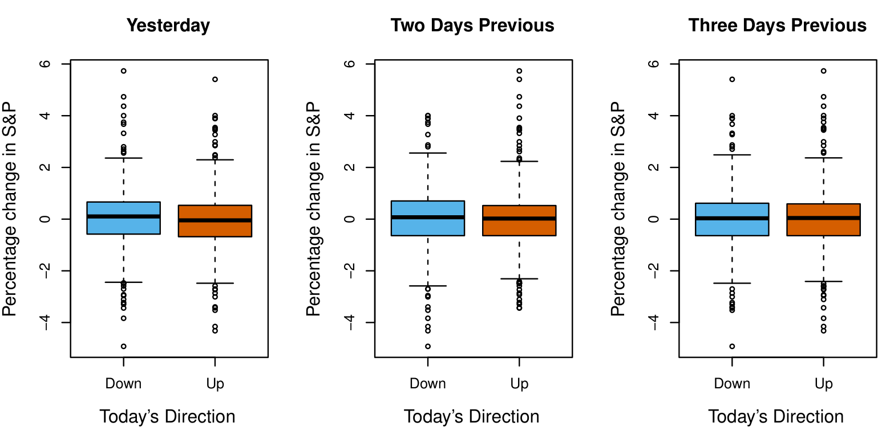

## Una Visión General del Aprendizaje Estadístico

El aprendizaje estadístico se refiere a un vasto conjunto de herramientas para comprender datos. Estas herramientas pueden clasificarse como supervisadas o no supervisadas. En términos generales, el aprendizaje estadístico supervisado implica la construcción de un modelo estadístico para predecir, o estimar, una salida basada en una o más entradas. Los problemas de esta naturaleza ocurren en campos tan diversos como los negocios, la medicina, la astrofísica y las políticas públicas. Con el aprendizaje estadístico no supervisado, hay entradas pero no una salida que supervise; sin embargo, podemos aprender relaciones y estructuras a partir de dichos datos. Para proporcionar una ilustración de algunas aplicaciones del aprendizaje estadístico, discutimos brevemente tres conjuntos de datos del mundo real que se consideran en este libro.

### Datos Salariales (Wage)

En esta aplicación (que denominamos conjunto de datos Wage a lo largo de este libro), examinamos una serie de factores que se relacionan con los salarios de un grupo de hombres de la región atlántica de los Estados Unidos. En particular, deseamos comprender la asociación entre la edad y educación de un empleado, así como el año calendario, con su salario. Consideremos, por ejemplo, el panel izquierdo de @fig-wage-data, que muestra el salario versus la edad para cada uno de los individuos en el conjunto de datos. Hay evidencia de que el salario aumenta con la edad pero luego disminuye nuevamente después de aproximadamente los 60 años. La línea azul, que proporciona una estimación del salario promedio para una edad dada, hace más clara esta tendencia. Dada la edad de un empleado, podemos usar esta curva para predecir su salario. Sin embargo, también está claro en @fig-wage-data que hay una cantidad significativa de variabilidad asociada con este valor promedio, por lo que la edad por sí sola probablemente no proporcionará una predicción precisa del salario de un hombre en particular.

![Datos salariales (Wage), que contienen información de encuestas de ingresos para hombres de la región central del Atlántico de Estados Unidos. Izquierda: salario en función de la edad. En promedio, el salario aumenta con la edad hasta aproximadamente los 60 años, momento en el cual comienza a disminuir. Centro: salario en función del año. Hay un aumento lento pero constante de aproximadamente $10,000 en el salario promedio entre 2003 y 2009. Derecha: diagramas de caja que muestran el salario en función del nivel educativo, donde 1 indica el nivel más bajo (sin diploma de secundaria) y 5 el nivel más alto (un título de posgrado avanzado). En promedio, el salario aumenta con el nivel de educación.](../../Figures/Chapter1/png/1_1.png){#fig-wage-data width=60%}

También tenemos información sobre el nivel educativo de cada empleado y el año en que se ganó el salario. Los paneles central y derecho de @fig-wage-data, que muestran el salario en función del año y la educación, indican que ambos factores están asociados con el salario. Los salarios aumentan aproximadamente \$10,000, de manera aproximadamente lineal, entre 2003 y 2009, aunque este aumento es muy leve en relación con la variabilidad en los datos. Los salarios también son típicamente mayores para individuos con niveles educativos más altos: los hombres con el nivel educativo más bajo (1) tienden a tener salarios sustancialmente más bajos que aquellos con el nivel educativo más alto (5). Claramente, la predicción más precisa del salario de un hombre dado se obtendrá combinando su edad, su educación y el año. En el Capítulo 3, discutimos la regresión lineal, que puede usarse para predecir el salario a partir de este conjunto de datos. Idealmente, deberíamos predecir el salario de una manera que tenga en cuenta la relación no lineal entre el salario y la edad. En el Capítulo 7, discutimos una clase de enfoques para abordar este problema.

### Datos del Mercado de Valores (Stock Market)

Los datos salariales (Wage) implican predecir un valor de salida continuo o cuantitativo. Esto a menudo se denomina un problema de regresión. Sin embargo, en ciertos casos podemos desear predecir un valor no numérico — es decir, una salida categórica o cualitativa. Por ejemplo, en el Capítulo 4 examinamos un conjunto de datos del mercado de valores que contiene los movimientos diarios del índice bursátil Standard & Poor's 500 (S&P) durante un período de 5 años entre 2001 y 2005. Nos referimos a esto como los datos Smarket. El objetivo es predecir si el índice aumentará o disminuirá en un día determinado, utilizando los cambios porcentuales de los últimos 5 días en el índice. Aquí el problema de aprendizaje estadístico no implica predecir un valor numérico. En cambio, implica predecir si el rendimiento del mercado de valores de un día caerá en la categoría de *Up* (sube) o *Down* (baja). Esto se conoce como un problema de clasificación. ¡Un modelo que pudiera predecir con precisión la dirección en la que se moverá el mercado sería muy útil!

{#fig-smarket-boxplots width=60%}

El panel izquierdo de @fig-smarket-boxplots muestra dos diagramas de caja del cambio porcentual del día anterior en el índice bursátil: uno para los 648 días en que el mercado aumentó en el día siguiente, y otro para los 602 días en que el mercado disminuyó. Los dos gráficos se ven casi idénticos, lo que sugiere que no existe una estrategia simple para usar el movimiento de ayer en el S&P para predecir los rendimientos de hoy. Los paneles restantes, que muestran diagramas de caja para los cambios porcentuales de 2 y 3 días antes de hoy, indican de manera similar poca asociación entre los rendimientos pasados y presentes. Por supuesto, esta falta de patrón es de esperarse: en presencia de fuertes correlaciones entre los rendimientos de días sucesivos, uno podría adoptar una estrategia de negociación simple para generar ganancias del mercado. Sin embargo, en el Capítulo 4, exploramos estos datos utilizando varios métodos de aprendizaje estadístico diferentes. Curiosamente, hay indicios de algunas tendencias débiles en los datos que sugieren que, al menos para este período de 5 años, es posible predecir correctamente la dirección del movimiento en el mercado aproximadamente el 60% de las veces (@fig-smarket-qda).

{#fig-smarket-qda width=45%}

### Datos de Expresión Génica (Gene Expression)

Las dos aplicaciones anteriores ilustran conjuntos de datos con variables de entrada y salida. Sin embargo, otra clase importante de problemas involucra situaciones en las que solo observamos variables de entrada, sin una salida correspondiente. Por ejemplo, en un contexto de marketing, podríamos tener información demográfica para una serie de clientes actuales o potenciales. Podríamos desear comprender qué tipos de clientes son similares entre sí agrupando individuos según sus características observadas. Esto se conoce como un problema de agrupamiento (clustering). A diferencia de los ejemplos anteriores, aquí no estamos tratando de predecir una variable de salida.

Dedicamos el Capítulo 12 a una discusión de los métodos de aprendizaje estadístico para problemas en los que no hay una variable de salida natural disponible. Consideramos el conjunto de datos NCI60, que consiste en 6,830 mediciones de expresión génica para cada una de 64 líneas celulares cancerosas. En lugar de predecir una variable de salida particular, estamos interesados en determinar si hay grupos, o conglomerados, entre las líneas celulares basados en sus mediciones de expresión génica. Esta es una pregunta difícil de abordar, en parte porque hay miles de mediciones de expresión génica por línea celular, lo que dificulta la visualización de los datos.

![Izquierda: representación del conjunto de datos de expresión génica NCI60 en un espacio bidimensional, Z1 y Z2. Cada punto corresponde a una de las 64 líneas celulares. Parecen haber cuatro grupos de líneas celulares, que hemos representado usando diferentes colores. Derecha: igual que el panel izquierdo, excepto que hemos representado cada uno de los 14 tipos diferentes de cáncer usando un símbolo de color diferente. Las líneas celulares que corresponden al mismo tipo de cáncer tienden a estar cerca entre sí en el espacio bidimensional.](../../Figures/Chapter1/png/1_4.png){#fig-nci60-pca width=60%}

El panel izquierdo de @fig-nci60-pca aborda este problema representando cada una de las 64 líneas celulares usando solo dos números, $Z_1$ y $Z_2$. Estos son los primeros dos componentes principales de los datos, que resumen las 6,830 mediciones de expresión para cada línea celular en dos números o dimensiones. Si bien es probable que esta reducción de dimensionalidad haya resultado en alguna pérdida de información, ahora es posible examinar visualmente los datos en busca de evidencia de agrupamiento. Decidir el número de conglomerados suele ser un problema difícil. Pero el panel izquierdo de @fig-nci60-pca sugiere al menos cuatro grupos de líneas celulares, que hemos representado usando colores separados.

En este conjunto de datos en particular, resulta que las líneas celulares corresponden a 14 tipos diferentes de cáncer. (Sin embargo, esta información no se utilizó para crear el panel izquierdo de @fig-nci60-pca.) El panel derecho de @fig-nci60-pca es idéntico al panel izquierdo, excepto que los 14 tipos de cáncer se muestran usando símbolos de colores distintos. Hay evidencia clara de que las líneas celulares con el mismo tipo de cáncer tienden a ubicarse cerca unas de otras en esta representación bidimensional. Además, aunque la información del cáncer no se utilizó para producir el panel izquierdo, la agrupación obtenida sí guarda cierto parecido con algunos de los tipos de cáncer reales observados en el panel derecho. Esto proporciona una verificación independiente de la precisión de nuestro análisis de agrupamiento.

## Una Breve Historia del Aprendizaje Estadístico

Aunque el término *aprendizaje estadístico* es bastante nuevo, muchos de los conceptos que subyacen al campo se desarrollaron hace mucho tiempo. A principios del siglo XIX, se desarrolló el método de mínimos cuadrados, implementando la primera forma de lo que ahora se conoce como regresión lineal. El enfoque se aplicó con éxito por primera vez a problemas de astronomía. La regresión lineal se utiliza para predecir valores cuantitativos, como el salario de un individuo.

Para predecir valores cualitativos, como si un paciente sobrevive o muere, o si el mercado de valores aumenta o disminuye, se propuso el análisis discriminante lineal en 1936. En la década de 1940, varios autores presentaron un enfoque alternativo, la regresión logística. A principios de la década de 1970, se desarrolló el término *modelo lineal generalizado* para describir una clase completa de métodos de aprendizaje estadístico que incluyen tanto la regresión lineal como la logística como casos especiales.

A finales de la década de 1970, ya estaban disponibles muchas más técnicas para aprender de los datos. Sin embargo, eran casi exclusivamente métodos lineales porque ajustar relaciones no lineales era computacionalmente difícil en ese momento. Para la década de 1980, la tecnología informática había mejorado lo suficiente como para que los métodos no lineales ya no fueran computacionalmente prohibitivos. A mediados de la década de 1980, se desarrollaron los árboles de clasificación y regresión, seguidos poco después por los modelos aditivos generalizados. Las redes neuronales ganaron popularidad en la década de 1980, y las máquinas de vectores de soporte surgieron en la década de 1990.

Desde entonces, el aprendizaje estadístico ha emergido como un nuevo subcampo de la estadística, centrado en la modelización y predicción supervisada y no supervisada. En los últimos años, el progreso en el aprendizaje estadístico ha estado marcado por la creciente disponibilidad de software potente y relativamente fácil de usar, como el popular y gratuito sistema Python. Esto tiene el potencial de continuar la transformación del campo de un conjunto de técnicas utilizadas y desarrolladas principalmente por estadísticos y científicos de datos a un conjunto de herramientas ampliamente accesibles para cualquier persona interesada en el análisis de datos.

## Este Libro

*The Elements of Statistical Learning* (ESL) de Hastie, Tibshirani y Friedman se publicó por primera vez en 2001. Desde entonces, se ha convertido en una referencia importante sobre los fundamentos del aprendizaje estadístico y automático. Su éxito se debe a su tratamiento completo y detallado de muchos temas importantes en el aprendizaje estadístico, así como al hecho de que (en relación con muchos libros de texto de estadística de nivel superior) es accesible para una amplia audiencia. Sin embargo, el mayor factor detrás del éxito de ESL ha sido su naturaleza oportuna. En el momento de su publicación, el interés en el campo del aprendizaje estadístico comenzaba a explotar. ESL proporcionó una de las primeras introducciones accesibles y completas al tema.

Desde que ESL se publicó por primera vez, el campo del aprendizaje estadístico ha seguido floreciendo. La expansión del campo ha tomado dos formas. El crecimiento más obvio ha involucrado el desarrollo de enfoques de aprendizaje estadístico nuevos y mejorados destinados a responder una variedad de preguntas científicas en numerosos campos. Sin embargo, el campo del aprendizaje estadístico también ha ampliado su audiencia. En la década de 1990, los aumentos en la capacidad computacional generaron un aumento del interés en el campo por parte de no estadísticos que estaban ansiosos por usar herramientas estadísticas de vanguardia para analizar sus datos. Desafortunadamente, la naturaleza altamente técnica de estos enfoques significaba que la comunidad de usuarios permanecía principalmente restringida a expertos en estadística, ciencias de la computación y campos relacionados con la formación (y el tiempo) para comprenderlos e implementarlos.

En los últimos años, los paquetes de software nuevos y mejorados han aliviado significativamente la carga de implementación de muchos métodos de aprendizaje estadístico. Al mismo tiempo, ha habido un reconocimiento creciente en varios campos, desde los negocios hasta la atención médica, la genética, las ciencias sociales y más allá, de que el aprendizaje estadístico es una herramienta poderosa con importantes aplicaciones prácticas. Como resultado, el campo ha pasado de ser principalmente de interés académico a una disciplina generalizada, con una audiencia potencial enorme. Esta tendencia seguramente continuará con la creciente disponibilidad de enormes cantidades de datos y el software para analizarlos.

El propósito de *An Introduction to Statistical Learning* (ISL) es facilitar la transición del aprendizaje estadístico de un campo académico a una disciplina generalizada. ISL no pretende reemplazar a ESL, que es un texto mucho más completo tanto en términos del número de enfoques considerados como de la profundidad con la que se exploran. Consideramos a ESL como un compañero importante para profesionales (con títulos de posgrado en estadística, aprendizaje automático o campos relacionados) que necesitan comprender los detalles técnicos detrás de los enfoques de aprendizaje estadístico. Sin embargo, la comunidad de usuarios de técnicas de aprendizaje estadístico se ha expandido para incluir individuos con una gama más amplia de intereses y antecedentes. Por lo tanto, hay un lugar para una versión menos técnica y más accesible de ESL.

A lo largo de años enseñando estos temas, hemos descubierto que son de interés para estudiantes de maestría y doctorado en campos tan diversos como administración de empresas, biología y ciencias de la computación, así como para estudiantes universitarios de últimos años con orientación cuantitativa. Es importante que este grupo diverso pueda comprender los modelos, las intuiciones, y las fortalezas y debilidades de los diversos enfoques. Pero para esta audiencia, muchos de los detalles técnicos detrás de los métodos de aprendizaje estadístico, como los algoritmos de optimización y las propiedades teóricas, no son de interés primordial. Creemos que estos estudiantes no necesitan una comprensión profunda de estos aspectos para convertirse en usuarios informados de las diversas metodologías, y para contribuir a sus campos elegidos mediante el uso de herramientas de aprendizaje estadístico.

ISL se basa en las siguientes cuatro premisas:

1. Muchos métodos de aprendizaje estadístico son relevantes y útiles en una amplia gama de disciplinas académicas y no académicas, más allá de las ciencias estadísticas. Creemos que muchos procedimientos contemporáneos de aprendizaje estadístico deberían, y lo harán, estar tan ampliamente disponibles y ser tan utilizados como lo son actualmente métodos clásicos como la regresión lineal. Como resultado, en lugar de intentar considerar todos los enfoques posibles (una tarea imposible), nos hemos concentrado en presentar los métodos que creemos que son más ampliamente aplicables.

2. El aprendizaje estadístico no debe verse como una serie de cajas negras. Ningún enfoque único funcionará bien en todas las aplicaciones posibles. Sin comprender todos los engranajes dentro de la caja, o la interacción entre esos engranajes, es imposible seleccionar la mejor caja. Por lo tanto, hemos intentado describir cuidadosamente el modelo, la intuición, los supuestos y las compensaciones detrás de cada uno de los métodos que consideramos.

3. Si bien es importante saber qué trabajo realiza cada engranaje, no es necesario tener las habilidades para construir la máquina dentro de la caja. Por lo tanto, hemos minimizado la discusión de los detalles técnicos relacionados con los procedimientos de ajuste y las propiedades teóricas. Suponemos que el lector se siente cómodo con conceptos matemáticos básicos, pero no asumimos un título de posgrado en ciencias matemáticas. Por ejemplo, casi hemos evitado por completo el uso del álgebra matricial, y es posible entender todo el libro sin un conocimiento detallado de matrices y vectores.

4. Presuponemos que el lector está interesado en aplicar métodos de aprendizaje estadístico a problemas del mundo real. Para facilitar esto, así como para motivar las técnicas discutidas, hemos dedicado una sección dentro de cada capítulo a laboratorios de computación. En cada laboratorio, guiamos al lector a través de una aplicación realista de los métodos considerados en ese capítulo. Cuando hemos enseñado este material en nuestros cursos, hemos asignado aproximadamente un tercio del tiempo de clase a trabajar en los laboratorios, y los hemos encontrado extremadamente útiles. Muchos de los estudiantes menos orientados a la computación que inicialmente se sintieron intimidados por los laboratorios terminaron dominándolos en el transcurso del trimestre o semestre. Este libro apareció originalmente (2013, segunda edición 2021) con laboratorios de computación escritos en el lenguaje R. Desde entonces, ha habido una demanda creciente de implementaciones en Python de las técnicas importantes en aprendizaje estadístico. En consecuencia, esta versión tiene laboratorios en Python. Hay un número cada vez mayor de paquetes de Python disponibles, y mediante el examen de las importaciones al comienzo de cada laboratorio, los lectores verán que hemos seleccionado y utilizado cuidadosamente los más apropiados. También hemos proporcionado algo de código y funcionalidad adicional en nuestro paquete ISLP. Sin embargo, los laboratorios en ISL son autocontenidos, y pueden omitirse si el lector desea utilizar un paquete de software diferente o no desea aplicar los métodos discutidos a problemas del mundo real.

## Quién Debería Leer Este Libro

Este libro está dirigido a cualquier persona interesada en utilizar métodos estadísticos modernos para la modelización y predicción a partir de datos. Este grupo incluye científicos, ingenieros, analistas de datos, científicos de datos y *quants*, pero también personas menos técnicas con títulos en campos no cuantitativos como las ciencias sociales o los negocios. Esperamos que el lector haya tenido al menos un curso elemental de estadística. Conocimientos de regresión lineal también son útiles, aunque no necesarios, ya que repasamos los conceptos clave detrás de la regresión lineal en el Capítulo 3. El nivel matemático de este libro es modesto, y no se requiere un conocimiento detallado de operaciones matriciales. Este libro proporciona una introducción a Python. La exposición previa a un lenguaje de programación, como MATLAB o R, es útil pero no necesaria.

La primera edición de este libro de texto se ha utilizado para enseñar a estudiantes de maestría y doctorado en negocios, economía, ciencias de la computación, biología, ciencias de la tierra, psicología y muchas otras áreas de las ciencias físicas y sociales. También se ha utilizado para enseñar a estudiantes universitarios avanzados que ya han tomado un curso de regresión lineal. En el contexto de un curso matemáticamente más riguroso en el que ESL sirve como libro de texto principal, ISL podría utilizarse como texto complementario para la enseñanza de los aspectos computacionales de los diversos enfoques.

## Notación y Álgebra Matricial Simple

Elegir la notación para un libro de texto es siempre una tarea difícil. En su mayor parte, adoptamos las mismas convenciones notacionales que ESL.

Usaremos $n$ para representar el número de puntos de datos distintos, u observaciones, en nuestra muestra. Denotaremos con $p$ el número de variables que están disponibles para su uso en la realización de predicciones. Por ejemplo, el conjunto de datos Wage consta de 11 variables para 3,000 personas, por lo que tenemos $n = 3{,}000$ observaciones y $p = 11$ variables (como año, edad, raza y más). Tenga en cuenta que a lo largo de este libro, indicamos los nombres de las variables usando un color de fuente diferente: `VariableNombre`. En algunos ejemplos, $p$ puede ser bastante grande, del orden de miles o incluso millones; esta situación se da con bastante frecuencia, por ejemplo, en el análisis de datos biológicos modernos o datos de publicidad en línea.

En general, denotaremos con $x_{ij}$ el valor de la $j$-ésima variable para la $i$-ésima observación, donde $i = 1, 2, \dots, n$ y $j = 1, 2, \dots, p$. A lo largo de este libro, $i$ se utilizará para indexar las muestras u observaciones (de 1 a $n$) y $j$ se utilizará para indexar las variables (de 1 a $p$). Sea $\mathbf{X}$ una matriz $n \times p$ cuyo elemento $(i, j)$-ésimo es $x_{ij}$. Es decir,

$$
\mathbf{X} = \begin{pmatrix}
x_{11} & x_{12} & \dots & x_{1p} \\
x_{21} & x_{22} & \dots & x_{2p} \\
\vdots & \vdots & \ddots & \vdots \\
x_{n1} & x_{n2} & \dots & x_{np}
\end{pmatrix}.
$$

Para los lectores que no están familiarizados con las matrices, es útil visualizar $\mathbf{X}$ como una hoja de cálculo de números con $n$ filas y $p$ columnas.

A veces nos interesaremos por las filas de $\mathbf{X}$, que escribimos como $x_1, x_2, \dots, x_n$. Aquí $x_i$ es un vector de longitud $p$, que contiene las $p$ mediciones de las variables para la $i$-ésima observación. Es decir,

$$
x_i = \begin{pmatrix} x_{i1} \\ x_{i2} \\ \vdots \\ x_{ip} \end{pmatrix}. \tag{1.1}
$$

(Los vectores se representan por defecto como columnas.) Por ejemplo, para los datos Wage, $x_i$ es un vector de longitud 11, que consiste en el año, la edad, la raza y otros valores para el $i$-ésimo individuo. En otras ocasiones nos interesaremos por las columnas de $\mathbf{X}$, que escribimos como $\mathbf{x}_1, \mathbf{x}_2, \dots, \mathbf{x}_p$. Cada una es un vector de longitud $n$. Es decir,

$$
\mathbf{x}_j = \begin{pmatrix} x_{1j} \\ x_{2j} \\ \vdots \\ x_{nj} \end{pmatrix}.
$$

Por ejemplo, para los datos Wage, $\mathbf{x}_1$ contiene los $n = 3{,}000$ valores del año.

Usando esta notación, la matriz $\mathbf{X}$ puede escribirse como

$$
\mathbf{X} = \begin{pmatrix} \mathbf{x}_1 & \mathbf{x}_2 & \cdots & \mathbf{x}_p \end{pmatrix},
$$

o

$$
\mathbf{X} = \begin{pmatrix} x_1^{\mathsf T} \\ x_2^{\mathsf T} \\ \vdots \\ x_n^{\mathsf T} \end{pmatrix}.
$$

La notación $^{\mathsf T}$ denota la transpuesta de una matriz o vector. Así, por ejemplo,

$$
\mathbf{X}^{\mathsf T} = \begin{pmatrix}
x_{11} & x_{21} & \dots & x_{n1} \\
x_{12} & x_{22} & \dots & x_{n2} \\
\vdots & \vdots & \ddots & \vdots \\
x_{1p} & x_{2p} & \dots & x_{np}
\end{pmatrix},
$$

mientras que

$$
x_i^{\mathsf T} = \begin{pmatrix} x_{i1} & x_{i2} & \cdots & x_{ip} \end{pmatrix}.
$$

Usamos $y_i$ para denotar la $i$-ésima observación de la variable sobre la que deseamos hacer predicciones, como el salario. Por lo tanto, escribimos el conjunto de todas las $n$ observaciones en forma vectorial como

$$
\mathbf{y} = \begin{pmatrix} y_1 \\ y_2 \\ \vdots \\ y_n \end{pmatrix}.
$$

Entonces nuestros datos observados consisten en $\{(x_1, y_1), (x_2, y_2), \dots, (x_n, y_n)\}$, donde cada $x_i$ es un vector de longitud $p$. (Si $p = 1$, entonces $x_i$ es simplemente un escalar.)

En este texto, un vector de longitud $n$ se denotará siempre en negrita minúscula; por ejemplo,

$$
\mathbf{a} = \begin{pmatrix} a_1 \\ a_2 \\ \vdots \\ a_n \end{pmatrix}.
$$

Sin embargo, los vectores que no son de longitud $n$ (como los vectores de características de longitud $p$, como en (1.1)) se denotarán en fuente normal minúscula, por ejemplo, $a$. Los escalares también se denotarán en fuente normal minúscula, por ejemplo, $a$. En los raros casos en que estos dos usos de la fuente normal minúscula generen ambigüedad, aclararemos qué uso se pretende. Las matrices se denotarán usando negrita mayúscula, como $\mathbf{A}$. Las variables aleatorias se denotarán usando mayúscula normal, por ejemplo, $A$, independientemente de sus dimensiones.

Ocasionalmente querremos indicar la dimensión de un objeto particular. Para indicar que un objeto es un escalar, usaremos la notación $a \in \mathbb{R}$. Para indicar que es un vector de longitud $k$, usaremos $a \in \mathbb{R}^k$ (o $\mathbf{a} \in \mathbb{R}^n$ si es de longitud $n$). Indicaremos que un objeto es una matriz $r \times s$ usando $\mathbf{A} \in \mathbb{R}^{r \times s}$.

Hemos evitado usar álgebra matricial siempre que ha sido posible. Sin embargo, en algunas ocasiones resulta demasiado engorroso evitarla por completo. En estos raros casos es importante entender el concepto de multiplicación de dos matrices. Supongamos que $\mathbf{A} \in \mathbb{R}^{r \times d}$ y $\mathbf{B} \in \mathbb{R}^{d \times s}$. Entonces el producto de $\mathbf{A}$ y $\mathbf{B}$ se denota $\mathbf{A}\mathbf{B}$. El elemento $(i, j)$-ésimo de $\mathbf{A}\mathbf{B}$ se calcula multiplicando cada elemento de la $i$-ésima fila de $\mathbf{A}$ por el elemento correspondiente de la $j$-ésima columna de $\mathbf{B}$. Es decir, $(\mathbf{A}\mathbf{B})_{ij} = \sum_{k=1}^d a_{ik} b_{kj}$. Como ejemplo, considere

$$
\mathbf{A} = \begin{pmatrix} 1 & 2 \\ 3 & 4 \end{pmatrix} \quad \text{y} \quad \mathbf{B} = \begin{pmatrix} 5 & 6 \\ 7 & 8 \end{pmatrix}.
$$

Entonces

$$
\mathbf{A}\mathbf{B} = \begin{pmatrix} 1 & 2 \\ 3 & 4 \end{pmatrix}
\begin{pmatrix} 5 & 6 \\ 7 & 8 \end{pmatrix}
= \begin{pmatrix} 1\times5+2\times7 & 1\times6+2\times8 \\ 3\times5+4\times7 & 3\times6+4\times8 \end{pmatrix}
= \begin{pmatrix} 19 & 22 \\ 43 & 50 \end{pmatrix}.
$$

Tenga en cuenta que esta operación produce una matriz $r \times s$. Solo es posible calcular $\mathbf{A}\mathbf{B}$ si el número de columnas de $\mathbf{A}$ es el mismo que el número de filas de $\mathbf{B}$.

## Organización de Este Libro

El Capítulo 2 introduce la terminología básica y los conceptos detrás del aprendizaje estadístico. Este capítulo también presenta el clasificador de vecinos más cercanos K, un método muy simple que funciona sorprendentemente bien en muchos problemas. Los Capítulos 3 y 4 cubren métodos lineales clásicos para regresión y clasificación. En particular, el Capítulo 3 revisa la regresión lineal, el punto de partida fundamental para todos los métodos de regresión. En el Capítulo 4 discutimos dos de los métodos de clasificación clásicos más importantes, la regresión logística y el análisis discriminante lineal.

Un problema central en todas las situaciones de aprendizaje estadístico implica elegir el mejor método para una aplicación determinada. Por lo tanto, en el Capítulo 5 introducimos la validación cruzada y el bootstrap, que pueden usarse para estimar la precisión de varios métodos diferentes con el fin de elegir el mejor.

Gran parte de la investigación reciente en aprendizaje estadístico se ha concentrado en métodos no lineales. Sin embargo, los métodos lineales a menudo tienen ventajas sobre sus competidores no lineales en términos de interpretabilidad y, a veces, también de precisión. Por lo tanto, en el Capítulo 6 consideramos una serie de métodos lineales, tanto clásicos como más modernos, que ofrecen mejoras potenciales sobre la regresión lineal estándar. Estos incluyen la selección paso a paso, la regresión ridge, la regresión de componentes principales y el lasso.

Los capítulos restantes se adentran en el mundo del aprendizaje estadístico no lineal. Primero introducimos en el Capítulo 7 varios métodos no lineales que funcionan bien para problemas con una sola variable de entrada. Luego mostramos cómo estos métodos pueden usarse para ajustar modelos aditivos no lineales cuando hay más de una entrada. En el Capítulo 8, investigamos métodos basados en árboles, incluyendo bagging, boosting y bosques aleatorios. Las máquinas de vectores de soporte, un conjunto de enfoques para realizar clasificación tanto lineal como no lineal, se discuten en el Capítulo 9. Cubrimos el aprendizaje profundo, un enfoque para la regresión y clasificación no lineales que ha recibido mucha atención en los últimos años, en el Capítulo 10. El Capítulo 11 explora el análisis de supervivencia, un enfoque de regresión especializado para el contexto en el que la variable de salida está censurada, es decir, no se observa completamente.

En el Capítulo 12, consideramos el contexto no supervisado en el que tenemos variables de entrada pero ninguna variable de salida. En particular, presentamos el análisis de componentes principales, el agrupamiento de K-medias y el agrupamiento jerárquico. Finalmente, en el Capítulo 13 cubrimos el tema muy importante de las pruebas de hipótesis múltiples.

Al final de cada capítulo, presentamos una o más secciones de laboratorio de Python en las que trabajamos sistemáticamente a través de aplicaciones de los diversos métodos discutidos en ese capítulo. Estos laboratorios demuestran las fortalezas y debilidades de los diversos enfoques, y también proporcionan una referencia útil para la sintaxis requerida para implementar los diversos métodos. El lector puede optar por trabajar en los laboratorios a su propio ritmo, o los laboratorios pueden ser el foco de sesiones grupales como parte de un entorno de aula. Dentro de cada laboratorio de Python, presentamos los resultados que obtuvimos cuando realizamos el laboratorio en el momento de escribir este libro. Sin embargo, se lanzan continuamente nuevas versiones de Python y, con el tiempo, los paquetes llamados en los laboratorios se actualizarán. Por lo tanto, en el futuro, es posible que los resultados mostrados en las secciones de laboratorio ya no se correspondan precisamente con los resultados obtenidos por el lector que realiza los laboratorios. Según sea necesario, publicaremos actualizaciones de los laboratorios en el sitio web del libro.

Usamos el símbolo $\bigstar$ para denotar secciones o ejercicios que contienen conceptos más desafiantes. Estos pueden omitirse fácilmente por parte de los lectores que no deseen profundizar tanto en el material, o que carezcan de la formación matemática necesaria.

## Conjuntos de Datos Utilizados en Laboratorios y Ejercicios

En este libro de texto, ilustramos los métodos de aprendizaje estadístico utilizando aplicaciones de marketing, finanzas, biología y otras áreas. El paquete ISLP contiene varios conjuntos de datos que son necesarios para realizar los laboratorios y ejercicios asociados con este libro. Otro conjunto de datos es parte de la distribución base de R (los datos USArrests), y mostramos cómo acceder a él desde Python en la Sección 12.5.1. La @tbl-datasets contiene un resumen de los conjuntos de datos necesarios para realizar los laboratorios y ejercicios. Un par de estos conjuntos de datos también están disponibles como archivos de texto en el sitio web del libro, para su uso en el Capítulo 2.

| Nombre | Descripción |
|--------|-------------|
| Auto | Rendimiento de gasolina, potencia y otra información para automóviles. |
| Bikeshare | Uso horario de un programa de bicicletas compartidas en Washington, DC. |
| Boston | Valores de viviendas y otra información sobre distritos censales de Boston. |
| BrainCancer | Tiempos de supervivencia para pacientes diagnosticados con cáncer cerebral. |
| Caravan | Información sobre personas a las que se les ofrece seguro para caravanas. |
| Carseats | Información sobre ventas de asientos para automóviles en 400 tiendas. |
| College | Características demográficas, matrícula y más para universidades de EE. UU. |
| Credit | Información sobre deudas de tarjetas de crédito para 400 clientes. |
| Default | Registros de incumplimiento de clientes de una compañía de tarjetas de crédito. |
| Fund | Rendimientos de 2,000 gestores de fondos de cobertura durante 50 meses. |
| Hitters | Registros y salarios de jugadores de béisbol. |
| Khan | Mediciones de expresión génica para cuatro tipos de cáncer. |
| NCI60 | Mediciones de expresión génica para 64 líneas celulares cancerosas. |
| NYSE | Rendimientos, volatilidad y volumen para la Bolsa de Nueva York. |
| OJ | Información de ventas de jugo de naranja Citrus Hill y Minute Maid. |
| Portfolio | Valores pasados de activos financieros, para uso en asignación de cartera. |
| Publication | Tiempo hasta la publicación de 244 ensayos clínicos. |
| Smarket | Rendimientos porcentuales diarios del S&P 500 durante un período de 5 años. |
| USArrests | Estadísticas de criminalidad por cada 100,000 habitantes en 50 estados de EE. UU. |
| Wage | Datos de encuesta de ingresos para hombres en la región central del Atlántico de EE. UU. |
| Weekly | Rendimientos semanales del mercado de valores durante 21 años. |

: Lista de conjuntos de datos necesarios para realizar los laboratorios y ejercicios de este libro de texto. Todos los conjuntos de datos están disponibles en el paquete ISLP, con la excepción de USArrests, que forma parte de la distribución base de R, pero accesible desde Python. {#tbl-datasets}

## Sitio Web del Libro

El sitio web de este libro se encuentra en

[www.statlearning.com](https://www.statlearning.com){target="_blank"}

Contiene varios recursos, incluyendo el paquete de Python asociado con este libro y algunos conjuntos de datos adicionales.

## Agradecimientos

Algunos de los gráficos de este libro fueron tomados de ESL: Figuras 6.7, 8.3 y 12.14. Todos los demás gráficos fueron producidos para la versión R de ISL, excepto la Figura 13.10, que difiere debido al software de Python que respalda el gráfico.
