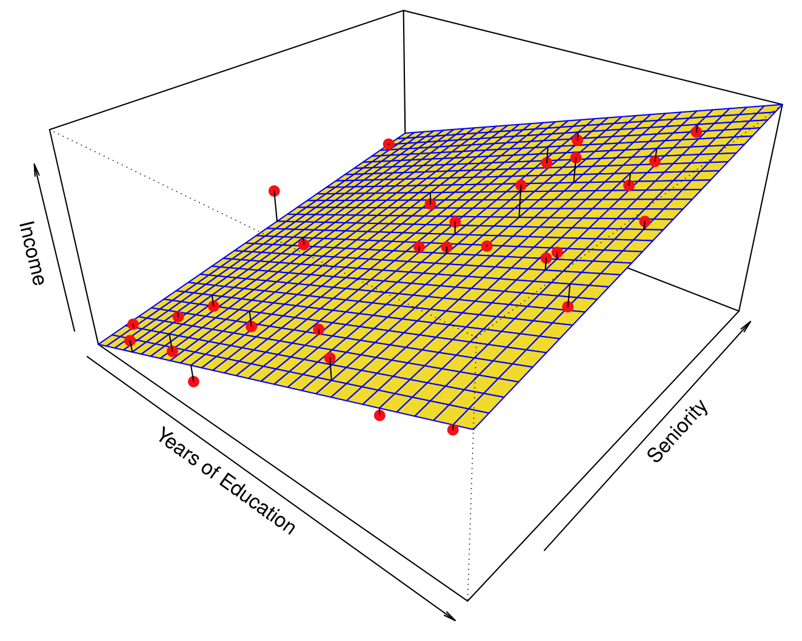
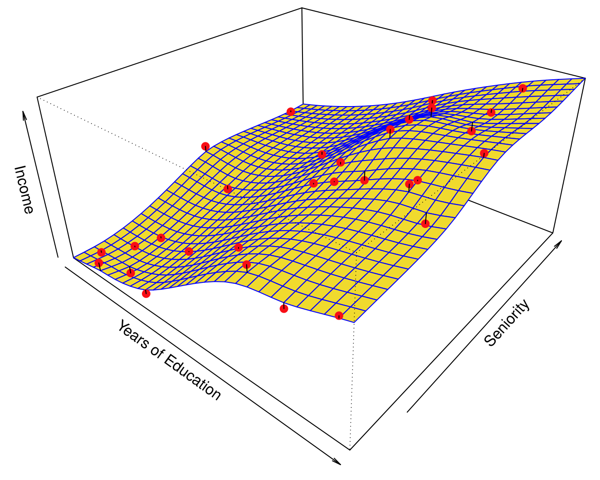
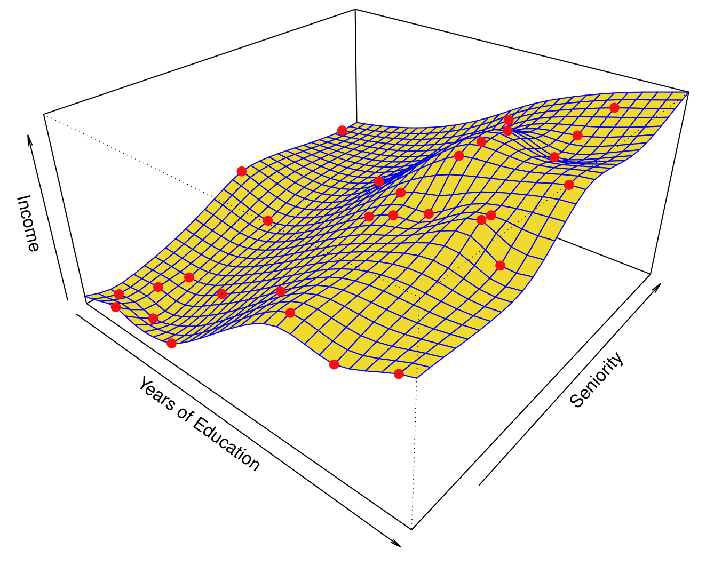
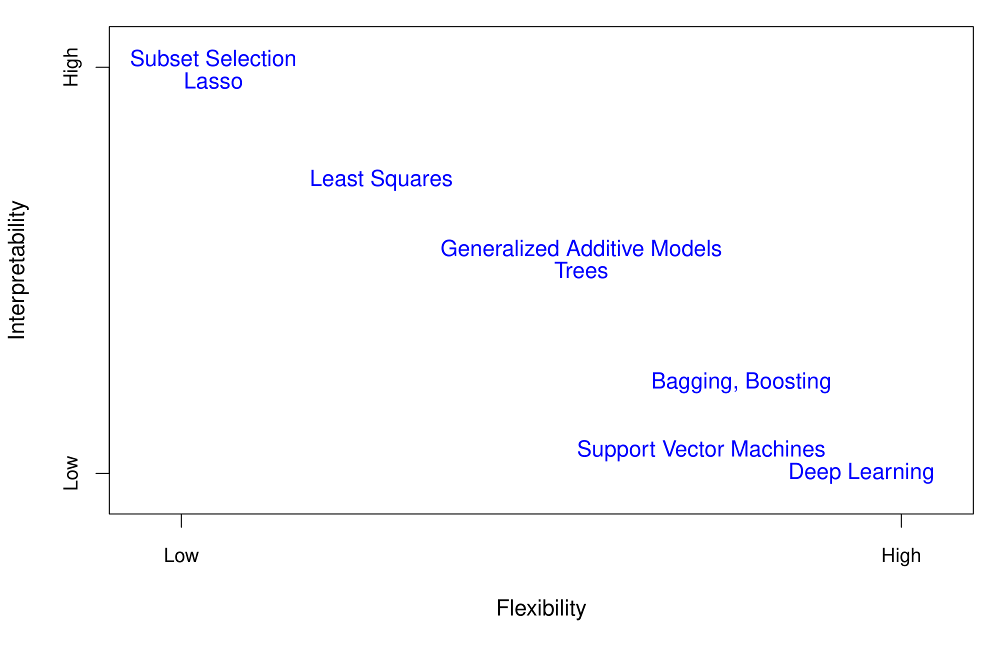
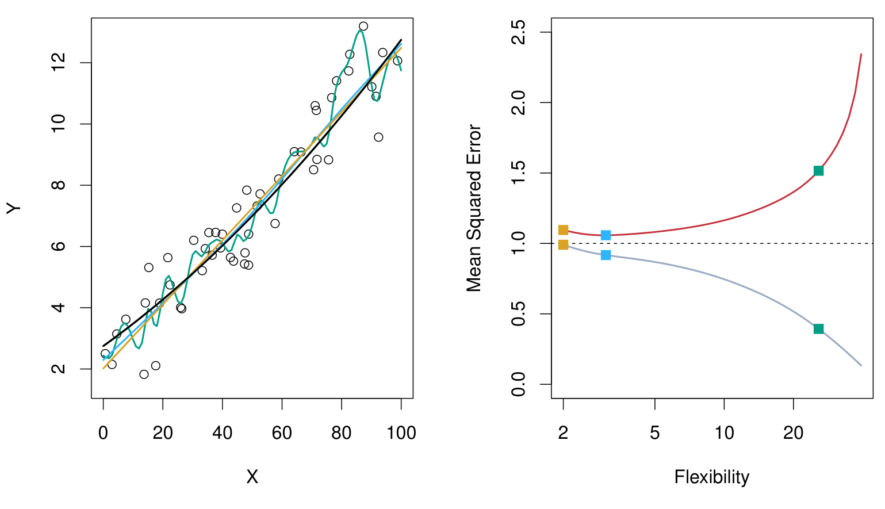
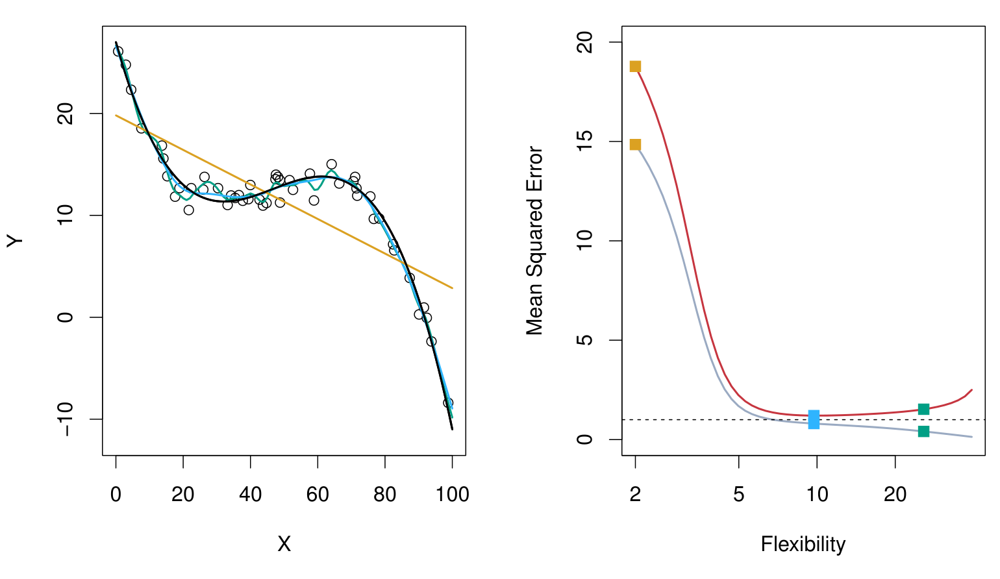
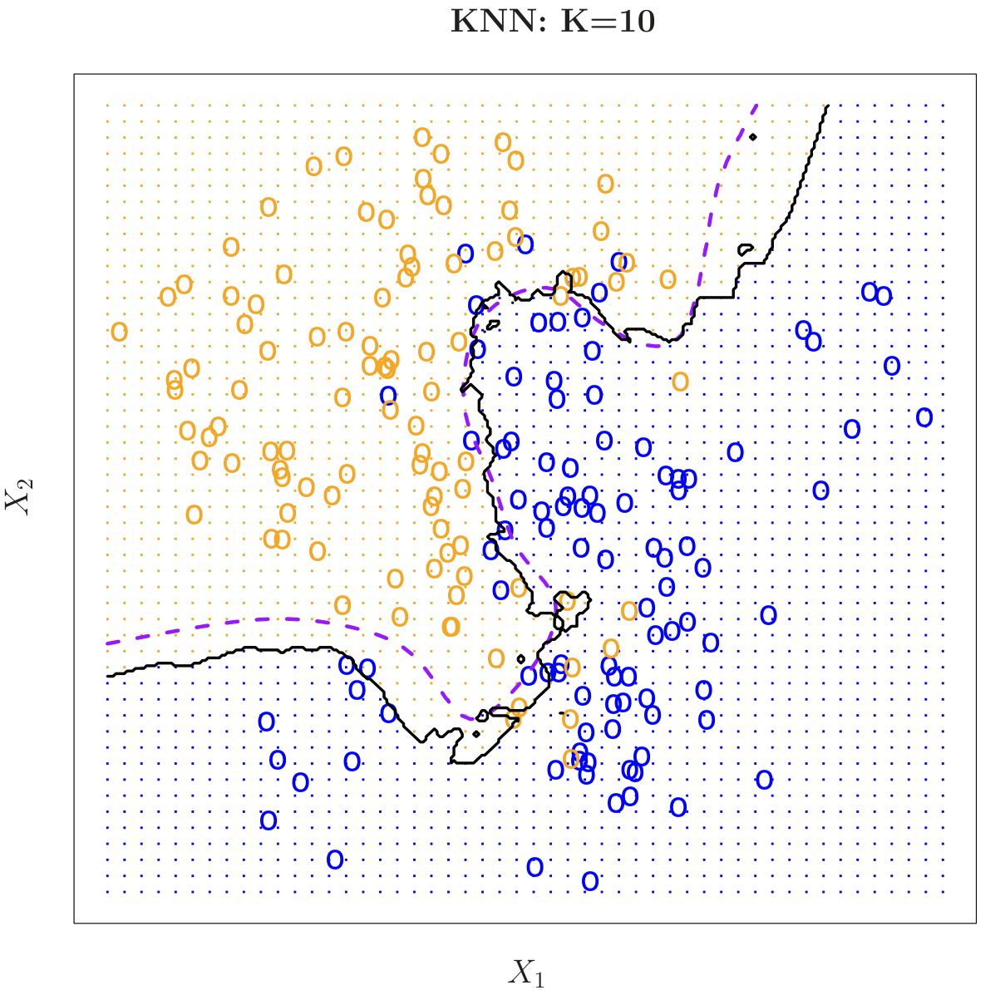

## ¿Qué es el Aprendizaje Estadístico?

Para motivar nuestro estudio del aprendizaje estadístico, comenzamos con un ejemplo sencillo. Supongamos que somos consultores estadísticos contratados por un cliente para investigar la asociación entre la publicidad y las ventas de un producto en particular. El conjunto de datos Advertising consiste en las ventas de ese producto en 200 mercados diferentes, junto con los presupuestos de publicidad para el producto en cada uno de esos mercados para tres medios diferentes: TV, radio y periódico. Los datos se muestran en @fig-advertising. No es posible que nuestro cliente aumente directamente las ventas del producto. Por otro lado, pueden controlar el gasto en publicidad en cada uno de los tres medios. Por lo tanto, si determinamos que existe una asociación entre la publicidad y las ventas, podemos indicar a nuestro cliente que ajuste los presupuestos de publicidad, aumentando así indirectamente las ventas. En otras palabras, nuestro objetivo es desarrollar un modelo preciso que pueda usarse para predecir las ventas en función de los presupuestos de los tres medios.

En este contexto, los presupuestos de publicidad son variables de entrada, mientras que las ventas son una variable de salida. Las variables de entrada se denotan típicamente con el símbolo $X$, con un subíndice para distinguirlas. Así, $X_1$ podría ser el presupuesto de TV, $X_2$ el presupuesto de radio y $X_3$ el presupuesto de periódico. Las entradas reciben diferentes nombres, como predictores, variables independientes, características o simplemente variables. La variable de salida —en este caso, las ventas— a menudo se denomina respuesta o variable dependiente, y normalmente se denota con el símbolo $Y$. A lo largo de este libro, usaremos todos estos términos de manera intercambiable.

De manera más general, supongamos que observamos una respuesta cuantitativa $Y$ y $p$ predictores diferentes, $X_1, X_2, \ldots, X_p$. Asumimos que existe alguna relación entre $Y$ y $X = (X_1, X_2, \ldots, X_p)$, que puede escribirse en la forma muy general

$$Y = f(X) + \epsilon. \tag{2.1}$$

Aquí $f$ es alguna función fija pero desconocida de $X_1, \ldots, X_p$, y $\epsilon$ es un término de error aleatorio, que es independiente de $X$ y tiene media cero. En esta formulación, $f$ representa la información sistemática que $X$ proporciona sobre $Y$.

{#fig-advertising width=60%}

Como otro ejemplo, considere el panel izquierdo de @fig-income-data, un gráfico de ingresos en función de los años de educación para 30 individuos en el conjunto de datos Income. El gráfico sugiere que uno podría predecir los ingresos usando los años de educación.

Sin embargo, la función $f$ que conecta la variable de entrada con la variable de salida es en general desconocida. En esta situación uno debe estimar $f$ basándose en los puntos observados. Dado que Income es un conjunto de datos simulado, $f$ se conoce y se muestra mediante la curva azul en el panel derecho de @fig-income-data. Las líneas verticales representan los términos de error $\epsilon$. Notamos que algunas de las 30 observaciones están por encima de la curva azul y algunas por debajo; en general, los errores tienen aproximadamente media cero.

![El conjunto de datos Income. Izquierda: Los puntos rojos son los valores observados de ingresos (en miles de dólares) y años de educación para 30 individuos. Derecha: La curva azul representa la verdadera relación subyacente entre ingresos y años de educación, que generalmente es desconocida (pero se conoce en este caso porque los datos fueron simulados). Las líneas negras representan el error asociado con cada observación. Nótese que algunos errores son positivos (si una observación está por encima de la curva azul) y algunos son negativos (si una observación está por debajo de la curva). En general, estos errores tienen aproximadamente media cero.](../../Figures/Chapter2/png/2_2.png){#fig-income-data width=60%}

En general, la función $f$ puede involucrar más de una variable de entrada. En @fig-income-3d representamos los ingresos en función de los años de educación y la antigüedad. Aquí $f$ es una superficie bidimensional que debe estimarse basándose en los datos observados.

{#fig-income-3d width=60%}

En esencia, el aprendizaje estadístico se refiere a un conjunto de enfoques para estimar $f$. En este capítulo describimos algunos de los conceptos teóricos clave que surgen al estimar $f$, así como herramientas para evaluar las estimaciones obtenidas.

### 2.1.1 ¿Por Qué Estimar $f$?

Hay dos razones principales por las que podemos desear estimar $f$: predicción e inferencia. Discutimos cada una por turno.

#### Predicción

En muchas situaciones, tenemos un conjunto de entradas $X$ disponibles, pero la salida $Y$ no puede obtenerse fácilmente. En este contexto, dado que el término de error promedia cero, podemos predecir $Y$ usando

$$\hat{Y} = \hat{f}(X), \tag{2.2}$$

donde $\hat{f}$ representa nuestra estimación de $f$, y $\hat{Y}$ representa la predicción resultante para $Y$. En este contexto, $\hat{f}$ a menudo se trata como una caja negra, en el sentido de que uno no suele estar preocupado por la forma exacta de $\hat{f}$, siempre que produzca predicciones precisas para $Y$.

Como ejemplo, supongamos que $X_1, \ldots, X_p$ son características de una muestra de sangre de un paciente que pueden medirse fácilmente en un laboratorio, e $Y$ es una variable que codifica el riesgo del paciente de una reacción adversa severa a un fármaco en particular. Es natural buscar predecir $Y$ usando $X$, ya que así podemos evitar administrar el fármaco en cuestión a pacientes que tienen un alto riesgo de una reacción adversa —es decir, pacientes para quienes la estimación de $Y$ es alta.

La precisión de $\hat{Y}$ como predicción de $Y$ depende de dos cantidades, que llamaremos el error reducible y el error irreducible. En general, $\hat{f}$ no será una estimación perfecta de $f$, y esta imprecisión introducirá algún error. Este error es reducible porque potencialmente podemos mejorar la precisión de $\hat{f}$ usando la técnica de aprendizaje estadístico más apropiada para estimar $f$. Sin embargo, incluso si fuera posible formar una estimación perfecta de $f$, de modo que nuestra respuesta estimada tomara la forma $\hat{Y} = f(X)$, ¡nuestra predicción aún tendría algún error! Esto se debe a que $Y$ también es una función de $\epsilon$, que, por definición, no puede predecirse usando $X$. Por lo tanto, la variabilidad asociada con $\epsilon$ también afecta la precisión de nuestras predicciones. Esto se conoce como el error irreducible, porque no importa qué tan bien estimemos $f$, no podemos reducir el error introducido por $\epsilon$.

¿Por qué el error irreducible es mayor que cero? La cantidad $\epsilon$ puede contener variables no medidas que son útiles para predecir $Y$: como no las medimos, $f$ no puede usarlas para su predicción. La cantidad $\epsilon$ también puede contener variación no medible. Por ejemplo, el riesgo de una reacción adversa podría variar para un paciente dado en un día dado, dependiendo de la variación de fabricación en el fármaco mismo o del sentimiento general de bienestar del paciente en ese día.

Consideremos una estimación dada $\hat{f}$ y un conjunto de predictores $X$, que produce la predicción $\hat{Y} = \hat{f}(X)$. Supongamos por un momento que tanto $\hat{f}$ como $X$ son fijos, de modo que la única variabilidad proviene de $\epsilon$. Entonces, es fácil mostrar que

$$E(Y - \hat{Y})^2 = E[f(X) + \epsilon - \hat{f}(X)]^2 = [f(X) - \hat{f}(X)]^2 + \operatorname{Var}(\epsilon), \tag{2.3}$$

donde $E(Y - \hat{Y})^2$ representa el valor promedio, o esperado, de la diferencia al cuadrado entre el valor predicho y el valor real de $Y$, y $\operatorname{Var}(\epsilon)$ representa la varianza asociada con el término de error $\epsilon$.

El enfoque de este libro está en las técnicas para estimar $f$ con el objetivo de minimizar el error reducible. Es importante tener en cuenta que el error irreducible siempre proporcionará un límite superior en la precisión de nuestra predicción para $Y$. Este límite casi siempre es desconocido en la práctica.

#### Inferencia

A menudo estamos interesados en comprender la asociación entre $Y$ y $X_1, \ldots, X_p$. En esta situación deseamos estimar $f$, pero nuestro objetivo no es necesariamente hacer predicciones para $Y$. Ahora $\hat{f}$ no puede tratarse como una caja negra, porque necesitamos conocer su forma exacta. En este contexto, uno puede estar interesado en responder las siguientes preguntas:

- ¿Qué predictores están asociados con la respuesta? A menudo es el caso de que solo una pequeña fracción de los predictores disponibles están sustancialmente asociados con $Y$. Identificar los pocos predictores importantes entre un gran conjunto de variables posibles puede ser extremadamente útil, dependiendo de la aplicación.
- ¿Cuál es la relación entre la respuesta y cada predictor? Algunos predictores pueden tener una relación positiva con $Y$, en el sentido de que valores más grandes del predictor están asociados con valores más grandes de $Y$. Otros predictores pueden tener la relación opuesta. Dependiendo de la complejidad de $f$, la relación entre la respuesta y un predictor dado también puede depender de los valores de los otros predictores.
- ¿Puede la relación entre $Y$ y cada predictor resumirse adecuadamente usando una ecuación lineal, o la relación es más complicada? Históricamente, la mayoría de los métodos para estimar $f$ han tomado una forma lineal. En algunas situaciones, tal suposición es razonable o incluso deseable. Pero a menudo la verdadera relación es más complicada, en cuyo caso un modelo lineal puede no proporcionar una representación precisa de la relación entre las variables de entrada y salida.

En este libro, veremos varios ejemplos que caen en el contexto de predicción, en el contexto de inferencia, o en una combinación de ambos.

Por ejemplo, considere una empresa que está interesada en realizar una campaña de marketing directo. El objetivo es identificar individuos que probablemente respondan positivamente a un envío postal, basándose en observaciones de variables demográficas medidas en cada individuo. En este caso, las variables demográficas sirven como predictores, y la respuesta a la campaña de marketing (ya sea positiva o negativa) sirve como resultado. La empresa no está interesada en obtener una comprensión profunda de las relaciones entre cada predictor individual y la respuesta; en cambio, la empresa simplemente quiere predecir con precisión la respuesta usando los predictores. Este es un ejemplo de modelado para predicción.

En contraste, considere los datos de Advertising ilustrados en @fig-advertising. Uno puede estar interesado en responder preguntas como:
- ¿Qué medios están asociados con las ventas?
- ¿Qué medios generan el mayor aumento en las ventas?
- ¿Qué tan grande es el aumento en las ventas asociado con un aumento dado en la publicidad en TV?

Esta situación cae en el paradigma de inferencia. Otro ejemplo implica modelar la marca de un producto que un cliente podría comprar basándose en variables como el precio, la ubicación de la tienda, los niveles de descuento, el precio de la competencia, y así sucesivamente. En esta situación, uno podría estar más interesado en la asociación entre cada variable y la probabilidad de compra. Por ejemplo, ¿en qué medida está asociado el precio del producto con las ventas? Este es un ejemplo de modelado para inferencia.

Finalmente, algunos modelos podrían realizarse tanto para predicción como para inferencia. Por ejemplo, en un contexto de bienes raíces, uno podría buscar relacionar los valores de las viviendas con entradas como la tasa de criminalidad, la zonificación, la distancia a un río, la calidad del aire, las escuelas, el nivel de ingresos de la comunidad, el tamaño de las casas, y así sucesivamente. En este caso, uno podría estar interesado en la asociación entre cada variable de entrada individual y el precio de la vivienda —por ejemplo, ¿cuánto extra valdrá una casa si tiene vista al río? Este es un problema de inferencia. Alternativamente, uno podría simplemente estar interesado en predecir el valor de una casa dadas sus características: ¿esta casa está infravalorada o sobrevalorada? Este es un problema de predicción.

Dependiendo de si nuestro objetivo final es predicción, inferencia, o una combinación de ambos, diferentes métodos para estimar $f$ pueden ser apropiados. Por ejemplo, los modelos lineales permiten una inferencia relativamente simple e interpretable, pero pueden no producir predicciones tan precisas como otros enfoques. En contraste, algunos de los enfoques altamente no lineales que discutimos en los capítulos posteriores de este libro pueden proporcionar predicciones bastante precisas para $Y$, pero esto viene a costa de un modelo menos interpretable para el cual la inferencia es más desafiante.

### 2.1.2 ¿Cómo Estimamos $f$?

A lo largo de este libro, exploramos muchos enfoques lineales y no lineales para estimar $f$. Sin embargo, estos métodos generalmente comparten ciertas características. Proporcionamos una visión general de estas características compartidas en esta sección. Siempre asumiremos que hemos observado un conjunto de $n$ puntos de datos diferentes. Por ejemplo, en @fig-income-data observamos $n = 30$ puntos de datos. Estas observaciones se llaman los datos de entrenamiento porque usaremos estas observaciones para entrenar, o enseñar, a nuestro método cómo estimar $f$. Sea $x_{ij}$ el valor del $j$-ésimo predictor, o entrada, para la observación $i$, donde $i = 1, 2, \ldots, n$ y $j = 1, 2, \ldots, p$. Correspondientemente, sea $y_i$ la variable de respuesta para la $i$-ésima observación. Entonces nuestros datos de entrenamiento consisten en $\{(x_1, y_1), (x_2, y_2), \ldots, (x_n, y_n)\}$ donde $x_i = (x_{i1}, x_{i2}, \ldots, x_{ip})^{\mathsf T}$.

Nuestro objetivo es aplicar un método de aprendizaje estadístico a los datos de entrenamiento para estimar la función desconocida $f$. En otras palabras, queremos encontrar una función $\hat{f}$ tal que $Y \approx \hat{f}(X)$ para cualquier observación $(X, Y)$. En términos generales, la mayoría de los métodos de aprendizaje estadístico para esta tarea pueden caracterizarse como paramétricos o no paramétricos. Discutimos brevemente estos dos tipos de enfoques.

#### Métodos Paramétricos

Los métodos paramétricos implican un enfoque basado en modelos de dos pasos.

1. Primero, hacemos una suposición sobre la forma funcional, o la forma, de $f$. Por ejemplo, una suposición muy simple es que $f$ es lineal en $X$:
   $$f(X) = \beta_0 + \beta_1 X_1 + \beta_2 X_2 + \cdots + \beta_p X_p. \tag{2.4}$$
   Este es un modelo lineal, que se discutirá extensamente en el Capítulo 3. Una vez que hemos asumido que $f$ es lineal, el problema de estimar $f$ se simplifica enormemente. En lugar de tener que estimar una función $f(X)$ $p$-dimensional completamente arbitraria, solo necesita estimar los $p+1$ coeficientes $\beta_0, \beta_1, \ldots, \beta_p$.

2. Después de que se ha seleccionado un modelo, necesitamos un procedimiento que use los datos de entrenamiento para ajustar o entrenar el modelo. En el caso del modelo lineal (2.4), necesitamos estimar los parámetros $\beta_0, \beta_1, \ldots, \beta_p$. Es decir, queremos encontrar valores de estos parámetros tales que
   $$Y \approx \beta_0 + \beta_1 X_1 + \beta_2 X_2 + \cdots + \beta_p X_p.$$
   El enfoque más común para ajustar el modelo (2.4) se conoce como mínimos cuadrados (ordinarios), que discutimos en el Capítulo 3. Sin embargo, mínimos cuadrados es una de muchas formas posibles de ajustar el modelo lineal. En el Capítulo 6, discutimos otros enfoques para estimar los parámetros en (2.4).

El enfoque basado en modelos que acabamos de describir se denomina paramétrico; reduce el problema de estimar $f$ a uno de estimar un conjunto de parámetros. Asumir una forma paramétrica para $f$ simplifica el problema de estimar $f$ porque generalmente es mucho más fácil estimar un conjunto de parámetros, como $\beta_0, \beta_1, \ldots, \beta_p$ en el modelo lineal (2.4), que ajustar una función $f$ completamente arbitraria. La desventaja potencial de un enfoque paramétrico es que el modelo que elijamos generalmente no coincidirá con la verdadera forma desconocida de $f$. Si el modelo elegido está demasiado lejos de la verdadera $f$, entonces nuestra estimación será pobre. Podemos intentar abordar este problema eligiendo modelos flexibles que puedan ajustar muchas formas funcionales posibles diferentes para $f$. Pero en general, ajustar un modelo más flexible requiere estimar un mayor número de parámetros. Estos modelos más complejos pueden llevar a un fenómeno conocido como sobreajuste de los datos, lo que esencialmente significa que siguen los errores, o ruido, demasiado de cerca. Estos problemas se discuten a lo largo de este libro.

@fig-income-linear muestra un ejemplo del enfoque paramétrico aplicado a los datos de Income de @fig-income-data. Hemos ajustado un modelo lineal de la forma

$$\text{ingreso} \approx \beta_0 + \beta_1 \times \text{educación} + \beta_2 \times \text{antigüedad}.$$

{#fig-income-linear width=60%}

Dado que hemos asumido una relación lineal entre la respuesta y los dos predictores, todo el problema de ajuste se reduce a estimar $\beta_0$, $\beta_1$ y $\beta_2$, lo que hacemos usando regresión lineal por mínimos cuadrados. Comparando @fig-income-data con @fig-income-linear, podemos ver que el ajuste lineal dado en @fig-income-linear no es del todo correcto: la verdadera $f$ tiene cierta curvatura que no se captura en el ajuste lineal. Sin embargo, el ajuste lineal todavía parece hacer un trabajo razonable al capturar la relación positiva entre los años de educación y los ingresos, así como la relación ligeramente menos positiva entre la antigüedad y los ingresos. Puede ser que con un número tan pequeño de observaciones, esto sea lo mejor que podemos hacer.

#### Métodos No Paramétricos

Los métodos no paramétricos no hacen suposiciones explícitas sobre la forma funcional de $f$. En cambio, buscan una estimación de $f$ que se acerque lo más posible a los puntos de datos sin ser demasiado rugosa u ondulada. Tales enfoques pueden tener una gran ventaja sobre los enfoques paramétricos: al evitar la suposición de una forma funcional particular para $f$, tienen el potencial de ajustar con precisión una gama más amplia de formas posibles para $f$. Cualquier enfoque paramétrico conlleva la posibilidad de que la forma funcional utilizada para estimar $f$ sea muy diferente de la verdadera $f$, en cuyo caso el modelo resultante no se ajustará bien a los datos. En contraste, los enfoques no paramétricos evitan completamente este peligro, ya que esencialmente no se hace ninguna suposición sobre la forma de $f$. Pero los enfoques no paramétricos sufren una gran desventaja: como no reducen el problema de estimar $f$ a un pequeño número de parámetros, se requiere un número muy grande de observaciones (mucho más del que típicamente se necesita para un enfoque paramétrico) para obtener una estimación precisa de $f$.

{#fig-income-spline-smooth width=60%}

Un ejemplo de un enfoque no paramétrico para ajustar los datos de Income se muestra en @fig-income-spline-smooth. Se utiliza un thin-plate spline para estimar $f$. Este enfoque no impone ningún modelo pre-especificado sobre $f$. En su lugar, intenta producir una estimación de $f$ que esté lo más cerca posible de los datos observados, sujeto a que el ajuste —es decir, la superficie amarilla en @fig-income-spline-smooth— sea suave. En este caso, el ajuste no paramétrico ha producido una estimación notablemente precisa de la verdadera $f$ mostrada en @fig-income-data. Para ajustar un thin-plate spline, el analista de datos debe seleccionar un nivel de suavidad.

{#fig-income-spline-rough width=60%}

@fig-income-spline-rough muestra el mismo ajuste de thin-plate spline usando un nivel de suavidad más bajo, permitiendo un ajuste más rugoso. ¡La estimación resultante se ajusta perfectamente a los datos observados! Sin embargo, el ajuste spline mostrado en @fig-income-spline-rough es mucho más variable que la verdadera función $f$, de @fig-income-data. Este es un ejemplo de sobreajuste de los datos, que discutimos anteriormente. Es una situación indeseable porque el ajuste obtenido no producirá estimaciones precisas de la respuesta en nuevas observaciones que no formaban parte del conjunto de datos de entrenamiento original. Discutimos métodos para elegir la cantidad correcta de suavidad en el Capítulo 5. Los splines se discuten en el Capítulo 7.

Como hemos visto, hay ventajas y desventajas en los métodos paramétricos y no paramétricos para el aprendizaje estadístico. Exploramos ambos tipos de métodos a lo largo de este libro.

### 2.1.3 El Compromiso entre Precisión de Predicción e Interpretabilidad del Modelo

De los muchos métodos que examinamos en este libro, algunos son menos flexibles, o más restrictivos, en el sentido de que pueden producir solo un rango relativamente pequeño de formas para estimar $f$. Por ejemplo, la regresión lineal es un enfoque relativamente inflexible, porque solo puede generar funciones lineales como las líneas mostradas en @fig-advertising o el plano mostrado en @fig-income-linear. Otros métodos, como los thin-plate splines mostrados en @fig-income-spline-smooth y @fig-income-spline-rough, son considerablemente más flexibles porque pueden generar una gama mucho más amplia de formas posibles para estimar $f$.

Uno podría preguntarse razonablemente: ¿por qué elegiríamos usar un método más restrictivo en lugar de un enfoque muy flexible? Hay varias razones por las que podríamos preferir un modelo más restrictivo. Si estamos principalmente interesados en inferencia, entonces los modelos restrictivos son mucho más interpretables. Por ejemplo, cuando el objetivo es la inferencia, el modelo lineal puede ser una buena opción ya que será bastante fácil entender la relación entre $Y$ y $X_1, X_2, \ldots, X_p$. En contraste, los enfoques muy flexibles, como los splines discutidos en el Capítulo 7 y mostrados en @fig-income-spline-smooth y @fig-income-spline-rough, y los métodos de boosting discutidos en el Capítulo 8, pueden llevar a estimaciones tan complicadas de $f$ que es difícil entender cómo cualquier predictor individual está asociado con la respuesta.

@fig-flexibility-interpretability proporciona una ilustración del compromiso entre flexibilidad e interpretabilidad para algunos de los métodos que cubrimos en este libro. La regresión lineal por mínimos cuadrados, discutida en el Capítulo 3, es relativamente inflexible pero bastante interpretable. El lasso, discutido en el Capítulo 6, se basa en el modelo lineal (2.4) pero utiliza un procedimiento de ajuste alternativo para estimar los coeficientes $\beta_0, \beta_1, \ldots, \beta_p$. El nuevo procedimiento es más restrictivo en la estimación de los coeficientes, y establece varios de ellos exactamente a cero. Por lo tanto, en este sentido, el lasso es un enfoque menos flexible que la regresión lineal. También es más interpretable que la regresión lineal, porque en el modelo final la variable de respuesta solo se relacionará con un pequeño subconjunto de los predictores —aquellos con estimaciones de coeficientes distintos de cero. Los modelos aditivos generalizados (GAM), discutidos en el Capítulo 7, extienden el modelo lineal (2.4) para permitir ciertas relaciones no lineales. En consecuencia, los GAM son más flexibles que la regresión lineal. También son algo menos interpretables que la regresión lineal, porque la relación entre cada predictor y la respuesta ahora se modela usando una curva. Finalmente, los métodos completamente no lineales como bagging, boosting, máquinas de vectores de soporte con kernels no lineales y redes neuronales (aprendizaje profundo), discutidos en los Capítulos 8, 9 y 10, son enfoques altamente flexibles que son más difíciles de interpretar.

{#fig-flexibility-interpretability width=60%}

Hemos establecido que cuando el objetivo es la inferencia, hay claras ventajas en usar métodos de aprendizaje estadístico simples y relativamente inflexibles. En algunos contextos, sin embargo, solo estamos interesados en la predicción, y la interpretabilidad del modelo predictivo simplemente no es relevante. Por ejemplo, si buscamos desarrollar un algoritmo para predecir el precio de una acción, nuestro único requisito para el algoritmo es que prediga con precisión —la interpretabilidad no es una preocupación. En este contexto, podríamos esperar que sea mejor usar el modelo más flexible disponible. Sorprendentemente, ¡este no es siempre el caso! A menudo obtendremos predicciones más precisas usando un método menos flexible. Este fenómeno, que puede parecer contraintuitivo a primera vista, tiene que ver con el potencial de sobreajuste en métodos altamente flexibles. Vimos un ejemplo de sobreajuste en @fig-income-spline-rough. Discutiremos este concepto muy importante más a fondo en la Sección 2.2 y a lo largo de este libro.

### 2.1.4 Aprendizaje Supervisado vs. No Supervisado

La mayoría de los problemas de aprendizaje estadístico caen en una de dos categorías: supervisado o no supervisado. Los ejemplos que hemos discutido hasta ahora en este capítulo caen todos en el dominio del aprendizaje supervisado. Para cada observación de las mediciones del predictor $x_i$, $i = 1, \ldots, n$, hay una medición de respuesta asociada $y_i$. Deseamos ajustar un modelo que relacione la respuesta con los predictores, con el objetivo de predecir con precisión la respuesta para observaciones futuras (predicción) o comprender mejor la relación entre la respuesta y los predictores (inferencia). Muchos métodos clásicos de aprendizaje estadístico como la regresión lineal y la regresión logística (Capítulo 4), así como enfoques más modernos como GAM, boosting y máquinas de vectores de soporte, operan en el dominio del aprendizaje supervisado. La gran mayoría de este libro está dedicada a este contexto.

Por el contrario, el aprendizaje no supervisado describe la situación algo más desafiante en la que para cada observación $i = 1, \ldots, n$, observamos un vector de mediciones $x_i$ pero ninguna respuesta asociada $y_i$. No es posible ajustar un modelo de regresión lineal, ya que no hay variable de respuesta que predecir. En este contexto, estamos en cierto sentido trabajando a ciegas; la situación se denomina no supervisada porque carecemos de una variable de respuesta que pueda supervisar nuestro análisis. ¿Qué tipo de análisis estadístico es posible? Podemos buscar comprender las relaciones entre las variables o entre las observaciones. Una herramienta de aprendizaje estadístico que podemos usar en este contexto es el análisis de conglomerados, o clustering. El objetivo del análisis de conglomerados es determinar, sobre la base de $x_1, \ldots, x_n$, si las observaciones caen en grupos relativamente distintos. Por ejemplo, en un estudio de segmentación de mercado podríamos observar múltiples características (variables) para clientes potenciales, como el código postal, los ingresos familiares y los hábitos de compra. Podríamos creer que los clientes caen en diferentes grupos, como grandes gastadores versus pequeños gastadores. Si la información sobre los patrones de gasto de cada cliente estuviera disponible, entonces sería posible un análisis supervisado. Sin embargo, esta información no está disponible —es decir, no sabemos si cada cliente potencial es un gran gastador o no. En este contexto, podemos intentar agrupar a los clientes sobre la base de las variables medidas, para identificar grupos distintos de clientes potenciales. Identificar tales grupos puede ser de interés porque podría ser que los grupos difieran con respecto a alguna propiedad de interés, como los hábitos de gasto.

{#fig-clustering width=60%}

@fig-clustering proporciona una ilustración simple del problema de agrupamiento. Hemos trazado 150 observaciones con mediciones en dos variables, $X_1$ y $X_2$. Cada observación corresponde a uno de tres grupos distintos. Con fines ilustrativos, hemos trazado los miembros de cada grupo usando diferentes colores y símbolos. Sin embargo, en la práctica, las membresías de grupo son desconocidas, y el objetivo es determinar el grupo al que pertenece cada observación. En el panel izquierdo de @fig-clustering, esta es una tarea relativamente fácil porque los grupos están bien separados. Por el contrario, el panel derecho ilustra un contexto más desafiante en el que hay cierta superposición entre los grupos. No se podría esperar que un método de agrupamiento asigne todos los puntos superpuestos a su grupo correcto (azul, verde o naranja).

En los ejemplos mostrados en @fig-clustering, solo hay dos variables, por lo que uno simplemente puede inspeccionar visualmente los diagramas de dispersión de las observaciones para identificar conglomerados. Sin embargo, en la práctica, a menudo encontramos conjuntos de datos que contienen muchas más de dos variables. En este caso, no podemos trazar fácilmente las observaciones. Por ejemplo, si hay $p$ variables en nuestro conjunto de datos, se pueden hacer $p(p-1)/2$ diagramas de dispersión distintos, y la inspección visual simplemente no es una forma viable de identificar conglomerados. Por esta razón, los métodos automatizados de agrupamiento son importantes. Discutimos el agrupamiento y otros enfoques de aprendizaje no supervisado en el Capítulo 12.

Muchos problemas caen naturalmente en los paradigmas de aprendizaje supervisado o no supervisado. Sin embargo, a veces la cuestión de si un análisis debe considerarse supervisado o no supervisado es menos clara. Por ejemplo, supongamos que tenemos un conjunto de $n$ observaciones. Para $m$ de las observaciones, donde $m < n$, tenemos tanto mediciones de predictores como una respuesta. Para las $n - m$ observaciones restantes, tenemos mediciones de predictores pero ninguna medición de respuesta. Tal escenario puede surgir si los predictores pueden medirse relativamente baratos pero las respuestas correspondientes son mucho más caras de recolectar. Nos referimos a este contexto como un problema de aprendizaje semi-supervisado. En este contexto, deseamos usar un método de aprendizaje estadístico que pueda incorporar las $m$ observaciones para las cuales las mediciones de respuesta están disponibles, así como las $n - m$ observaciones para las cuales no lo están. Aunque este es un tema interesante, está más allá del alcance de este libro.

### 2.1.5 Regresión vs. Problemas de Clasificación

Las variables pueden caracterizarse como cuantitativas o cualitativas (también conocidas como categóricas). Las variables cuantitativas toman valores numéricos. Los ejemplos incluyen la edad, altura o ingresos de una persona, el valor de una casa y el precio de una acción. En contraste, las variables cualitativas toman valores en una de $K$ clases o categorías diferentes. Los ejemplos de variables cualitativas incluyen el estado civil de una persona (casado o no), la marca de producto comprada (marca A, B o C), si una persona no paga una deuda (sí o no), o un diagnóstico de cáncer (Leucemia Mielógena Aguda, Leucemia Linfoblástica Aguda, o Sin Leucemia). Tendemos a referirnos a los problemas con una respuesta cuantitativa como problemas de regresión, mientras que aquellos que involucran una respuesta cualitativa a menudo se denominan problemas de clasificación. Sin embargo, la distinción no siempre es tan nítida. La regresión lineal por mínimos cuadrados (Capítulo 3) se usa con una respuesta cuantitativa, mientras que la regresión logística (Capítulo 4) se usa típicamente con una respuesta cualitativa (de dos clases, o binaria). Por lo tanto, a pesar de su nombre, la regresión logística es un método de clasificación. Pero como estima probabilidades de clase, también puede considerarse un método de regresión. Algunos métodos estadísticos, como los $K$-vecinos más cercanos (Capítulos 2 y 4) y boosting (Capítulo 8), pueden usarse en el caso de respuestas cuantitativas o cualitativas.

Tendemos a seleccionar métodos de aprendizaje estadístico sobre la base de si la respuesta es cuantitativa o cualitativa; es decir, podríamos usar regresión lineal cuando es cuantitativa y regresión logística cuando es cualitativa. Sin embargo, si los predictores son cualitativos o cuantitativos generalmente se considera menos importante. La mayoría de los métodos de aprendizaje estadístico discutidos en este libro pueden aplicarse independientemente del tipo de variable predictora, siempre que los predictores cualitativos estén codificados adecuadamente antes de realizar el análisis. Esto se discute en el Capítulo 3.

## Evaluación de la Precisión del Modelo

Uno de los objetivos clave de este libro es presentar al lector una amplia gama de métodos de aprendizaje estadístico que se extienden mucho más allá del enfoque estándar de regresión lineal. ¿Por qué es necesario introducir tantos enfoques diferentes de aprendizaje estadístico, en lugar de un solo método mejor? No existe el almuerzo gratis en estadística: ningún método domina a todos los demás sobre todos los conjuntos de datos posibles. En un conjunto de datos particular, un método específico puede funcionar mejor, pero algún otro método puede funcionar mejor en un conjunto de datos similar pero diferente. Por lo tanto, es una tarea importante decidir para cualquier conjunto de datos dado qué método produce los mejores resultados. Seleccionar el mejor enfoque puede ser una de las partes más desafiantes de realizar aprendizaje estadístico en la práctica.

En esta sección, discutimos algunos de los conceptos más importantes que surgen al seleccionar un procedimiento de aprendizaje estadístico para un conjunto de datos específico. A medida que el libro avanza, explicaremos cómo los conceptos presentados aquí pueden aplicarse en la práctica.

### 2.2.1 Medición de la Calidad del Ajuste

Para evaluar el rendimiento de un método de aprendizaje estadístico en un conjunto de datos dado, necesitamos alguna forma de medir qué tan bien sus predicciones realmente coinciden con los datos observados. Es decir, necesitamos cuantificar en qué medida el valor de respuesta predicho para una observación dada está cerca del valor de respuesta verdadero para esa observación. En el contexto de regresión, la medida más comúnmente utilizada es el error cuadrático medio (MSE), dado por

$$\text{MSE} = \frac{1}{n}\sum_{i=1}^{n}(y_i - \hat{f}(x_i))^2, \tag{2.5}$$

donde $\hat{f}(x_i)$ es la predicción que $\hat{f}$ da para la $i$-ésima observación. El MSE será pequeño si las respuestas predichas están muy cerca de las respuestas verdaderas, y será grande si para algunas de las observaciones, las respuestas predichas y verdaderas difieren sustancialmente.

El MSE en (2.5) se calcula usando los datos de entrenamiento que se usaron para ajustar el modelo, por lo que debería denominarse más precisamente MSE de entrenamiento. Pero en general, realmente no nos importa qué tan bien funciona el método en los datos de entrenamiento. Más bien, estamos interesados en la precisión de las predicciones que obtenemos cuando aplicamos nuestro método a datos de prueba no vistos anteriormente. ¿Por qué es esto lo que nos importa? Supongamos que estamos interesados en desarrollar un algoritmo para predecir el precio de una acción basado en rendimientos bursátiles anteriores. Podemos entrenar el método usando rendimientos bursátiles de los últimos 6 meses. Pero no nos importa realmente qué tan bien nuestro método predice el precio de las acciones de la semana pasada. Nos importa más cómo predecirá el precio de mañana o del próximo mes. De manera similar, supongamos que tenemos mediciones clínicas (por ejemplo, peso, presión arterial, altura, edad, historial familiar de enfermedades) para varios pacientes, así como información sobre si cada paciente tiene diabetes. Podemos usar estos pacientes para entrenar un método de aprendizaje estadístico para predecir el riesgo de diabetes basado en mediciones clínicas. En la práctica, queremos que este método prediga con precisión el riesgo de diabetes para pacientes futuros basado en sus mediciones clínicas. No estamos muy interesados en si el método predice con precisión el riesgo de diabetes para los pacientes utilizados para entrenar el modelo, ya que ya sabemos cuáles de esos pacientes tienen diabetes.

Para expresarlo más matemáticamente, supongamos que ajustamos nuestro método de aprendizaje estadístico en nuestras observaciones de entrenamiento $\{(x_1, y_1), (x_2, y_2), \ldots, (x_n, y_n)\}$, y obtenemos la estimación $\hat{f}$. Podemos entonces calcular $\hat{f}(x_1), \hat{f}(x_2), \ldots, \hat{f}(x_n)$. Si estos son aproximadamente iguales a $y_1, y_2, \ldots, y_n$, entonces el MSE de entrenamiento dado por (2.5) es pequeño. Sin embargo, realmente no estamos interesados en si $\hat{f}(x_i) \approx y_i$; en cambio, queremos saber si $\hat{f}(x_0)$ es aproximadamente igual a $y_0$, donde $(x_0, y_0)$ es una observación de prueba no vista anteriormente y no utilizada para entrenar el método de aprendizaje estadístico. Queremos elegir el método que dé el MSE de prueba más bajo, en oposición al MSE de entrenamiento más bajo. En otras palabras, si tuviéramos un gran número de observaciones de prueba, podríamos calcular

$$\operatorname{Ave}(y_0 - \hat{f}(x_0))^2, \tag{2.6}$$

el error de predicción cuadrático promedio para estas observaciones de prueba $(x_0, y_0)$. Nos gustaría seleccionar el modelo para el cual esta cantidad sea lo más pequeña posible.

¿Cómo podemos tratar de seleccionar un método que minimice el MSE de prueba? En algunos contextos, podemos tener un conjunto de datos de prueba disponible —es decir, podemos tener acceso a un conjunto de observaciones que no se usaron para entrenar el método de aprendizaje estadístico. Podemos entonces simplemente evaluar (2.6) en las observaciones de prueba, y seleccionar el método de aprendizaje para el cual el MSE de prueba sea más pequeño. Pero ¿qué pasa si no hay observaciones de prueba disponibles? En ese caso, uno podría imaginarse simplemente seleccionar un método de aprendizaje estadístico que minimice el MSE de entrenamiento (2.5). Esto parece que podría ser un enfoque sensato, ya que el MSE de entrenamiento y el MSE de prueba parecen estar estrechamente relacionados. Desafortunadamente, hay un problema fundamental con esta estrategia: no hay garantía de que el método con el MSE de entrenamiento más bajo también tenga el MSE de prueba más bajo. En términos generales, el problema es que muchos métodos estadísticos estiman coeficientes específicamente para minimizar el MSE del conjunto de entrenamiento. Para estos métodos, el MSE del conjunto de entrenamiento puede ser bastante pequeño, pero el MSE de prueba es a menudo mucho más grande.

{#fig-mse-simulation width=60%}

@fig-mse-simulation ilustra este fenómeno en un ejemplo simple. En el panel izquierdo de @fig-mse-simulation, hemos generado observaciones de (2.1) con la verdadera $f$ dada por la curva negra. Las curvas naranja, azul y verde ilustran tres posibles estimaciones para $f$ obtenidas usando métodos con niveles crecientes de flexibilidad. La línea naranja es el ajuste de regresión lineal, que es relativamente inflexible. Las curvas azul y verde se produjeron usando smoothing splines, discutidos en el Capítulo 7, con diferentes niveles de suavidad. Está claro que a medida que el nivel de flexibilidad aumenta, las curvas se ajustan a los datos observados más estrechamente. La curva verde es la más flexible y coincide muy bien con los datos; sin embargo, observamos que se ajusta a la verdadera $f$ (mostrada en negro) pobremente porque es demasiado ondulada. Al ajustar el nivel de flexibilidad del ajuste del smoothing spline, podemos producir muchos ajustes diferentes a estos datos.

Ahora pasamos al panel derecho de @fig-mse-simulation. La curva gris muestra el MSE de entrenamiento promedio en función de la flexibilidad, o más formalmente los grados de libertad, para varios smoothing splines. Los grados de libertad son una cantidad que resume la flexibilidad de una curva; se discute más completamente en el Capítulo 7. Los cuadrados naranja, azul y verde indican los MSE asociados con las curvas correspondientes en el panel izquierdo. Una curva más restringida y por lo tanto más suave tiene menos grados de libertad que una curva ondulada —nótese que en @fig-mse-simulation, la regresión lineal está en el extremo más restrictivo, con dos grados de libertad. El MSE de entrenamiento disminuye monótonamente a medida que la flexibilidad aumenta. En este ejemplo, la verdadera $f$ es no lineal, por lo que el ajuste lineal naranja no es lo suficientemente flexible para estimar $f$ bien. La curva verde tiene el MSE de entrenamiento más bajo de los tres métodos, ya que corresponde al más flexible de los tres curvas ajustadas en el panel izquierdo.

En este ejemplo, conocemos la verdadera función $f$, por lo que también podemos calcular el MSE de prueba sobre un conjunto de prueba muy grande, en función de la flexibilidad. (Por supuesto, en general $f$ es desconocida, por lo que esto no será posible.) El MSE de prueba se muestra usando la curva roja en el panel derecho de @fig-mse-simulation. Al igual que con el MSE de entrenamiento, el MSE de prueba inicialmente disminuye a medida que el nivel de flexibilidad aumenta. Sin embargo, en algún punto el MSE de prueba se estabiliza y luego comienza a aumentar nuevamente. En consecuencia, las curvas naranja y verde ambas tienen un MSE de prueba alto. La curva azul minimiza el MSE de prueba, lo que no debería ser sorprendente dado que visualmente parece estimar $f$ mejor en el panel izquierdo de @fig-mse-simulation. La línea horizontal discontinua indica $\operatorname{Var}(\epsilon)$, el error irreducible en (2.3), que corresponde al MSE de prueba más bajo alcanzable entre todos los métodos posibles. Por lo tanto, el smoothing spline representado por la curva azul está cerca del óptimo.

En el panel derecho de @fig-mse-simulation, a medida que la flexibilidad del método de aprendizaje estadístico aumenta, observamos una disminución monótona en el MSE de entrenamiento y una forma de U en el MSE de prueba. Esta es una propiedad fundamental del aprendizaje estadístico que se mantiene independientemente del conjunto de datos particular en cuestión y del método estadístico que se use. A medida que la flexibilidad del modelo aumenta, el MSE de entrenamiento disminuirá, pero el MSE de prueba puede no hacerlo. Cuando un método dado produce un MSE de entrenamiento pequeño pero un MSE de prueba grande, se dice que estamos sobreajustando los datos. Esto sucede porque nuestro procedimiento de aprendizaje estadístico está trabajando demasiado para encontrar patrones en los datos de entrenamiento, y puede estar capturando algunos patrones que son causados solo por el azar en lugar de por propiedades verdaderas de la función desconocida $f$. Cuando sobreajustamos los datos de entrenamiento, el MSE de prueba será muy grande porque los supuestos patrones que el método encontró en los datos de entrenamiento simplemente no existen en los datos de prueba. Nótese que independientemente de si ha ocurrido o no sobreajuste, casi siempre esperamos que el MSE de entrenamiento sea menor que el MSE de prueba porque la mayoría de los métodos de aprendizaje estadístico buscan directa o indirectamente minimizar el MSE de entrenamiento. El sobreajuste se refiere específicamente al caso en el que un modelo menos flexible habría producido un MSE de prueba más pequeño.

{#fig-mse-linear-true width=60%}

@fig-mse-linear-true proporciona otro ejemplo en el que la verdadera $f$ es aproximadamente lineal. Nuevamente observamos que el MSE de entrenamiento disminuye monótonamente a medida que la flexibilidad del modelo aumenta, y que hay una forma de U en el MSE de prueba. Sin embargo, debido a que la verdad está cerca de ser lineal, el MSE de prueba solo disminuye ligeramente antes de aumentar nuevamente, por lo que el ajuste de mínimos cuadrados naranja es sustancialmente mejor que la curva verde altamente flexible.

{#fig-mse-nonlinear-true width=60%}

Finalmente, @fig-mse-nonlinear-true muestra un ejemplo en el que $f$ es altamente no lineal. Las curvas de MSE de entrenamiento y prueba aún exhiben los mismos patrones generales, pero ahora hay una disminución rápida en ambas curvas antes de que el MSE de prueba comience a aumentar lentamente.

En la práctica, uno puede generalmente calcular el MSE de entrenamiento con relativa facilidad, pero estimar el MSE de prueba es considerablemente más difícil porque generalmente no hay datos de prueba disponibles. Como ilustran los tres ejemplos anteriores, el nivel de flexibilidad correspondiente al modelo con el MSE de prueba mínimo puede variar considerablemente entre conjuntos de datos. A lo largo de este libro, discutimos una variedad de enfoques que pueden usarse en la práctica para estimar este punto mínimo. Un método importante es la validación cruzada (Capítulo 5), que es un método para estimar el MSE de prueba usando los datos de entrenamiento.

### 2.2.2 El Compromiso Sesgo-Varianza

La forma de U observada en las curvas de MSE de prueba (Figuras 2.9–2.11) resulta ser el resultado de dos propiedades contrapuestas de los métodos de aprendizaje estadístico. Aunque la prueba matemática está más allá del alcance de este libro, es posible mostrar que el MSE de prueba esperado, para un valor dado $x_0$, siempre puede descomponerse en la suma de tres cantidades fundamentales: la varianza de $\hat{f}(x_0)$, el sesgo al cuadrado de $\hat{f}(x_0)$ y la varianza de los términos de error $\epsilon$. Es decir,

$$E\left[(y_0 - \hat{f}(x_0))^2\right] = \operatorname{Var}(\hat{f}(x_0)) + [\operatorname{Bias}(\hat{f}(x_0))]^2 + \operatorname{Var}(\epsilon). \tag{2.7}$$

Aquí la notación $E[(y_0 - \hat{f}(x_0))^2]$ define el MSE de prueba esperado en $x_0$, y se refiere al MSE de prueba promedio que obtendríamos si estimáramos repetidamente $f$ usando un gran número de conjuntos de entrenamiento, y probáramos cada uno en $x_0$. El MSE de prueba esperado global puede calcularse promediando $E[(y_0 - \hat{f}(x_0))^2]$ sobre todos los valores posibles de $x_0$ en el conjunto de prueba.

La ecuación (2.7) nos dice que para minimizar el error de prueba esperado, necesitamos seleccionar un método de aprendizaje estadístico que logre simultáneamente baja varianza y bajo sesgo. Nótese que la varianza es inherentemente una cantidad no negativa, y el sesgo al cuadrado también es no negativo. Por lo tanto, vemos que el MSE de prueba esperado nunca puede estar por debajo de $\operatorname{Var}(\epsilon)$, el error irreducible de (2.3).

¿Qué queremos decir con la varianza y el sesgo de un método de aprendizaje estadístico? La varianza se refiere a la cantidad en la que $\hat{f}$ cambiaría si la estimáramos usando un conjunto de datos de entrenamiento diferente. Dado que los datos de entrenamiento se usan para ajustar el método de aprendizaje estadístico, diferentes conjuntos de datos de entrenamiento resultarán en un $\hat{f}$ diferente. Pero idealmente, la estimación de $f$ no debería variar demasiado entre conjuntos de entrenamiento. Sin embargo, si un método tiene alta varianza, entonces pequeños cambios en los datos de entrenamiento pueden resultar en grandes cambios en $\hat{f}$. En general, los métodos estadísticos más flexibles tienen mayor varianza. Considere las curvas verde y naranja en @fig-mse-simulation. La curva verde flexible sigue las observaciones muy de cerca. Tiene alta varianza porque cambiar cualquiera de estos puntos de datos puede causar que la estimación $\hat{f}$ cambie considerablemente. En contraste, la línea de mínimos cuadrados naranja es relativamente inflexible y tiene baja varianza, porque mover cualquier observación individual probablemente causará solo un pequeño desplazamiento en la posición de la línea.

Por otro lado, el sesgo se refiere al error que se introduce al aproximar un problema de la vida real, que puede ser extremadamente complicado, mediante un modelo mucho más simple. Por ejemplo, la regresión lineal asume que hay una relación lineal entre $Y$ y $X_1, X_2, \ldots, X_p$. Es poco probable que cualquier problema de la vida real tenga realmente una relación lineal tan simple, por lo que realizar una regresión lineal sin duda resultará en algún sesgo en la estimación de $f$. En @fig-mse-nonlinear-true, la verdadera $f$ es sustancialmente no lineal, por lo que no importa cuántas observaciones de entrenamiento tengamos, no será posible producir una estimación precisa usando regresión lineal. En otras palabras, la regresión lineal resulta en un alto sesgo en este ejemplo. Sin embargo, en @fig-mse-linear-true la verdadera $f$ está muy cerca de ser lineal, por lo que con suficientes datos, debería ser posible que la regresión lineal produzca una estimación precisa. Generalmente, los métodos más flexibles resultan en menos sesgo.

Como regla general, a medida que usamos métodos más flexibles, la varianza aumentará y el sesgo disminuirá. La tasa relativa de cambio de estas dos cantidades determina si el MSE de prueba aumenta o disminuye. A medida que aumentamos la flexibilidad de una clase de métodos, el sesgo tiende a disminuir inicialmente más rápido de lo que aumenta la varianza. En consecuencia, el MSE de prueba esperado disminuye. Sin embargo, en algún punto, aumentar la flexibilidad tiene poco impacto en el sesgo pero comienza a aumentar significativamente la varianza. Cuando esto sucede, el MSE de prueba aumenta. Nótese que observamos este patrón de disminución del MSE de prueba seguido de un aumento del MSE de prueba en los paneles derechos de las Figuras 2.9–2.11.

{#fig-bias-variance width=60%}

Los tres gráficos en @fig-bias-variance ilustran la Ecuación 2.7 para los ejemplos en las Figuras 2.9–2.11. En cada caso, la curva sólida azul representa el sesgo al cuadrado, para diferentes niveles de flexibilidad, mientras que la curva naranja corresponde a la varianza. La línea horizontal discontinua representa $\operatorname{Var}(\epsilon)$, el error irreducible. Finalmente, la curva roja, correspondiente al MSE del conjunto de prueba, es la suma de estas tres cantidades. En los tres casos, la varianza aumenta y el sesgo disminuye a medida que la flexibilidad del método aumenta. Sin embargo, el nivel de flexibilidad correspondiente al MSE de prueba óptimo difiere considerablemente entre los tres conjuntos de datos, porque el sesgo al cuadrado y la varianza cambian a diferentes tasas en cada uno de los conjuntos de datos. En el panel izquierdo de @fig-bias-variance, el sesgo inicialmente disminuye rápidamente, resultando en una disminución inicial aguda en el MSE de prueba esperado. Por otro lado, en el panel central de @fig-bias-variance, la verdadera $f$ está cerca de ser lineal, por lo que solo hay una pequeña disminución en el sesgo a medida que la flexibilidad aumenta, y el MSE de prueba solo disminuye ligeramente antes de aumentar rápidamente a medida que la varianza aumenta. Finalmente, en el panel derecho de @fig-bias-variance, a medida que la flexibilidad aumenta, hay una disminución dramática en el sesgo porque la verdadera $f$ es muy no lineal. También hay muy poco aumento en la varianza a medida que la flexibilidad aumenta. En consecuencia, el MSE de prueba disminuye sustancialmente antes de experimentar un pequeño aumento a medida que la flexibilidad del modelo aumenta.

La relación entre sesgo, varianza y MSE del conjunto de prueba dada en la Ecuación 2.7 y mostrada en @fig-bias-variance se conoce como el compromiso sesgo-varianza. Un buen rendimiento en el conjunto de prueba de un método de aprendizaje estadístico requiere baja varianza así como bajo sesgo al cuadrado. Esto se denomina un compromiso porque es fácil obtener un método con sesgo extremadamente bajo pero varianza alta (por ejemplo, dibujando una curva que pase por cada observación de entrenamiento individual) o un método con varianza muy baja pero sesgo alto (ajustando una línea horizontal a los datos). El desafío radica en encontrar un método para el cual tanto la varianza como el sesgo al cuadrado sean bajos. Este compromiso es uno de los temas recurrentes más importantes en este libro.

En una situación de la vida real en la que $f$ no se observa, generalmente no es posible calcular explícitamente el MSE de prueba, el sesgo o la varianza para un método de aprendizaje estadístico. Sin embargo, uno siempre debe tener en cuenta el compromiso sesgo-varianza. En este libro exploramos métodos que son extremadamente flexibles y por lo tanto pueden esencialmente eliminar el sesgo. Sin embargo, esto no garantiza que superarán a un método mucho más simple como la regresión lineal. Para tomar un ejemplo extremo, supongamos que la verdadera $f$ es lineal. En esta situación, la regresión lineal no tendrá sesgo, lo que dificulta mucho que un método más flexible compita. En contraste, si la verdadera $f$ es altamente no lineal y tenemos un número amplio de observaciones de entrenamiento, entonces podemos hacerlo mejor usando un enfoque altamente flexible, como en @fig-mse-nonlinear-true. En el Capítulo 5 discutimos la validación cruzada, que es una forma de estimar el MSE de prueba usando los datos de entrenamiento.

### 2.2.3 El Contexto de Clasificación

Hasta ahora, nuestra discusión sobre la precisión del modelo se ha centrado en el contexto de regresión. Pero muchos de los conceptos que hemos encontrado, como el compromiso sesgo-varianza, se transfieren al contexto de clasificación con solo algunas modificaciones debido al hecho de que $y_i$ ya no es cuantitativa. Supongamos que buscamos estimar $f$ sobre la base de observaciones de entrenamiento $\{(x_1, y_1), \ldots, (x_n, y_n)\}$, donde ahora $y_1, \ldots, y_n$ son cualitativas. El enfoque más común para cuantificar la precisión de nuestra estimación $\hat{f}$ es la tasa de error de entrenamiento, la proporción de errores que se cometen si aplicamos nuestra estimación $\hat{f}$ a las observaciones de entrenamiento:

$$\frac{1}{n}\sum_{i=1}^{n} I(y_i \neq \hat{y}_i). \tag{2.8}$$

Aquí $\hat{y}_i$ es la etiqueta de clase predicha para la $i$-ésima observación usando $\hat{f}$. E $I(y_i \neq \hat{y}_i)$ es una variable indicadora que es igual a 1 si $y_i \neq \hat{y}_i$ y cero si $y_i = \hat{y}_i$. Si $I(y_i \neq \hat{y}_i) = 0$, entonces la $i$-ésima observación fue clasificada correctamente por nuestro método de clasificación; de lo contrario, fue mal clasificada. Por lo tanto, la Ecuación 2.8 calcula la fracción de clasificaciones incorrectas.

La Ecuación 2.8 se denomina tasa de error de entrenamiento porque se calcula sobre la base de los datos que se usaron para entrenar nuestro clasificador. Como en el contexto de regresión, estamos más interesados en las tasas de error que resultan de aplicar nuestro clasificador a observaciones de prueba que no se usaron en el entrenamiento. La tasa de error de prueba asociada con un conjunto de observaciones de prueba de la forma $(x_0, y_0)$ está dada por

$$\operatorname{Ave}(I(y_0 \neq \hat{y}_0)), \tag{2.9}$$

donde $\hat{y}_0$ es la etiqueta de clase predicha que resulta de aplicar el clasificador a la observación de prueba con predictor $x_0$. Un buen clasificador es aquel para el cual el error de prueba (2.9) es el más pequeño.

#### El Clasificador de Bayes

Es posible demostrar (aunque la prueba está fuera del alcance de este libro) que la tasa de error de prueba dada en (2.9) se minimiza, en promedio, mediante un clasificador muy simple que asigna cada observación a la clase más probable, dados sus valores predictores. En otras palabras, deberíamos simplemente asignar una observación de prueba con vector de predictor $x_0$ a la clase $j$ para la cual

$$\Pr(Y = j \mid X = x_0) \tag{2.10}$$

es más grande. Nótese que (2.10) es una probabilidad condicional: es la probabilidad de que $Y = j$, dado el vector de predictor observado $x_0$. Este clasificador muy simple se llama el clasificador de Bayes. En un problema de dos clases donde solo hay dos valores de respuesta posibles, digamos clase 1 o clase 2, el clasificador de Bayes corresponde a predecir la clase uno si $\Pr(Y = 1 \mid X = x_0) > 0.5$, y la clase dos en caso contrario.

{#fig-bayes-classifier width=45%}

@fig-bayes-classifier proporciona un ejemplo usando un conjunto de datos simulado en un espacio bidimensional que consiste en los predictores $X_1$ y $X_2$. Los círculos naranja y azul corresponden a observaciones de entrenamiento que pertenecen a dos clases diferentes. Para cada valor de $X_1$ y $X_2$, hay una probabilidad diferente de que la respuesta sea naranja o azul. Dado que estos son datos simulados, sabemos cómo se generaron los datos y podemos calcular las probabilidades condicionales para cada valor de $X_1$ y $X_2$. La región sombreada naranja refleja el conjunto de puntos para los cuales $\Pr(Y = \text{naranja} \mid X)$ es mayor del 50%, mientras que la región sombreada azul indica el conjunto de puntos para los cuales la probabilidad está por debajo del 50%. La línea discontinua púrpura representa los puntos donde la probabilidad es exactamente del 50%. Esto se llama la frontera de decisión de Bayes. La predicción del clasificador de Bayes está determinada por la frontera de decisión de Bayes; una observación que cae en el lado naranja de la frontera será asignada a la clase naranja, y similarmente una observación en el lado azul de la frontera será asignada a la clase azul.

El clasificador de Bayes produce la tasa de error de prueba más baja posible, llamada la tasa de error de Bayes. Dado que el clasificador de Bayes siempre elegirá la clase para la cual (2.10) es más grande, la tasa de error será $1 - \max_j \Pr(Y = j \mid X = x_0)$ en $X = x_0$. En general, la tasa de error de Bayes global está dada por

$$1 - E\left[\max_j \Pr(Y = j \mid X)\right], \tag{2.11}$$

donde la esperanza promedia la probabilidad sobre todos los valores posibles de $X$. Para nuestros datos simulados, la tasa de error de Bayes es 0.133. Es mayor que cero, porque las clases se superponen en la población verdadera, lo que implica que $\max_j \Pr(Y = j \mid X = x_0) < 1$ para algunos valores de $x_0$. La tasa de error de Bayes es análoga al error irreducible, discutido anteriormente.

#### $K$-Vecinos Más Cercanos

En teoría, siempre nos gustaría predecir respuestas cualitativas usando el clasificador de Bayes. Pero para datos reales, no conocemos la distribución condicional de $Y$ dado $X$, y por lo tanto calcular el clasificador de Bayes es imposible. Por lo tanto, el clasificador de Bayes sirve como un estándar de oro inalcanzable contra el cual comparar otros métodos. Muchos enfoques intentan estimar la distribución condicional de $Y$ dado $X$, y luego clasificar una observación dada a la clase con la probabilidad estimada más alta. Un método de este tipo es el clasificador de $K$-vecinos más cercanos (KNN). Dado un entero positivo $K$ y una observación de prueba $x_0$, el clasificador KNN primero identifica los $K$ puntos en los datos de entrenamiento que están más cerca de $x_0$, representados por $N_0$. Luego estima la probabilidad condicional para la clase $j$ como la fracción de puntos en $N_0$ cuyos valores de respuesta son iguales a $j$:

$$\Pr(Y = j \mid X = x_0) = \frac{1}{K}\sum_{i \in N_0} I(y_i = j). \tag{2.12}$$

Finalmente, KNN clasifica la observación de prueba $x_0$ a la clase con la mayor probabilidad de (2.12).

![El enfoque KNN, usando K = 3, se ilustra en una situación simple con seis observaciones azules y seis observaciones naranjas. Izquierda: una observación de prueba para la cual se desea una etiqueta de clase predicha se muestra como una cruz negra. Los tres puntos más cercanos a la observación de prueba se identifican, y se predice que la observación de prueba pertenece a la clase que ocurre con más frecuencia, en este caso azul. Derecha: La frontera de decisión KNN para este ejemplo se muestra en negro. La cuadrícula azul indica la región en la que una observación de prueba será asignada a la clase azul, y la cuadrícula naranja indica la región en la que será asignada a la clase naranja.](../../Figures/Chapter2/png/2_14.png){#fig-knn-illustration width=60%}

@fig-knn-illustration proporciona un ejemplo ilustrativo del enfoque KNN. En el panel izquierdo, hemos trazado un pequeño conjunto de datos de entrenamiento que consiste en seis observaciones azules y seis naranjas. Nuestro objetivo es hacer una predicción para el punto etiquetado por la cruz negra. Supongamos que elegimos $K = 3$. Entonces KNN primero identificará las tres observaciones que están más cerca de la cruz. Esta vecindad se muestra como un círculo. Consiste en dos puntos azules y un punto naranja, resultando en probabilidades estimadas de $2/3$ para la clase azul y $1/3$ para la clase naranja. Por lo tanto, KNN predecirá que la cruz negra pertenece a la clase azul. En el panel derecho de @fig-knn-illustration hemos aplicado el enfoque KNN con $K = 3$ en todos los valores posibles para $X_1$ y $X_2$, y hemos dibujado la frontera de decisión KNN correspondiente.

A pesar de ser un enfoque muy simple, KNN a menudo puede producir clasificadores que están sorprendentemente cerca del clasificador de Bayes óptimo.

{#fig-knn-decision width=45%}

@fig-knn-decision muestra la frontera de decisión KNN, usando $K = 10$, cuando se aplica al conjunto de datos simulado más grande de @fig-bayes-classifier. Nótese que aunque la verdadera distribución no es conocida por el clasificador KNN, la frontera de decisión KNN está muy cerca de la del clasificador de Bayes. La tasa de error de prueba usando KNN es 0.1363, que está cerca de la tasa de error de Bayes de 0.1304.

La elección de $K$ tiene un efecto drástico en el clasificador KNN obtenido.

{#fig-knn-comparison width=60%}

@fig-knn-comparison muestra dos ajustes KNN a los datos simulados de @fig-bayes-classifier, usando $K = 1$ y $K = 100$. Cuando $K = 1$, la frontera de decisión es excesivamente flexible y encuentra patrones en los datos que no corresponden a la frontera de decisión de Bayes. Esto corresponde a un clasificador que tiene bajo sesgo pero varianza muy alta. A medida que $K$ crece, el método se vuelve menos flexible y produce una frontera de decisión que está cerca de ser lineal. Esto corresponde a un clasificador de baja varianza pero alto sesgo. En este conjunto de datos simulado, ni $K = 1$ ni $K = 100$ dan buenas predicciones: tienen tasas de error de prueba de 0.1695 y 0.1925, respectivamente.

Al igual que en el contexto de regresión, no hay una relación fuerte entre la tasa de error de entrenamiento y la tasa de error de prueba. Con $K = 1$, la tasa de error de entrenamiento de KNN es 0, pero la tasa de error de prueba puede ser bastante alta. En general, a medida que usamos métodos de clasificación más flexibles, la tasa de error de entrenamiento disminuirá pero la tasa de error de prueba puede no hacerlo.

{#fig-knn-error width=45%}

En @fig-knn-error, hemos trazado los errores de prueba y entrenamiento de KNN en función de $1/K$. A medida que $1/K$ aumenta, el método se vuelve más flexible. Como en el contexto de regresión, la tasa de error de entrenamiento disminuye consistentemente a medida que la flexibilidad aumenta. Sin embargo, el error de prueba exhibe una forma de U característica, disminuyendo al principio (con un mínimo aproximadamente en $K = 10$) antes de aumentar nuevamente cuando el método se vuelve excesivamente flexible y sobreajusta.

Tanto en el contexto de regresión como en el de clasificación, elegir el nivel correcto de flexibilidad es crítico para el éxito de cualquier método de aprendizaje estadístico. El compromiso sesgo-varianza, y la forma de U resultante en el error de prueba, pueden hacer de esta una tarea difícil. En el Capítulo 5, volvemos a este tema y discutimos varios métodos para estimar las tasas de error de prueba y, por lo tanto, elegir el nivel óptimo de flexibilidad para un método de aprendizaje estadístico dado.

---

## Laboratorio

Los laboratorios con el código completo de este capítulo están disponibles en el sitio oficial del libro: [statlearning.com](https://www.statlearning.com){target="_blank"}. También puedes acceder a los notebooks en el repositorio oficial de ISLP: [ISLP en GitHub](https://github.com/intro-stat-learning/ISLP_labs){target="_blank"}.
