## 3 Regresión Lineal

Este capítulo trata sobre la regresión lineal, un enfoque muy simple para el aprendizaje supervisado. En particular, la regresión lineal es una herramienta útil para predecir una variable respuesta cuantitativa. Ha existido durante mucho tiempo y es el tema de innumerables libros de texto. Aunque pueda parecer algo aburrida en comparación con algunos de los métodos de aprendizaje estadístico más modernos descritos en capítulos posteriores de este libro, la regresión lineal sigue siendo un método de aprendizaje estadístico útil y ampliamente utilizado. Además, sirve como un buen punto de partida para enfoques más novedosos: como veremos en capítulos posteriores, muchos de los sofisticados métodos de aprendizaje estadístico pueden verse como generalizaciones o extensiones de la regresión lineal. En consecuencia, no se puede exagerar la importancia de tener una buena comprensión de la regresión lineal antes de estudiar métodos de aprendizaje más complejos. En este capítulo, revisamos algunas de las ideas clave que subyacen al modelo de regresión lineal, así como el enfoque de *mínimos cuadrados* (*least squares*) que se utiliza con mayor frecuencia para ajustar este modelo.

Recordemos los datos `Advertising` del Capítulo 2. La Figura 2.1 muestra `sales` (ventas en miles de unidades) para un producto particular en función de los presupuestos publicitarios (en miles de dólares) para los medios de `TV` (televisión), `radio` y `newspaper` (periódico). Supongamos que en nuestro papel de consultores estadísticos se nos pide sugerir, con base en estos datos, un plan de marketing para el próximo año que resulte en altas ventas del producto. ¿Qué información sería útil para proporcionar tal recomendación? Aquí hay algunas preguntas importantes que podríamos tratar de abordar:

1. ¿Existe una relación entre el presupuesto publicitario y las ventas (`sales`)? Nuestro primer objetivo debe ser determinar si los datos proporcionan evidencia de una asociación entre el gasto publicitario y las ventas. Si la evidencia es débil, ¡entonces se podría argumentar que no debería gastarse dinero en publicidad!

2. ¿Qué tan fuerte es la relación entre el presupuesto publicitario y las ventas? Suponiendo que existe una relación entre la publicidad y las ventas, nos gustaría conocer la intensidad de esta relación. ¿El conocimiento del presupuesto publicitario proporciona mucha información sobre las ventas del producto?

3. ¿Qué medios están asociados con las ventas? ¿Están los tres medios —`TV`, `radio` y `newspaper`— asociados con las ventas, o solo uno o dos de ellos están asociados? Para responder a esta pregunta, debemos encontrar una forma de separar la contribución individual de cada medio a las ventas cuando hemos gastado dinero en los tres medios.

4. ¿Qué tan grande es la asociación entre cada medio y las ventas? Por cada dólar gastado en publicidad en un medio particular, ¿en qué cantidad aumentarán las ventas? ¿Con qué precisión podemos predecir esta cantidad de aumento?

5. ¿Con qué precisión podemos predecir las ventas futuras? Para cualquier nivel dado de publicidad en `TV`, `radio` o `newspaper`, ¿cuál es nuestra predicción para las ventas y cuál es la precisión de esta predicción?

6. ¿Es lineal la relación? Si existe aproximadamente una relación lineal entre el gasto publicitario en los diversos medios y las ventas, entonces la regresión lineal es una herramienta apropiada. Si no, tal vez aún sea posible transformar el predictor o la variable respuesta para poder utilizar la regresión lineal.

7. ¿Existe *sinergia* (*synergy*) entre los medios publicitarios? Quizás gastar $50{,}000$ en publicidad televisiva y $50{,}000$ en publicidad radial genera mayores ventas que asignar $100{,}000$ exclusivamente a televisión o a radio por separado. En marketing, esto se conoce como un *efecto de sinergia*, mientras que en estadística se denomina *efecto de interacción* (*interaction effect*).

Resulta que la regresión lineal puede usarse para responder cada una de estas preguntas. Primero discutiremos todas estas preguntas en un contexto general, y luego volveremos a ellas en el contexto específico en la Sección 3.4.

## 3.1 Regresión Lineal Simple

La *regresión lineal simple* (*simple linear regression*) hace honor a su nombre: es un enfoque muy directo para predecir una variable respuesta cuantitativa $Y$ con base en una única variable predictora $X$. Se asume que existe aproximadamente una relación lineal entre $X$ e $Y$. Matemáticamente, podemos escribir esta relación lineal como

$$
Y \approx \beta_0 + \beta_1 X. \qquad (3.1)
$$

Se puede interpretar "$\approx$" como "se modela aproximadamente como". A veces describiremos <a href="#eq-3-1" class="quarto-xref">(3.1)</a> diciendo que estamos *regresando* $Y$ sobre $X$ (o $Y$ en función de $X$).

Por ejemplo, $X$ puede representar la publicidad en `TV` e $Y$ puede representar las ventas (`sales`). Entonces podemos regresar `sales` sobre `TV` ajustando el modelo

$$
\text{sales} \approx \beta_0 + \beta_1 \times \text{TV}.$$

En la <a href="#eq-3-1" class="quarto-xref">Ecuación&nbsp;3.1</a>, $\beta_0$ y $\beta_1$ son dos constantes desconocidas que representan los términos de *intercepto* (*intercept*) y *pendiente* (*slope*) en el modelo lineal. En conjunto, $\beta_0$ y $\beta_1$ se conocen como los *coeficientes* (*coefficients*) o *parámetros* (*parameters*) del modelo. Una vez que hemos utilizado nuestros datos de entrenamiento para producir estimaciones $\hat{\beta}_0$ y $\hat{\beta}_1$ para los coeficientes del modelo, podemos predecir ventas futuras con base en un valor particular de publicidad en `TV` calculando

$$
\hat{y} = \hat{\beta}_0 + \hat{\beta}_1 x, \qquad (3.2)
$$

donde $\hat{y}$ indica una predicción de $Y$ con base en $X = x$. Aquí utilizamos el símbolo de acento circunflejo, $\hat{ }$, para denotar el valor estimado de un parámetro o coeficiente desconocido, o para denotar el valor predicho de la variable respuesta.

### 3.1.1 Estimación de los Coeficientes

En la práctica, $\beta_0$ y $\beta_1$ son desconocidos. Por lo tanto, antes de poder usar <a href="#eq-3-1" class="quarto-xref">(3.1)</a> para hacer predicciones, debemos usar datos para estimar los coeficientes. Sea

$$
(x_1, y_1), (x_2, y_2), \ldots, (x_n, y_n)$$

lo que representa $n$ pares de observaciones, cada uno de los cuales consiste en una medición de $X$ y una medición de $Y$. En el ejemplo de `Advertising`, este conjunto de datos consiste en el presupuesto de publicidad en `TV` y las ventas del producto en $n = 200$ mercados diferentes. (Recordemos que los datos se muestran en la Figura 2.1.) Nuestro objetivo es obtener estimaciones de los coeficientes $\hat{\beta}_0$ y $\hat{\beta}_1$ tales que el modelo lineal <a href="#eq-3-1" class="quarto-xref">(3.1)</a> se ajuste bien a los datos disponibles —es decir, de modo que $y_i \approx \hat{\beta}_0 + \hat{\beta}_1 x_i$ para $i = 1, \ldots, n$. En otras palabras, queremos encontrar un intercepto $\hat{\beta}_0$ y una pendiente $\hat{\beta}_1$ tales que la línea resultante esté lo más cerca posible de los $n = 200$ puntos de datos. Existen varias formas de medir la cercanía. Sin embargo, con mucho, el enfoque más común consiste en minimizar el criterio de *mínimos cuadrados* (*least squares*), y adoptamos ese enfoque en este capítulo. En el Capítulo 6 se considerarán enfoques alternativos.

Sea $\hat{y}_i = \hat{\beta}_0 + \hat{\beta}_1 x_i$ la predicción para $Y$ basada en el $i$-ésimo valor de $X$. Entonces $e_i = y_i - \hat{y}_i$ representa el $i$-ésimo *residuo* (*residual*) —esta es la diferencia entre el $i$-ésimo valor de respuesta observado y el $i$-ésimo valor de respuesta que es predicho por nuestro modelo lineal. Definimos la *suma de cuadrados de los residuos* (*residual sum of squares*, RSS) como

$$\text{RSS} = e_1^2 + e_2^2 + \cdots + e_n^2,$$

o equivalentemente como

$$
\text{RSS} = (y_1 - \hat{\beta}_0 - \hat{\beta}_1 x_1)^2 + (y_2 - \hat{\beta}_0 - \hat{\beta}_1 x_2)^2 + \cdots + (y_n - \hat{\beta}_0 - \hat{\beta}_1 x_n)^2. \qquad (3.3)
$$

El enfoque de mínimos cuadrados elige $\hat{\beta}_0$ y $\hat{\beta}_1$ para minimizar la RSS. Usando algo de cálculo, se puede demostrar que los minimizadores son

$$
\hat{\beta}_1 = \frac{\sum_{i=1}^{n} (x_i - \bar{x})(y_i - \bar{y})}{\sum_{i=1}^{n} (x_i - \bar{x})^2}, \qquad (3.4)
$$

$$
\hat{\beta}_0 = \bar{y} - \hat{\beta}_1 \bar{x},$$

donde $\bar{y} \equiv \frac{1}{n} \sum_{i=1}^{n} y_i$ y $\bar{x} \equiv \frac{1}{n} \sum_{i=1}^{n} x_i$ son las medias muestrales. En otras palabras, <a href="#eq-3-4" class="quarto-xref">(3.4)</a> define las estimaciones de los coeficientes de mínimos cuadrados para la regresión lineal simple.

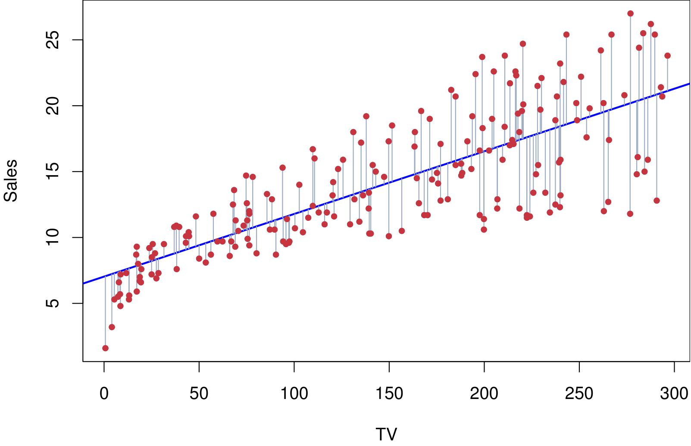

Figura&nbsp;3.1: Para los datos Advertising, el ajuste de mínimos cuadrados para la regresión de sales sobre TV. El ajuste se encuentra minimizando la suma de cuadrados de los residuos. Cada segmento de línea gris representa un residuo. En este caso, un ajuste lineal captura la esencia de la relación, aunque sobreestima la tendencia en la parte izquierda del gráfico.

La <a href="#fig-3-1" class="quarto-xref">Figura&nbsp;3.1</a> muestra el ajuste de regresión lineal simple a los datos `Advertising`, donde $\hat{\beta}_0 = 7.03$ y $\hat{\beta}_1 = 0.0475$. En otras palabras, según esta aproximación, $1{,}000$ adicionales gastados en publicidad en `TV` están asociados con la venta de aproximadamente 47.5 unidades adicionales del producto. En la <a href="#fig-3-2" class="quarto-xref">Figura&nbsp;3.2</a>, hemos calculado la RSS para varios valores de $\beta_0$ y $\beta_1$, usando los datos `Advertising` con `sales` como variable respuesta y `TV` como predictor. En cada gráfico, el punto rojo representa el par de estimaciones de mínimos cuadrados $(\hat{\beta}_0, \hat{\beta}_1)$ dado por <a href="#eq-3-4" class="quarto-xref">(3.4)</a>. Estos valores claramente minimizan la RSS.

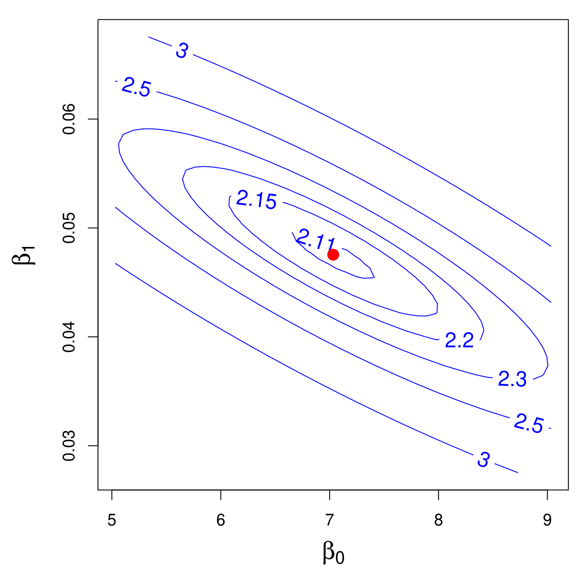
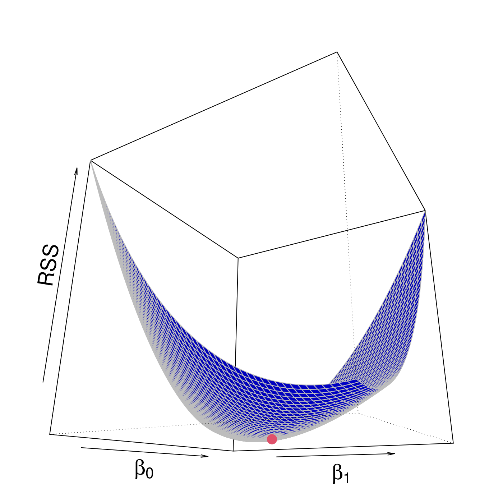

Figura&nbsp;3.2: Gráficos de contorno y tridimensional de la RSS sobre los datos Advertising, usando sales como variable respuesta y TV como predictor. Los puntos rojos corresponden a las estimaciones de mínimos cuadrados $\hat{\beta}_0$ y $\hat{\beta}_1$, dados por <a href="#eq-3-4" class="quarto-xref">(3.4)</a>.

### 3.1.2 Evaluación de la Precisión de las Estimaciones de los Coeficientes

Recordemos de (2.1) que asumimos que la verdadera relación entre $X$ e $Y$ toma la forma $Y = f(X) + \epsilon$ para alguna función desconocida $f$, donde $\epsilon$ es un término de error aleatorio con media cero. Si $f$ va a ser aproximada por una función lineal, entonces podemos escribir esta relación como

$$
Y = \beta_0 + \beta_1 X + \epsilon. \qquad (3.5)
$$

Aquí $\beta_0$ es el término de intercepto —es decir, el valor esperado de $Y$ cuando $X = 0$, y $\beta_1$ es la pendiente —el aumento promedio en $Y$ asociado con un aumento de una unidad en $X$. El término de error es un comodín para lo que omitimos con este modelo simple: la verdadera relación probablemente no es lineal, puede haber otras variables que causen variación en $Y$, y puede haber error de medición. Típicamente asumimos que el término de error es independiente de $X$.

El modelo dado por <a href="#eq-3-5" class="quarto-xref">(3.5)</a> define la *línea de regresión poblacional* (*population regression line*), que es la mejor aproximación lineal a la verdadera relación entre $X$ e $Y$.^[La suposición de linealidad es a menudo un modelo de trabajo útil. Sin embargo, a pesar de lo que muchos libros de texto puedan decirnos, rara vez creemos que la verdadera relación sea lineal.] Las estimaciones de los coeficientes de regresión de mínimos cuadrados <a href="#eq-3-4" class="quarto-xref">(3.4)</a> caracterizan la *línea de mínimos cuadrados* (*least squares line*) <a href="#eq-3-2" class="quarto-xref">(3.2)</a>. El panel izquierdo de la <a href="#fig-3-3" class="quarto-xref">Figura&nbsp;3.3</a> muestra estas dos líneas en un ejemplo simulado simple. Creamos 100 valores aleatorios de $X$, y generamos 100 valores correspondientes de $Y$ a partir del modelo

$$
Y = 2 + 3X + \epsilon, \qquad (3.6)
$$

donde $\epsilon$ se generó a partir de una distribución normal con media cero. La línea roja en el panel izquierdo de la <a href="#fig-3-3" class="quarto-xref">Figura&nbsp;3.3</a> muestra la verdadera relación, $f(X) = 2 + 3X$, mientras que la línea azul es la estimación de mínimos cuadrados basada en los datos observados. La verdadera relación generalmente no se conoce para datos reales, pero la línea de mínimos cuadrados siempre puede calcularse usando las estimaciones de los coeficientes dadas en <a href="#eq-3-4" class="quarto-xref">(3.4)</a>. En otras palabras, en aplicaciones reales, tenemos acceso a un conjunto de observaciones a partir del cual podemos calcular la línea de mínimos cuadrados; sin embargo, la línea de regresión poblacional no se observa. En el panel derecho de la <a href="#fig-3-3" class="quarto-xref">Figura&nbsp;3.3</a> hemos generado diez conjuntos de datos diferentes a partir del modelo dado por <a href="#eq-3-6" class="quarto-xref">(3.6)</a> y graficado las diez líneas de mínimos cuadrados correspondientes. Nótese que diferentes conjuntos de datos generados a partir del mismo modelo verdadero resultan en líneas de mínimos cuadrados ligeramente diferentes, pero la línea de regresión poblacional no observada no cambia.

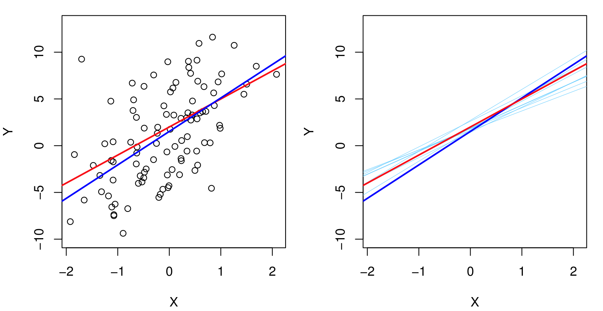

Figura&nbsp;3.3: Un conjunto de datos simulado. <em>Izquierda:</em> La línea roja representa la verdadera relación, $f(X) = 2 + 3X$, que se conoce como la línea de regresión poblacional. La línea azul es la línea de mínimos cuadrados; es la estimación de mínimos cuadrados para $f(X)$ basada en los datos observados, mostrados en negro. <em>Derecha:</em> La línea de regresión poblacional se muestra nuevamente en rojo, y la línea de mínimos cuadrados en azul oscuro. En azul claro, se muestran diez líneas de mínimos cuadrados, cada una calculada con base en un conjunto aleatorio separado de observaciones. Cada línea de mínimos cuadrados es diferente, pero en promedio, las líneas de mínimos cuadrados están bastante cerca de la línea de regresión poblacional.

A primera vista, la diferencia entre la línea de regresión poblacional y la línea de mínimos cuadrados puede parecer sutil y confusa. Solo tenemos un conjunto de datos, así que ¿qué significa que dos líneas diferentes describan la relación entre el predictor y la variable respuesta? Fundamentalmente, el concepto de estas dos líneas es una extensión natural del enfoque estadístico estándar de usar información de una muestra para estimar características de una población grande. Por ejemplo, supongamos que estamos interesados en conocer la media poblacional $\mu$ de alguna variable aleatoria $Y$. Desafortunadamente, $\mu$ es desconocida, pero tenemos acceso a $n$ observaciones de $Y$, $y_1, \ldots, y_n$, que podemos usar para estimar $\mu$. Una estimación razonable es $\hat{\mu} = \bar{y}$, donde $\bar{y} = \frac{1}{n} \sum_{i=1}^{n} y_i$ es la media muestral. La media muestral y la media poblacional son diferentes, pero en general la media muestral proporcionará una buena estimación de la media poblacional. De la misma manera, los coeficientes desconocidos $\beta_0$ y $\beta_1$ en la regresión lineal definen la línea de regresión poblacional. Buscamos estimar estos coeficientes desconocidos usando $\hat{\beta}_0$ y $\hat{\beta}_1$ dados en <a href="#eq-3-4" class="quarto-xref">(3.4)</a>. Estas estimaciones de los coeficientes definen la línea de mínimos cuadrados.

La analogía entre la regresión lineal y la estimación de la media de una variable aleatoria es apropiada y se basa en el concepto de *sesgo* (*bias*). Si usamos la media muestral $\hat{\mu}$ para estimar $\mu$, esta estimación es *insesgada* (*unbiased*), en el sentido de que en promedio, esperamos que $\hat{\mu}$ sea igual a $\mu$. ¿Qué significa exactamente esto? Significa que con base en un conjunto particular de observaciones $y_1, \ldots, y_n$, $\hat{\mu}$ podría sobrestimar $\mu$, y con base en otro conjunto de observaciones, $\hat{\mu}$ podría subestimar $\mu$. Pero si pudiéramos promediar un número enorme de estimaciones de $\mu$ obtenidas de un número enorme de conjuntos de observaciones, entonces este promedio sería exactamente igual a $\mu$. Por lo tanto, un *estimador insesgado* (*unbiased estimator*) no sobrestima ni subestima sistemáticamente el verdadero parámetro. La propiedad de insesgadez también se cumple para las estimaciones de los coeficientes de mínimos cuadrados dadas por <a href="#eq-3-4" class="quarto-xref">(3.4)</a>: si estimamos $\beta_0$ y $\beta_1$ con base en un conjunto de datos particular, entonces nuestras estimaciones no serán exactamente iguales a $\beta_0$ y $\beta_1$. Pero si pudiéramos promediar las estimaciones obtenidas sobre un número enorme de conjuntos de datos, ¡entonces el promedio de estas estimaciones sería exacto! De hecho, podemos ver en el panel derecho de la <a href="#fig-3-3" class="quarto-xref">Figura&nbsp;3.3</a> que el promedio de muchas líneas de mínimos cuadrados, cada una estimada a partir de un conjunto de datos separado, está bastante cerca de la verdadera línea de regresión poblacional.

Continuamos la analogía con la estimación de la media poblacional $\mu$ de una variable aleatoria $Y$. Una pregunta natural es la siguiente: ¿qué tan precisa es la media muestral $\hat{\mu}$ como estimación de $\mu$? Hemos establecido que el promedio de los $\hat{\mu}$ sobre muchos conjuntos de datos estará muy cerca de $\mu$, pero que una sola estimación $\hat{\mu}$ puede ser una subestimación o sobrestimación sustancial de $\mu$. ¿Qué tan lejos estará esa única estimación $\hat{\mu}$? En general, respondemos esta pregunta calculando el *error estándar* (*standard error*) de $\hat{\mu}$, escrito como $\text{SE}(\hat{\mu})$. Tenemos la bien conocida fórmula

$$
\text{Var}(\hat{\mu}) = \text{SE}(\hat{\mu})^2 = \frac{\sigma^2}{n}, \qquad (3.7)
$$

donde $\sigma$ es la desviación estándar de cada realización $y_i$ de $Y$.^[Esta fórmula es válida siempre que las $n$ observaciones no estén correlacionadas.] A grandes rasgos, el *error estándar* nos dice la cantidad promedio en que esta estimación $\hat{\mu}$ difiere del valor real de $\mu$. La <a href="#eq-3-7" class="quarto-xref">Ecuación&nbsp;3.7</a> también nos dice cómo esta desviación se reduce con $n$ —cuantas más observaciones tengamos, menor será el error estándar de $\hat{\mu}$. De manera similar, podemos preguntarnos qué tan cerca están $\hat{\beta}_0$ y $\hat{\beta}_1$ de los valores verdaderos $\beta_0$ y $\beta_1$. Para calcular los errores estándar asociados con $\hat{\beta}_0$ y $\hat{\beta}_1$, usamos las siguientes fórmulas:

$$
\text{SE}(\hat{\beta}_0)^2 = \sigma^2 \left[ \frac{1}{n} + \frac{\bar{x}^2}{\sum_{i=1}^{n} (x_i - \bar{x})^2} \right], \qquad \text{SE}(\hat{\beta}_1)^2 = \frac{\sigma^2}{\sum_{i=1}^{n} (x_i - \bar{x})^2}, \qquad (3.8)
$$

donde $\sigma^2 = \text{Var}(\epsilon)$. Para que estas fórmulas sean estrictamente válidas, precisamos asumir que los errores $\epsilon_i$ para cada observación tienen varianza común $\sigma^2$ y no están correlacionados. Esto claramente no es cierto en la <a href="#fig-3-1" class="quarto-xref">Figura&nbsp;3.1</a>, pero la fórmula aún resulta ser una buena aproximación. Nótese en la fórmula que $\text{SE}(\hat{\beta}_1)$ es menor cuando los $x_i$ están más dispersos; intuitivamente tenemos más *apalancamiento* (*leverage*) para estimar una pendiente cuando este es el caso. También vemos que $\text{SE}(\hat{\beta}_0)$ sería igual a $\text{SE}(\hat{\mu})$ si $\bar{x}$ fuera cero (en cuyo caso $\hat{\beta}_0$ sería igual a $\bar{y}$). En general, $\sigma^2$ no se conoce, pero puede estimarse a partir de los datos. Esta estimación de $\sigma$ se conoce como el *error estándar residual* (*residual standard error*), y está dada por la fórmula $\text{RSE} = \sqrt{\text{RSS}/(n - 2)}$. Estrictamente hablando, cuando $\sigma^2$ se estima a partir de los datos deberíamos escribir $\widehat{\text{SE}}(\hat{\beta}_1)$ para indicar que se ha realizado una estimación, pero por simplicidad de notación omitiremos este "acento circunflejo" adicional.

Los errores estándar pueden usarse para calcular *intervalos de confianza* (*confidence intervals*). Un *intervalo de confianza* del 95% se define como un rango de valores tal que con un 95% de probabilidad, el rango contendrá el verdadero valor desconocido del parámetro. El rango se define en términos de límites inferior y superior calculados a partir de la muestra de datos. Un intervalo de confianza del 95% tiene la siguiente propiedad: si tomamos muestras repetidas y construimos el intervalo de confianza para cada muestra, el 95% de los intervalos contendrá el verdadero valor desconocido del parámetro. Para la regresión lineal, el intervalo de confianza del 95% para $\beta_1$ toma aproximadamente la forma

$$
\hat{\beta}_1 \pm 2 \cdot \text{SE}(\hat{\beta}_1). \qquad (3.9)
$$

Es decir, hay aproximadamente un 95% de probabilidad de que el intervalo

$$
\big[ \hat{\beta}_1 - 2 \cdot \text{SE}(\hat{\beta}_1), \quad \hat{\beta}_1 + 2 \cdot \text{SE}(\hat{\beta}_1) \big] \qquad (3.10)
$$

contendrá el verdadero valor de $\beta_1$.^[Aproximadamente por varias razones. La <a href="#eq-3-10" class="quarto-xref">Ecuación&nbsp;3.10</a> depende de la suposición de que los errores son gaussianos. Además, el factor de 2 delante del término $\text{SE}(\hat{\beta}_1)$ variará ligeramente dependiendo del número de observaciones $n$ en la regresión lineal. Para ser precisos, en lugar del número 2, <a href="#eq-3-10" class="quarto-xref">(3.10)</a> debería contener el cuantil del 97.5% de una distribución $t$ con $n-2$ grados de libertad. Más adelante en este capítulo se proporcionarán detalles sobre cómo calcular el intervalo de confianza del 95% de manera precisa en R.] De manera similar, un intervalo de confianza para $\beta_0$ toma aproximadamente la forma

$$
\hat{\beta}_0 \pm 2 \cdot \text{SE}(\hat{\beta}_0). \qquad (3.11)
$$

En el caso de los datos `Advertising`, el intervalo de confianza del 95% para $\beta_0$ es $[6.130, 7.935]$ y el intervalo de confianza del 95% para $\beta_1$ es $[0.042, 0.053]$. Por lo tanto, podemos concluir que en ausencia de cualquier publicidad, las ventas (`sales`) estarán, en promedio, entre 6{,}130 y 7{,}935 unidades. Además, por cada aumento de $1{,}000$ en publicidad televisiva, habrá un aumento promedio en las ventas de entre 42 y 53 unidades.

Los errores estándar también pueden usarse para realizar *pruebas de hipótesis* (*hypothesis tests*) sobre los coeficientes. La prueba de hipótesis más común implica contrastar la *hipótesis nula* (*null hypothesis*) de

$$
H_0: \text{ No existe relación entre } X \text{ e } Y \qquad (3.12)
$$

frente a la *hipótesis alternativa* (*alternative hypothesis*)

$$
H_a: \text{ Existe alguna relación entre } X \text{ e } Y. \qquad (3.13)
$$

Matemáticamente, esto corresponde a contrastar

$$
H_0: \beta_1 = 0$$

frente a

$$H_a: \beta_1 \neq 0,$$

ya que si $\beta_1 = 0$ entonces el modelo <a href="#eq-3-5" class="quarto-xref">(3.5)</a> se reduce a $Y = \beta_0 + \epsilon$, y $X$ no está asociado con $Y$. Para contrastar la hipótesis nula, necesitamos determinar si $\hat{\beta}_1$, nuestra estimación para $\beta_1$, está suficientemente lejos de cero como para poder confiar en que $\beta_1$ es distinto de cero. ¿Qué tan lejos es suficientemente lejos? Esto, por supuesto, depende de la precisión de $\hat{\beta}_1$ —es decir, depende de $\text{SE}(\hat{\beta}_1)$. Si $\text{SE}(\hat{\beta}_1)$ es pequeño, entonces incluso valores relativamente pequeños de $\hat{\beta}_1$ pueden proporcionar evidencia sólida de que $\beta_1 \neq 0$, y por lo tanto de que existe una relación entre $X$ e $Y$. En contraste, si $\text{SE}(\hat{\beta}_1)$ es grande, entonces $\hat{\beta}_1$ debe ser grande en valor absoluto para que podamos rechazar la hipótesis nula. En la práctica, calculamos un *estadístico t* (*t-statistic*), dado por

$$
t = \frac{\hat{\beta}_1 - 0}{\text{SE}(\hat{\beta}_1)}, \qquad (3.14)
$$

que mide el número de desviaciones estándar a las que $\hat{\beta}_1$ está de 0. Si realmente no existe relación entre $X$ e $Y$, entonces esperamos que <a href="#eq-3-14" class="quarto-xref">(3.14)</a> tenga una distribución $t$ con $n - 2$ grados de libertad. La distribución $t$ tiene forma de campana y para valores de $n$ mayores que aproximadamente 30 es bastante similar a la distribución normal estándar. En consecuencia, es sencillo calcular la probabilidad de observar cualquier número igual a $|t|$ o mayor en valor absoluto, asumiendo $\beta_1 = 0$. Llamamos a esta probabilidad el *valor p* (*p-value*). A grandes rasgos, interpretamos el *valor p* de la siguiente manera: un *valor p* pequeño indica que es poco probable observar una asociación tan sustancial entre el predictor y la variable respuesta debido al azar, en ausencia de cualquier asociación real entre el predictor y la variable respuesta. Por lo tanto, si vemos un *valor p* pequeño, entonces podemos inferir que existe una asociación entre el predictor y la variable respuesta. Rechazamos la hipótesis nula —es decir, declaramos que existe una relación entre $X$ e $Y$— si el *valor p* es suficientemente pequeño. Los puntos de corte típicos para el *valor p* para rechazar la hipótesis nula son 5% o 1%, aunque este tema se explorará con mucho mayor detalle en el Capítulo 13. Cuando $n = 30$, estos corresponden a estadísticos $t$ <a href="#eq-3-14" class="quarto-xref">(3.14)</a> de alrededor de 2 y 2.75, respectivamente.

|             | Coeficiente | Error estándar | Estadístico t | Valor p   |
|:------------|:-----------:|:--------------:|:-------------:|:---------:|
| Intercepto  |   7.0325    |    0.4578      |    15.36      | $< 0.0001$ |
| TV          |   0.0475    |    0.0027      |    17.67      | $< 0.0001$ |

: Tabla 3.1: Para los datos Advertising, coeficientes del modelo de mínimos cuadrados para la regresión del número de unidades vendidas sobre el presupuesto de publicidad en TV. Un aumento de $1{,}000$ en el presupuesto de publicidad en TV está asociado con un aumento en las ventas de alrededor de 50 unidades. (Recordemos que la variable sales está en miles de unidades, y la variable TV está en miles de dólares.)

La <a href="#tbl-3-1" class="quarto-xref">Tabla&nbsp;3.1</a> proporciona detalles del modelo de mínimos cuadrados para la regresión del número de unidades vendidas sobre el presupuesto de publicidad en `TV` para los datos `Advertising`. Nótese que los coeficientes para $\hat{\beta}_0$ y $\hat{\beta}_1$ son muy grandes en relación con sus errores estándar, por lo que los estadísticos $t$ también son grandes; las probabilidades de ver tales valores si $H_0$ es verdadera son virtualmente cero. Por lo tanto, podemos concluir que $\beta_0 \neq 0$ y $\beta_1 \neq 0$.^[En la <a href="#tbl-3-1" class="quarto-xref">Tabla&nbsp;3.1</a>, un valor p pequeño para el intercepto indica que podemos rechazar la hipótesis nula de que $\beta_0 = 0$, y un valor p pequeño para TV indica que podemos rechazar la hipótesis nula de que $\beta_1 = 0$. Rechazar esta última hipótesis nula nos permite concluir que existe una relación entre TV y sales. Rechazar la primera nos permite concluir que en ausencia de gasto en TV, las ventas son distintas de cero.]

### 3.1.3 Evaluación de la Precisión del Modelo

Una vez que hemos rechazado la hipótesis nula <a href="#eq-3-12" class="quarto-xref">(3.12)</a> a favor de la hipótesis alternativa <a href="#eq-3-13" class="quarto-xref">(3.13)</a>, es natural querer cuantificar el grado en que el modelo se ajusta a los datos. La calidad de un ajuste de regresión lineal se evalúa típicamente usando dos cantidades relacionadas: el *error estándar residual* (*residual standard error*, RSE) y el estadístico $R^2$.

| Cantidad                     | Valor |
|:-----------------------------|:-----:|
| Error estándar residual      | 3.26  |
| $R^2$                        | 0.612 |
| Estadístico $F$              | 312.1 |

: Tabla 3.2: Para los datos Advertising, más información sobre el modelo de mínimos cuadrados para la regresión del número de unidades vendidas sobre el presupuesto de publicidad en TV.

La <a href="#tbl-3-2" class="quarto-xref">Tabla&nbsp;3.2</a> muestra el RSE, el estadístico $R^2$ y el *estadístico F* (*F-statistic*) (que se describirá en la Sección 3.2.2) para la regresión lineal del número de unidades vendidas sobre el presupuesto de publicidad en `TV`.

**Error Estándar Residual**

Recordemos del modelo <a href="#eq-3-5" class="quarto-xref">(3.5)</a> que asociado con cada observación hay un término de error $\epsilon$. Debido a la presencia de estos términos de error, incluso si conociéramos la verdadera línea de regresión (es decir, incluso si $\beta_0$ y $\beta_1$ fueran conocidos), no podríamos predecir perfectamente $Y$ a partir de $X$. El RSE es una estimación de la desviación estándar de $\epsilon$. A grandes rasgos, es la cantidad promedio en que la variable respuesta se desviará de la verdadera línea de regresión. Se calcula usando la fórmula

$$
\text{RSE} = \sqrt{\frac{1}{n-2} \text{RSS}} = \sqrt{\frac{1}{n-2} \sum_{i=1}^{n} (y_i - \hat{y}_i)^2}. \qquad (3.15)
$$

Nótese que la RSS se definió en la Sección 3.1.1, y está dada por la fórmula

$$
\text{RSS} = \sum_{i=1}^{n} (y_i - \hat{y}_i)^2. \qquad (3.16)
$$

En el caso de los datos `Advertising`, vemos de la salida de la regresión lineal en la <a href="#tbl-3-2" class="quarto-xref">Tabla&nbsp;3.2</a> que el RSE es 3.26. En otras palabras, las ventas reales en cada mercado se desvían de la verdadera línea de regresión en aproximadamente 3{,}260 unidades, en promedio. Otra forma de pensar sobre esto es que incluso si el modelo fuera correcto y los valores verdaderos de los coeficientes desconocidos $\beta_0$ y $\beta_1$ se conocieran exactamente, cualquier predicción de las ventas basada en la publicidad en `TV` aún estaría errada en aproximadamente 3{,}260 unidades en promedio. Por supuesto, si 3{,}260 unidades es un error de predicción aceptable o no depende del contexto del problema. En el conjunto de datos `Advertising`, el valor medio de `sales` sobre todos los mercados es aproximadamente 14{,}000 unidades, por lo que el error porcentual es $3{,}260/14{,}000 = 23\%$.

El RSE se considera una medida de la falta de ajuste del modelo <a href="#eq-3-5" class="quarto-xref">(3.5)</a> a los datos. Si las predicciones obtenidas usando el modelo están muy cerca de los valores reales —es decir, si $\hat{y}_i \approx y_i$ para $i = 1, \ldots, n$— entonces <a href="#eq-3-15" class="quarto-xref">(3.15)</a> será pequeño, y podemos concluir que el modelo se ajusta muy bien a los datos. Por otro lado, si $\hat{y}_i$ está muy lejos de $y_i$ para una o más observaciones, entonces el RSE puede ser bastante grande, indicando que el modelo no se ajusta bien a los datos.

**Estadístico $R^2$**

El RSE proporciona una medida absoluta de la falta de ajuste del modelo <a href="#eq-3-5" class="quarto-xref">(3.5)</a> a los datos. Pero dado que se mide en las unidades de $Y$, no siempre está claro qué constituye un buen RSE. El estadístico $R^2$ proporciona una medida alternativa de ajuste. Toma la forma de una proporción —la proporción de varianza explicada— y por lo tanto siempre toma un valor entre 0 y 1, y es independiente de la escala de $Y$.

Para calcular $R^2$, usamos la fórmula

$$
R^2 = \frac{\text{TSS} - \text{RSS}}{\text{TSS}} = 1 - \frac{\text{RSS}}{\text{TSS}}, \qquad (3.17)
$$

donde $\text{TSS} = \sum (y_i - \bar{y})^2$ es la *suma total de cuadrados* (*total sum of squares*), y RSS se define en <a href="#eq-3-16" class="quarto-xref">(3.16)</a>. TSS mide la varianza total en la variable respuesta $Y$, y puede pensarse como la cantidad de variabilidad inherente en la variable respuesta antes de que se realice la regresión. En contraste, RSS mide la cantidad de variabilidad que queda sin explicar después de realizar la regresión. Por lo tanto, $\text{TSS} - \text{RSS}$ mide la cantidad de variabilidad en la variable respuesta que es explicada (o eliminada) al realizar la regresión, y $R^2$ mide la proporción de variabilidad en $Y$ que puede explicarse usando $X$. Un estadístico $R^2$ cercano a 1 indica que una gran proporción de la variabilidad en la variable respuesta es explicada por la regresión. Un número cercano a 0 indica que la regresión no explica gran parte de la variabilidad en la variable respuesta; esto podría ocurrir porque el modelo lineal es incorrecto, o la varianza del error $\sigma^2$ es alta, o ambas cosas. En la <a href="#tbl-3-2" class="quarto-xref">Tabla&nbsp;3.2</a>, el $R^2$ fue 0.61, por lo que poco menos de dos tercios de la variabilidad en `sales` es explicada por una regresión lineal sobre `TV`.

El estadístico $R^2$ <a href="#eq-3-17" class="quarto-xref">(3.17)</a> tiene una ventaja interpretativa sobre el RSE <a href="#eq-3-15" class="quarto-xref">(3.15)</a>, ya que a diferencia del RSE, siempre se encuentra entre 0 y 1. Sin embargo, aún puede ser difícil determinar qué es un buen valor de $R^2$, y en general, esto dependerá de la aplicación. Por ejemplo, en ciertos problemas de física, podemos saber que los datos verdaderamente provienen de un modelo lineal con un pequeño error residual. En este caso, esperaríamos ver un valor de $R^2$ extremadamente cercano a 1, y un valor de $R^2$ sustancialmente menor podría indicar un problema grave con el experimento en el que se generaron los datos. Por otro lado, en aplicaciones típicas en biología, psicología, marketing y otros dominios, el modelo lineal <a href="#eq-3-5" class="quarto-xref">(3.5)</a> es en el mejor de los casos una aproximación extremadamente burda a los datos, y los errores residuales debidos a otros factores no medidos son a menudo muy grandes. En este contexto, esperaríamos que solo una proporción muy pequeña de la varianza en la variable respuesta fuera explicada por el predictor, ¡y un valor de $R^2$ muy por debajo de 0.1 podría ser más realista!

El estadístico $R^2$ es una medida de la relación lineal entre $X$ e $Y$. Recordemos que la *correlación* (*correlation*), definida como

$$
\text{Cor}(X, Y) = \frac{\sum_{i=1}^{n} (x_i - \bar{x})(y_i - \bar{y})}{\sqrt{\sum_{i=1}^{n} (x_i - \bar{x})^2} \sqrt{\sum_{i=1}^{n} (y_i - \bar{y})^2}}, \qquad (3.18)
$$

es también una medida de la relación lineal entre $X$ e $Y$.^[Nótese que, de hecho, el lado derecho de <a href="#eq-3-18" class="quarto-xref">(3.18)</a> es la correlación muestral; por lo tanto, sería más correcto escribir $\widehat{\text{Cor}}(X, Y)$; sin embargo, omitimos el "acento circunflejo" para facilitar la notación.] Esto sugiere que podríamos usar $r = \text{Cor}(X, Y)$ en lugar de $R^2$ para evaluar el ajuste del modelo lineal. De hecho, se puede demostrar que en el contexto de la regresión lineal simple, $R^2 = r^2$. En otras palabras, la correlación al cuadrado y el estadístico $R^2$ son idénticos. Sin embargo, en la siguiente sección discutiremos el problema de la *regresión lineal múltiple*, en el cual usamos varios predictores simultáneamente para predecir la variable respuesta. El concepto de correlación entre los predictores y la variable respuesta no se extiende automáticamente a este contexto, ya que la correlación cuantifica la asociación entre un solo par de variables en lugar de entre un número mayor de variables. Veremos que $R^2$ cumple este papel.

**Regresión simple de sales sobre radio**

|             | Coeficiente | Error estándar | Estadístico t | Valor p   |
|:------------|:-----------:|:--------------:|:-------------:|:---------:|
| Intercepto  |   9.312     |    0.563       |    16.54      | $< 0.0001$ |
| radio       |   0.203     |    0.020       |     9.92      | $< 0.0001$ |

**Regresión simple de sales sobre newspaper**

|             | Coeficiente | Error estándar | Estadístico t | Valor p   |
|:------------|:-----------:|:--------------:|:-------------:|:---------:|
| Intercepto  |   12.351    |    0.621       |    19.88      | $< 0.0001$ |
| newspaper   |   0.055     |    0.017       |     3.30      |  0.00115  |

Tabla&nbsp;3.3: Más modelos de regresión lineal simple para los datos Advertising. Coeficientes del modelo de regresión lineal simple para el número de unidades vendidas sobre el presupuesto de publicidad en radio (arriba) y en newspaper (abajo). Un aumento de $1{,}000$ en el gasto en publicidad radial está asociado con un aumento promedio en las ventas de alrededor de 203 unidades, mientras que el mismo aumento en el gasto en publicidad en periódicos está asociado con un aumento promedio en las ventas de alrededor de 55 unidades. (Nótese que la variable sales está en miles de unidades, y las variables radio y newspaper están en miles de dólares.)

## 3.2 Regresión Lineal Múltiple

La regresión lineal simple es un enfoque útil para predecir una variable respuesta con base en una única variable predictora. Sin embargo, en la práctica a menudo tenemos más de un predictor. Por ejemplo, en los datos `Advertising`, hemos examinado la relación entre `sales` y la publicidad en `TV`. También tenemos datos sobre la cantidad de dinero gastado en publicidad en `radio` y en `newspaper` (periódico), y podríamos querer saber si alguno de estos dos medios está asociado con las ventas. ¿Cómo podemos extender nuestro análisis de los datos `Advertising` para dar cabida a estos dos predictores adicionales?

Una opción es ejecutar tres regresiones lineales simples separadas, cada una de las cuales usa un medio publicitario diferente como predictor. Por ejemplo, podemos ajustar una regresión lineal simple para predecir `sales` con base en la cantidad gastada en anuncios de `radio`. Los resultados se muestran en la <a href="#tbl-3-3" class="quarto-xref">Tabla&nbsp;3.3</a> (tabla superior). Encontramos que un aumento de $1{,}000$ en el gasto en publicidad radial está asociado con un aumento en las ventas de alrededor de 203 unidades. La <a href="#tbl-3-3" class="quarto-xref">Tabla&nbsp;3.3</a> (tabla inferior) contiene los coeficientes de mínimos cuadrados para una regresión lineal simple de `sales` sobre el presupuesto de publicidad en `newspaper`. Un aumento de $1{,}000$ en el presupuesto de publicidad en periódicos está asociado con un aumento en las ventas de aproximadamente 55 unidades.

Sin embargo, el enfoque de ajustar un modelo de regresión lineal simple separado para cada predictor no es del todo satisfactorio. En primer lugar, no está claro cómo hacer una única predicción de `sales` dados los tres presupuestos de medios publicitarios, ya que cada uno de los presupuestos está asociado con una ecuación de regresión separada. En segundo lugar, cada una de las tres ecuaciones de regresión ignora los otros dos medios al formar estimaciones para los coeficientes de regresión. Veremos en breve que si los presupuestos de los medios están correlacionados entre sí en los 200 mercados de nuestro conjunto de datos, entonces esto puede llevar a estimaciones muy engañosas de la asociación entre cada presupuesto de medio y las ventas.

En lugar de ajustar un modelo de regresión lineal simple separado para cada predictor, un mejor enfoque es extender el modelo de regresión lineal simple <a href="#eq-3-5" class="quarto-xref">(3.5)</a> para que pueda dar cabida directamente a múltiples predictores. Podemos hacer esto dando a cada predictor un coeficiente de pendiente separado en un solo modelo. En general, supongamos que tenemos $p$ predictores distintos. Entonces el modelo de *regresión lineal múltiple* (*multiple linear regression*) toma la forma

$$
Y = \beta_0 + \beta_1 X_1 + \beta_2 X_2 + \cdots + \beta_p X_p + \epsilon, \qquad (3.19)
$$

donde $X_j$ representa el $j$-ésimo predictor y $\beta_j$ cuantifica la asociación entre esa variable y la variable respuesta. Interpretamos $\beta_j$ como el efecto promedio sobre $Y$ de un aumento de una unidad en $X_j$, *manteniendo fijos todos los demás predictores*. En el ejemplo de `Advertising`, <a href="#eq-3-19" class="quarto-xref">(3.19)</a> se convierte en

$$
\text{sales} = \beta_0 + \beta_1 \times \text{TV} + \beta_2 \times \text{radio} + \beta_3 \times \text{newspaper} + \epsilon. \qquad (3.20)
$$

### 3.2.1 Estimación de los Coeficientes de Regresión

Como fue el caso en el contexto de la regresión lineal simple, los coeficientes de regresión $\beta_0, \beta_1, \ldots, \beta_p$ en <a href="#eq-3-19" class="quarto-xref">(3.19)</a> son desconocidos y deben estimarse. Dadas las estimaciones $\hat{\beta}_0, \hat{\beta}_1, \ldots, \hat{\beta}_p$, podemos hacer predicciones usando la fórmula

$$
\hat{y} = \hat{\beta}_0 + \hat{\beta}_1 x_1 + \hat{\beta}_2 x_2 + \cdots + \hat{\beta}_p x_p. \qquad (3.21)
$$

Los parámetros se estiman usando el mismo enfoque de mínimos cuadrados que vimos en el contexto de la regresión lineal simple. Elegimos $\beta_0, \beta_1, \ldots, \beta_p$ para minimizar la suma de cuadrados de los residuos

$$
\begin{aligned}
\text{RSS} &= \sum_{i=1}^{n} (y_i - \hat{y}_i)^2 \\
           &= \sum_{i=1}^{n} (y_i - \hat{\beta}_0 - \hat{\beta}_1 x_{i1} - \hat{\beta}_2 x_{i2} - \cdots - \hat{\beta}_p x_{ip})^2. \qquad (3.22)
\end{aligned}
$$

Los valores $\hat{\beta}_0, \hat{\beta}_1, \ldots, \hat{\beta}_p$ que minimizan <a href="#eq-3-22" class="quarto-xref">(3.22)</a> son las *estimaciones de los coeficientes de regresión de mínimos cuadrados múltiples*. A diferencia de las estimaciones de la regresión lineal simple dadas en <a href="#eq-3-4" class="quarto-xref">(3.4)</a>, las estimaciones de los coeficientes de regresión múltiple tienen formas algo complicadas que se representan más fácilmente usando álgebra matricial. Por esta razón, no las proporcionamos aquí. Cualquier paquete de software estadístico puede usarse para calcular estas estimaciones de coeficientes, y más adelante en este capítulo mostraremos cómo hacerlo. La <a href="#fig-3-4" class="quarto-xref">Figura&nbsp;3.4</a> ilustra un ejemplo del ajuste de mínimos cuadrados a un conjunto de datos de juguete con $p = 2$ predictores.

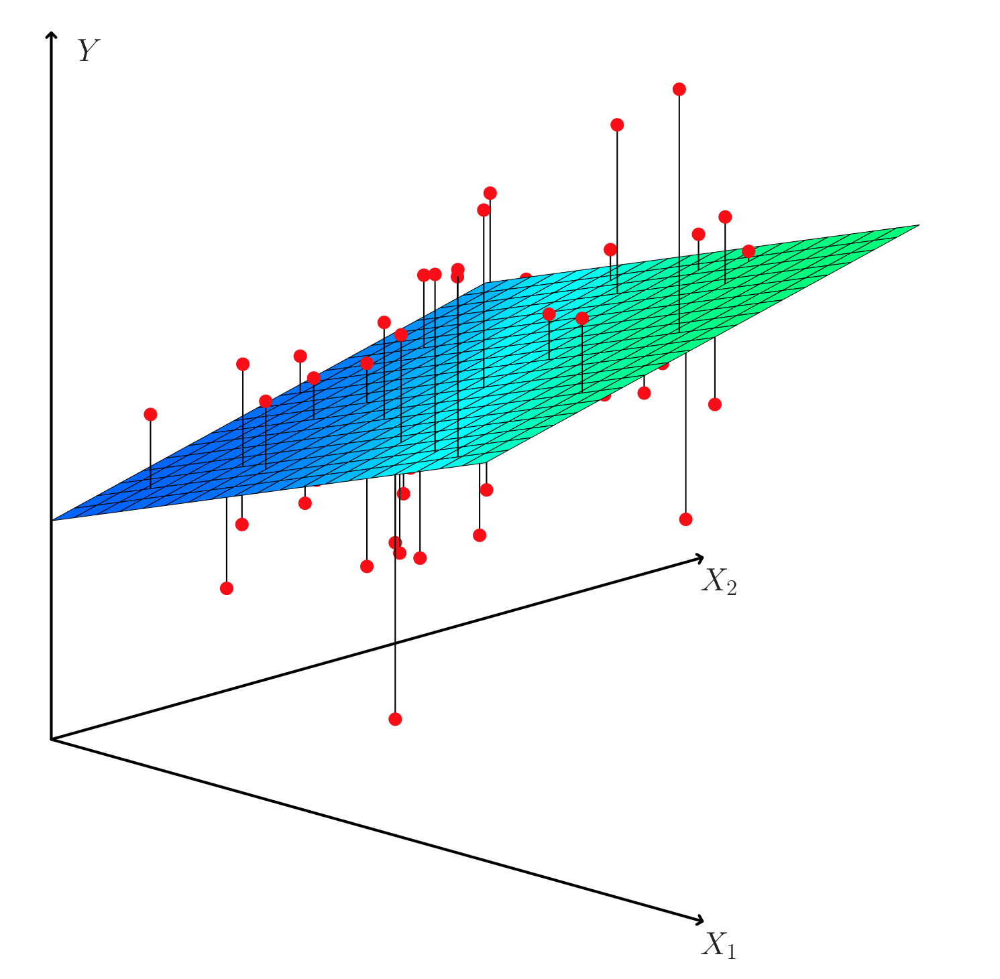

Figura&nbsp;3.4: En un entorno tridimensional, con dos predictores y una variable respuesta, la línea de regresión de mínimos cuadrados se convierte en un plano. El plano se elige para minimizar la suma de las distancias verticales al cuadrado entre cada observación (mostrada en rojo) y el plano.

|             | Coeficiente | Error estándar | Estadístico t | Valor p   |
|:------------|:-----------:|:--------------:|:-------------:|:---------:|
| Intercepto  |    2.939    |    0.3119      |     9.42      | $< 0.0001$ |
| TV          |    0.046    |    0.0014      |    32.81      | $< 0.0001$ |
| radio       |    0.189    |    0.0086      |    21.89      | $< 0.0001$ |
| newspaper   |   $-0.001$  |    0.0059      |    $-0.18$    |  0.8599   |

: Tabla 3.4: Para los datos Advertising, estimaciones de los coeficientes de mínimos cuadrados de la regresión lineal múltiple del número de unidades vendidas sobre los presupuestos de publicidad en TV, radio y newspaper.

La <a href="#tbl-3-4" class="quarto-xref">Tabla&nbsp;3.4</a> muestra las estimaciones de los coeficientes de regresión múltiple cuando los presupuestos de publicidad en `TV`, `radio` y `newspaper` se utilizan para predecir las ventas del producto usando los datos `Advertising`. Interpretamos estos resultados de la siguiente manera: para una cantidad dada de publicidad en `TV` y `newspaper`, gastar $1{,}000$ adicionales en publicidad radial está asociado con aproximadamente 189 unidades adicionales de ventas. Comparando estas estimaciones de coeficientes con las mostradas en las <a href="#tbl-3-1" class="quarto-xref">Tablas&nbsp;3.1</a> y <a href="#tbl-3-3" class="quarto-xref">3.3</a>, notamos que las estimaciones de los coeficientes de regresión múltiple para `TV` y `radio` son bastante similares a las estimaciones de los coeficientes de regresión lineal simple. Sin embargo, mientras que la estimación del coeficiente de regresión para `newspaper` en la <a href="#tbl-3-3" class="quarto-xref">Tabla&nbsp;3.3</a> era significativamente distinta de cero, la estimación del coeficiente para `newspaper` en el modelo de regresión múltiple es cercana a cero, y el *valor p* correspondiente ya no es significativo, con un valor alrededor de 0.86. Esto ilustra que los coeficientes de regresión simple y múltiple pueden ser bastante diferentes. Esta diferencia se debe al hecho de que en el caso de la regresión simple, el término de pendiente representa el aumento promedio en las ventas del producto asociado con un aumento de $1{,}000$ en publicidad en `newspaper`, ignorando otros predictores como `TV` y `radio`. En contraste, en el contexto de la regresión múltiple, el coeficiente para `newspaper` representa el aumento promedio en las ventas del producto asociado con aumentar el gasto en `newspaper` en $1{,}000$ *manteniendo* `TV` y `radio` *fijos*.

¿Tiene sentido que la regresión múltiple no sugiera una relación entre `sales` y `newspaper` mientras que la regresión lineal simple implica lo contrario? De hecho, sí tiene sentido. Consideremos la matriz de correlación para las tres variables predictoras y la variable respuesta, mostrada en la <a href="#tbl-3-5" class="quarto-xref">Tabla&nbsp;3.5</a>. Nótese que la correlación entre `radio` y `newspaper` es 0.35. Esto indica que los mercados con alta publicidad en `newspaper` tienden a tener también alta publicidad en `radio`. Ahora supongamos que la regresión múltiple es correcta y que la publicidad en `newspaper` no está asociada con `sales`, pero la publicidad en `radio` sí está asociada con `sales`. Entonces, en los mercados donde gastamos más en `radio` nuestras ventas tenderán a ser mayores, y como muestra nuestra matriz de correlación, también tendemos a gastar más en publicidad en `newspaper` en esos mismos mercados. Por lo tanto, en una regresión lineal simple que solo examina `sales` versus `newspaper`, observaremos que valores más altos de `newspaper` tienden a estar asociados con valores más altos de `sales`, aunque la publicidad en `newspaper` no esté directamente asociada con las ventas. Así que la publicidad en `newspaper` es un *sustituto* de la publicidad en `radio`; `newspaper` recibe el "crédito" por la asociación entre `radio` y `sales`.

|           |  TV    | radio  | newspaper | sales  |
|:----------|:------:|:------:|:---------:|:------:|
| TV        | 1.0000 | 0.0548 |  0.0567   | 0.7822 |
| radio     |        | 1.0000 |  0.3541   | 0.5762 |
| newspaper |        |        |  1.0000   | 0.2283 |
| sales     |        |        |           | 1.0000 |

: Tabla 3.5: Matriz de correlación para TV, radio, newspaper y sales para los datos Advertising.

Este resultado ligeramente contraintuitivo es muy común en muchas situaciones de la vida real. Consideremos un ejemplo absurdo para ilustrar el punto. Ejecutar una regresión de ataques de tiburón versus ventas de helados para datos recopilados en una comunidad costera durante un período de tiempo mostraría una relación positiva, similar a la observada entre `sales` y `newspaper`. Por supuesto, nadie ha sugerido (aún) que los helados deberían prohibirse en las playas para reducir los ataques de tiburón. En realidad, las temperaturas más altas hacen que más personas visiten la playa, lo que a su vez resulta en más ventas de helados y más ataques de tiburón. Una regresión múltiple de los ataques de tiburón sobre las ventas de helados y la temperatura revela que, como la intuición sugiere, las ventas de helados ya no son un predictor significativo después de ajustar por la temperatura.

### 3.2.2 Algunas Preguntas Importantes

Cuando realizamos una regresión lineal múltiple, generalmente estamos interesados en responder algunas preguntas importantes.

1. ¿Es al menos uno de los predictores $X_1, X_2, \ldots, X_p$ útil para predecir la variable respuesta?
2. ¿Todos los predictores ayudan a explicar $Y$, o solo un subconjunto de los predictores es útil?
3. ¿Qué tan bien se ajusta el modelo a los datos?
4. Dado un conjunto de valores de los predictores, ¿qué valor de respuesta debemos predecir, y qué tan precisa es nuestra predicción?

Ahora abordamos cada una de estas preguntas por turno.

**Uno: ¿Existe una Relación entre la Variable Respuesta y los Predictores?**

Recordemos que en el contexto de la regresión lineal simple, para determinar si existe una relación entre la variable respuesta y el predictor simplemente podemos verificar si $\beta_1 = 0$. En el contexto de la regresión múltiple con $p$ predictores, necesitamos preguntar si todos los coeficientes de regresión son cero, es decir, si $\beta_1 = \beta_2 = \cdots = \beta_p = 0$. Como en el contexto de la regresión lineal simple, utilizamos una prueba de hipótesis para responder esta pregunta. Contrastamos la hipótesis nula,

$$
H_0: \beta_1 = \beta_2 = \cdots = \beta_p = 0$$

frente a la alternativa

$$H_a: \text{al menos un } \beta_j \text{ es distinto de cero.}$$

Esta prueba de hipótesis se realiza calculando el *estadístico F* (*F-statistic*),

$$
F = \frac{(\text{TSS} - \text{RSS})/p}{\text{RSS}/(n - p - 1)}, \qquad (3.23)
$$

donde, al igual que con la regresión lineal simple, $\text{TSS} = \sum (y_i - \bar{y})^2$ y $\text{RSS} = \sum (y_i - \hat{y}_i)^2$. Si las suposiciones del modelo lineal son correctas, se puede demostrar que

$$
E\{\text{RSS}/(n - p - 1)\} = \sigma^2$$

y que, siempre que $H_0$ sea verdadera,

$$E\{(\text{TSS} - \text{RSS})/p\} = \sigma^2.$$

Por lo tanto, cuando no hay relación entre la variable respuesta y los predictores, se esperaría que el *estadístico F* tome un valor cercano a 1. Por otro lado, si $H_a$ es verdadera, entonces $E\{(\text{TSS} - \text{RSS})/p\} > \sigma^2$, por lo que esperamos que $F$ sea mayor que 1.

| Cantidad                     | Valor |
|:-----------------------------|:-----:|
| Error estándar residual      | 1.69  |
| $R^2$                        | 0.897 |
| Estadístico $F$              | 570   |

: Tabla 3.6: Más información sobre el modelo de mínimos cuadrados para la regresión del número de unidades vendidas sobre los presupuestos de publicidad en TV, newspaper y radio en los datos Advertising. Otra información sobre este modelo se mostró en la <a href="#tbl-3-4" class="quarto-xref">Tabla&nbsp;3.4</a>.

El *estadístico F* para el modelo de regresión lineal múltiple obtenido al regresar `sales` sobre `radio`, `TV` y `newspaper` se muestra en la <a href="#tbl-3-6" class="quarto-xref">Tabla&nbsp;3.6</a>. En este ejemplo, el *estadístico F* es 570. Dado que esto es mucho mayor que 1, proporciona evidencia contundente en contra de la hipótesis nula $H_0$. En otras palabras, el gran *estadístico F* sugiere que al menos uno de los medios publicitarios debe estar relacionado con las ventas. Sin embargo, ¿qué pasaría si el *estadístico F* hubiera estado más cerca de 1? ¿Qué tan grande necesita ser el *estadístico F* antes de que podamos rechazar $H_0$ y concluir que existe una relación? Resulta que la respuesta depende de los valores de $n$ y $p$. Cuando $n$ es grande, un *estadístico F* que es solo un poco mayor que 1 aún podría proporcionar evidencia en contra de $H_0$. En contraste, se necesita un *estadístico F* mayor para rechazar $H_0$ si $n$ es pequeño. Cuando $H_0$ es verdadera y los errores $\epsilon_i$ tienen una distribución normal, el *estadístico F* sigue una distribución $F$.^[Incluso si los errores no están distribuidos normalmente, el estadístico F sigue aproximadamente una distribución F siempre que el tamaño muestral $n$ sea grande.] Para cualquier valor dado de $n$ y $p$, cualquier paquete de software estadístico puede usarse para calcular el *valor p* asociado con el *estadístico F* usando esta distribución. Con base en este *valor p*, podemos determinar si rechazar o no $H_0$. Para los datos `Advertising`, el *valor p* asociado con el *estadístico F* en la <a href="#tbl-3-6" class="quarto-xref">Tabla&nbsp;3.6</a> es esencialmente cero, por lo que tenemos evidencia extremadamente fuerte de que al menos uno de los medios está asociado con un aumento en las ventas.

En <a href="#eq-3-23" class="quarto-xref">(3.23)</a> estamos contrastando $H_0$ de que todos los coeficientes son cero. A veces queremos contrastar que un subconjunto particular de $q$ de los coeficientes es cero. Esto corresponde a una hipótesis nula

$$H_0: \beta_{p-q+1} = \beta_{p-q+2} = \cdots = \beta_p = 0,$$

donde por conveniencia hemos colocado las variables elegidas para omisión al final de la lista. En este caso ajustamos un segundo modelo que utiliza todas las variables excepto esas últimas $q$. Supongamos que la suma de cuadrados de los residuos para ese modelo es $\text{RSS}_0$. Entonces el *estadístico F* apropiado es

$$
F = \frac{(\text{RSS}_0 - \text{RSS})/q}{\text{RSS}/(n - p - 1)}. \qquad (3.24)
$$

Nótese que en la <a href="#tbl-3-4" class="quarto-xref">Tabla&nbsp;3.4</a>, para cada predictor individual se reportaron un estadístico $t$ y un *valor p*. Estos proporcionan información sobre si cada predictor individual está relacionado con la variable respuesta, después de ajustar por los otros predictores. Resulta que cada uno de estos es exactamente equivalente^[El cuadrado de cada estadístico $t$ es el estadístico $F$ correspondiente.] a la prueba $F$ que omite esa única variable del modelo, dejando todas las demás dentro —es decir, $q=1$ en <a href="#eq-3-24" class="quarto-xref">(3.24)</a>. Así que reporta el efecto parcial de agregar esa variable al modelo. Por ejemplo, como discutimos anteriormente, estos *valores p* indican que `TV` y `radio` están relacionados con las ventas, pero que no hay evidencia de que `newspaper` esté asociado con las ventas, cuando `TV` y `radio` se mantienen fijos.

Dados estos *valores p* individuales para cada variable, ¿por qué necesitamos mirar el *estadístico F* global? Después de todo, parece probable que si alguno de los *valores p* para las variables individuales es muy pequeño, entonces al menos uno de los predictores está relacionado con la variable respuesta. Sin embargo, esta lógica es defectuosa, especialmente cuando el número de predictores $p$ es grande.

Por ejemplo, consideremos un ejemplo en el que $p = 100$ y $H_0: \beta_1 = \beta_2 = \cdots = \beta_p = 0$ es verdadera, por lo que ninguna variable está verdaderamente asociada con la variable respuesta. En esta situación, aproximadamente el 5% de los *valores p* asociados con cada variable (del tipo mostrado en la <a href="#tbl-3-4" class="quarto-xref">Tabla&nbsp;3.4</a>) estarán por debajo de 0.05 por azar. En otras palabras, esperamos ver aproximadamente cinco *valores p* pequeños incluso en ausencia de cualquier asociación verdadera entre los predictores y la variable respuesta.^[Esto está relacionado con el importante concepto de pruebas múltiples, que es el tema central del Capítulo 13.] De hecho, ¡es probable que observemos al menos un *valor p* por debajo de 0.05 por azar! Por lo tanto, si usamos los estadísticos $t$ individuales y los *valores p* asociados para decidir si existe o no alguna asociación entre las variables y la variable respuesta, hay una probabilidad muy alta de que concluyamos incorrectamente que existe una relación. Sin embargo, el *estadístico F* no sufre este problema porque ajusta por el número de predictores. Por lo tanto, si $H_0$ es verdadera, solo hay un 5% de probabilidad de que el *estadístico F* resulte en un *valor p* por debajo de 0.05, independientemente del número de predictores o del número de observaciones.

El enfoque de usar un *estadístico F* para contrastar cualquier asociación entre los predictores y la variable respuesta funciona cuando $p$ es relativamente pequeño, y ciertamente pequeño en comparación con $n$. Sin embargo, a veces tenemos un número muy grande de variables. Si $p > n$ entonces hay más coeficientes $\beta_j$ por estimar que observaciones a partir de las cuales estimarlos. En este caso ni siquiera podemos ajustar el modelo de regresión lineal múltiple usando mínimos cuadrados, por lo que el *estadístico F* no puede usarse, y tampoco la mayoría de los otros conceptos que hemos visto hasta ahora en este capítulo. Cuando $p$ es grande, se pueden usar algunos de los enfoques discutidos en la siguiente sección, como la *selección hacia adelante* (*forward selection*). Este contexto de *alta dimensionalidad* (*high-dimensional*) se discute con mayor detalle en el Capítulo 6.

**Dos: Decidir sobre las Variables Importantes**

Como se discutió en la sección anterior, el primer paso en un análisis de regresión múltiple es calcular el *estadístico F* y examinar el *valor p* asociado. Si concluimos con base en ese *valor p* que al menos uno de los predictores está relacionado con la variable respuesta, entonces es natural preguntarse ¡cuáles son los culpables! Podríamos mirar los *valores p* individuales como en la <a href="#tbl-3-4" class="quarto-xref">Tabla&nbsp;3.4</a>, pero como se discutió (y como se explora más a fondo en el Capítulo 13), si $p$ es grande es probable que hagamos algunos *descubrimientos falsos*.

Es posible que todos los predictores estén asociados con la variable respuesta, pero es más frecuente el caso en que la variable respuesta solo está asociada con un subconjunto de los predictores. La tarea de determinar qué predictores están asociados con la variable respuesta, para ajustar un solo modelo que involucre solo esos predictores, se conoce como *selección de variables* (*variable selection*). El problema de la *selección de variables* se estudia extensamente en el Capítulo 6, por lo que aquí solo proporcionaremos un breve resumen de algunos enfoques clásicos.

Idealmente, nos gustaría realizar la *selección de variables* probando muchos modelos diferentes, cada uno conteniendo un subconjunto diferente de los predictores. Por ejemplo, si $p = 2$, entonces podemos considerar cuatro modelos: (1) un modelo que no contiene variables, (2) un modelo que contiene solo $X_1$, (3) un modelo que contiene solo $X_2$, y (4) un modelo que contiene tanto $X_1$ como $X_2$. Podemos entonces seleccionar el mejor modelo entre todos los modelos que hemos considerado. ¿Cómo determinamos cuál modelo es el mejor? Se pueden usar varios estadísticos para juzgar la calidad de un modelo. Estos incluyen el $C_p$ de Mallows, el *criterio de información de Akaike* (*Akaike information criterion*, AIC), el *criterio de información bayesiano* (*Bayesian information criterion*, BIC) y el $R^2$ *ajustado* (*adjusted $R^2$*). Estos se discuten con más detalle en el Capítulo 6. También podemos determinar qué modelo es mejor graficando varias salidas del modelo, como los residuos, para buscar patrones.

Desafortunadamente, hay un total de $2^p$ modelos que contienen subconjuntos de $p$ variables. Esto significa que incluso para $p$ moderado, probar cada subconjunto posible de los predictores es inviable. Por ejemplo, vimos que si $p = 2$, entonces hay $2^2 = 4$ modelos a considerar. ¡Pero si $p = 30$, entonces debemos considerar $2^{30} = 1{,}073{,}741{,}824$ modelos! Esto no es práctico. Por lo tanto, a menos que $p$ sea muy pequeño, no podemos considerar todos los $2^p$ modelos, y en su lugar necesitamos un enfoque automatizado y eficiente para elegir un conjunto más pequeño de modelos a considerar. Existen tres enfoques clásicos para esta tarea:

* **Selección hacia adelante** (*forward selection*). Comenzamos con el *modelo nulo* (*null model*) —un modelo que contiene un intercepto pero ningún predictor. Luego ajustamos $p$ regresiones lineales simples y agregamos al modelo nulo la variable que resulta en la RSS más baja. Luego agregamos a ese modelo la variable que resulta en la RSS más baja para el nuevo modelo de dos variables. Este enfoque continúa hasta que se satisface alguna regla de parada.

* **Selección hacia atrás** (*backward selection*). Comenzamos con todas las variables en el modelo, y eliminamos la variable con el mayor *valor p* —es decir, la variable que es la menos estadísticamente significativa. Se ajusta el nuevo modelo de $(p - 1)$ variables, y se elimina la variable con el mayor *valor p*. Este procedimiento continúa hasta que se alcanza una regla de parada. Por ejemplo, podemos parar cuando todas las variables restantes tienen un *valor p* por debajo de algún umbral.

* **Selección mixta** (*mixed selection*). Esta es una combinación de *selección hacia adelante* y *hacia atrás*. Comenzamos sin variables en el modelo, y al igual que con la *selección hacia adelante*, agregamos la variable que proporciona el mejor ajuste. Continuamos agregando variables una por una. Por supuesto, como notamos con el ejemplo de `Advertising`, los *valores p* para las variables pueden aumentar a medida que se agregan nuevos predictores al modelo. Por lo tanto, si en algún punto el *valor p* para una de las variables en el modelo supera un cierto umbral, entonces eliminamos esa variable del modelo. Continuamos realizando estos pasos hacia adelante y hacia atrás hasta que todas las variables en el modelo tengan un *valor p* suficientemente bajo, y todas las variables fuera del modelo tendrían un *valor p* grande si se agregaran al modelo.

La *selección hacia atrás* no puede usarse si $p > n$, mientras que la *selección hacia adelante* siempre puede usarse. La *selección hacia adelante* es un enfoque voraz (*greedy*), y podría incluir variables temprano que luego se vuelven redundantes. La *selección mixta* puede remediar esto.

**Tres: Ajuste del Modelo**

Dos de las medidas numéricas más comunes del ajuste del modelo son el RSE y $R^2$, la fracción de varianza explicada. Estas cantidades se calculan e interpretan de la misma manera que para la regresión lineal simple.

Recordemos que en la regresión simple, $R^2$ es el cuadrado de la correlación entre la variable respuesta y la variable predictora. En la regresión lineal múltiple, resulta que es igual a $\text{Cor}(Y, \hat{Y})^2$, el cuadrado de la correlación entre la variable respuesta y el modelo lineal ajustado; de hecho, una propiedad del modelo lineal ajustado es que maximiza esta correlación entre todos los modelos lineales posibles.

Un valor de $R^2$ cercano a 1 indica que el modelo explica una gran proporción de la varianza en la variable respuesta. Como ejemplo, vimos en la <a href="#tbl-3-6" class="quarto-xref">Tabla&nbsp;3.6</a> que para los datos `Advertising`, el modelo que usa los tres medios publicitarios para predecir `sales` tiene un $R^2$ de 0.8972. Por otro lado, el modelo que usa solo `TV` y `radio` para predecir `sales` tiene un valor de $R^2$ de 0.89719. En otras palabras, hay un pequeño aumento en $R^2$ si incluimos la publicidad en `newspaper` en el modelo que ya contiene `TV` y `radio`, a pesar de que vimos anteriormente que el *valor p* para `newspaper` en la <a href="#tbl-3-4" class="quarto-xref">Tabla&nbsp;3.4</a> no es significativo. Resulta que $R^2$ siempre aumentará cuando se agregan más variables al modelo, incluso si esas variables están solo débilmente asociadas con la variable respuesta. Esto se debe al hecho de que agregar otra variable siempre resulta en una disminución de la suma de cuadrados de los residuos en los datos de entrenamiento (aunque no necesariamente en los datos de prueba). Por lo tanto, el estadístico $R^2$, que también se calcula sobre los datos de entrenamiento, debe aumentar. El hecho de que agregar publicidad en `newspaper` al modelo que contiene solo `TV` y `radio` conduzca a solo un pequeño aumento en $R^2$ proporciona evidencia adicional de que `newspaper` puede eliminarse del modelo. Esencialmente, `newspaper` no proporciona una mejora real en el ajuste del modelo a las muestras de entrenamiento, y su inclusión probablemente conducirá a malos resultados en muestras de prueba independientes debido al *sobreajuste* (*overfitting*).

En contraste, el modelo que contiene solo `TV` como predictor tenía un $R^2$ de 0.61 (<a href="#tbl-3-2" class="quarto-xref">Tabla&nbsp;3.2</a>). Agregar `radio` al modelo conduce a una mejora sustancial en $R^2$. Esto implica que un modelo que utiliza los gastos en `TV` y `radio` para predecir `sales` es sustancialmente mejor que uno que solo utiliza publicidad en `TV`. Podríamos cuantificar aún más esta mejora observando el *valor p* para el coeficiente de `radio` en un modelo que contiene solo `TV` y `radio` como predictores.

El modelo que contiene solo `TV` y `radio` como predictores tiene un RSE de 1.681, y el modelo que también contiene `newspaper` como predictor tiene un RSE de 1.686 (<a href="#tbl-3-6" class="quarto-xref">Tabla&nbsp;3.6</a>). En contraste, el modelo que contiene solo `TV` tiene un RSE de 3.26 (<a href="#tbl-3-2" class="quarto-xref">Tabla&nbsp;3.2</a>). Esto corrobora nuestra conclusión anterior de que un modelo que utiliza los gastos en `TV` y `radio` para predecir `sales` es mucho más preciso (en los datos de entrenamiento) que uno que solo utiliza el gasto en `TV`. Además, dado que los gastos en `TV` y `radio` se utilizan como predictores, no tiene sentido usar también el gasto en `newspaper` como predictor en el modelo. El lector observador podría preguntarse cómo puede aumentar el RSE cuando se agrega `newspaper` al modelo dado que la RSS debe disminuir. En general, el RSE se define como

$$
\text{RSE} = \sqrt{\frac{1}{n - p - 1} \text{RSS}}, \qquad (3.25)
$$

que se simplifica a <a href="#eq-3-15" class="quarto-xref">(3.15)</a> para una regresión lineal simple. Por lo tanto, los modelos con más variables pueden tener un RSE mayor si la disminución en RSS es pequeña en relación con el aumento en $p$.

Además de observar las estadísticas RSE y $R^2$ que acabamos de discutir, puede ser útil graficar los datos. Los resúmenes gráficos pueden revelar problemas con un modelo que no son visibles a partir de estadísticas numéricas. Por ejemplo, la <a href="#fig-3-5" class="quarto-xref">Figura&nbsp;3.5</a> muestra un gráfico tridimensional de `TV` y `radio` versus `sales`. Vemos que algunas observaciones están por encima y algunas observaciones están por debajo del plano de regresión de mínimos cuadrados. En particular, el modelo lineal parece sobrestimar las ventas para casos en los que la mayor parte del dinero publicitario se gastó exclusivamente en `TV` o en `radio`. Subestima las ventas para casos en los que el presupuesto se dividió entre los dos medios. Este pronunciado patrón no lineal sugiere un efecto de *sinergia* o *interacción* (*interaction*) entre los medios publicitarios, mediante el cual combinar los medios juntos resulta en un mayor impulso a las ventas que usar cualquier medio individual. En la Sección 3.3.2, discutiremos la extensión del modelo lineal para dar cabida a tales efectos sinérgicos mediante el uso de términos de interacción.

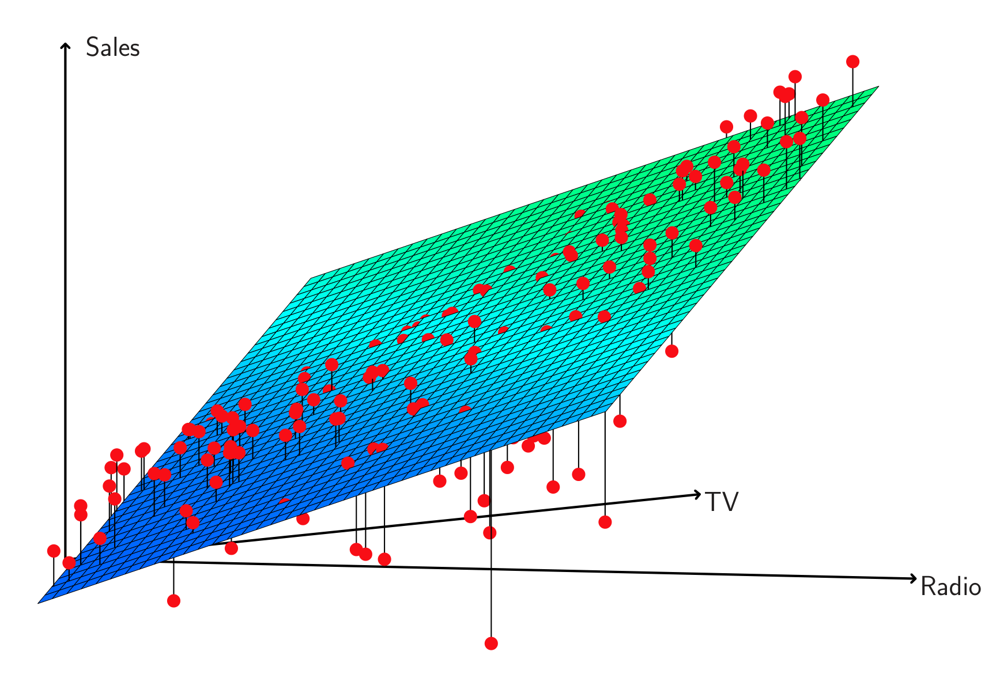

Figura&nbsp;3.5: Para los datos Advertising, un ajuste de regresión lineal a sales usando TV y radio como predictores. Del patrón de los residuos, podemos ver que hay una pronunciada relación no lineal en los datos. Los residuos positivos (aquellos visibles sobre la superficie), tienden a situarse a lo largo de la línea de 45 grados, donde los presupuestos de TV y Radio se dividen equitativamente. Los residuos negativos (la mayoría no visibles), tienden a situarse lejos de esta línea, donde los presupuestos están más desequilibrados.

**Cuatro: Predicciones**

Una vez que hemos ajustado el modelo de regresión múltiple, es sencillo aplicar <a href="#eq-3-21" class="quarto-xref">(3.21)</a> para predecir la variable respuesta $Y$ con base en un conjunto de valores para los predictores $X_1, X_2, \ldots, X_p$. Sin embargo, hay tres tipos de incertidumbre asociados con esta predicción.

1. Las estimaciones de los coeficientes $\hat{\beta}_0, \hat{\beta}_1, \ldots, \hat{\beta}_p$ son estimaciones para $\beta_0, \beta_1, \ldots, \beta_p$. Es decir, el plano de mínimos cuadrados

$$
\hat{Y} = \hat{\beta}_0 + \hat{\beta}_1 X_1 + \cdots + \hat{\beta}_p X_p$$

   es solo una estimación del verdadero plano de regresión poblacional

   $$f(X) = \beta_0 + \beta_1 X_1 + \cdots + \beta_p X_p.$$

   La inexactitud en las estimaciones de los coeficientes está relacionada con el *error reducible* del Capítulo 2. Podemos calcular un *intervalo de confianza* para determinar qué tan cerca estará $\hat{Y}$ de $f(X)$.

2. Por supuesto, en la práctica asumir un modelo lineal para $f(X)$ es casi siempre una aproximación de la realidad, por lo que hay una fuente adicional de error potencialmente reducible que llamamos *sesgo del modelo* (*model bias*). Así que cuando usamos un modelo lineal, de hecho estamos estimando la mejor aproximación lineal a la superficie verdadera. Sin embargo, aquí ignoraremos esta discrepancia y operaremos como si el modelo lineal fuera correcto.

3. Incluso si conociéramos $f(X)$ —es decir, incluso si conociéramos los valores verdaderos de $\beta_0, \beta_1, \ldots, \beta_p$— el valor de la variable respuesta no puede predecirse perfectamente debido al error aleatorio $\epsilon$ en el modelo <a href="#eq-3-20" class="quarto-xref">(3.20)</a>. En el Capítulo 2, nos referimos a esto como el *error irreducible* (*irreducible error*). ¿Cuánto variará $Y$ de $\hat{Y}$? Usamos *intervalos de predicción* (*prediction intervals*) para responder esta pregunta. Los *intervalos de predicción* son siempre más amplios que los *intervalos de confianza*, porque incorporan tanto el error en la estimación de $f(X)$ (el *error reducible*) como la incertidumbre sobre cuánto diferirá un punto individual del plano de regresión poblacional (el *error irreducible*).

Usamos un *intervalo de confianza* para cuantificar la incertidumbre alrededor de las ventas promedio sobre un gran número de ciudades. Por ejemplo, dado que se gastan $100{,}000$ en publicidad en `TV` y $20{,}000$ en publicidad en `radio` en cada ciudad, el intervalo de confianza del 95% es $[10{,}985, 11{,}528]$. Interpretamos esto como que el 95% de los intervalos de esta forma contendrán el verdadero valor de $f(X)$.^[En otras palabras, si recolectamos un gran número de conjuntos de datos como el conjunto de datos Advertising, y construimos un intervalo de confianza para las ventas promedio con base en cada conjunto de datos (dados $100{,}000$ en TV y $20{,}000$ en publicidad radial), entonces el 95% de estos intervalos de confianza contendrán el verdadero valor de las ventas promedio.] Por otro lado, un *intervalo de predicción* puede usarse para cuantificar la incertidumbre alrededor de las ventas para una ciudad particular. Dado que se gastan $100{,}000$ en publicidad en `TV` y $20{,}000$ en publicidad en `radio` en esa ciudad, el intervalo de predicción del 95% es $[7{,}930, 14{,}580]$. Interpretamos esto como que el 95% de los intervalos de esta forma contendrán el verdadero valor de $Y$ para esta ciudad. Nótese que ambos intervalos están centrados en 11{,}256, pero que el intervalo de predicción es sustancialmente más amplio que el intervalo de confianza, reflejando la mayor incertidumbre sobre las ventas para una ciudad dada en comparación con las ventas promedio sobre muchas ubicaciones.

## 3.3 Otras Consideraciones en el Modelo de Regresión

### 3.3.1 Predictores Cualitativos

En nuestra discusión hasta ahora, hemos asumido que todas las variables en nuestro modelo de regresión lineal son cuantitativas. Pero en la práctica, este no es necesariamente el caso; a menudo algunos predictores son cualitativos.

Por ejemplo, el conjunto de datos `Credit` mostrado en la <a href="#fig-3-6" class="quarto-xref">Figura&nbsp;3.6</a> registra variables para una serie de titulares de tarjetas de crédito. La variable respuesta es `balance` (saldo promedio de la tarjeta de crédito para cada individuo) y hay varios predictores cuantitativos: `age` (edad), `cards` (número de tarjetas de crédito), `education` (años de educación), `income` (ingresos en miles de dólares), `limit` (límite de crédito) y `rating` (calificación crediticia). Cada panel de la <a href="#fig-3-6" class="quarto-xref">Figura&nbsp;3.6</a> es un diagrama de dispersión para un par de variables cuyas identidades están dadas por las etiquetas de fila y columna correspondientes. Por ejemplo, el diagrama de dispersión directamente a la derecha de la palabra "Balance" representa `balance` versus `age`, mientras que el gráfico directamente a la derecha de "Age" corresponde a `age` versus `cards`. Además de estas variables cuantitativas, también tenemos cuatro variables cualitativas: `own` (propiedad de vivienda), `student` (estatus de estudiante), `status` (estado civil) y `region` (región: Este, Oeste o Sur).

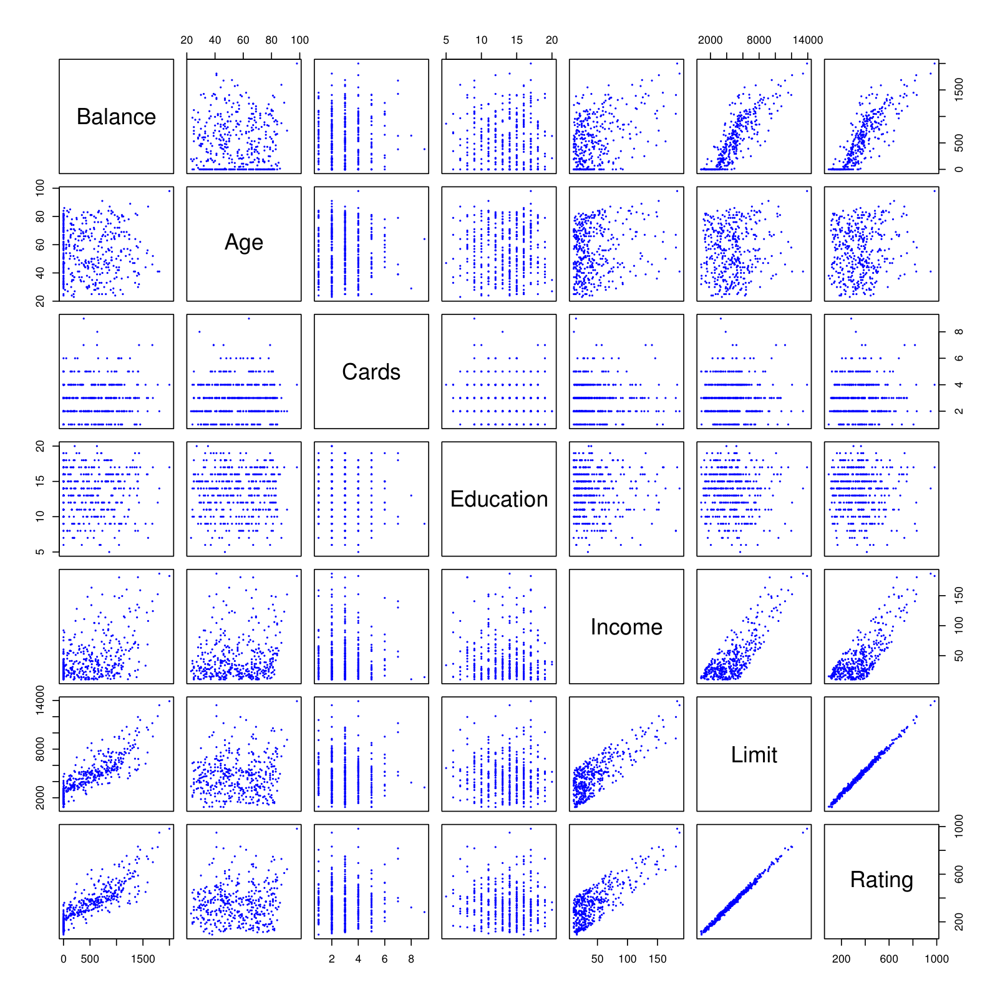

Figura&nbsp;3.6: El conjunto de datos Credit contiene información sobre balance, age, cards, education, income, limit y rating para una serie de clientes potenciales.

**Predictores con Solo Dos Niveles**

Supongamos que deseamos investigar las diferencias en el saldo de la tarjeta de crédito entre aquellos que poseen una casa y aquellos que no, ignorando las otras variables por el momento. Si un predictor cualitativo (también conocido como *factor* (*factor*)) solo tiene dos *niveles* (*levels*), o valores posibles, entonces incorporarlo en un modelo de regresión es muy simple. Simplemente creamos una variable *indicadora* o *dummy* (*dummy variable*) que toma dos posibles valores numéricos.^[En la comunidad de aprendizaje automático, la creación de variables dummy para manejar predictores cualitativos se conoce como "codificación one-hot".] Por ejemplo, con base en la variable `own` (propiedad), podemos crear una nueva variable que tome la forma

$$
x_i = \begin{cases}
1 & \text{si la i-ésima persona posee una casa}\\
0 & \text{si la i-ésima persona no posee una casa},
\end{cases} \qquad (3.26)
$$

y usar esta variable como un predictor en la ecuación de regresión. Esto resulta en el modelo

$$
y_i = \beta_0 + \beta_1 x_i + \epsilon_i = \begin{cases}
\beta_0 + \beta_1 + \epsilon_i & \text{si la i-ésima persona posee una casa}\\
\beta_0 + \epsilon_i & \text{si no.}
\end{cases} \qquad (3.27)
$$

Ahora $\beta_0$ puede interpretarse como el `balance` promedio de la tarjeta de crédito entre aquellos que no poseen casa, $\beta_0 + \beta_1$ como el `balance` promedio de la tarjeta de crédito entre aquellos que sí poseen su casa, y $\beta_1$ como la diferencia promedio en el `balance` de la tarjeta de crédito entre propietarios y no propietarios.

|             | Coeficiente | Error estándar | Estadístico t | Valor p   |
|:------------|:-----------:|:--------------:|:-------------:|:---------:|
| Intercepto  |   509.80    |     33.13      |    15.389     | $< 0.0001$ |
| own[Yes]    |    19.73    |     46.05      |     0.429     |  0.6690   |

: Tabla 3.7: Estimaciones de los coeficientes de mínimos cuadrados asociadas con la regresión de balance sobre own en el conjunto de datos Credit. El modelo lineal se da en <a href="#eq-3-27" class="quarto-xref">(3.27)</a>. Es decir, ownership se codifica como una variable dummy, como en <a href="#eq-3-26" class="quarto-xref">(3.26)</a>.

La <a href="#tbl-3-7" class="quarto-xref">Tabla&nbsp;3.7</a> muestra las estimaciones de los coeficientes y otra información asociada con el modelo <a href="#eq-3-27" class="quarto-xref">(3.27)</a>. La deuda promedio de tarjeta de crédito para los no propietarios se estima en $509.80$, mientras que se estima que los propietarios tienen $19.73$ en deuda adicional para un total de $509.80 + 19.73 = 529.53$. Sin embargo, notamos que el *valor p* para la *variable dummy* es muy alto. Esto indica que no hay evidencia estadística de una diferencia en el `balance` promedio de la tarjeta de crédito basada en la propiedad de la vivienda.

La decisión de codificar a los propietarios como 1 y a los no propietarios como 0 en <a href="#eq-3-27" class="quarto-xref">(3.27)</a> es arbitraria, y no tiene efecto en el ajuste de la regresión, pero sí altera la interpretación de los coeficientes. Si hubiéramos codificado a los no propietarios como 1 y a los propietarios como 0, entonces las estimaciones para $\beta_0$ y $\beta_1$ habrían sido 529.53 y $-19.73$, respectivamente, llevando una vez más a una predicción de deuda de tarjeta de crédito de $529.53 - 19.73 = 509.80$ para los no propietarios y una predicción de $529.53$ para los propietarios. Alternativamente, en lugar de un esquema de codificación 0/1, podríamos crear una *variable dummy*

$$
x_i = \begin{cases}
1 & \text{si la i-ésima persona posee una casa}\\
-1 & \text{si la i-ésima persona no posee una casa}
\end{cases}$$

y usar esta variable en la ecuación de regresión. Esto resulta en el modelo

$$y_i = \beta_0 + \beta_1 x_i + \epsilon_i = \begin{cases}
\beta_0 + \beta_1 + \epsilon_i & \text{si la i-ésima persona posee una casa}\\
\beta_0 - \beta_1 + \epsilon_i & \text{si la i-ésima persona no posee una casa.}
\end{cases}$$

Ahora $\beta_0$ puede interpretarse como el `balance` promedio general de la tarjeta de crédito (ignorando el efecto de la propiedad de la vivienda), y $\beta_1$ es la cantidad en que los propietarios y no propietarios tienen saldos de tarjeta de crédito por encima y por debajo del promedio, respectivamente.^[Técnicamente $\beta_0$ es la mitad de la suma de la deuda promedio para propietarios y la deuda promedio para no propietarios. Por lo tanto, $\beta_0$ es exactamente igual al promedio general solo si los dos grupos tienen igual número de miembros.] En este ejemplo, la estimación para $\beta_0$ es $519.665$, a medio camino entre los promedios de no propietarios y propietarios de $509.80$ y $529.53$. La estimación para $\beta_1$ es $9.865$, que es la mitad de $19.73$, la diferencia promedio entre propietarios y no propietarios. Es importante notar que las predicciones finales para los saldos de crédito de propietarios y no propietarios serán idénticas independientemente del esquema de codificación utilizado. La única diferencia está en la forma en que se interpretan los coeficientes.

**Predictores Cualitativos con Más de Dos Niveles**

Cuando un predictor cualitativo tiene más de dos niveles, una sola *variable dummy* no puede representar todos los valores posibles. En esta situación, podemos crear variables dummy adicionales. Por ejemplo, para la variable `region` creamos dos variables dummy. La primera podría ser

$$
x_{i1} = \begin{cases}
1 & \text{si la i-ésima persona es del Sur}\\
0 & \text{si la i-ésima persona no es del Sur},
\end{cases} \qquad (3.28)
$$

y la segunda podría ser

$$
x_{i2} = \begin{cases}
1 & \text{si la i-ésima persona es del Oeste}\\
0 & \text{si la i-ésima persona no es del Oeste}.
\end{cases} \qquad (3.29)
$$

Entonces ambas variables pueden usarse en la ecuación de regresión, para obtener el modelo

$$
y_i = \beta_0 + \beta_1 x_{i1} + \beta_2 x_{i2} + \epsilon_i = \begin{cases}
\beta_0 + \beta_1 + \epsilon_i & \text{si la i-ésima persona es del Sur}\\
\beta_0 + \beta_2 + \epsilon_i & \text{si la i-ésima persona es del Oeste}\\
\beta_0 + \epsilon_i & \text{si la i-ésima persona es del Este.}
\end{cases} \qquad (3.30)
$$

Ahora $\beta_0$ puede interpretarse como el `balance` promedio de la tarjeta de crédito para individuos del Este, $\beta_1$ puede interpretarse como la diferencia en el `balance` promedio entre personas del Sur versus el Este, y $\beta_2$ puede interpretarse como la diferencia en el `balance` promedio entre aquellos del Oeste versus el Este. Siempre habrá una variable dummy menos que el número de niveles. El nivel sin variable dummy —Este en este ejemplo— se conoce como la *categoría de referencia* o *línea base* (*baseline*).

|                | Coeficiente | Error estándar | Estadístico t | Valor p   |
|:---------------|:-----------:|:--------------:|:-------------:|:---------:|
| Intercepto     |   531.00    |     46.32      |    11.464     | $< 0.0001$ |
| region[South]  |   $-12.50$  |     56.68      |    $-0.221$   |  0.8260   |
| region[West]   |   $-18.69$  |     65.02      |    $-0.287$   |  0.7740   |

: Tabla 3.8: Estimaciones de los coeficientes de mínimos cuadrados asociadas con la regresión de balance sobre region en el conjunto de datos Credit. El modelo lineal se da en <a href="#eq-3-30" class="quarto-xref">(3.30)</a>. Es decir, region se codifica mediante dos variables dummy <a href="#eq-3-28" class="quarto-xref">(3.28)</a> y <a href="#eq-3-29" class="quarto-xref">(3.29)</a>.

De la <a href="#tbl-3-8" class="quarto-xref">Tabla&nbsp;3.8</a>, vemos que el `balance` estimado para la línea base, Este, es $531.00$. Se estima que aquellos en el Sur tendrán $18.69$ menos de deuda que aquellos en el Este, y que aquellos en el Oeste tendrán $12.50$ menos de deuda que aquellos en el Este. Sin embargo, los *valores p* asociados con las estimaciones de los coeficientes para las dos variables dummy son muy grandes, lo que sugiere que no hay evidencia estadística de una diferencia real en el `balance` promedio de la tarjeta de crédito entre el Sur y el Este o entre el Oeste y el Este.^[En teoría aún podría existir una diferencia entre Sur y Oeste, aunque los datos aquí no sugieren ninguna diferencia.] Una vez más, el nivel seleccionado como categoría de referencia es arbitrario, y las predicciones finales para cada grupo serán las mismas independientemente de esta elección. Sin embargo, los coeficientes y sus *valores p* sí dependen de la elección de la codificación de variables dummy. En lugar de confiar en los coeficientes individuales, podemos usar una prueba $F$ para contrastar $H_0: \beta_1 = \beta_2 = 0$; esto no depende de la codificación. Esta prueba $F$ tiene un *valor p* de 0.96, indicando que no podemos rechazar la hipótesis nula de que no hay relación entre `balance` y `region`.

Usar este enfoque de variables dummy no presenta dificultades al incorporar tanto predictores cuantitativos como cualitativos. Por ejemplo, para regresar `balance` sobre una variable cuantitativa como `income` (ingreso) y una variable cualitativa como `student` (estudiante), simplemente debemos crear una variable dummy para `student` y luego ajustar un modelo de regresión múltiple usando `income` y la variable dummy como predictores para el `balance` de la tarjeta de crédito.

Existen muchas formas diferentes de codificar variables cualitativas además del enfoque de variables dummy tomado aquí. Todos estos enfoques conducen a ajustes de modelo equivalentes, pero los coeficientes son diferentes y tienen diferentes interpretaciones, y están diseñados para medir *contrastes* (*contrasts*) particulares. Este tema está más allá del alcance de este libro.

### 3.3.2 Extensiones del Modelo Lineal

El modelo de regresión lineal estándar <a href="#eq-3-19" class="quarto-xref">(3.19)</a> proporciona resultados interpretables y funciona bastante bien en muchos problemas del mundo real. Sin embargo, hace varias suposiciones altamente restrictivas que a menudo se violan en la práctica. Dos de las suposiciones más importantes establecen que la relación entre los predictores y la variable respuesta es *aditiva* (*additive*) y *lineal* (*linear*). La suposición de aditividad significa que la asociación entre un predictor $X_j$ y la variable respuesta $Y$ no depende de los valores de los otros predictores. La suposición de linealidad establece que el cambio en la variable respuesta $Y$ asociado con un cambio de una unidad en $X_j$ es constante, independientemente del valor de $X_j$. En capítulos posteriores de este libro, examinamos una serie de métodos sofisticados que relajan estas dos suposiciones. Aquí, examinamos brevemente algunos enfoques clásicos comunes para extender el modelo lineal.

**Eliminación de la Suposición de Aditividad**

En nuestro análisis previo de los datos `Advertising`, concluimos que tanto `TV` como `radio` parecen estar asociados con `sales`. Los modelos lineales que formaron la base de esta conclusión asumían que el efecto sobre las ventas de aumentar un medio publicitario es independiente de la cantidad gastada en los otros medios. Por ejemplo, el modelo lineal <a href="#eq-3-20" class="quarto-xref">(3.20)</a> establece que el aumento promedio en `sales` asociado con un aumento de una unidad en `TV` es siempre $\beta_1$, independientemente de la cantidad gastada en `radio`.

Sin embargo, este modelo simple puede ser incorrecto. Supongamos que gastar dinero en publicidad radial realmente aumenta la efectividad de la publicidad televisiva, de modo que el término de pendiente para `TV` debería aumentar a medida que `radio` aumenta. En esta situación, dado un presupuesto fijo de $100{,}000$, gastar la mitad en `radio` y la mitad en `TV` puede aumentar las ventas más que asignar la cantidad total a `TV` o a `radio` individualmente. En marketing, esto se conoce como un *efecto de sinergia*, y en estadística se denomina *efecto de interacción* (*interaction effect*). La <a href="#fig-3-5" class="quarto-xref">Figura&nbsp;3.5</a> sugiere que tal efecto puede estar presente en los datos `Advertising`. Nótese que cuando los niveles de `TV` o `radio` son bajos, las ventas reales son menores de lo predicho por el modelo lineal. Pero cuando la publicidad se divide entre los dos medios, el modelo tiende a subestimar las ventas.

Consideremos el modelo de regresión lineal estándar con dos variables,

$$
Y = \beta_0 + \beta_1 X_1 + \beta_2 X_2 + \epsilon.$$

Según este modelo, un aumento de una unidad en $X_1$ está asociado con un aumento promedio en $Y$ de $\beta_1$ unidades. Nótese que la presencia de $X_2$ no altera esta afirmación —es decir, independientemente del valor de $X_2$, un aumento de una unidad en $X_1$ está asociado con un aumento de $\beta_1$ unidades en $Y$. Una forma de extender este modelo es incluir un tercer predictor, llamado *término de interacción* (*interaction term*), que se construye calculando el producto de $X_1$ y $X_2$. Esto resulta en el modelo

$$
Y = \beta_0 + \beta_1 X_1 + \beta_2 X_2 + \beta_3 X_1 X_2 + \epsilon. \qquad (3.31)
$$

¿Cómo la inclusión de este término de interacción relaja la suposición de aditividad? Nótese que <a href="#eq-3-31" class="quarto-xref">(3.31)</a> puede reescribirse como

$$
\begin{aligned}
Y &= \beta_0 + (\beta_1 + \beta_3 X_2) X_1 + \beta_2 X_2 + \epsilon \\
  &= \beta_0 + \tilde{\beta}_1 X_1 + \beta_2 X_2 + \epsilon
\end{aligned} \qquad (3.32)
$$

donde $\tilde{\beta}_1 = \beta_1 + \beta_3 X_2$. Dado que $\tilde{\beta}_1$ es ahora una función de $X_2$, la asociación entre $X_1$ e $Y$ ya no es constante: un cambio en el valor de $X_2$ cambiará la asociación entre $X_1$ e $Y$. Un argumento similar muestra que un cambio en el valor de $X_1$ cambia la asociación entre $X_2$ e $Y$.

Por ejemplo, supongamos que estamos interesados en estudiar la productividad de una fábrica. Deseamos predecir el número de unidades producidas con base en el número de líneas de producción y el número total de trabajadores. Parece probable que el efecto de aumentar el número de líneas de producción dependa del número de trabajadores, ya que si no hay trabajadores disponibles para operar las líneas, entonces aumentar el número de líneas no incrementará la producción. Esto sugiere que sería apropiado incluir un *término de interacción* entre líneas y trabajadores en un modelo lineal para predecir unidades. Supongamos que cuando ajustamos el modelo, obtenemos

$$
\begin{aligned}
\text{units} &\approx 1.2 + 3.4 \times \text{lines} + 0.22 \times \text{workers} + 1.4 \times (\text{lines} \times \text{workers})\\
             &= 1.2 + (3.4 + 1.4 \times \text{workers}) \times \text{lines} + 0.22 \times \text{workers}.
\end{aligned}$$

En otras palabras, agregar una línea adicional aumentará el número de unidades producidas en $3.4 + 1.4 \times \text{workers}$. Por lo tanto, cuantos más trabajadores tengamos, más fuerte será el efecto de las líneas.

Ahora volvemos al ejemplo de `Advertising`. Un modelo lineal que usa `radio`, `TV` y una interacción entre los dos para predecir `sales` toma la forma

$$
\begin{aligned}
\text{sales} &= \beta_0 + \beta_1 \times \text{TV} + \beta_2 \times \text{radio} + \beta_3 \times (\text{radio} \times \text{TV}) + \epsilon \\
             &= \beta_0 + (\beta_1 + \beta_3 \times \text{radio}) \times \text{TV} + \beta_2 \times \text{radio} + \epsilon. \qquad (3.33)
\end{aligned}
$$

Podemos interpretar $\beta_3$ como el aumento en la efectividad de la publicidad en `TV` asociado con un aumento de una unidad en la publicidad en `radio` (o viceversa). Los coeficientes que resultan de ajustar el modelo <a href="#eq-3-33" class="quarto-xref">(3.33)</a> se dan en la <a href="#tbl-3-9" class="quarto-xref">Tabla&nbsp;3.9</a>.

|             | Coeficiente | Error estándar | Estadístico t | Valor p   |
|:------------|:-----------:|:--------------:|:-------------:|:---------:|
| Intercepto  |   6.7502    |     0.248      |    27.23      | $< 0.0001$ |
| TV          |   0.0191    |     0.002      |    12.70      | $< 0.0001$ |
| radio       |   0.0289    |     0.009      |     3.24      |  0.0014   |
| TV×radio    |   0.0011    |     0.000      |    20.73      | $< 0.0001$ |

: Tabla 3.9: Para los datos Advertising, estimaciones de los coeficientes de mínimos cuadrados asociadas con la regresión de sales sobre TV y radio, con un término de interacción, como en <a href="#eq-3-33" class="quarto-xref">(3.33)</a>.

Los resultados en la <a href="#tbl-3-9" class="quarto-xref">Tabla&nbsp;3.9</a> sugieren fuertemente que el modelo que incluye el término de interacción es superior al modelo que contiene solo *efectos principales* (*main effects*). El *valor p* para el término de interacción, TV×radio, es extremadamente bajo, indicando que hay fuerte evidencia para $H_a: \beta_3 \neq 0$. En otras palabras, está claro que la verdadera relación no es aditiva. El $R^2$ para el modelo <a href="#eq-3-33" class="quarto-xref">(3.33)</a> es 96.8%, comparado con solo 89.7% para el modelo que predice `sales` usando `TV` y `radio` sin un término de interacción. Esto significa que $(96.8 - 89.7)/(100 - 89.7) = 69\%$ de la variabilidad en las ventas que permanece después de ajustar el modelo aditivo ha sido explicada por el término de interacción. Las estimaciones de los coeficientes en la <a href="#tbl-3-9" class="quarto-xref">Tabla&nbsp;3.9</a> sugieren que un aumento en la publicidad en `TV` de $1{,}000$ está asociado con un aumento en las ventas de $(\hat{\beta}_1 + \hat{\beta}_3 \times \text{radio}) \times 1{,}000 = 19 + 1.1 \times \text{radio}$ unidades. Y un aumento en la publicidad en `radio` de $1{,}000$ estará asociado con un aumento en las ventas de $(\hat{\beta}_2 + \hat{\beta}_3 \times \text{TV}) \times 1{,}000 = 29 + 1.1 \times \text{TV}$ unidades.

En este ejemplo, los *valores p* asociados con `TV`, `radio` y el término de interacción son todos estadísticamente significativos (<a href="#tbl-3-9" class="quarto-xref">Tabla&nbsp;3.9</a>), por lo que es obvio que las tres variables deben incluirse en el modelo. Sin embargo, a veces ocurre que un término de interacción tiene un *valor p* muy pequeño, pero los *efectos principales* asociados (en este caso, `TV` y `radio`) no. El *principio jerárquico* (*hierarchical principle*) establece que si incluimos una interacción en un modelo, también debemos incluir los *efectos principales*, incluso si los *valores p* asociados con sus coeficientes no son significativos. En otras palabras, si la interacción entre $X_1$ y $X_2$ parece importante, entonces debemos incluir tanto $X_1$ como $X_2$ en el modelo incluso si las estimaciones de sus coeficientes tienen *valores p* grandes. La razón de ser de este principio es que si $X_1 \times X_2$ está relacionado con la variable respuesta, entonces que los coeficientes de $X_1$ o $X_2$ sean exactamente cero es de poco interés. Además, $X_1 \times X_2$ típicamente está correlacionado con $X_1$ y $X_2$, por lo que omitirlos tiende a alterar el significado de la interacción.

En el ejemplo anterior, consideramos una interacción entre `TV` y `radio`, ambas variables cuantitativas. Sin embargo, el concepto de interacciones se aplica igualmente bien a variables cualitativas, o a una combinación de variables cuantitativas y cualitativas. De hecho, una interacción entre una variable cualitativa y una variable cuantitativa tiene una interpretación particularmente elegante. Consideremos el conjunto de datos `Credit` de la Sección 3.3.1, y supongamos que deseamos predecir `balance` usando las variables `income` (cuantitativa) y `student` (cualitativa). En ausencia de un término de interacción, el modelo toma la forma

$$
\begin{aligned}
\text{balance}_i &\approx \beta_0 + \beta_1 \times \text{income}_i + \begin{cases}
\beta_2 & \text{si la i-ésima persona es estudiante}\\
0 & \text{si la i-ésima persona no es estudiante}
\end{cases}\\
&= \beta_1 \times \text{income}_i + \begin{cases}
\beta_0 + \beta_2 & \text{si la i-ésima persona es estudiante}\\
\beta_0 & \text{si la i-ésima persona no es estudiante.}
\end{cases}
\end{aligned} \qquad (3.34)
$$

Nótese que esto equivale a ajustar dos líneas paralelas a los datos, una para estudiantes y otra para no estudiantes. Las líneas para estudiantes y no estudiantes tienen diferentes interceptos, $\beta_0 + \beta_2$ versus $\beta_0$, pero la misma pendiente, $\beta_1$. Esto se ilustra en el panel izquierdo de la <a href="#fig-3-7" class="quarto-xref">Figura&nbsp;3.7</a>. El hecho de que las líneas sean paralelas significa que el efecto promedio sobre `balance` de un aumento de una unidad en `income` no depende de si el individuo es estudiante o no. Esto representa una limitación potencialmente seria del modelo, ya que de hecho un cambio en `income` puede tener un efecto muy diferente en el `balance` de la tarjeta de crédito de un estudiante versus un no estudiante.

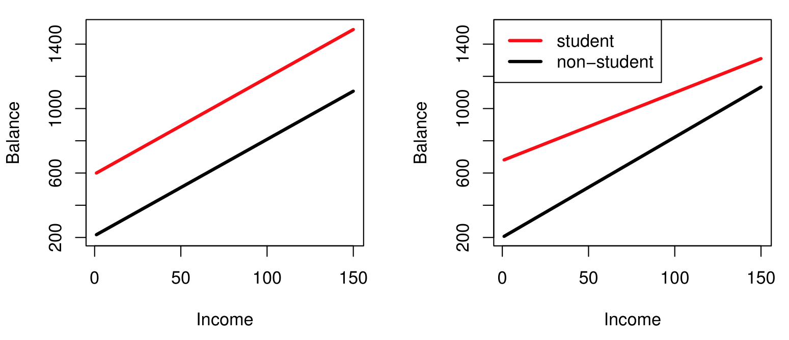

Figura&nbsp;3.7: Para los datos Credit, se muestran las líneas de mínimos cuadrados para la predicción de balance a partir de income para estudiantes y no estudiantes. <em>Izquierda:</em> Se ajustó el modelo <a href="#eq-3-34" class="quarto-xref">(3.34)</a>. No hay interacción entre income y student. <em>Derecha:</em> Se ajustó el modelo <a href="#eq-3-35" class="quarto-xref">(3.35)</a>. Hay un término de interacción entre income y student.

Esta limitación puede abordarse agregando una variable de interacción, creada multiplicando `income` por la variable dummy para `student`. Nuestro modelo ahora se convierte en

$$
\begin{aligned}
\text{balance}_i &\approx \beta_0 + \beta_1 \times \text{income}_i + \begin{cases}
\beta_2 + \beta_3 \times \text{income}_i & \text{si es estudiante}\\
0 & \text{si no es estudiante}
\end{cases}\\
&= \begin{cases}
(\beta_0 + \beta_2) + (\beta_1 + \beta_3) \times \text{income}_i & \text{si es estudiante}\\
\beta_0 + \beta_1 \times \text{income}_i & \text{si no es estudiante.}
\end{cases}
\end{aligned} \qquad (3.35)
$$

Una vez más, tenemos dos líneas de regresión diferentes para los estudiantes y los no estudiantes. Pero ahora esas líneas de regresión tienen diferentes interceptos, $\beta_0 + \beta_2$ versus $\beta_0$, así como diferentes pendientes, $\beta_1 + \beta_3$ versus $\beta_1$. Esto permite la posibilidad de que los cambios en `income` puedan afectar los saldos de las tarjetas de crédito de estudiantes y no estudiantes de manera diferente. El panel derecho de la <a href="#fig-3-7" class="quarto-xref">Figura&nbsp;3.7</a> muestra las relaciones estimadas entre `income` y `balance` para estudiantes y no estudiantes en el modelo <a href="#eq-3-35" class="quarto-xref">(3.35)</a>. Notamos que la pendiente para estudiantes es menor que la pendiente para no estudiantes. Esto sugiere que los aumentos en `income` están asociados con aumentos menores en el `balance` de la tarjeta de crédito entre estudiantes en comparación con los no estudiantes.

**Relaciones No Lineales**

Como se discutió anteriormente, el modelo de regresión lineal <a href="#eq-3-19" class="quarto-xref">(3.19)</a> asume una relación lineal entre la variable respuesta y los predictores. Pero en algunos casos, la verdadera relación entre la variable respuesta y los predictores puede ser *no lineal*. Aquí presentamos una forma muy simple de extender directamente el modelo lineal para dar cabida a relaciones no lineales, usando *regresión polinomial* (*polynomial regression*). En capítulos posteriores, presentaremos enfoques más complejos para realizar ajustes no lineales en contextos más generales.

Consideremos la <a href="#fig-3-8" class="quarto-xref">Figura&nbsp;3.8</a>, en la que se muestra `mpg` (consumo de combustible en millas por galón) versus `horsepower` (potencia) para varios automóviles en el conjunto de datos `Auto`. La línea naranja representa el ajuste de regresión lineal. Existe una relación pronunciada entre `mpg` y `horsepower`, pero parece claro que esta relación es de hecho no lineal: los datos sugieren una relación curva. Un enfoque simple para incorporar asociaciones no lineales en un modelo lineal es incluir versiones transformadas de los predictores. Por ejemplo, los puntos en la <a href="#fig-3-8" class="quarto-xref">Figura&nbsp;3.8</a> parecen tener una forma *cuadrática* (*quadratic*), lo que sugiere que un modelo de la forma

$$
\text{mpg} = \beta_0 + \beta_1 \times \text{horsepower} + \beta_2 \times \text{horsepower}^2 + \epsilon \qquad (3.36)
$$

puede proporcionar un mejor ajuste. La <a href="#eq-3-36" class="quarto-xref">Ecuación&nbsp;3.36</a> implica predecir `mpg` usando una función no lineal de `horsepower`. ¡Pero sigue siendo un modelo lineal! Es decir, <a href="#eq-3-36" class="quarto-xref">(3.36)</a> es simplemente un modelo de regresión lineal múltiple con $X_1 = \text{horsepower}$ y $X_2 = \text{horsepower}^2$. Así que podemos usar software estándar de regresión lineal para estimar $\beta_0$, $\beta_1$ y $\beta_2$ para producir un ajuste no lineal. La curva azul en la <a href="#fig-3-8" class="quarto-xref">Figura&nbsp;3.8</a> muestra el ajuste cuadrático resultante a los datos. El ajuste cuadrático parece ser sustancialmente mejor que el ajuste obtenido cuando solo se incluye el término lineal. El $R^2$ del ajuste cuadrático es 0.688, comparado con 0.606 para el ajuste lineal, y el *valor p* en la <a href="#tbl-3-10" class="quarto-xref">Tabla&nbsp;3.10</a> para el término cuadrático es altamente significativo.

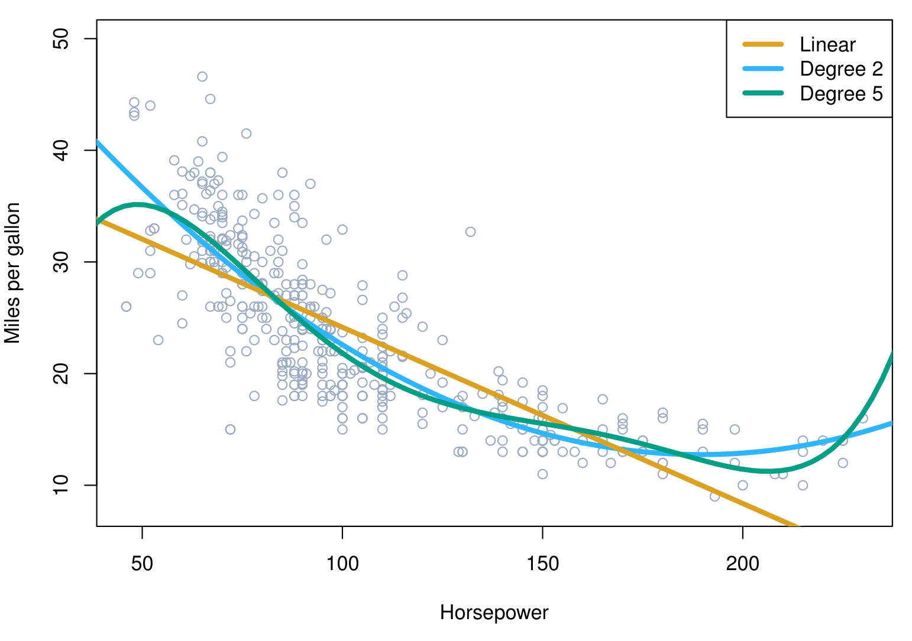

Figura&nbsp;3.8: El conjunto de datos Auto. Para varios automóviles, se muestran mpg y horsepower. El ajuste de regresión lineal se muestra en naranja. El ajuste de regresión lineal para un modelo que incluye horsepower2 se muestra como una curva azul. El ajuste de regresión lineal para un modelo que incluye todos los polinomios de horsepower hasta el quinto grado se muestra en verde.

|                | Coeficiente | Error estándar | Estadístico t | Valor p   |
|:---------------|:-----------:|:--------------:|:-------------:|:---------:|
| Intercepto     |   56.9001   |     1.8004     |     31.6      | $< 0.0001$ |
| horsepower     |   $-0.4662$ |     0.0311     |    $-15.0$    | $< 0.0001$ |
| horsepower$^2$ |    0.0012   |     0.0001     |     10.1      | $< 0.0001$ |

: Tabla 3.10: Para el conjunto de datos Auto, estimaciones de los coeficientes de mínimos cuadrados asociadas con la regresión de mpg sobre horsepower y horsepower2.

Si incluir `horsepower`$^2$ condujo a una mejora tan grande en el modelo, ¿por qué no incluir `horsepower`$^3$, `horsepower`$^4$, o incluso `horsepower`$^5$? La curva verde en la <a href="#fig-3-8" class="quarto-xref">Figura&nbsp;3.8</a> muestra el ajuste que resulta de incluir todos los polinomios hasta el quinto grado en el modelo <a href="#eq-3-36" class="quarto-xref">(3.36)</a>. El ajuste resultante parece innecesariamente ondulado —es decir, no está claro que incluir los términos adicionales realmente haya conducido a un mejor ajuste a los datos.

El enfoque que acabamos de describir para extender el modelo lineal para dar cabida a relaciones no lineales se conoce como *regresión polinomial*, ya que hemos incluido funciones polinomiales de los predictores en el modelo de regresión. Exploramos más a fondo este enfoque y otras extensiones no lineales del modelo lineal en el Capítulo 7.

### 3.3.3 Problemas Potenciales

Cuando ajustamos un modelo de regresión lineal a un conjunto de datos particular, pueden ocurrir muchos problemas. Los más comunes entre estos son los siguientes:

1. No linealidad de las relaciones variable respuesta-predictores.
2. Correlación de los términos de error.
3. Varianza no constante de los términos de error.
4. Valores atípicos (*outliers*).
5. Puntos de alto apalancamiento (*high-leverage*).
6. Colinealidad (*collinearity*).

En la práctica, identificar y superar estos problemas es tanto un arte como una ciencia. Se han escrito muchas páginas en innumerables libros sobre este tema. Dado que el modelo de regresión lineal no es nuestro enfoque principal aquí, proporcionaremos solo un breve resumen de algunos puntos clave.

**1. No Linealidad de los Datos**

El modelo de regresión lineal asume que existe una relación lineal entre los predictores y la variable respuesta. Si la verdadera relación está lejos de ser lineal, entonces prácticamente todas las conclusiones que extraemos del ajuste son sospechosas. Además, la precisión de predicción del modelo puede reducirse significativamente.

Los *gráficos de residuos* (*residual plots*) son una herramienta gráfica útil para identificar la *no linealidad*. Dado un modelo de regresión lineal simple, podemos graficar los residuos, $e_i = y_i - \hat{y}_i$, versus el predictor $x_i$. En el caso de un modelo de regresión múltiple, dado que hay múltiples predictores, en su lugar graficamos los residuos versus los valores predichos (o *ajustados*, *fitted*) $\hat{y}_i$. Idealmente, el *gráfico de residuos* no mostrará ningún patrón discernible. La presencia de un patrón puede indicar un problema con algún aspecto del modelo lineal.

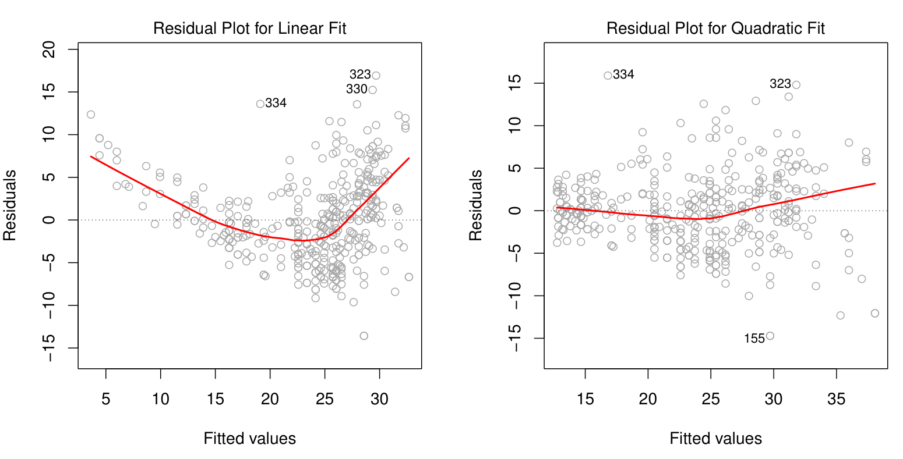

Figura&nbsp;3.9: Gráficos de residuos versus valores predichos (o ajustados) para el conjunto de datos Auto. En cada gráfico, la línea roja es un ajuste suave a los residuos, destinado a facilitar la identificación de una tendencia. <em>Izquierda:</em> Una regresión lineal de mpg sobre horsepower. Un fuerte patrón en los residuos indica no linealidad en los datos. <em>Derecha:</em> Una regresión lineal de mpg sobre horsepower y horsepower2. Hay poco patrón en los residuos.

El panel izquierdo de la <a href="#fig-3-9" class="quarto-xref">Figura&nbsp;3.9</a> muestra un gráfico de residuos de la regresión lineal de `mpg` sobre `horsepower` en el conjunto de datos `Auto` que se ilustró en la <a href="#fig-3-8" class="quarto-xref">Figura&nbsp;3.8</a>. La línea roja es un ajuste suave a los residuos, que se muestra para facilitar la identificación de cualquier tendencia. Los residuos exhiben una clara forma de U, lo que proporciona una fuerte indicación de no linealidad en los datos. En contraste, el panel derecho de la <a href="#fig-3-9" class="quarto-xref">Figura&nbsp;3.9</a> muestra el gráfico de residuos que resulta del modelo <a href="#eq-3-36" class="quarto-xref">(3.36)</a>, que contiene un término cuadrático. Parece haber poco patrón en los residuos, lo que sugiere que el término cuadrático mejora el ajuste a los datos.

Si el gráfico de residuos indica que hay asociaciones no lineales en los datos, entonces un enfoque simple es usar transformaciones no lineales de los predictores, como $\log X$, $\sqrt{X}$, y $X^2$, en el modelo de regresión. En capítulos posteriores de este libro, discutiremos otros enfoques no lineales más avanzados para abordar este problema.

**2. Correlación de los Términos de Error**

Una suposición importante del modelo de regresión lineal es que los términos de error, $\epsilon_1, \epsilon_2, \ldots, \epsilon_n$, no están correlacionados. ¿Qué significa esto? Por ejemplo, si los errores no están correlacionados, entonces el hecho de que $\epsilon_i$ sea positivo proporciona poca o ninguna información sobre el signo de $\epsilon_{i+1}$. Los errores estándar que se calculan para los coeficientes de regresión estimados o los valores ajustados se basan en la suposición de términos de error no correlacionados. Si de hecho hay correlación entre los términos de error, entonces los errores estándar estimados tenderán a subestimar los verdaderos errores estándar. Como resultado, los intervalos de confianza y de predicción serán más estrechos de lo que deberían ser. Por ejemplo, un intervalo de confianza del 95% puede en realidad tener una probabilidad mucho menor que 0.95 de contener el verdadero valor del parámetro. Además, los *valores p* asociados con el modelo serán más bajos de lo que deberían ser; esto podría hacer que concluyamos erróneamente que un parámetro es estadísticamente significativo. En resumen, si los términos de error están correlacionados, podemos tener una sensación injustificada de confianza en nuestro modelo.

Como ejemplo extremo, supongamos que accidentalmente duplicamos nuestros datos, lo que lleva a observaciones y términos de error idénticos en pares. Si ignoráramos esto, nuestros cálculos de errores estándar serían como si tuviéramos una muestra de tamaño $2n$, cuando de hecho solo tenemos $n$ muestras. Nuestros parámetros estimados serían los mismos para las $2n$ muestras que para las $n$ muestras, ¡pero los intervalos de confianza serían más estrechos por un factor de $\sqrt{2}$!

¿Por qué podrían ocurrir correlaciones entre los términos de error? Tales correlaciones ocurren frecuentemente en el contexto de *datos de series de tiempo* (*time series data*), que consisten en observaciones para las cuales las mediciones se obtienen en puntos discretos en el tiempo. En muchos casos, las observaciones que se obtienen en puntos de tiempo adyacentes tendrán errores positivamente correlacionados. Para determinar si este es el caso para un conjunto de datos dado, podemos graficar los residuos de nuestro modelo en función del tiempo. Si los errores no están correlacionados, entonces no debería haber un patrón discernible. Por otro lado, si los términos de error están positivamente correlacionados, entonces podemos ver *seguimiento* (*tracking*) en los residuos —es decir, los residuos adyacentes pueden tener valores similares.

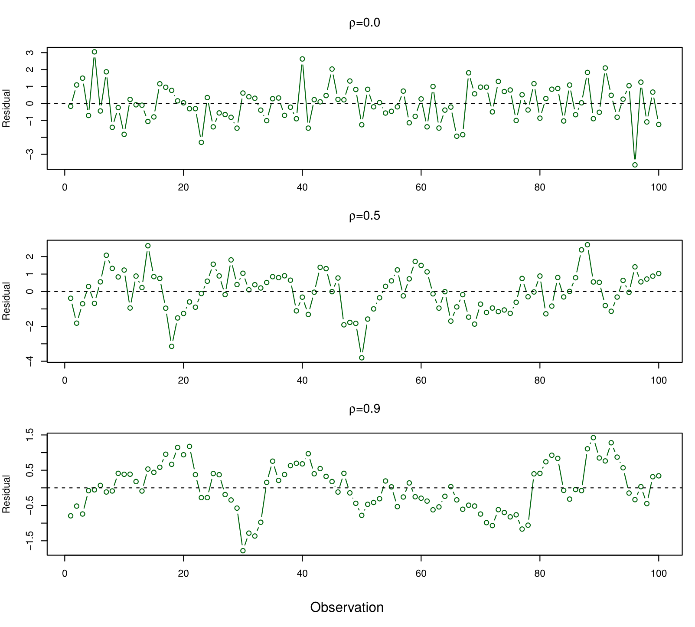

Figura&nbsp;3.10: Gráficos de residuos de conjuntos de datos de series de tiempo simulados generados con diferentes niveles de correlación $\rho$ entre términos de error para puntos de tiempo adyacentes.

La <a href="#fig-3-10" class="quarto-xref">Figura&nbsp;3.10</a> proporciona una ilustración. En el panel superior, vemos los residuos de un ajuste de regresión lineal a datos generados con errores no correlacionados. No hay evidencia de una tendencia relacionada con el tiempo en los residuos. En contraste, los residuos en el panel inferior provienen de un conjunto de datos en el que los errores adyacentes tenían una correlación de 0.9. Ahora hay un patrón claro en los residuos —los residuos adyacentes tienden a tomar valores similares. Finalmente, el panel central ilustra un caso más moderado en el que los residuos tenían una correlación de 0.5. Todavía hay evidencia de seguimiento, pero el patrón es menos claro.

Se han desarrollado muchos métodos para tener en cuenta adecuadamente las correlaciones en los términos de error en datos de series de tiempo. La correlación entre los términos de error también puede ocurrir fuera de los datos de series de tiempo. Por ejemplo, consideremos un estudio en el que las alturas de los individuos se predicen a partir de sus pesos. La suposición de errores no correlacionados podría violarse si algunos de los individuos en el estudio son miembros de la misma familia, comen la misma dieta, o han estado expuestos a los mismos factores ambientales. En general, la suposición de errores no correlacionados es extremadamente importante para la regresión lineal así como para otros métodos estadísticos, y un buen diseño experimental es crucial para mitigar el riesgo de tales correlaciones.

**3. Varianza No Constante de los Términos de Error**

Otra suposición importante del modelo de regresión lineal es que los términos de error tienen una varianza constante, $\text{Var}(\epsilon_i) = \sigma^2$. Los errores estándar, intervalos de confianza y pruebas de hipótesis asociados con el modelo lineal dependen de esta suposición.

Desafortunadamente, a menudo ocurre que las varianzas de los términos de error no son constantes. Por ejemplo, las varianzas de los términos de error pueden aumentar con el valor de la variable respuesta. Se puede identificar varianzas no constantes en los errores, o *heterocedasticidad* (*heteroscedasticity*), por la presencia de una forma de embudo en el gráfico de residuos. Un ejemplo se muestra en el panel izquierdo de la <a href="#fig-3-11" class="quarto-xref">Figura&nbsp;3.11</a>, en el cual la magnitud de los residuos tiende a aumentar con los valores ajustados. Al enfrentar este problema, una posible solución es transformar la variable respuesta $Y$ usando una función cóncava como $\log Y$ o $\sqrt{Y}$. Tal transformación resulta en una mayor contracción de las respuestas más grandes, lo que lleva a una reducción en la *heterocedasticidad*. El panel derecho de la <a href="#fig-3-11" class="quarto-xref">Figura&nbsp;3.11</a> muestra el gráfico de residuos después de transformar la variable respuesta usando $\log Y$. Los residuos ahora parecen tener varianza constante, aunque hay cierta evidencia de una ligera relación no lineal en los datos.

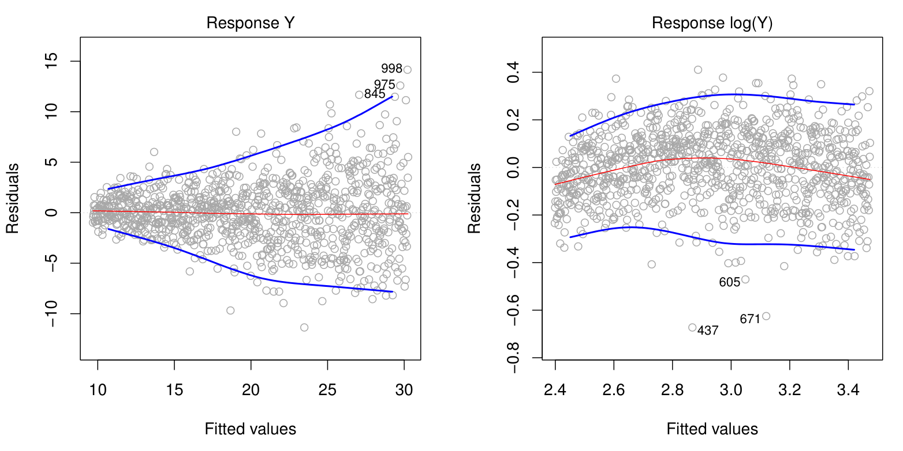

Figura&nbsp;3.11: Gráficos de residuos. En cada gráfico, la línea roja es un ajuste suave a los residuos, destinado a facilitar la identificación de una tendencia. Las líneas azules siguen los cuantiles exteriores de los residuos y enfatizan los patrones. <em>Izquierda:</em> La forma de embudo indica heterocedasticidad. <em>Derecha:</em> La variable respuesta ha sido transformada mediante logaritmo, y ahora no hay evidencia de heterocedasticidad.

A veces tenemos una buena idea de la varianza de cada respuesta. Por ejemplo, la $i$-ésima respuesta podría ser un promedio de $n_i$ observaciones crudas. Si cada una de estas observaciones crudas no está correlacionada con varianza $\sigma^2$, entonces su promedio tiene varianza $\sigma_i^2 = \sigma^2 / n_i$. En este caso, un remedio simple es ajustar nuestro modelo mediante *mínimos cuadrados ponderados* (*weighted least squares*), con pesos proporcionales a las varianzas inversas —es decir, $w_i = n_i$ en este caso. La mayoría del software de regresión lineal permite ponderaciones por observación.

**4. Valores Atípicos**

Un *valor atípico* (*outlier*) es un punto para el cual $y_i$ está lejos del valor predicho por el modelo. Los valores atípicos pueden surgir por una variedad de razones, como el registro incorrecto de una observación durante la recolección de datos.

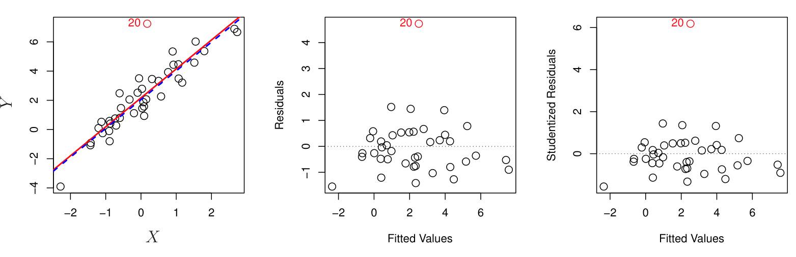

Figura&nbsp;3.12: <em>Izquierda:</em> La línea de regresión de mínimos cuadrados se muestra en rojo, y la línea de regresión después de eliminar el valor atípico se muestra en azul. <em>Centro:</em> El gráfico de residuos identifica claramente el valor atípico. <em>Derecha:</em> El valor atípico tiene un residuo studentizado de 6; típicamente esperamos valores entre $-3$ y 3.

El punto rojo (observación 20) en el panel izquierdo de la <a href="#fig-3-12" class="quarto-xref">Figura&nbsp;3.12</a> ilustra un valor atípico típico. La línea roja sólida es el ajuste de regresión de mínimos cuadrados, mientras que la línea azul discontinua es el ajuste de mínimos cuadrados después de eliminar el valor atípico. En este caso, eliminar el valor atípico tiene poco efecto en la línea de mínimos cuadrados: conduce a casi ningún cambio en la pendiente, y una reducción minúscula en el intercepto. Es típico que un valor atípico que no tiene un valor inusual del predictor tenga poco efecto en el ajuste de mínimos cuadrados. Sin embargo, incluso si un valor atípico no tiene mucho efecto en el ajuste de mínimos cuadrados, puede causar otros problemas. Por ejemplo, en este ejemplo, el RSE es 1.09 cuando el valor atípico está incluido en la regresión, pero es solo 0.77 cuando el valor atípico es eliminado. Dado que el RSE se usa para calcular todos los intervalos de confianza y *valores p*, un aumento tan dramático causado por un solo punto de datos puede tener implicaciones para la interpretación del ajuste. De manera similar, la inclusión del valor atípico hace que el $R^2$ disminuya de 0.892 a 0.805.

Los gráficos de residuos pueden usarse para identificar valores atípicos. En este ejemplo, el valor atípico es claramente visible en el gráfico de residuos ilustrado en el panel central de la <a href="#fig-3-12" class="quarto-xref">Figura&nbsp;3.12</a>. Pero en la práctica, puede ser difícil decidir qué tan grande debe ser un residuo antes de considerar que el punto es un valor atípico. Para abordar este problema, en lugar de graficar los residuos, podemos graficar los *residuos studentizados* (*studentized residuals*), calculados dividiendo cada residuo $e_i$ por su error estándar estimado. Las observaciones cuyos residuos studentizados son mayores que 3 en valor absoluto son posibles valores atípicos. En el panel derecho de la <a href="#fig-3-12" class="quarto-xref">Figura&nbsp;3.12</a>, el residuo studentizado del valor atípico excede 6, mientras que todas las demás observaciones tienen residuos studentizados entre $-2$ y 2.

Si creemos que un valor atípico ha ocurrido debido a un error en la recolección o registro de datos, entonces una solución es simplemente eliminar la observación. Sin embargo, debe tenerse cuidado, ya que un valor atípico puede en cambio indicar una deficiencia del modelo, como un predictor faltante.

**5. Puntos de Alto Apalancamiento**

Acabamos de ver que los valores atípicos son observaciones para las cuales la respuesta $y_i$ es inusual dado el predictor $x_i$. En contraste, las observaciones con *alto apalancamiento* (*high leverage*) tienen un valor inusual para $x_i$. Por ejemplo, la observación 41 en el panel izquierdo de la <a href="#fig-3-13" class="quarto-xref">Figura&nbsp;3.13</a> tiene alto apalancamiento, en el sentido de que el valor del predictor para esta observación es grande en relación con las otras observaciones. (Nótese que los datos mostrados en la <a href="#fig-3-13" class="quarto-xref">Figura&nbsp;3.13</a> son los mismos que los datos mostrados en la <a href="#fig-3-12" class="quarto-xref">Figura&nbsp;3.12</a>, pero con la adición de una única observación de alto apalancamiento.) La línea roja sólida es el ajuste de mínimos cuadrados a los datos, mientras que la línea azul discontinua es el ajuste producido cuando la observación 41 es eliminada. Comparando los paneles izquierdos de las Figuras 3.12 y 3.13, observamos que eliminar la observación de alto apalancamiento tiene un impacto mucho más sustancial en la línea de mínimos cuadrados que eliminar el valor atípico. De hecho, las observaciones de alto apalancamiento tienden a tener un impacto considerable en la línea de regresión estimada. Es motivo de preocupación si la línea de mínimos cuadrados es fuertemente afectada por solo un par de observaciones, porque cualquier problema con estos puntos puede invalidar el ajuste completo. Por esta razón, es importante identificar las observaciones de alto apalancamiento.

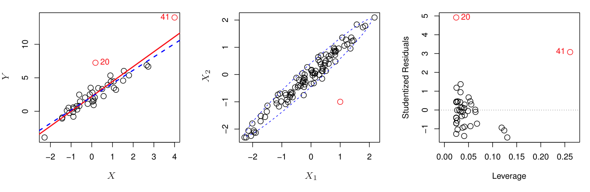

Figura&nbsp;3.13: <em>Izquierda:</em> La observación 41 es un punto de alto apalancamiento, mientras que la 20 no lo es. La línea roja es el ajuste a todos los datos, y la línea azul es el ajuste con la observación 41 eliminada. <em>Centro:</em> La observación roja no es inusual en términos de su valor de X1 ni de su valor de X2, pero aún cae fuera del grueso de los datos, y por lo tanto tiene alto apalancamiento. <em>Derecha:</em> La observación 41 tiene un alto apalancamiento y un alto residuo.

En una regresión lineal simple, las observaciones de alto apalancamiento son bastante fáciles de identificar, ya que simplemente podemos buscar observaciones para las cuales el valor del predictor está fuera del rango normal de las observaciones. Pero en una regresión lineal múltiple con muchos predictores, es posible tener una observación que esté bien dentro del rango de los valores de cada predictor individual, pero que sea inusual en términos del conjunto completo de predictores. Un ejemplo se muestra en el panel central de la <a href="#fig-3-13" class="quarto-xref">Figura&nbsp;3.13</a>, para un conjunto de datos con dos predictores, $X_1$ y $X_2$. La mayoría de los valores de los predictores de las observaciones caen dentro de la elipse azul discontinua, pero la observación roja está bien fuera de este rango. Pero ni su valor para $X_1$ ni su valor para $X_2$ es inusual. Así que si examinamos solo $X_1$ o solo $X_2$, no notaremos este punto de alto apalancamiento. Este problema es más pronunciado en contextos de regresión múltiple con más de dos predictores, porque entonces no hay una forma simple de graficar todas las dimensiones de los datos simultáneamente.

Para cuantificar el apalancamiento de una observación, calculamos el *estadístico de apalancamiento* (*leverage statistic*). Un valor grande de este estadístico indica una observación con alto apalancamiento. Para una regresión lineal simple,

$$
h_i = \frac{1}{n} + \frac{(x_i - \bar{x})^2}{\sum_{i' =1}^{n} (x_{i'} - \bar{x})^2}. \qquad (3.37)
$$

Es claro de esta ecuación que $h_i$ aumenta con la distancia de $x_i$ a $\bar{x}$. Existe una extensión simple de $h_i$ al caso de múltiples predictores, aunque no proporcionamos la fórmula aquí. El estadístico de apalancamiento $h_i$ siempre está entre $1/n$ y 1, y el apalancamiento promedio para todas las observaciones es siempre igual a $(p + 1)/n$. Así que si una observación dada tiene un estadístico de apalancamiento que excede en gran medida $(p+1)/n$, entonces podemos sospechar que el punto correspondiente tiene alto apalancamiento.

El panel derecho de la <a href="#fig-3-13" class="quarto-xref">Figura&nbsp;3.13</a> proporciona un gráfico de los residuos studentizados versus $h_i$ para los datos en el panel izquierdo de la <a href="#fig-3-13" class="quarto-xref">Figura&nbsp;3.13</a>. La observación 41 se destaca por tener un estadístico de apalancamiento muy alto así como un alto residuo studentizado. En otras palabras, ¡es un valor atípico así como una observación de alto apalancamiento. Esta es una combinación particularmente peligrosa! Este gráfico también revela la razón por la que la observación 20 tenía relativamente poco efecto en el ajuste de mínimos cuadrados en la <a href="#fig-3-12" class="quarto-xref">Figura&nbsp;3.12</a>: tiene bajo apalancamiento.

**6. Colinealidad**

La *colinealidad* (*collinearity*) se refiere a la situación en la que dos o más variables predictoras están estrechamente relacionadas entre sí. El concepto de colinealidad se ilustra en la <a href="#fig-3-14" class="quarto-xref">Figura&nbsp;3.14</a> usando el conjunto de datos `Credit`. En el panel izquierdo de la <a href="#fig-3-14" class="quarto-xref">Figura&nbsp;3.14</a>, los dos predictores `limit` (límite) y `age` (edad) parecen no tener una relación obvia. En contraste, en el panel derecho de la <a href="#fig-3-14" class="quarto-xref">Figura&nbsp;3.14</a>, los predictores `limit` y `rating` están muy altamente correlacionados entre sí, y decimos que son colineales. La presencia de colinealidad puede plantear problemas en el contexto de la regresión, ya que puede ser difícil separar los efectos individuales de las variables colineales sobre la variable respuesta. En otras palabras, dado que `limit` y `rating` tienden a aumentar o disminuir juntos, puede ser difícil determinar cómo cada uno por separado está asociado con la variable respuesta, `balance`.

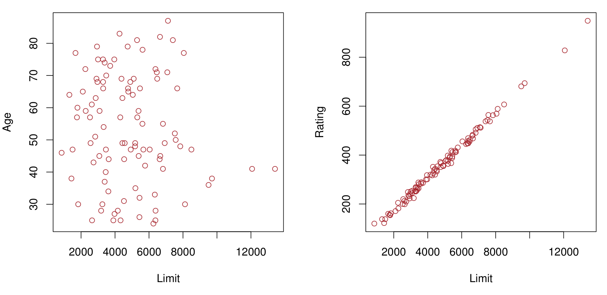

Figura&nbsp;3.14: Diagramas de dispersión de las observaciones del conjunto de datos Credit. <em>Izquierda:</em> Un gráfico de age versus limit. Estas dos variables no son colineales. <em>Derecha:</em> Un gráfico de rating versus limit. Existe una alta colinealidad.

La <a href="#fig-3-15" class="quarto-xref">Figura&nbsp;3.15</a> ilustra algunas de las dificultades que pueden resultar de la colinealidad. El panel izquierdo de la <a href="#fig-3-15" class="quarto-xref">Figura&nbsp;3.15</a> es un gráfico de contorno de la RSS <a href="#eq-3-22" class="quarto-xref">(3.22)</a> asociada con diferentes estimaciones posibles de los coeficientes para la regresión de `balance` sobre `limit` y `age`. Cada elipse representa un conjunto de coeficientes que corresponden a la misma RSS, y las elipses más cercanas al centro toman los valores más bajos de RSS. Los puntos negros y las líneas discontinuas asociadas representan las estimaciones de los coeficientes que resultan en la RSS más pequeña posible —en otras palabras, estas son las estimaciones de mínimos cuadrados. Los ejes para `limit` y `age` han sido escalados de modo que el gráfico incluya estimaciones posibles de los coeficientes que están hasta cuatro errores estándar a cada lado de las estimaciones de mínimos cuadrados. Así, el gráfico incluye todos los valores plausibles para los coeficientes. Por ejemplo, vemos que el verdadero coeficiente de `limit` está casi ciertamente en algún lugar entre 0.15 y 0.20.

En contraste, el panel derecho de la <a href="#fig-3-15" class="quarto-xref">Figura&nbsp;3.15</a> muestra gráficos de contorno de la RSS asociada con posibles estimaciones de los coeficientes para la regresión de `balance` sobre `limit` y `rating`, que sabemos que son altamente colineales. Ahora los contornos corren a lo largo de un valle estrecho; hay un amplio rango de valores para las estimaciones de los coeficientes que resultan en valores iguales de RSS. Por lo tanto, un pequeño cambio en los datos podría hacer que el par de valores de los coeficientes que producen la RSS más pequeña —es decir, las estimaciones de mínimos cuadrados— se mueva a cualquier lugar a lo largo de este valle. Esto resulta en una gran incertidumbre en las estimaciones de los coeficientes. Nótese que la escala para el coeficiente de `limit` ahora va de aproximadamente $-0.2$ a 0.2; esto es un aumento de ocho veces sobre el rango plausible del coeficiente de `limit` en la regresión con `age`. Curiosamente, aunque los coeficientes de `limit` y `rating` ahora tienen mucha más incertidumbre individual, casi ciertamente se encontrarán en algún lugar de este valle de contorno. Por ejemplo, no esperaríamos que el verdadero valor de los coeficientes de `limit` y `rating` fuera $-0.1$ y 1 respectivamente, aunque tal valor es plausible para cada coeficiente individualmente.

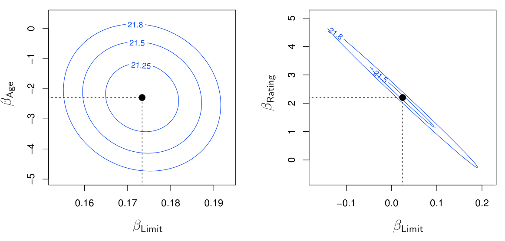

Figura&nbsp;3.15: Gráficos de contorno para los valores de RSS en función de los parámetros $\beta$ para varias regresiones que involucran el conjunto de datos Credit. En cada gráfico, los puntos negros representan los valores de los coeficientes correspondientes al mínimo de RSS. <em>Izquierda:</em> Un gráfico de contorno de RSS para la regresión de balance sobre age y limit. El valor mínimo está bien definido. <em>Derecha:</em> Un gráfico de contorno de RSS para la regresión de balance sobre rating y limit. Debido a la colinealidad, existen muchos pares $(\beta_{\text{Limit}}, \beta_{\text{Rating}})$ con un valor similar de RSS.

Dado que la colinealidad reduce la precisión de las estimaciones de los coeficientes de regresión, hace que el error estándar para $\hat{\beta}_j$ aumente. Recordemos que el estadístico $t$ para cada predictor se calcula dividiendo $\hat{\beta}_j$ por su error estándar. En consecuencia, la colinealidad resulta en una disminución del estadístico $t$. Como resultado, en presencia de colinealidad, podemos no rechazar $H_0: \beta_j = 0$. Esto significa que la *potencia* (*power*) de la prueba de hipótesis —la probabilidad de detectar correctamente un coeficiente distinto de cero— se reduce por la colinealidad.

**Modelo 1: regresión de `balance` sobre `age` y `limit`**

|             | Coeficiente | Error estándar | Estadístico t | Valor p   |
|:------------|:-----------:|:--------------:|:-------------:|:---------:|
| Intercepto  |  $-173.411$ |     43.828     |    $-3.957$   | $< 0.0001$ |
| age         |   $-2.292$  |      0.672     |    $-3.407$   |  0.0007   |
| limit       |    0.173    |      0.005     |    34.496     | $< 0.0001$ |

**Modelo 2: regresión de `balance` sobre `rating` y `limit`**

|             | Coeficiente | Error estándar | Estadístico t | Valor p   |
|:------------|:-----------:|:--------------:|:-------------:|:---------:|
| Intercepto  |  $-377.537$ |     45.254     |    $-8.343$   | $< 0.0001$ |
| rating      |    2.202    |      0.952     |     2.312     |  0.0213   |
| limit       |    0.025    |      0.064     |     0.384     |  0.7012   |

Tabla&nbsp;3.11: Se muestran los resultados para dos modelos de regresión múltiple que involucran el conjunto de datos Credit. El Modelo 1 es una regresión de balance sobre age y limit, y el Modelo 2 una regresión de balance sobre rating y limit. El error estándar de $\hat{\beta}_{\text{limit}}$ aumenta 12 veces en la segunda regresión, debido a la colinealidad.

La <a href="#tbl-3-11" class="quarto-xref">Tabla&nbsp;3.11</a> compara las estimaciones de los coeficientes obtenidas de dos modelos de regresión múltiple separados. El primero es una regresión de `balance` sobre `age` y `limit`, y el segundo es una regresión de `balance` sobre `rating` y `limit`. En la primera regresión, tanto `age` como `limit` son altamente significativos con *valores p* muy pequeños. En la segunda, la colinealidad entre `limit` y `rating` ha causado que el error estándar para la estimación del coeficiente de `limit` aumente por un factor de 12 y que el *valor p* aumente a 0.701. En otras palabras, la importancia de la variable `limit` ha sido enmascarada debido a la presencia de colinealidad. Para evitar tal situación, es deseable identificar y abordar problemas potenciales de colinealidad mientras se ajusta el modelo.

Una forma simple de detectar colinealidad es observar la matriz de correlación de los predictores. Un elemento de esta matriz que es grande en valor absoluto indica un par de variables altamente correlacionadas, y por lo tanto un problema de colinealidad en los datos. Desafortunadamente, no todos los problemas de colinealidad pueden detectarse mediante la inspección de la matriz de correlación: es posible que exista colinealidad entre tres o más variables incluso si ningún par de variables tiene una correlación particularmente alta. Llamamos a esta situación *multicolinealidad* (*multicollinearity*). En lugar de inspeccionar la matriz de correlación, una mejor manera de evaluar la *multicolinealidad* es calcular el *factor de inflación de la varianza* (*variance inflation factor*, VIF). El VIF es la razón entre la varianza de $\hat{\beta}_j$ al ajustar el modelo completo dividida por la varianza de $\hat{\beta}_j$ si se ajusta por sí solo. El valor más pequeño posible para el VIF es 1, lo que indica la ausencia completa de colinealidad. Típicamente en la práctica hay una pequeña cantidad de colinealidad entre los predictores. Como regla general, un valor de VIF que excede 5 o 10 indica una cantidad problemática de colinealidad. El VIF para cada variable puede calcularse usando la fórmula

$$\text{VIF}(\hat{\beta}_j) = \frac{1}{1 - R^2_{X_j|X_{-j}}},$$

donde $R^2_{X_j|X_{-j}}$ es el $R^2$ de una regresión de $X_j$ sobre todos los demás predictores. Si $R^2_{X_j|X_{-j}}$ es cercano a uno, entonces la colinealidad está presente, y por lo tanto el VIF será grande.

En los datos `Credit`, una regresión de `balance` sobre `age`, `rating` y `limit` indica que los predictores tienen valores VIF de 1.01, 160.67 y 160.59. ¡Como sospechábamos, hay una considerable colinealidad en los datos!

Al enfrentar el problema de la colinealidad, existen dos soluciones simples. La primera es eliminar una de las variables problemáticas de la regresión. Esto generalmente puede hacerse sin mucho compromiso para el ajuste de la regresión, ya que la presencia de colinealidad implica que la información que esta variable proporciona sobre la variable respuesta es redundante en presencia de las otras variables. Por ejemplo, si regresamos `balance` sobre `age` y `limit`, sin el predictor `rating`, entonces los valores VIF resultantes están cerca del valor mínimo posible de 1, y el $R^2$ disminuye de 0.754 a 0.75. Así que eliminar `rating` del conjunto de predictores ha resuelto efectivamente el problema de colinealidad sin comprometer el ajuste. La segunda solución es combinar las variables colineales en un solo predictor. Por ejemplo, podríamos tomar el promedio de versiones estandarizadas de `limit` y `rating` para crear una nueva variable que mida la solvencia crediticia.

## 3.4 El Plan de Marketing

Ahora volvemos brevemente a las siete preguntas sobre los datos `Advertising` que nos propusimos responder al comienzo de este capítulo.

1. ¿Existe una relación entre las ventas (`sales`) y el presupuesto publicitario? Esta pregunta puede responderse ajustando un modelo de regresión múltiple de `sales` sobre `TV`, `radio` y `newspaper`, como en <a href="#eq-3-20" class="quarto-xref">(3.20)</a>, y contrastando la hipótesis $H_0: \beta_{\text{TV}} = \beta_{\text{radio}} = \beta_{\text{newspaper}} = 0$. En la Sección 3.2.2, mostramos que el *estadístico F* puede usarse para determinar si debemos o no rechazar esta hipótesis nula. En este caso, el *valor p* correspondiente al *estadístico F* en la <a href="#tbl-3-6" class="quarto-xref">Tabla&nbsp;3.6</a> es muy bajo, indicando clara evidencia de una relación entre la publicidad y las ventas.

2. ¿Qué tan fuerte es la relación? Discutimos dos medidas de precisión del modelo en la Sección 3.1.3. Primero, el RSE estima la desviación estándar de la variable respuesta con respecto a la línea de regresión poblacional. Para los datos `Advertising`, el RSE es 1.69 unidades mientras que el valor medio de la variable respuesta es 14.022, indicando un error porcentual de aproximadamente 12%. Segundo, el estadístico $R^2$ registra el porcentaje de variabilidad en la variable respuesta que es explicado por los predictores. Los predictores explican casi el 90% de la varianza en `sales`. Las estadísticas RSE y $R^2$ se muestran en la <a href="#tbl-3-6" class="quarto-xref">Tabla&nbsp;3.6</a>.

3. ¿Qué medios están asociados con las ventas? Para responder a esta pregunta, podemos examinar los *valores p* asociados con el estadístico $t$ de cada predictor (Sección 3.1.2). En la regresión lineal múltiple mostrada en la <a href="#tbl-3-4" class="quarto-xref">Tabla&nbsp;3.4</a>, los *valores p* para `TV` y `radio` son bajos, pero el *valor p* para `newspaper` no lo es. Esto sugiere que solo `TV` y `radio` están relacionados con las ventas. En el Capítulo 6 exploramos esta pregunta con mayor detalle.

4. ¿Qué tan grande es la asociación entre cada medio y las ventas? Vimos en la Sección 3.1.2 que el error estándar de $\hat{\beta}_j$ puede usarse para construir intervalos de confianza para $\beta_j$. Para los datos `Advertising`, podemos usar los resultados en la <a href="#tbl-3-4" class="quarto-xref">Tabla&nbsp;3.4</a> para calcular los intervalos de confianza del 95% para los coeficientes en un modelo de regresión múltiple usando los tres presupuestos de medios como predictores. Los intervalos de confianza son los siguientes: $(0.043, 0.049)$ para `TV`, $(0.172, 0.206)$ para `radio` y $(-0.013, 0.011)$ para `newspaper`. Los intervalos de confianza para `TV` y `radio` son estrechos y están lejos de cero, proporcionando evidencia de que estos medios están relacionados con las ventas. Pero el intervalo para `newspaper` incluye cero, indicando que la variable no es estadísticamente significativa dados los valores de `TV` y `radio`.

   Vimos en la Sección 3.3.3 que la colinealidad puede resultar en errores estándar muy amplios. ¿Podría ser la colinealidad la razón por la que el intervalo de confianza asociado con `newspaper` es tan amplio? Las puntuaciones VIF son 1.005, 1.145 y 1.145 para `TV`, `radio` y `newspaper`, sugiriendo que no hay evidencia de colinealidad.

   Para evaluar la asociación de cada medio individualmente sobre las ventas, podemos realizar tres regresiones lineales simples separadas. Los resultados se muestran en las <a href="#tbl-3-1" class="quarto-xref">Tablas&nbsp;3.1</a> y <a href="#tbl-3-3" class="quarto-xref">3.3</a>. Hay evidencia de una asociación extremadamente fuerte entre `TV` y `sales` y entre `radio` y `sales`. Hay evidencia de una asociación leve entre `newspaper` y `sales`, cuando los valores de `TV` y `radio` son ignorados.

5. ¿Con qué precisión podemos predecir las ventas futuras? La variable respuesta puede predecirse usando <a href="#eq-3-21" class="quarto-xref">(3.21)</a>. La precisión asociada con esta estimación depende de si deseamos predecir una respuesta individual, $Y = f(X) + \epsilon$, o la respuesta promedio, $f(X)$ (Sección 3.2.2). Si es lo primero, usamos un *intervalo de predicción*, y si es lo segundo, usamos un *intervalo de confianza*. Los *intervalos de predicción* siempre serán más amplios que los *intervalos de confianza* porque tienen en cuenta la incertidumbre asociada con $\epsilon$, el *error irreducible*.

6. ¿Es lineal la relación? En la Sección 3.3.3, vimos que los gráficos de residuos pueden usarse para identificar la no linealidad. Si las relaciones son lineales, entonces los gráficos de residuos no deberían mostrar ningún patrón. En el caso de los datos `Advertising`, observamos un efecto no lineal en la <a href="#fig-3-5" class="quarto-xref">Figura&nbsp;3.5</a>, aunque este efecto también podría observarse en un gráfico de residuos. En la Sección 3.3.2, discutimos la inclusión de transformaciones de los predictores en el modelo de regresión lineal para dar cabida a relaciones no lineales.

7. ¿Existe sinergia entre los medios publicitarios? El modelo de regresión lineal estándar asume una relación aditiva entre los predictores y la variable respuesta. Un modelo aditivo es fácil de interpretar porque la asociación entre cada predictor y la variable respuesta no está relacionada con los valores de los otros predictores. Sin embargo, la suposición de aditividad puede no ser realista para ciertos conjuntos de datos. En la Sección 3.3.2, mostramos cómo incluir un *término de interacción* en el modelo de regresión para dar cabida a relaciones no aditivas. Un *valor p* pequeño asociado con el término de interacción indica la presencia de tales relaciones. La <a href="#fig-3-5" class="quarto-xref">Figura&nbsp;3.5</a> sugirió que los datos `Advertising` pueden no ser aditivos. Incluir un *término de interacción* en el modelo resulta en un aumento sustancial en $R^2$, de alrededor del 90% a casi el 97%.

## 3.5 Comparación de la Regresión Lineal con K-Vecinos Más Cercanos

Como se discutió en el Capítulo 2, la regresión lineal es un ejemplo de un enfoque paramétrico porque asume una forma funcional lineal para $f(X)$. Los métodos paramétricos tienen varias ventajas. A menudo son fáciles de ajustar, porque solo se necesita estimar un pequeño número de coeficientes. En el caso de la regresión lineal, los coeficientes tienen interpretaciones simples, y las pruebas de significación estadística pueden realizarse fácilmente. Pero los métodos paramétricos tienen una desventaja: por construcción, hacen suposiciones fuertes sobre la forma de $f(X)$. Si la forma funcional especificada está lejos de la verdad, y la precisión de predicción es nuestro objetivo, entonces el método paramétrico tendrá un mal desempeño. Por ejemplo, si asumimos una relación lineal entre $X$ e $Y$ pero la verdadera relación está lejos de ser lineal, entonces el modelo resultante proporcionará un mal ajuste a los datos, y cualquier conclusión extraída de él será sospechosa.

En contraste, los métodos *no paramétricos* no asumen explícitamente una forma paramétrica para $f(X)$, y por lo tanto proporcionan una alternativa y un enfoque más flexible para realizar regresión. Discutimos varios métodos no paramétricos en este libro. Aquí consideramos uno de los métodos no paramétricos más simples y mejor conocidos, la *regresión de K-vecinos más cercanos* (*K-nearest neighbors regression*, KNN regression). El método de regresión KNN está estrechamente relacionado con el clasificador KNN discutido en el Capítulo 2. Dado un valor para $K$ y un punto de predicción $x_0$, la regresión KNN primero identifica las $K$ observaciones de entrenamiento que están más cerca de $x_0$, representadas por $\mathcal{N}_0$. Luego estima $f(x_0)$ usando el promedio de todas las respuestas de entrenamiento en $\mathcal{N}_0$. En otras palabras,

$$\hat{f}(x_0) = \frac{1}{K} \sum_{x_i \in \mathcal{N}_0} y_i.$$

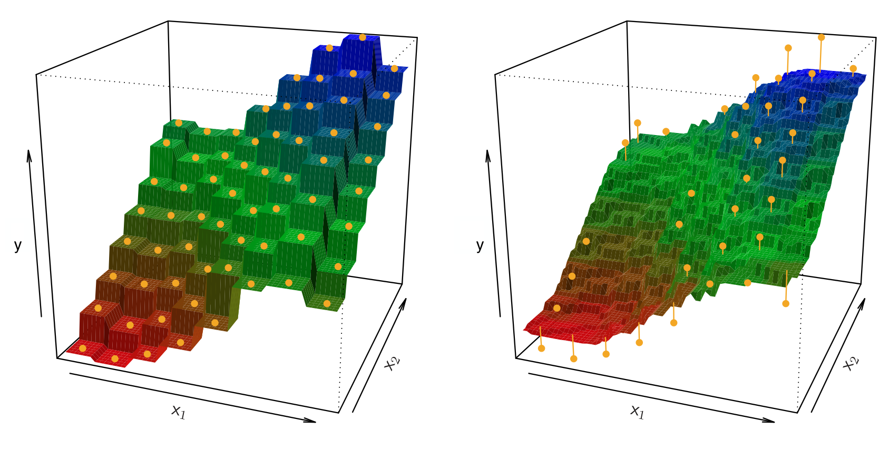

Figura&nbsp;3.16: Gráficos de $\hat{f}(X)$ usando regresión KNN en un conjunto de datos bidimensional con 64 observaciones (puntos naranjas). <em>Izquierda:</em> $K = 1$ resulta en un ajuste de función escalonada rugosa. <em>Derecha:</em> $K = 9$ produce un ajuste mucho más suave.

La <a href="#fig-3-16" class="quarto-xref">Figura&nbsp;3.16</a> ilustra dos ajustes KNN en un conjunto de datos con $p = 2$ predictores. El ajuste con $K = 1$ se muestra en el panel izquierdo, mientras que el panel derecho corresponde a $K = 9$. Vemos que cuando $K = 1$, el ajuste KNN interpola perfectamente las observaciones de entrenamiento, y en consecuencia toma la forma de una función escalonada. Cuando $K = 9$, el ajuste KNN sigue siendo una función escalonada, pero promediar sobre nueve observaciones resulta en regiones mucho más pequeñas de predicción constante, y en consecuencia un ajuste más suave. En general, el valor óptimo para $K$ dependerá del *compromiso sesgo-varianza* (*bias-variance tradeoff*), que introdujimos en el Capítulo 2. Un valor pequeño de $K$ proporciona el ajuste más flexible, que tendrá bajo sesgo pero alta varianza. Esta varianza se debe al hecho de que la predicción en una región dada depende enteramente de una sola observación. En contraste, valores más grandes de $K$ proporcionan un ajuste más suave y menos variable; la predicción en una región es un promedio de varios puntos, por lo que cambiar una observación tiene un efecto menor. Sin embargo, el suavizado puede causar sesgo al enmascarar parte de la estructura en $f(X)$. En el Capítulo 5, introducimos varios enfoques para estimar las tasas de error de prueba. Estos métodos pueden usarse para identificar el valor óptimo de $K$ en la regresión KNN.

¿En qué contexto un enfoque paramétrico como la regresión lineal de mínimos cuadrados superará a un enfoque no paramétrico como la regresión KNN? La respuesta es simple: el enfoque paramétrico superará al enfoque no paramétrico si la forma paramétrica que se ha seleccionado está cerca de la verdadera forma de $f$. La <a href="#fig-3-17" class="quarto-xref">Figura&nbsp;3.17</a> proporciona un ejemplo con datos generados a partir de un modelo de regresión lineal unidimensional. Las líneas negras sólidas representan $f(X)$, mientras que las curvas azules corresponden a los ajustes KNN usando $K = 1$ y $K = 9$. En este caso, las predicciones con $K = 1$ son demasiado variables, mientras que el ajuste más suave $K = 9$ está mucho más cerca de $f(X)$. Sin embargo, dado que la verdadera relación es lineal, es difícil para un enfoque no paramétrico competir con la regresión lineal: un enfoque no paramétrico incurre en un costo en varianza que no se compensa con una reducción en el sesgo. La línea azul discontinua en el panel izquierdo de la <a href="#fig-3-18" class="quarto-xref">Figura&nbsp;3.18</a> representa el ajuste de regresión lineal a los mismos datos. Es casi perfecto. El panel derecho de la <a href="#fig-3-18" class="quarto-xref">Figura&nbsp;3.18</a> revela que la regresión lineal supera a KNN para estos datos. La línea verde sólida, graficada en función de $1/K$, representa el error cuadrático medio (MSE) del conjunto de prueba para KNN. Los errores de KNN están muy por encima de la línea negra discontinua, que es el MSE de prueba para la regresión lineal. Cuando el valor de $K$ es grande, KNN se desempeña solo un poco peor que la regresión de mínimos cuadrados en términos de MSE. Se desempeña mucho peor cuando $K$ es pequeño.

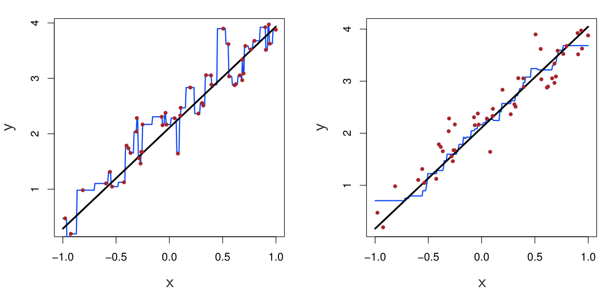

Figura&nbsp;3.17: Gráficos de $\hat{f}(X)$ usando regresión KNN en un conjunto de datos unidimensional con 50 observaciones. La verdadera relación está dada por la línea negra sólida. <em>Izquierda:</em> La curva azul corresponde a $K = 1$ e interpola (es decir, pasa directamente a través de) los datos de entrenamiento. <em>Derecha:</em> La curva azul corresponde a $K = 9$, y representa un ajuste más suave.

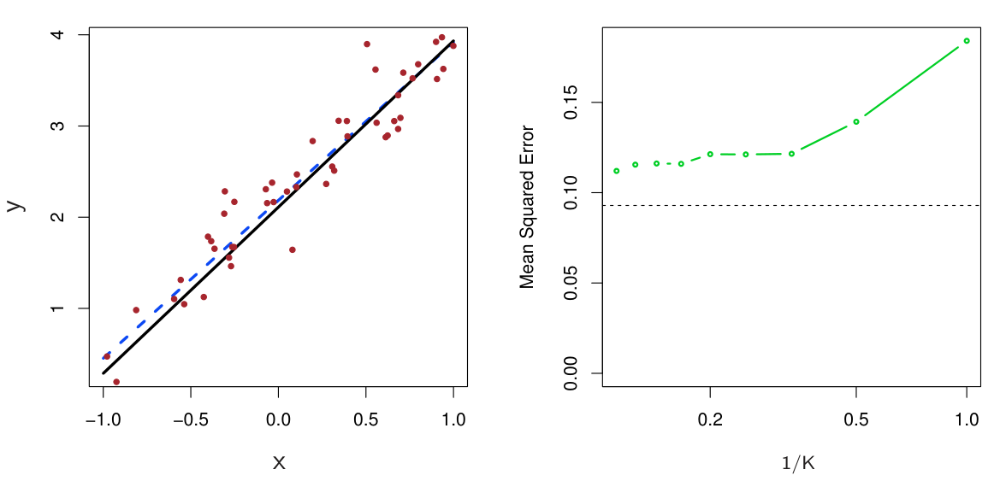

Figura&nbsp;3.18: El mismo conjunto de datos mostrado en la Figura&nbsp;3.17 se investiga más a fondo. <em>Izquierda:</em> La línea azul discontinua es el ajuste de mínimos cuadrados a los datos. Dado que $f(X)$ es de hecho lineal (mostrada como la línea negra), la línea de regresión de mínimos cuadrados proporciona una muy buena estimación de $f(X)$. <em>Derecha:</em> La línea horizontal discontinua representa el MSE del conjunto de prueba de mínimos cuadrados, mientras que la línea verde sólida corresponde al MSE para KNN en función de $1/K$ (en escala logarítmica). La regresión lineal logra un MSE de prueba más bajo que la regresión KNN, ya que $f(X)$ es de hecho lineal. Para la regresión KNN, los mejores resultados ocurren con un valor muy grande de $K$, correspondiente a un valor pequeño de $1/K$.

En la práctica, la verdadera relación entre $X$ e $Y$ rara vez es exactamente lineal. La <a href="#fig-3-19" class="quarto-xref">Figura&nbsp;3.19</a> examina los desempeños relativos de la regresión de mínimos cuadrados y KNN bajo niveles crecientes de no linealidad en la relación entre $X$ e $Y$. En la fila superior, la verdadera relación es casi lineal. En este caso vemos que el MSE de prueba para la regresión lineal sigue siendo superior al de KNN para valores bajos de $K$. Sin embargo, para $K \geq 4$, KNN supera a la regresión lineal. La segunda fila ilustra una desviación más sustancial de la linealidad. En esta situación, KNN supera sustancialmente a la regresión lineal para todos los valores de $K$. Nótese que a medida que aumenta el grado de no linealidad, hay poco cambio en el MSE del conjunto de prueba para el método no paramétrico KNN, pero hay un gran aumento en el MSE del conjunto de prueba de la regresión lineal.

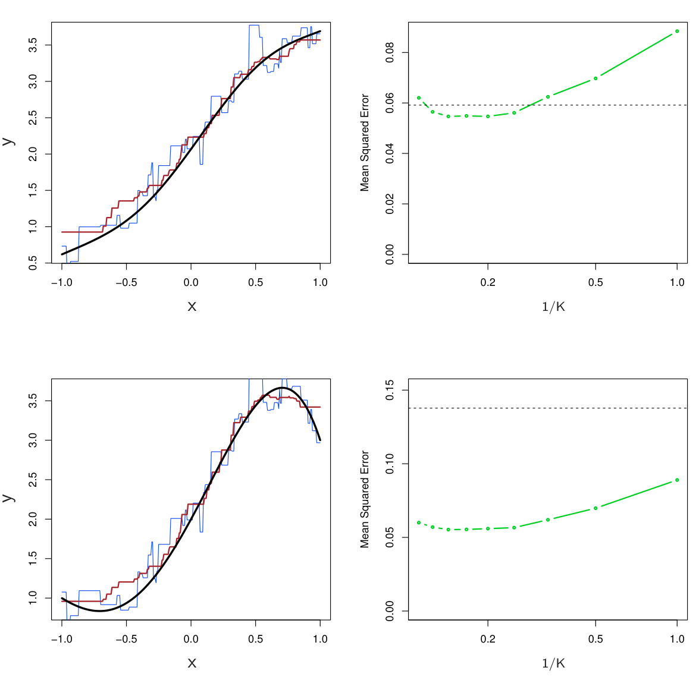

Figura&nbsp;3.19: <em>Arriba Izquierda:</em> En un contexto con una relación ligeramente no lineal entre $X$ e $Y$ (línea negra sólida), se muestran los ajustes KNN con $K = 1$ (azul) y $K = 9$ (rojo). <em>Arriba Derecha:</em> Para los datos ligeramente no lineales, se muestran el MSE del conjunto de prueba para la regresión de mínimos cuadrados (línea negra horizontal) y KNN con varios valores de $1/K$ (verde). <em>Abajo Izquierda</em> y <em>Abajo Derecha:</em> Como en el panel superior, pero con una relación fuertemente no lineal entre $X$ e $Y$.

Las <a href="#fig-3-18" class="quarto-xref">Figuras&nbsp;3.18</a> y <a href="#fig-3-19" class="quarto-xref">3.19</a> muestran situaciones en las que KNN se desempeña ligeramente peor que la regresión lineal cuando la relación es lineal, pero mucho mejor que la regresión lineal para situaciones no lineales. En una situación de la vida real en la que la verdadera relación es desconocida, uno podría sospechar que KNN debería favorecerse sobre la regresión lineal porque en el peor de los casos será ligeramente inferior a la regresión lineal si la verdadera relación es lineal, y puede dar resultados sustancialmente mejores si la verdadera relación es no lineal. Pero en realidad, incluso cuando la verdadera relación es altamente no lineal, KNN aún puede proporcionar resultados inferiores a la regresión lineal. En particular, tanto las <a href="#fig-3-18" class="quarto-xref">Figuras&nbsp;3.18</a> como <a href="#fig-3-19" class="quarto-xref">3.19</a> ilustran contextos con $p = 1$ predictor. Pero en dimensiones más altas, KNN a menudo se desempeña peor que la regresión lineal.

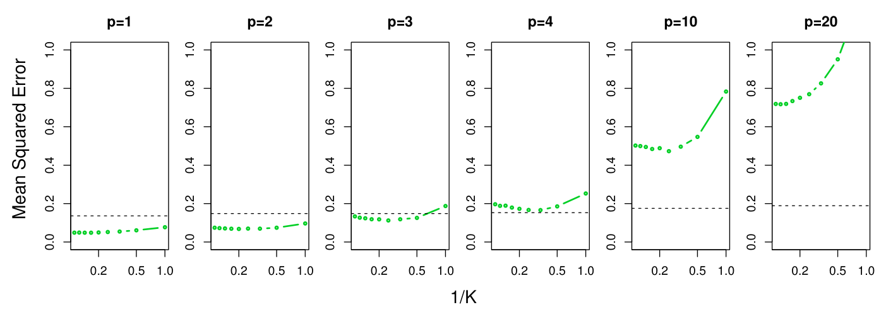

Figura&nbsp;3.20: MSE de prueba para la regresión lineal (líneas negras discontinuas) y KNN (curvas verdes) a medida que el número de variables $p$ aumenta. La función verdadera es no lineal en la primera variable, como en el panel inferior de la Figura&nbsp;3.19, y no depende de las variables adicionales. El desempeño de la regresión lineal se deteriora lentamente en presencia de estas variables de ruido adicionales, mientras que el desempeño de KNN se degrada mucho más rápidamente a medida que $p$ aumenta.

La <a href="#fig-3-20" class="quarto-xref">Figura&nbsp;3.20</a> considera la misma situación fuertemente no lineal que en la segunda fila de la <a href="#fig-3-19" class="quarto-xref">Figura&nbsp;3.19</a>, excepto que hemos agregado predictores de ruido adicionales que no están asociados con la variable respuesta. Cuando $p = 1$ o $p = 2$, KNN supera a la regresión lineal. Pero para $p = 3$ los resultados son mixtos, y para $p \geq 4$ la regresión lineal es superior a KNN. De hecho, el aumento en la dimensión solo ha causado un pequeño deterioro en el MSE del conjunto de prueba de la regresión lineal, pero ha causado más de un aumento de diez veces en el MSE para KNN. Esta disminución en el desempeño a medida que la dimensión aumenta es un problema común para KNN, y resulta del hecho de que en dimensiones más altas hay efectivamente una reducción en el tamaño de la muestra. En este conjunto de datos hay 50 observaciones de entrenamiento; cuando $p = 1$, esto proporciona suficiente información para estimar $f(X)$ con precisión. Sin embargo, distribuir 50 observaciones sobre $p = 20$ dimensiones resulta en un fenómeno en el que una observación dada no tiene vecinos cercanos —esta es la llamada *maldición de la dimensionalidad* (*curse of dimensionality*). Es decir, las $K$ observaciones que están más cercanas a una observación de prueba dada $x_0$ pueden estar muy lejos de $x_0$ en el espacio $p$-dimensional cuando $p$ es grande, lo que lleva a una muy mala predicción de $f(x_0)$ y por lo tanto un mal ajuste KNN. Como regla general, los métodos paramétricos tenderán a superar a los enfoques no paramétricos cuando hay un número pequeño de observaciones por predictor.

Incluso cuando la dimensión es pequeña, podríamos preferir la regresión lineal a KNN desde el punto de vista de la interpretabilidad. Si el MSE de prueba de KNN es solo ligeramente menor que el de la regresión lineal, podríamos estar dispuestos a renunciar a un poco de precisión de predicción en aras de un modelo simple que puede describirse en términos de solo unos pocos coeficientes, y para el cual los *valores p* están disponibles.
