## Resumen

En este capítulo, abordamos problemas de **clasificación**, donde la variable respuesta es cualitativa o categórica. Predecir una respuesta cualitativa requiere un enfoque distinto al de la regresión lineal. Presentamos tres de los métodos de clasificación más utilizados: **regresión logística**, **análisis de discriminante lineal** (LDA) y **análisis de discriminante cuadrático** (QDA). También se discuten los **K vecinos más cercanos** (KNN), que fueron introducidos en el Capítulo 2. El capítulo concluye con un laboratorio práctico que aplica estos métodos al conjunto de datos *Smarket* y a datos de seguros.

## Visión General de la Clasificación

La clasificación es probablemente la tarea de aprendizaje supervisado más utilizada. Aparece en campos como la medicina (diagnóstico), finanzas (detección de fraude), marketing (predicción de abandono), etc.

Al igual que en regresión, tenemos un conjunto de entrenamiento $\{(x_1, y_1), \ldots, (x_n, y_n)\}$ donde cada $x_i$ es un vector de predictores y $y_i$ es la respuesta cualitativa, que puede tomar valores en un conjunto discreto de clases $C_1, C_2, \ldots, C_K$.

El objetivo es construir un clasificador $f(X)$ que asigne una observación a una de las $K$ clases. También nos interesa medir la **incertidumbre** de nuestras predicciones, por ejemplo a través de la **probabilidad condicional** $P(Y = k \mid X = x_0)$.

## ¿Por Qué No Regresión Lineal?

Cuando la respuesta $Y$ es binaria (dos clases, codificadas como 0 y 1), la regresión lineal puede parecer un enfoque natural. Sin embargo, tiene varios inconvenientes:

1. **Predicciones fuera de rango**: $\hat{Y}$ puede ser menor que 0 o mayor que 1, lo que no tiene sentido como probabilidad.
2. **Interpretabilidad**: con más de dos clases, la codificación numérica arbitraria (1, 2, 3) impone un orden que no necesariamente existe.
3. **Mala calidad del ajuste**: los errores no son homoscedásticos ni normales.

Por estas razones, se prefieren métodos diseñados específicamente para clasificación.

## Regresión Logística

### El Modelo Logístico

En lugar de modelar $Y$ directamente, modelamos la **probabilidad** de que $Y$ pertenezca a una clase particular. Para la regresión logística simple con un predictor $X$, usamos la **función logística**:

$$p(X) = \frac{e^{\beta_0 + \beta_1 X}}{1 + e^{\beta_0 + \beta_1 X}}$$

Esta función produce valores entre 0 y 1 para cualquier valor de $X$. Reordenando, obtenemos las **odds**:

$$\frac{p(X)}{1 - p(X)} = e^{\beta_0 + \beta_1 X}$$

y el **log-odds** (logit):

$$\log\left(\frac{p(X)}{1 - p(X)}\right) = \beta_0 + \beta_1 X$$

El logit es lineal en $X$, pero la probabilidad $p(X)$ no lo es.

La @fig-4-1a muestra la función logística ajustada a datos simulados, donde la respuesta binaria representa si un cliente incumplió o no un préstamo (datos *Default*). El panel izquierdo (@fig-4-1a) usa el saldo como predictor en un rango limitado; el derecho (@fig-4-1b) muestra la función logística completa.

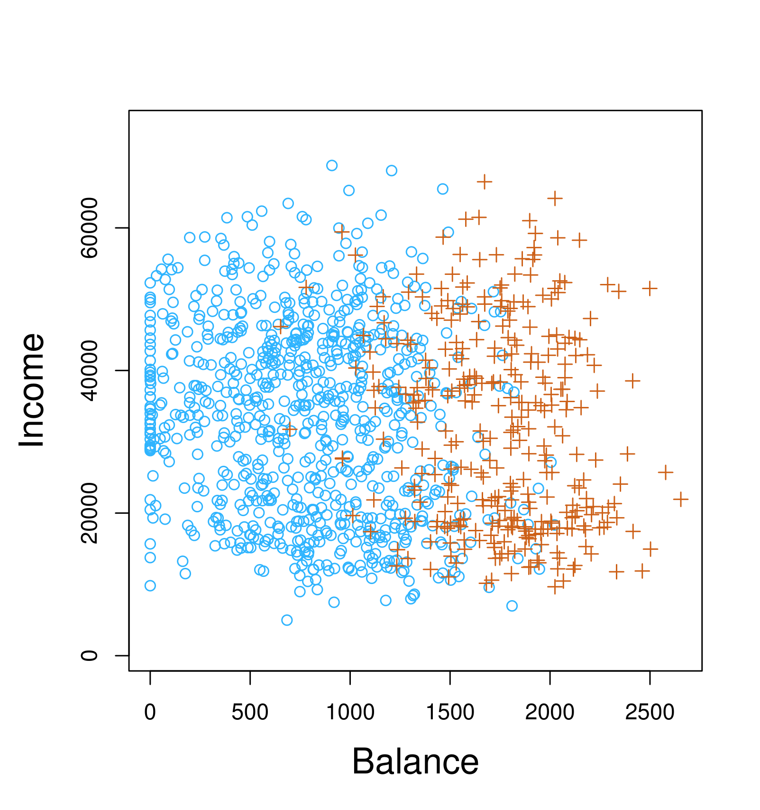{#fig-4-1a width=40%}

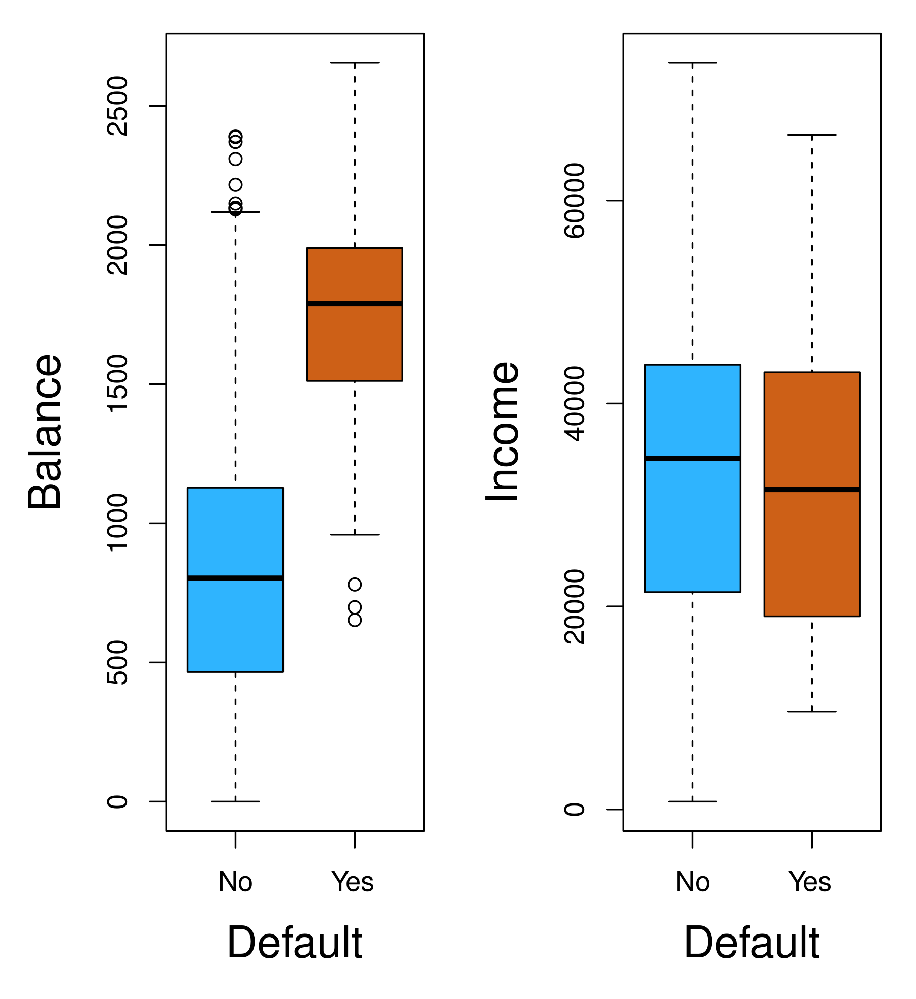{#fig-4-1b width=40%}

### Estimación de los Coeficientes de Regresión

Los coeficientes $\beta_0$ y $\beta_1$ en (4.2) se estiman mediante **máxima verosimilitud** (EMV). La verosimilitud para una muestra de $n$ observaciones independientes es:

$$\ell(\beta_0, \beta_1) = \prod_{i: y_i=1} p(x_i) \prod_{i: y_i=0} (1 - p(x_i))$$

Maximizar esta función (o su logaritmo) produce las estimaciones $\hat{\beta}_0$ y $\hat{\beta}_1$. Este proceso se realiza numéricamente, ya que no existe una solución cerrada como en regresión lineal.

En la Tabla 4.1 se muestran los coeficientes estimados para la regresión logística de *default* sobre *balance*, junto con sus errores estándar, estadísticos $z$ y valores $p$.

### Predicciones

Una vez estimados los coeficientes, podemos calcular la probabilidad de incumplimiento para un saldo dado:

$$\hat{p}(X) = \frac{e^{\hat{\beta}_0 + \hat{\beta}_1 X}}{1 + e^{\hat{\beta}_0 + \hat{\beta}_1 X}}$$

Por ejemplo, con un saldo de \$1000, la probabilidad estimada de incumplimiento es 0.00576; con \$2000, 0.586. Esta no linealidad es una característica clave de la regresión logística.

La @fig-4-2 muestra la curva logística ajustada con los datos Default, con las observaciones reales superpuestas (con dispersión aleatoria para visualizar la densidad).

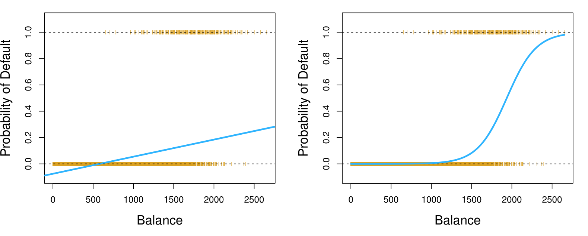{#fig-4-2 width=60%}

### Regresión Logística Múltiple

Generalizamos la regresión logística a múltiples predictores:

$$p(X) = \frac{e^{\beta_0 + \beta_1 X_1 + \cdots + \beta_p X_p}}{1 + e^{\beta_0 + \beta_1 X_1 + \cdots + \beta_p X_p}}$$

o equivalentemente:

$$\log\left(\frac{p(X)}{1 - p(X)}\right) = \beta_0 + \beta_1 X_1 + \cdots + \beta_p X_p$$

Para los datos *Default*, usando saldo, estudiante (indicador) e ingresos como predictores, los coeficientes estimados se muestran en la Tabla 4.3. Un resultado interesante es que el coeficiente de *estudiante* es negativo (los estudiantes tienen menor riesgo cuando se controla por saldo e ingresos), aunque en el análisis univariado parecía positivo. Esto se debe a una **variable de confusión**: los estudiantes tienden a tener saldos más altos.

La @fig-4-12 muestra la regresión logística múltiple con dos predictores (saldo y estudiante) en los datos Default, ilustrando cómo se combinan predictores cuantitativos y cualitativos.

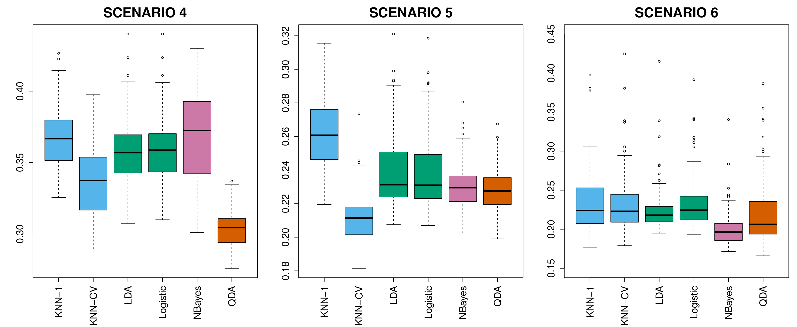{#fig-4-12 width=60%}

### Regresión Logística Multinomial

Para problemas con más de dos clases, usamos la **regresión logística multinomial**. Si $Y$ puede tomar valores $1, 2, \ldots, K$, la probabilidad de pertenecer a la clase $k$ es:

$$P(Y = k \mid X = x) = \frac{e^{\beta_{k0} + \beta_{k1} X_1 + \cdots + \beta_{kp} X_p}}{\sum_{\ell=1}^{K} e^{\beta_{\ell 0} + \beta_{\ell 1} X_1 + \cdots + \beta_{\ell p} X_p}}$$

Se requieren $K$ conjuntos de coeficientes, pero solo $K-1$ son libres (por la restricción de que las probabilidades suman 1). En la práctica, se fija una clase de referencia, por ejemplo la clase $K$, con coeficientes $\beta_K = 0$.

## Modelos Generativos para Clasificación

Además de la regresión logística (que modela $P(Y \mid X)$ directamente), existen **modelos generativos** que modelan la **distribución conjunta** $P(X, Y)$ y luego usan el teorema de Bayes para obtener $P(Y \mid X)$.

### Teorema de Bayes para Clasificación

Recordemos el teorema de Bayes para clasificación:

$$P(Y = k \mid X = x) = \frac{\pi_k \, f_k(x)}{\sum_{\ell=1}^{K} \pi_\ell \, f_\ell(x)}$$

donde:

- $\pi_k$ es la **probabilidad previa** (prior) de la clase $k$ (proporción de observaciones de esa clase en la población)
- $f_k(x) = P(X = x \mid Y = k)$ es la **densidad** de $X$ en la clase $k$

Estimamos $\pi_k$ y $f_k(x)$ a partir de los datos de entrenamiento, y luego usamos Bayes para obtener $P(Y = k \mid X = x)$. Asignamos una observación a la clase con mayor probabilidad posterior, lo que se conoce como el **clasificador de Bayes** (óptimo, pero inalcanzable porque no conocemos las distribuciones verdaderas).

Diferentes supuestos sobre $f_k(x)$ dan lugar a diferentes métodos:

- Si $X$ es **una dimensión** y $f_k(x)$ es **normal** con varianza común $\rightarrow$ **LDA univariado**
- Si $X$ es **multivariante** y $f_k(x)$ es normal **con matriz de covarianza común** $\rightarrow$ **LDA**
- Si $X$ es **multivariante** y $f_k(x)$ es normal **con matrices de covarianza distintas** $\rightarrow$ **QDA**
- Cada $f_k(x)$ se estima de forma no paramétrica $\rightarrow$ **KNN**

### Análisis de Discriminante Lineal para $p = 1$

Cuando $p = 1$ y $f_k(x)$ es normal con media $\mu_k$ y varianza $\sigma^2$, la probabilidad posterior se simplifica a:

$$P(Y = k \mid X = x) = \frac{\pi_k \, \frac{1}{\sqrt{2\pi}\sigma} \exp\left(-\frac{(x - \mu_k)^2}{2\sigma^2}\right)}{\sum_{\ell=1}^{K} \pi_\ell \, \frac{1}{\sqrt{2\pi}\sigma} \exp\left(-\frac{(x - \mu_\ell)^2}{2\sigma^2}\right)}$$

Tomando logaritmos y simplificando, la regla de clasificación asigna $x$ a la clase $k$ que maximiza:

$$\delta_k(x) = x \cdot \frac{\mu_k}{\sigma^2} - \frac{\mu_k^2}{2\sigma^2} + \log(\pi_k)$$

Esta es una **función lineal** en $x$, de ahí el nombre de discriminante lineal. Los parámetros $\mu_k$, $\sigma^2$ y $\pi_k$ se estiman a partir de los datos:

- $\hat{\pi}_k = n_k / n$
- $\hat{\mu}_k = \frac{1}{n_k} \sum_{i: y_i=k} x_i$
- $\hat{\sigma}^2 = \frac{1}{n - K} \sum_{k=1}^{K} \sum_{i: y_i=k} (x_i - \hat{\mu}_k)^2$

La @fig-4-5 ilustra el LDA univariado aplicado a los datos *Default* usando el saldo como predictor, mostrando las densidades normales ajustadas para cada clase y la frontera de decisión resultante.

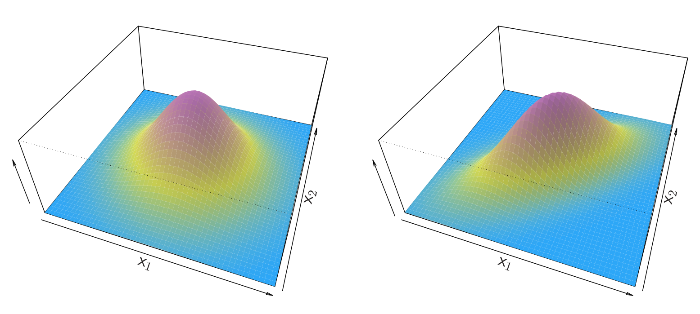{#fig-4-5 width=60%}

### Análisis de Discriminante Lineal para $p > 1$

Cuando $p > 1$, $f_k(x)$ se modela como una **normal multivariante** con media $\mu_k$ y matriz de covarianza común $\Sigma$ (compartida por todas las clases):

$$f_k(x) = \frac{1}{(2\pi)^{p/2} |\Sigma|^{1/2}} \exp\left(-\frac{1}{2} (x - \mu_k)^T \Sigma^{-1} (x - \mu_k)\right)$$

La función discriminante lineal es:

$$\delta_k(x) = x^T \Sigma^{-1} \mu_k - \frac{1}{2} \mu_k^T \Sigma^{-1} \mu_k + \log \pi_k$$

La frontera de decisión entre dos clases $k$ y $\ell$ es el conjunto de puntos donde $\delta_k(x) = \delta_\ell(x)$, que es un **hiperplano** en el espacio de predictores.

La @fig-4-6 muestra el LDA multivariante aplicado a los datos *Default* usando saldo e ingresos, con la frontera de decisión lineal que separa a los clientes que incumplen de los que no.

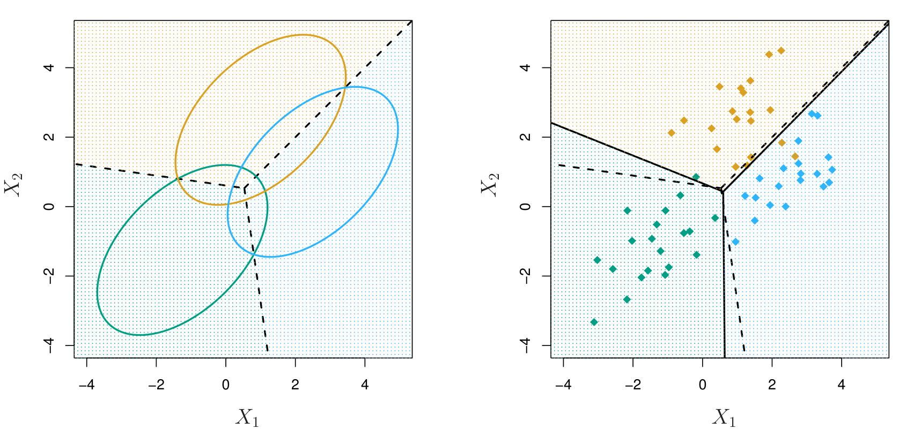{#fig-4-6 width=60%}

La @fig-4-4 compara la frontera de decisión del LDA (lineal) con la de QDA (cuadrática) en datos simulados, ilustrando cuándo cada una es más apropiada.

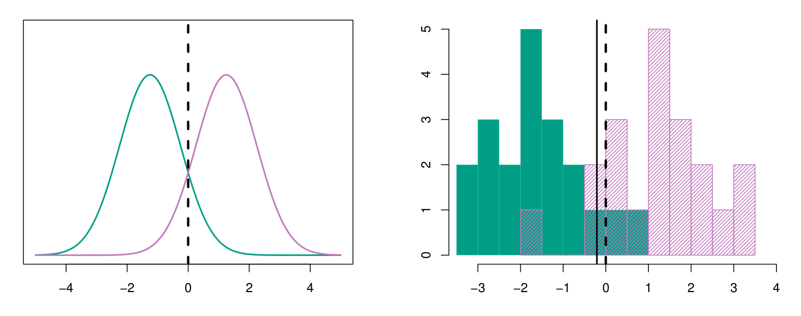{#fig-4-4 width=60%}

#### Tasa de Error de Clasificación (Matriz de Confusión)

Para evaluar el rendimiento de un clasificador, construimos una **matriz de confusión** que tabula las clasificaciones correctas e incorrectas. La @fig-4-3 muestra una matriz de confusión típica para un problema de clasificación binaria.

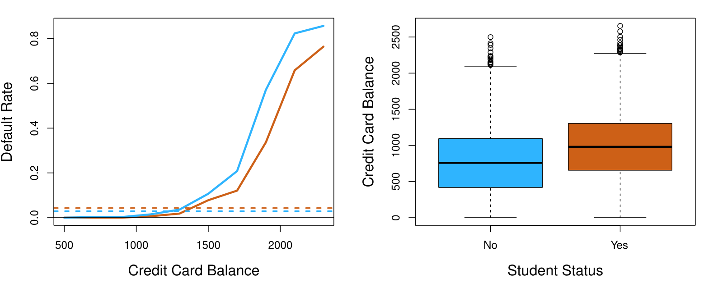{#fig-4-3 width=45%}

A partir de la matriz de confusión, derivamos métricas como:

- **Tasa de error** = (FP + FN) / total
- **Exactitud** = (VP + VN) / total = 1 - tasa de error
- **Tasa de verdaderos positivos** (sensibilidad) = VP / (VP + FN)
- **Tasa de falsos positivos** = FP / (FP + VN)
- **Precisión positiva** (precision) = VP / (VP + FP)

### Análisis de Discriminante Cuadrático (QDA)

El QDA relaja el supuesto de covarianza común. Cada clase tiene su propia matriz de covarianza $\Sigma_k$:

$$f_k(x) = \frac{1}{(2\pi)^{p/2} |\Sigma_k|^{1/2}} \exp\left(-\frac{1}{2} (x - \mu_k)^T \Sigma_k^{-1} (x - \mu_k)\right)$$

La función discriminante se vuelve **cuadrática** en $x$:

$$\delta_k(x) = -\frac{1}{2} (x - \mu_k)^T \Sigma_k^{-1} (x - \mu_k) - \frac{1}{2} \log |\Sigma_k| + \log \pi_k$$

QDA es más flexible que LDA, pero requiere estimar más parámetros (cada $\Sigma_k$ tiene $p(p+1)/2$ parámetros), por lo que necesita más datos.

La @fig-4-7 muestra la aplicación de QDA a datos simulados donde las clases tienen diferentes estructuras de covarianza, destacando la frontera de decisión curva.

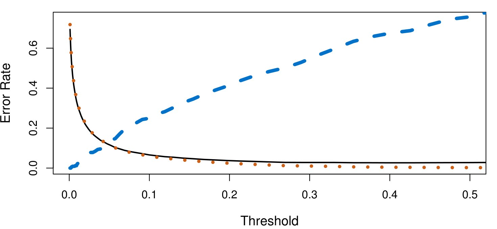{#fig-4-7 width=60%}

La @fig-4-13 y @fig-4-14 proporcionan una comparación visual más detallada de LDA y QDA en datos simulados adicionales, mostrando cómo la elección entre ambos depende de la estructura de covarianza de los datos.

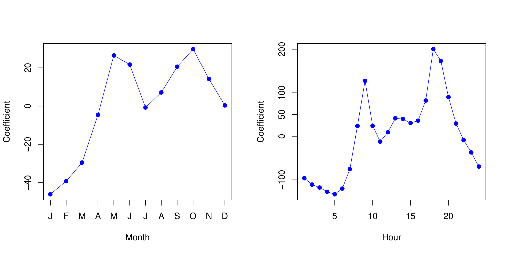{#fig-4-13 width=60%}

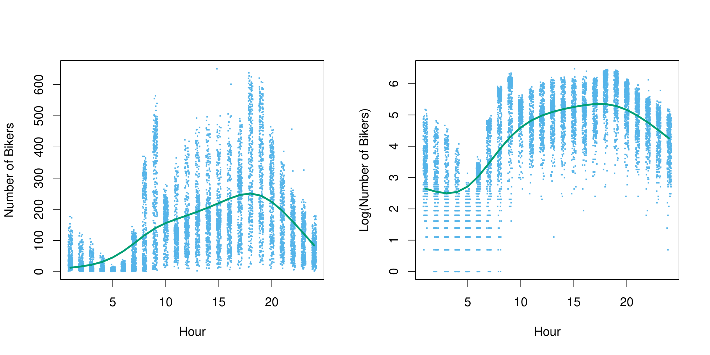{#fig-4-14 width=60%}

### Naive Bayes

**Naive Bayes** es un enfoque generativo alternativo que asume que los predictores son **condicionalmente independientes** dada la clase:

$$f_k(x) = f_{k1}(x_1) \times f_{k2}(x_2) \times \cdots \times f_{kp}(x_p)$$

Cada $f_{kj}$ se estima por separado (por ejemplo, como normal univariada o mediante estimación de densidad no paramétrica). Este supuesto simplifica enormemente la estimación, aunque es poco realista en la práctica.

Sorprendentemente, Naive Bayes puede funcionar muy bien incluso cuando la independencia condicional no se cumple, y es especialmente útil cuando $p$ es grande.

## Comparación de Métodos de Clasificación

La @fig-4-8 y @fig-4-9 comparan el rendimiento de varios clasificadores en diferentes escenarios, mostrando la tasa de error de prueba en función de la flexibilidad del modelo.

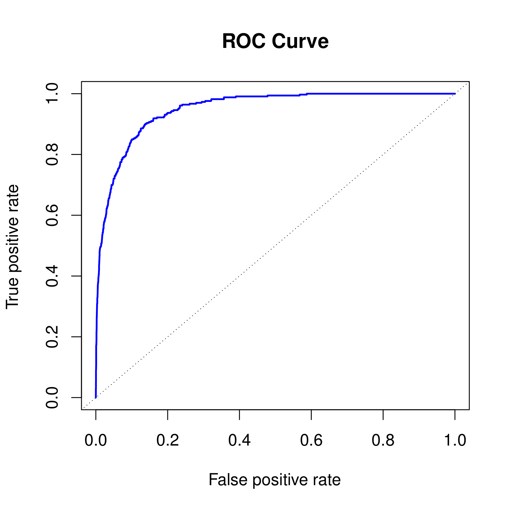{#fig-4-8 width=60%}

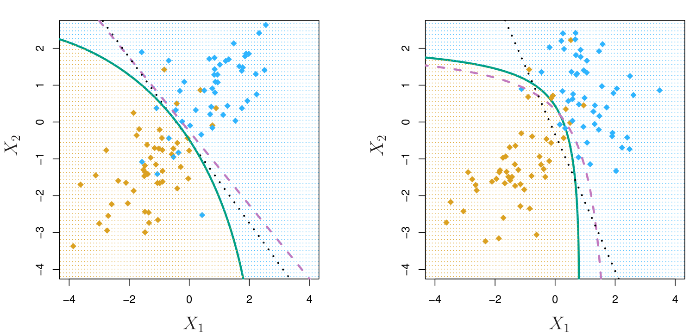{#fig-4-9 width=60%}

### Curvas ROC

La **curva ROC** (Receiver Operating Characteristic) es una herramienta para visualizar el rendimiento de un clasificador binario variando el umbral de decisión. Representa la tasa de verdaderos positivos (sensibilidad) frente a la tasa de falsos positivos (1 -- especificidad) para todos los umbrales posibles.

La @fig-4-10a y @fig-4-10b muestran curvas ROC para la regresión logística en los datos *Default* (entrenamiento y prueba).

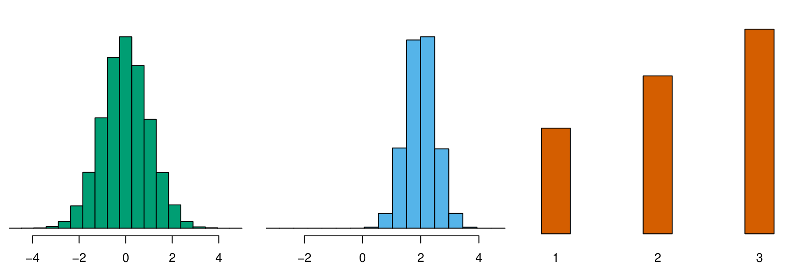{#fig-4-10a width=40%}

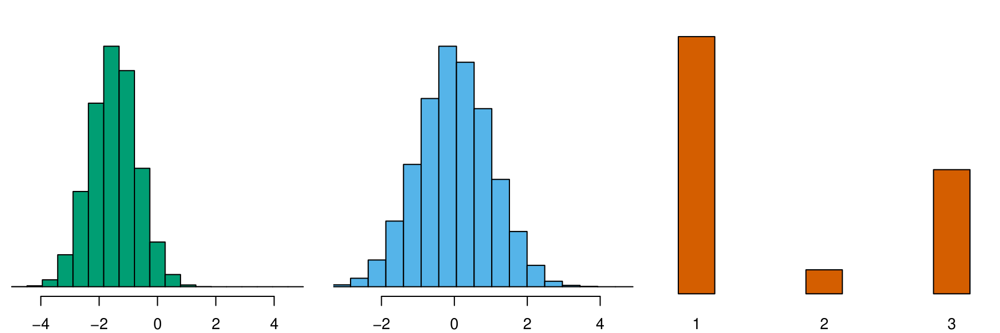{#fig-4-10b width=40%}

El **AUC** (área bajo la curva ROC) es una métrica resumen: un AUC de 1 indica un clasificador perfecto, mientras que 0.5 indica un clasificador aleatorio. En la práctica, valores superiores a 0.8 se consideran buenos.

La @fig-4-11 compara KNN y regresión logística en datos simulados, mostrando que KNN puede superar a la regresión logística cuando la frontera de decisión verdadera es no lineal, pero requiere más datos y una buena elección de $K$.

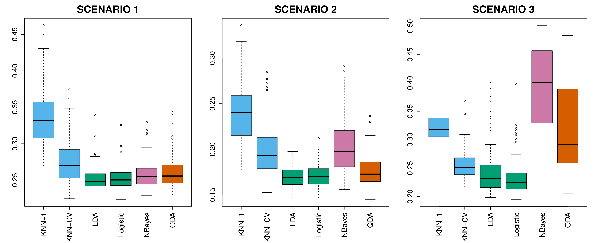{#fig-4-11 width=60%}

La @fig-4-15 compara las curvas ROC de diferentes clasificadores en un mismo conjunto de datos.

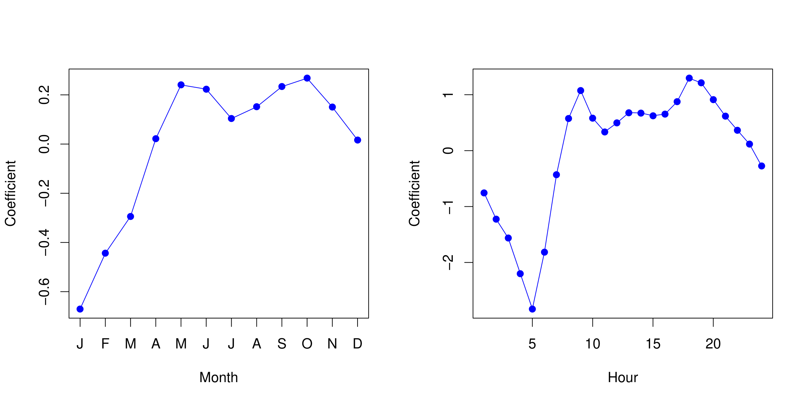{#fig-4-15 width=60%}

---

## Laboratorio

Los laboratorios con el código completo de este capítulo están disponibles en el sitio oficial del libro: [statlearning.com](https://www.statlearning.com){target="_blank"}. También puedes acceder a los notebooks en el repositorio oficial de ISLP: [ISLP en GitHub](https://github.com/intro-stat-learning/ISLP_labs){target="_blank"}.
