## Resumen

Los métodos de remuestreo (resampling) implican tomar muestras repetidas del conjunto de datos de entrenamiento. En este capítulo estudiamos dos métodos fundamentales: **validación cruzada** y **bootstrap**. La validación cruzada se utiliza para estimar el error de prueba de un modelo, mientras que bootstrap se usa para estimar la variabilidad de una estimación estadística. Ambos son herramientas esenciales en el aprendizaje estadístico moderno.

## Validación Cruzada

### El Enfoque del Conjunto de Validación

La forma más simple de estimar el error de prueba es dividir los datos en dos conjuntos: **entrenamiento** y **validación** (o prueba). Se ajusta el modelo en el conjunto de entrenamiento y se evalúa en el de validación.

La @fig-5-1 ilustra este enfoque usando los datos *Auto*. Se ajustaron modelos polinomiales de grado 1 a 10 y se calculó el error cuadrático medio en el conjunto de validación. El panel izquierdo muestra el ajuste lineal y el derecho uno de mayor grado.

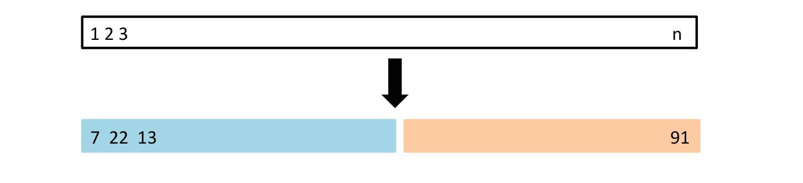{#fig-5-1 width=60%}

La tasa de error de prueba estimada depende en gran medida de qué observaciones se incluyen en el conjunto de entrenamiento y cuáles en el de validación. Diferentes divisiones pueden producir resultados muy distintos, lo que hace que este enfoque sea muy variable.

### Validación Cruzada Dejando Uno Fuera (LOOCV)

La **validación cruzada dejando uno fuera** (Leave-One-Out Cross-Validation, LOOCV) aborda el problema de la variabilidad del enfoque anterior. En LOOCV:

1. Se divide el conjunto de datos en $n$ partes, cada una con una sola observación.
2. Para cada observación $i$, se ajusta el modelo usando todas las observaciones excepto la $i$, y se predice la observación $i$.
3. El error de prueba estimado es el promedio de los $n$ errores:

$$CV_{(n)} = \frac{1}{n} \sum_{i=1}^{n} \text{MSE}_i$$

LOOCV tiene la ventaja de ser aproximadamente insesgado, pero puede ser computacionalmente costoso porque requiere ajustar el modelo $n$ veces. Afortunadamente, para la regresión lineal por mínimos cuadrados, existe una fórmula cerrada:

$$\text{MSE}_i = \left(\frac{y_i - \hat{y}_i}{1 - h_i}\right)^2$$

donde $h_i$ es el apalancamiento de la observación $i$.

La @fig-5-2 muestra los resultados de LOOCV aplicado a los datos Auto para polinomios de grado 1 a 10.

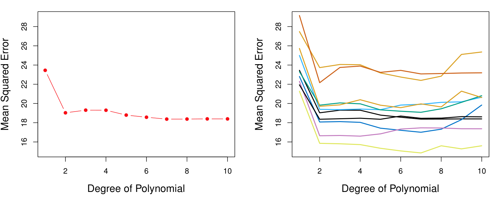{#fig-5-2 width=60%}

### Validación Cruzada de $k$ Pliegues (k-Fold CV)

La **validación cruzada de $k$ pliegues** (k-fold CV) es un compromiso entre el enfoque del conjunto de validación y LOOCV:

1. Se dividen los datos en $k$ grupos (folds) de aproximadamente igual tamaño.
2. Para cada grupo $j$, se ajusta el modelo usando todos los datos excepto el grupo $j$, y se evalúa en el grupo $j$.
3. El error de prueba estimado es:

$$CV_{(k)} = \frac{1}{k} \sum_{j=1}^{k} \text{MSE}_j$$

Los valores típicos de $k$ son 5 o 10. La @fig-5-3 ilustra el esquema de k-fold CV.

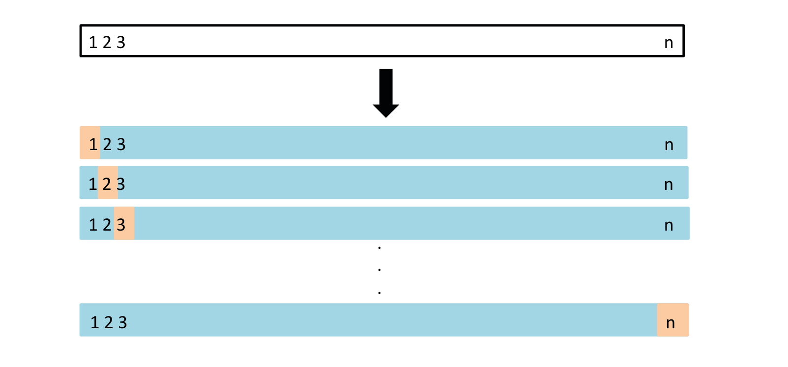{#fig-5-3 width=60%}

La @fig-5-7, @fig-5-8 y @fig-5-9 comparan el rendimiento de LOOCV, validación cruzada de 10 iteraciones y el enfoque del conjunto de validación en los datos Auto.

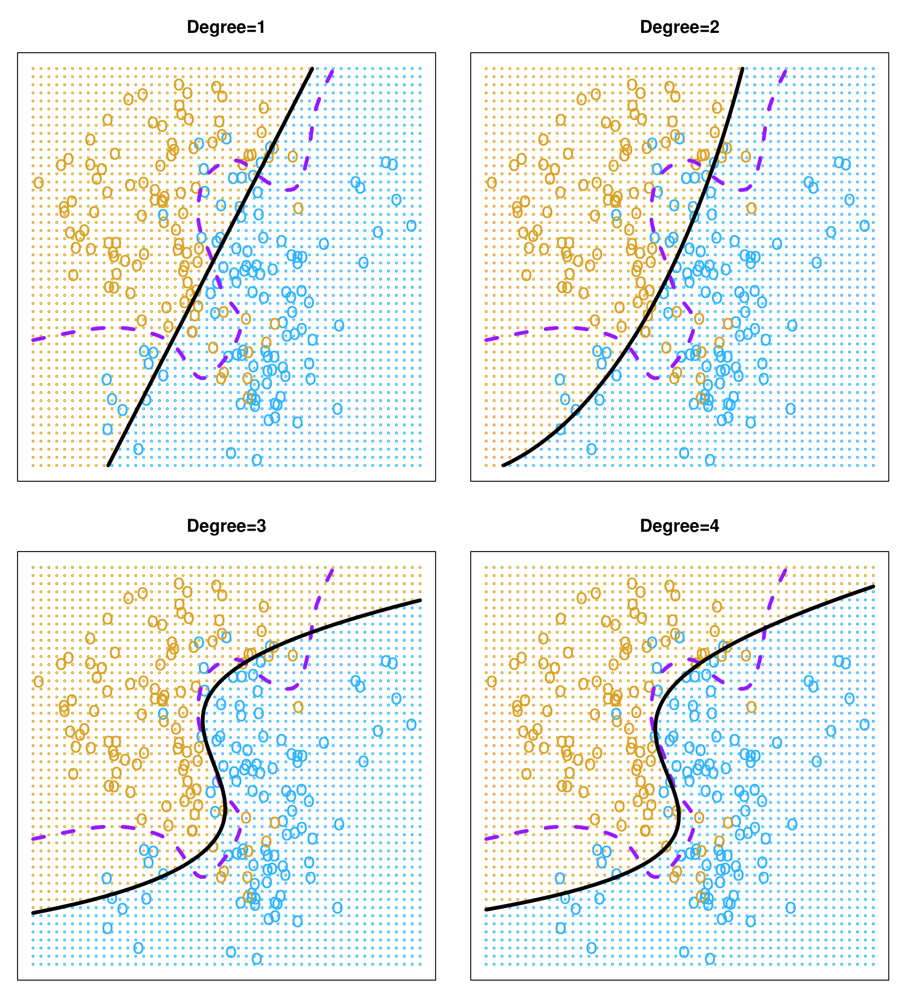{#fig-5-7 width=60%}

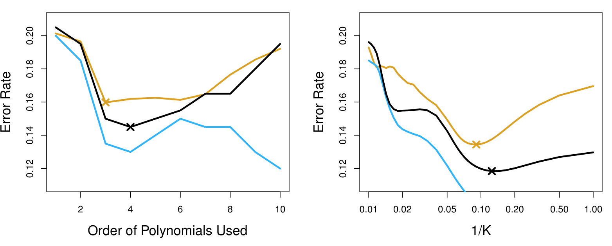{#fig-5-8 width=60%}

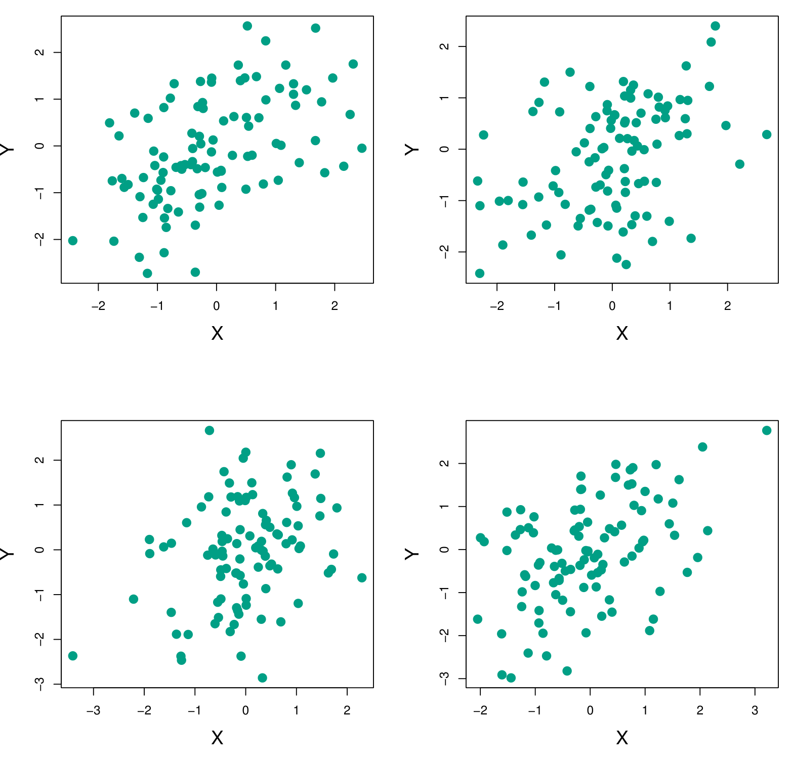{#fig-5-9 width=60%}

#### Compromiso Sesgo-Varianza para k-Fold CV

LOOCV produce estimaciones aproximadamente insesgadas del error de prueba, pero tiene alta varianza. Por otro lado, k-fold CV con $k$ pequeño (como 5 o 10) tiene menor varianza pero mayor sesgo. En la práctica, $k = 5$ o $k = 10$ ofrecen un buen equilibrio entre sesgo y varianza.

### Validación Cruzada en Problemas de Clasificación

La validación cruzada se aplica de manera similar en problemas de clasificación, usando la **tasa de error de clasificación** en lugar del MSE. Para LOOCV:

$$CV_{(n)} = \frac{1}{n} \sum_{i=1}^{n} \text{Err}_i$$

donde $\text{Err}_i = I(y_i \neq \hat{y}_i)$.

La @fig-5-4 y @fig-5-11 muestran la validación cruzada aplicada a problemas de clasificación.

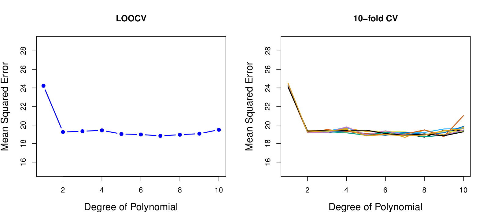{#fig-5-4 width=60%}

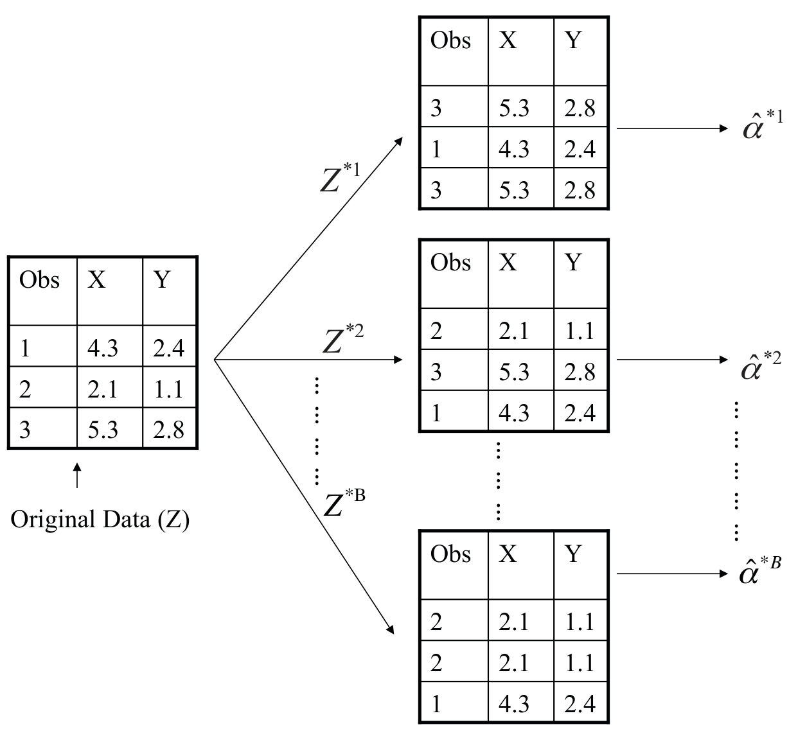{#fig-5-11 width=60%}

## El Bootstrap

El **bootstrap** es un método iterativo que permite estimar la variabilidad de una estimación estadística sin recurrir a supuestos distribucionales. Se basa en el concepto de **muestreo con reemplazo** de los datos originales.

Procedimiento:
1. Seleccionar $B$ muestras bootstrap independientes, cada una de tamaño $n$, obtenidas mediante muestreo con reemplazo de los datos originales.
2. Calcular la estimación de interés $\hat{\theta}^{*b}$ en cada muestra bootstrap.
3. Estimar el error estándar de $\hat{\theta}$ como la desviación estándar de las $B$ estimaciones bootstrap:

$$\text{SE}_B(\hat{\theta}) = \sqrt{\frac{1}{B-1} \sum_{b=1}^{B} \left(\hat{\theta}^{*b} - \bar{\hat{\theta}}^{*}\right)^2}$$

La @fig-5-5 ilustra el concepto de bootstrap aplicado a los datos *Portfolio* (cartera de inversiones), donde se estima la asignación óptima de activos para minimizar la varianza.

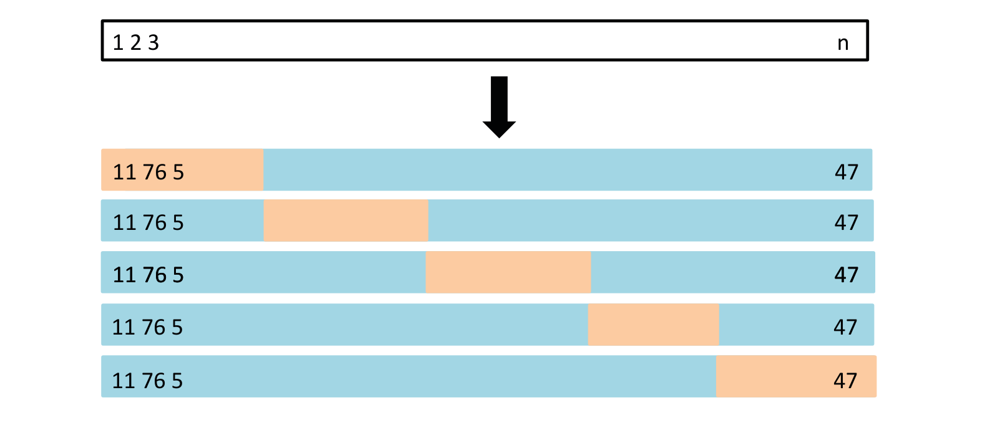{#fig-5-5 width=60%}

La @fig-5-6 y @fig-5-10 muestran los resultados del bootstrap para diferentes estadísticos y tamaños de muestra.

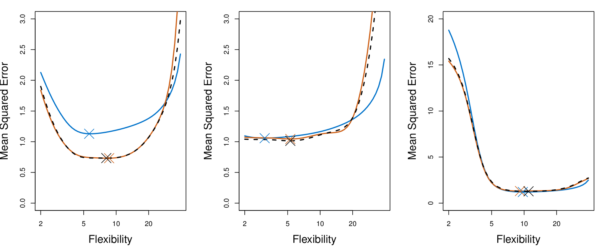{#fig-5-6 width=60%}

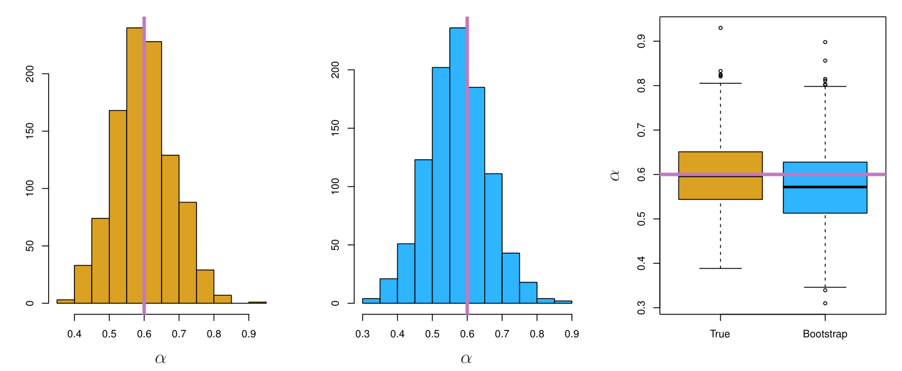{#fig-5-10 width=60%}

---

## Laboratorio

Los laboratorios con el código completo de este capítulo están disponibles en el sitio oficial del libro: [statlearning.com](https://www.statlearning.com){target="_blank"}. También puedes acceder a los notebooks en el repositorio oficial de ISLP: [ISLP en GitHub](https://github.com/intro-stat-learning/ISLP_labs){target="_blank"}.
