## Resumen

En este capítulo exploramos métodos para mejorar la regresión lineal. La regresión por mínimos cuadrados a menudo funciona bien, pero no siempre. Existen alternativas que pueden mejorar la precisión de predicción y la interpretabilidad. Estudiamos tres clases de métodos: **selección de subconjuntos**, **regularización** (ridge y lasso) y **reducción de dimensionalidad** (PCR y PLS). También discutimos los desafíos de trabajar con datos de alta dimensión.

## Selección de Subconjuntos

### Selección del Mejor Subconjunto

La **selección del mejor subconjunto** (best subset selection) consiste en ajustar modelos de regresión con todos los $2^p$ subconjuntos posibles de $p$ predictores y seleccionar el mejor según algún criterio. La @fig-6-1 muestra la RSS para todos los modelos posibles en el conjunto de datos *Credit*, ordenados por tamaño.

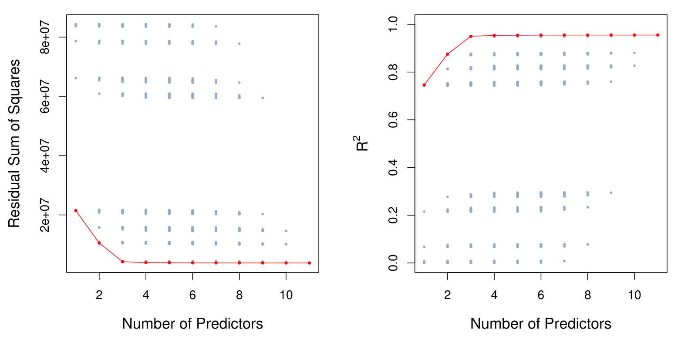{#fig-6-1 width=60%}

La @fig-6-2 muestra los coeficientes estimados para los mejores modelos de cada tamaño, ilustrando qué predictores son seleccionados en cada caso.

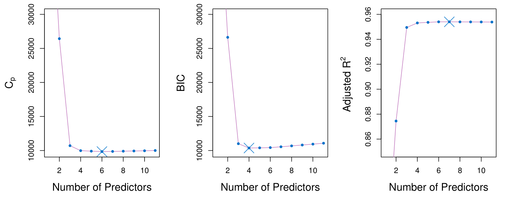{#fig-6-2 width=60%}

### Selección Paso a Paso

La selección del mejor subconjunto es computacionalmente inviable para $p$ grande. Alternativas más eficientes son:

- **Selección hacia adelante** (forward selection): comienza sin predictores y los agrega de a uno.
- **Selección hacia atrás** (backward selection): comienza con todos los predictores y los elimina de a uno.
- **Selección paso a paso mixta** (mixed selection): combina ambas estrategias.

### Elección del Modelo Óptimo

Para seleccionar entre modelos de diferentes tamaños, usamos criterios como:

- **$C_p$** (Mallows): estima el error de prueba.
- **AIC** (Akaike Information Criterion): similar a $C_p$.
- **BIC** (Bayesian Information Criterion): penaliza más la complejidad.
- **$R^2$ ajustado**: versión penalizada del $R^2$.
- **Validación cruzada**: estimación directa del error de prueba.

La @fig-6-3 compara $C_p$, BIC y $R^2$ ajustado para la selección de subconjuntos en los datos Credit.

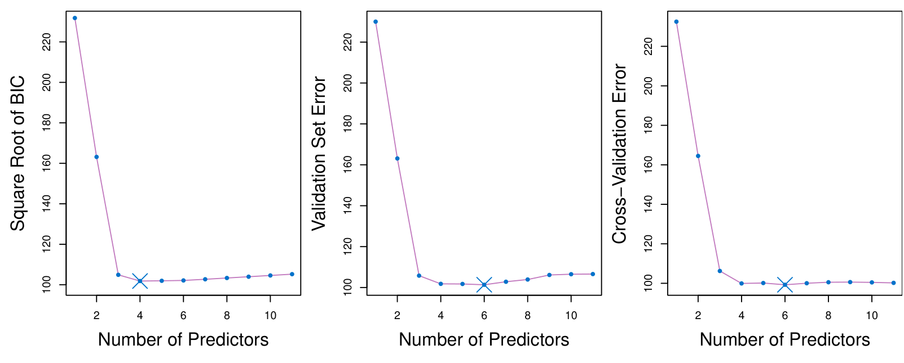{#fig-6-3 width=60%}

La @fig-6-4 compara la selección hacia adelante, hacia atrás y el mejor subconjunto.

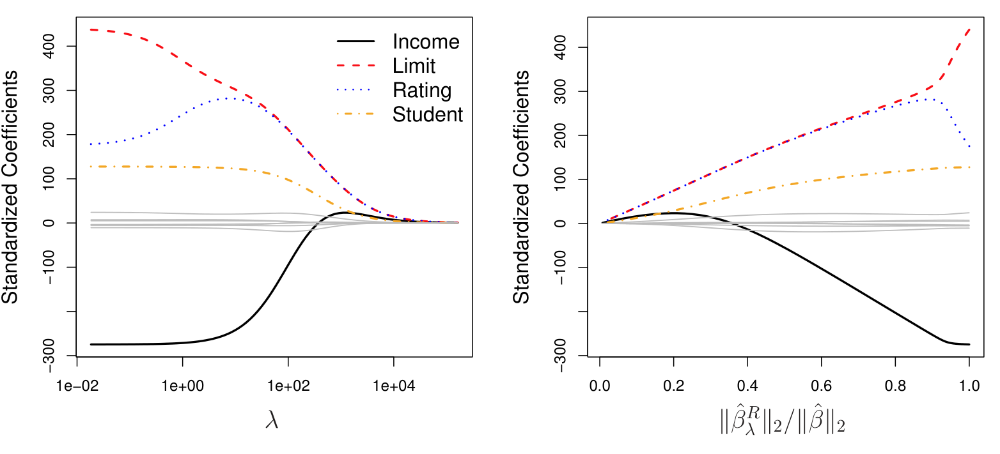{#fig-6-4 width=60%}

## Métodos de Regularización (Shrinkage)

La regularización consiste en restringir los coeficientes de regresión para reducir la varianza a costa de un pequeño sesgo.

### Regresión Ridge

La regresión **ridge** minimiza una RSS penalizada:

$$\sum_{i=1}^{n} (y_i - \beta_0 - \sum_{j=1}^{p} \beta_j x_{ij})^2 + \lambda \sum_{j=1}^{p} \beta_j^2$$

El término $\lambda \sum \beta_j^2$ es la **penalización $L_2$** (o penalización de la norma al cuadrado). Cuando $\lambda = 0$, ridge equivale a mínimos cuadrados; cuando $\lambda \to \infty$, los coeficientes tienden a cero.

La @fig-6-5 muestra los coeficientes de la regresión ridge en función de $\lambda$ para los datos Credit.

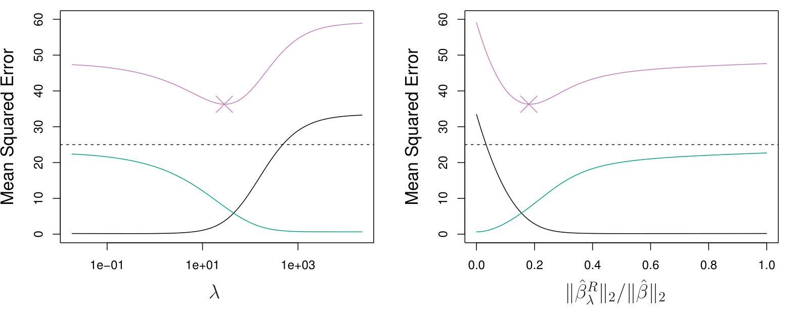{#fig-6-5 width=60%}

La elección de $\lambda$ es crítica. La @fig-6-6 muestra la validación cruzada para seleccionar $\lambda$ óptimo.

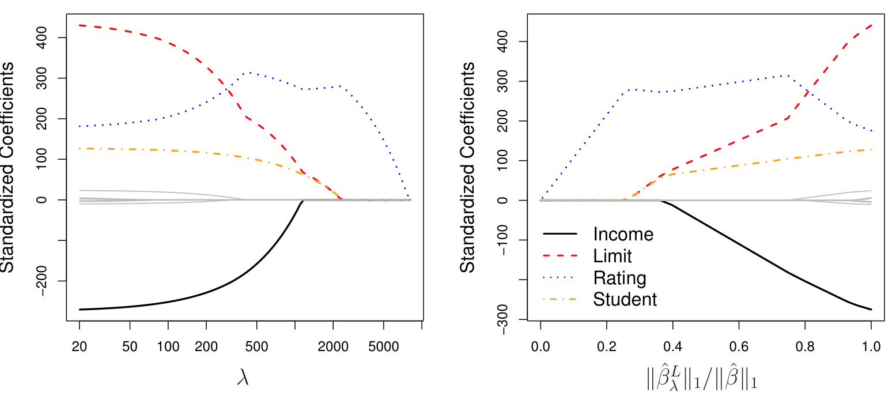{#fig-6-6 width=60%}

### El Lasso

El **lasso** (Least Absolute Shrinkage and Selection Operator) usa una penalización $L_1$:

$$\sum_{i=1}^{n} (y_i - \beta_0 - \sum_{j=1}^{p} \beta_j x_{ij})^2 + \lambda \sum_{j=1}^{p} |\beta_j|$$

A diferencia de ridge, el lasso puede llevar algunos coeficientes exactamente a cero, realizando así **selección de variables**. La @fig-6-7 muestra los coeficientes del lasso en función de $\lambda$ para los datos Credit.

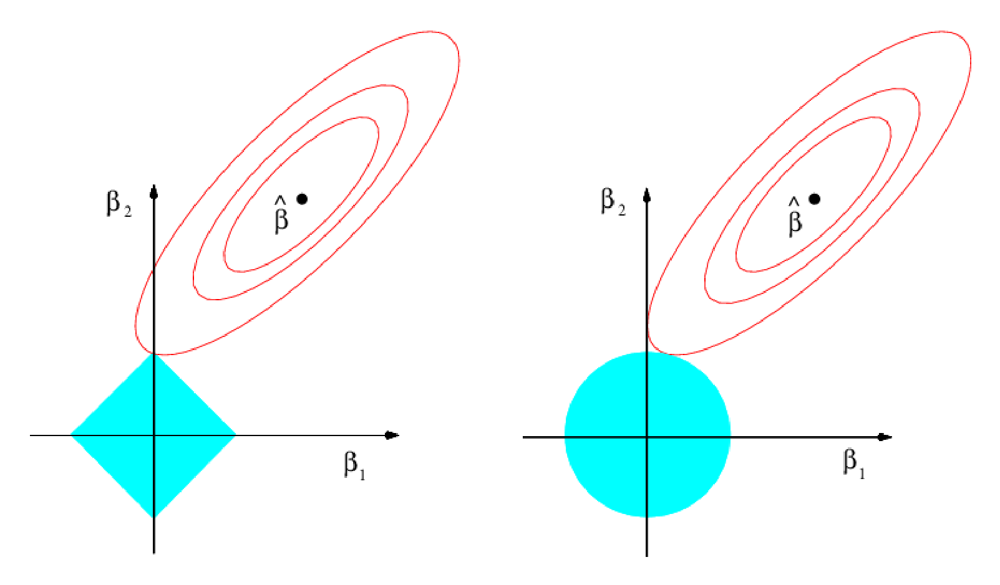{#fig-6-7 width=60%}

La @fig-6-8 muestra la validación cruzada para seleccionar $\lambda$ en el lasso.

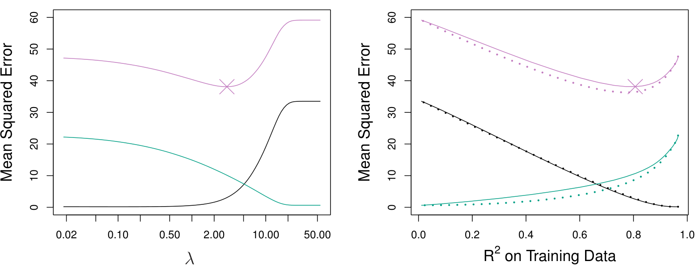{#fig-6-8 width=60%}

La @fig-6-9 compara las regiones de restricción de ridge (círculo) y lasso (diamante), ilustrando por qué el lasso produce coeficientes exactamente cero.

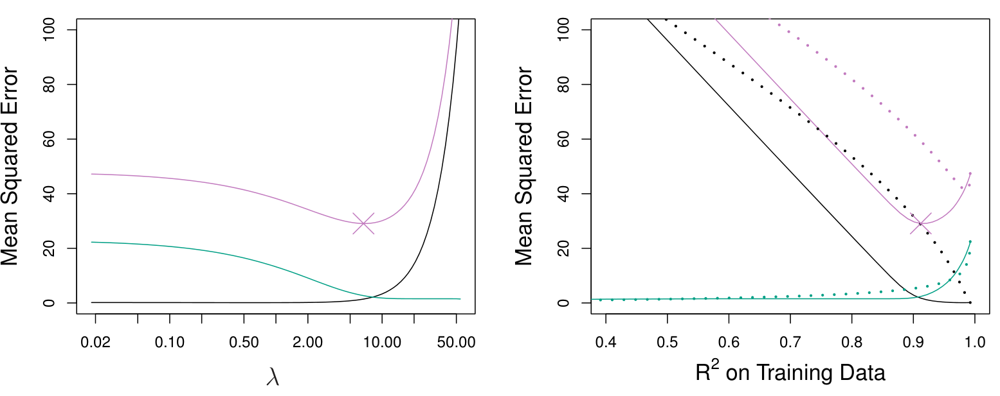{#fig-6-9 width=60%}

La @fig-6-18 y @fig-6-19 comparan el rendimiento de ridge y lasso en diferentes escenarios simulados, mostrando el ECM de prueba.

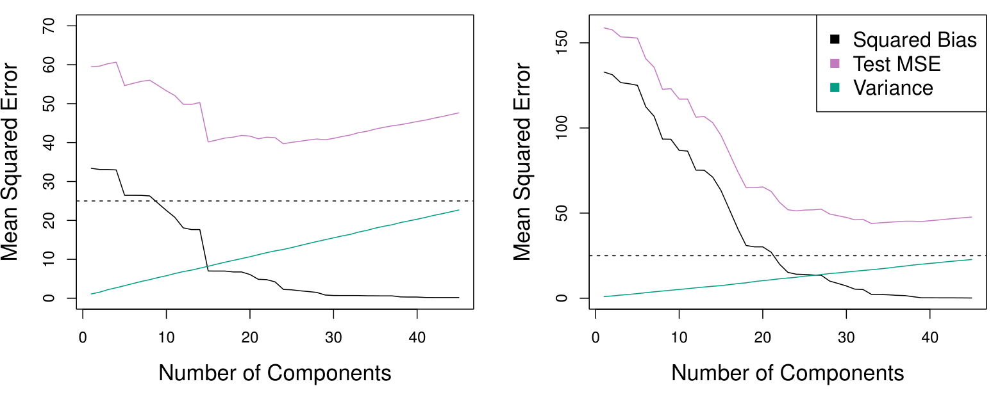{#fig-6-18 width=60%}

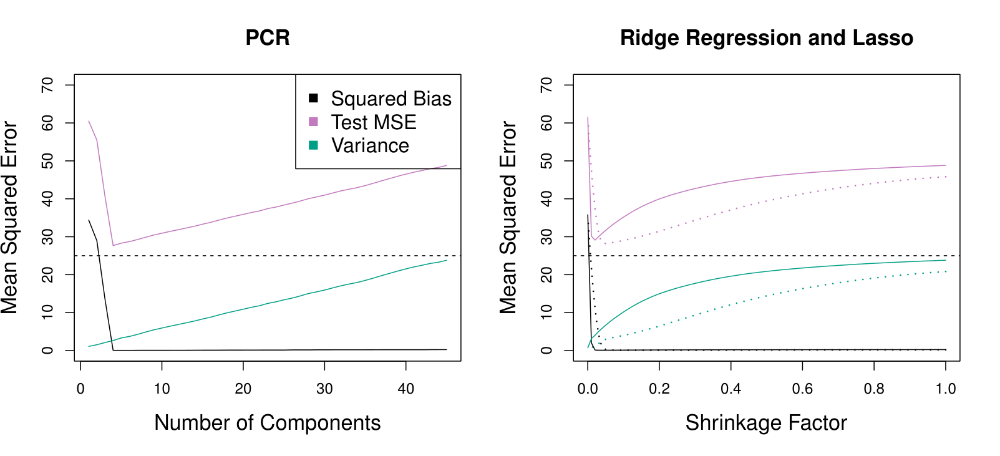{#fig-6-19 width=60%}

#### Selección del Parámetro de Ajuste

El parámetro $\lambda$ se selecciona típicamente mediante validación cruzada. También se puede usar el criterio de información de Akaike (AIC) o BIC para el lasso.

## Métodos de Reducción de Dimensionalidad

Los métodos de reducción de dimensionalidad transforman los $p$ predictores originales en $M < p$ combinaciones lineales, y luego usan estas $M$ variables en la regresión.

### Regresión por Componentes Principales (PCR)

La **regresión por componentes principales** (Principal Components Regression, PCR) usa los primeros $M$ componentes principales como predictores. Las componentes principales son combinaciones lineales de los predictores originales que capturan la máxima varianza en $X$.

La @fig-6-10 muestra los coeficientes de PCR en función del número de componentes.

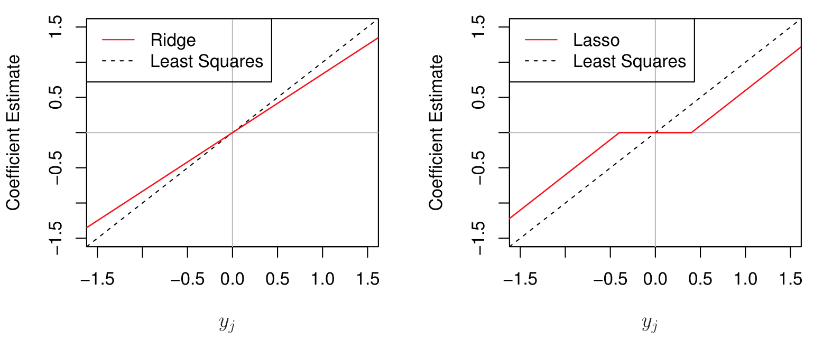{#fig-6-10 width=60%}

La @fig-6-11 muestra el error de validación cruzada para PCR en los datos Credit.

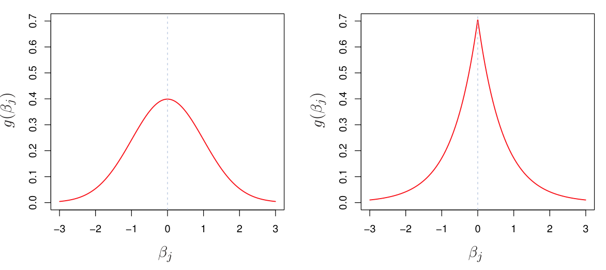{#fig-6-11 width=60%}

### Mínimos Cuadrados Parciales (PLS)

Los **mínimos cuadrados parciales** (Partial Least Squares, PLS) es una alternativa a PCR que también construye combinaciones lineales de los predictores, pero usando también la respuesta $Y$ para guiar la construcción de las componentes.

La @fig-6-12 compara PCR y PLS en datos simulados.

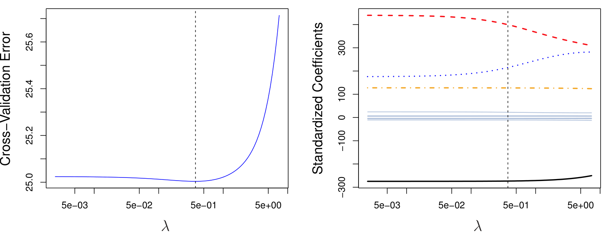{#fig-6-12 width=60%}

## Consideraciones en Altas Dimensiones

Los métodos de este capítulo son particularmente útiles cuando $p$ es grande o cuando $p > n$ (más predictores que observaciones).

### Datos de Alta Dimensión

Cuando $p > n$, la regresión por mínimos cuadrados no tiene solución única. La @fig-6-13 ilustra un ejemplo de datos de alta dimensión.

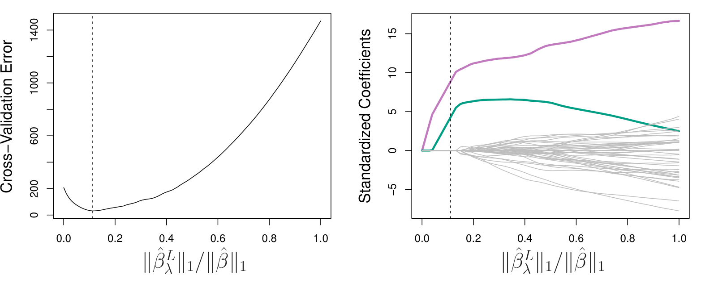{#fig-6-13 width=60%}

### ¿Qué Sale Mal en Altas Dimensiones?

En altas dimensiones, la varianza de las predicciones puede ser enorme. La @fig-6-14 y @fig-6-15 muestran los problemas que surgen.

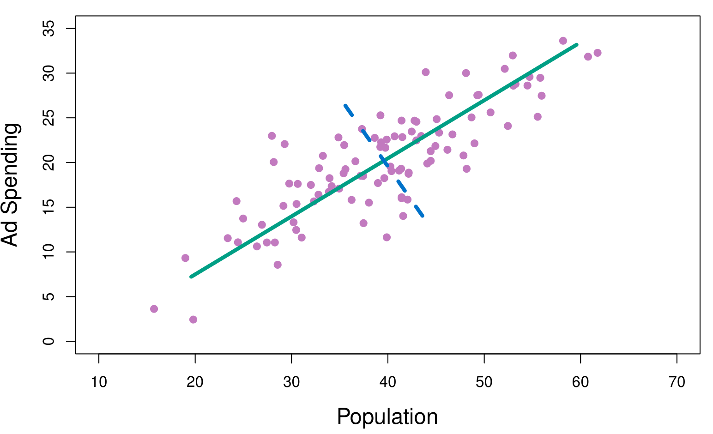{#fig-6-14 width=60%}

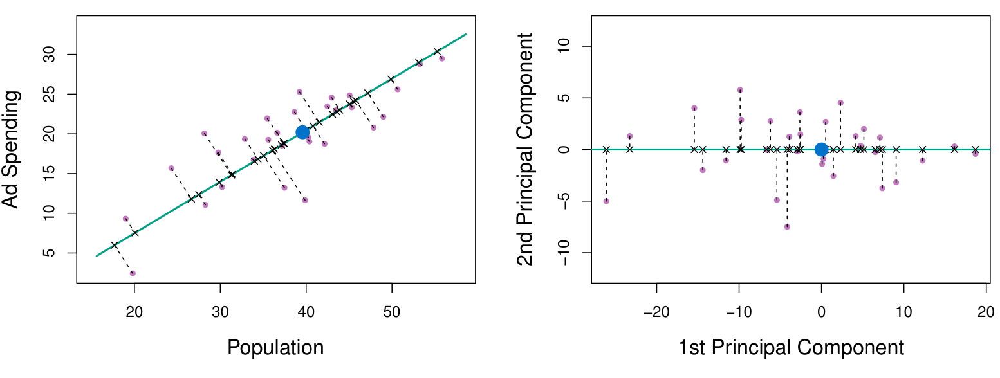{#fig-6-15 width=60%}

Las @fig-6-16 y @fig-6-17 proporcionan más comparaciones de métodos en escenarios de alta dimensión.

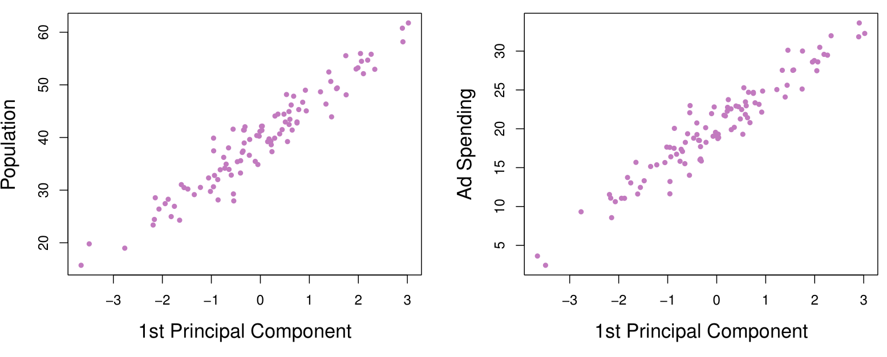{#fig-6-16 width=60%}

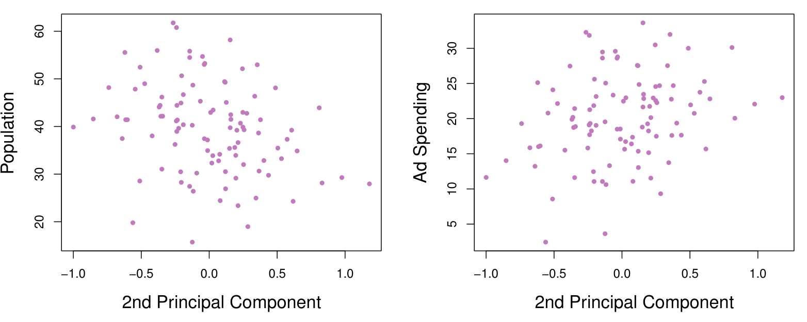{#fig-6-17 width=60%}

### El Rol de la Regularización

En altas dimensiones, la regularización (ridge, lasso) es esencial para obtener modelos estables y predictivos. La @fig-6-20, @fig-6-21 y @fig-6-22 muestran el efecto de la regularización en escenarios de alta dimensión.

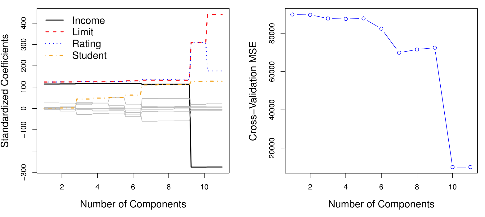{#fig-6-20 width=60%}

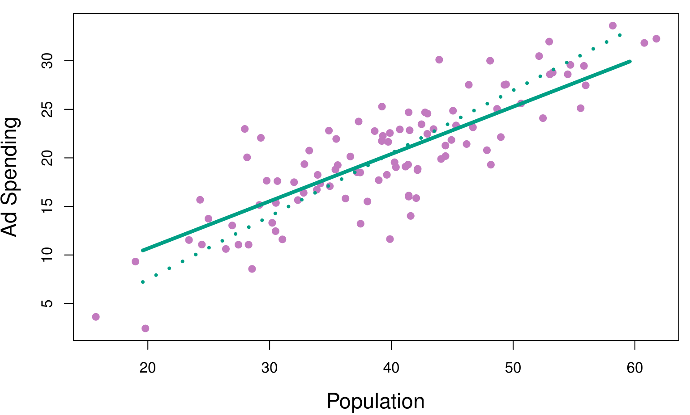{#fig-6-21 width=60%}

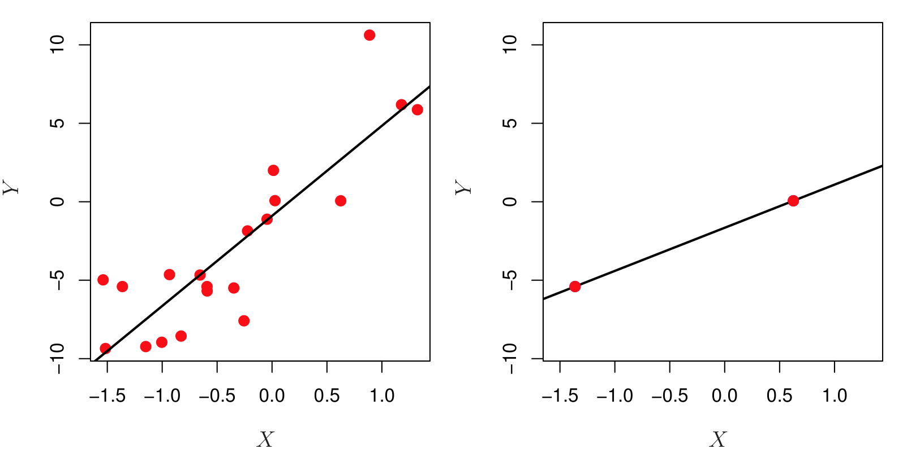{#fig-6-22 width=60%}

La @fig-6-23 y @fig-6-24 presentan más comparaciones entre métodos de regularización y reducción de dimensionalidad.

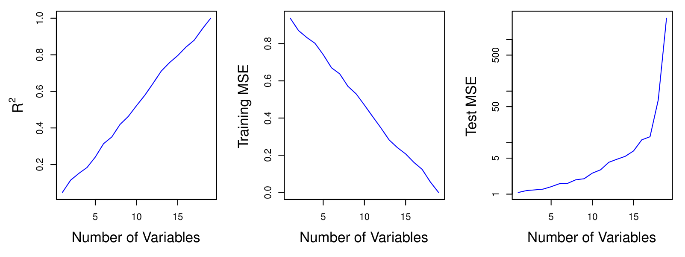{#fig-6-23 width=60%}

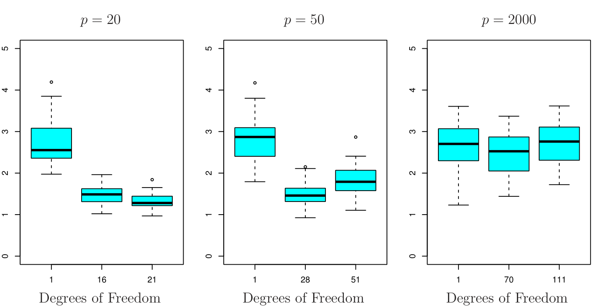{#fig-6-24 width=60%}

## Laboratorio

Los laboratorios con el código completo de este capítulo están disponibles en el sitio oficial del libro: [statlearning.com](https://www.statlearning.com){target="_blank"}. También puedes acceder a los notebooks en el repositorio oficial de ISLP: [ISLP_labs en GitHub](https://github.com/intro-stat-learning/ISLP_labs){target="_blank"}.
