## Resumen

En este capítulo relajamos el supuesto de linealidad que ha sido central en los capítulos anteriores. Presentamos métodos que extienden el modelo lineal para capturar relaciones no lineales: **regresión polinomial**, **funciones escalón**, **splines**, **splines de suavizado**, **regresión local** y **modelos aditivos generalizados** (GAMs).

## Regresión Polinomial

La **regresión polinomial** reemplaza el predictor $X$ por sus potencias:

$$y_i = \beta_0 + \beta_1 x_i + \beta_2 x_i^2 + \cdots + \beta_d x_i^d + \epsilon_i$$

La @fig-7-1 muestra ajustes polinomiales de diferentes grados para la relación entre *mpg* y *horsepower* en los datos *Auto*.

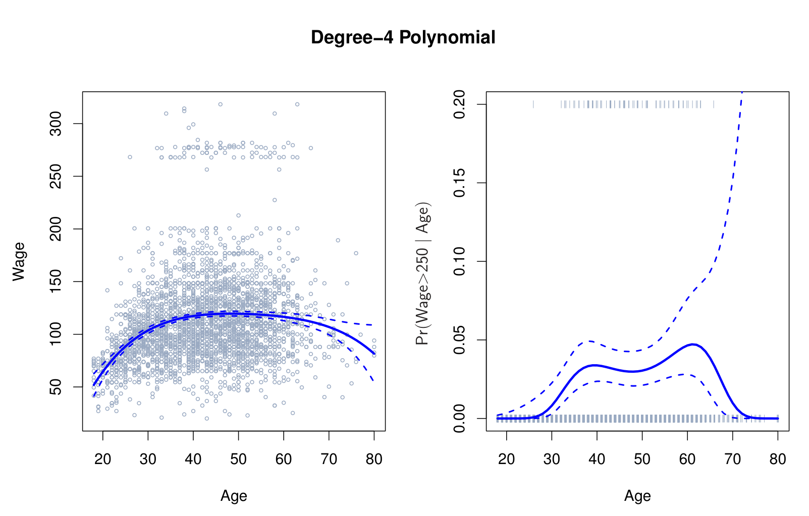{#fig-7-1 width=60%}

## Funciones Escalón

Las **funciones escalón** (step functions) dividen el rango de $X$ en intervalos y ajustan una constante en cada uno. Esto es equivalente a crear variables dummy para cada intervalo:

$$C_0(x) = I(x < c_1), \quad C_1(x) = I(c_1 \le x < c_2), \quad \ldots, \quad C_{K-1}(x) = I(c_{K-1} \le x)$$

La @fig-7-2 ilustra el ajuste de funciones escalón a los datos *Wage*, donde se aplicaron cortes en la variable *año*.

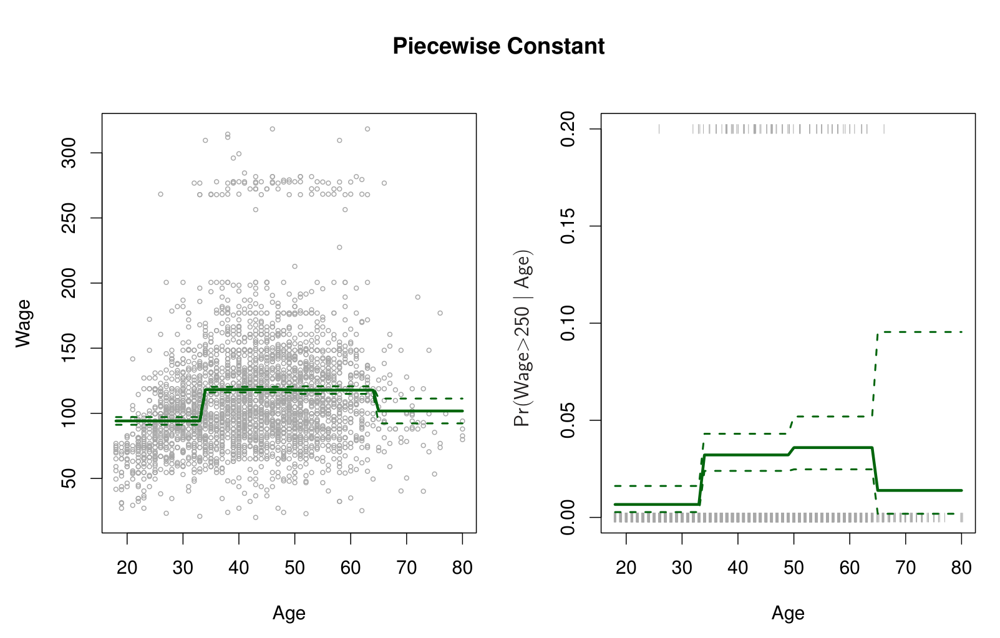{#fig-7-2 width=60%}

## Funciones Base

Tanto la regresión polinomial como las funciones escalón son casos particulares de **funciones base** (basis functions). En general, transformamos $X$ usando $K$ funciones $b_1(X), b_2(X), \ldots, b_K(X)$:

$$y_i = \beta_0 + \beta_1 b_1(x_i) + \beta_2 b_2(x_i) + \cdots + \beta_K b_K(x_i) + \epsilon_i$$

Elegir funciones base adecuadas es clave para capturar la no linealidad de forma eficiente.

## Splines de Regresión

### Polinomios por Partes

Los **polinomios por partes** (piecewise polynomials) ajustan polinomios independientes en diferentes intervalos de $X$. Sin embargo, pueden producir discontinuidades en los puntos de unión.

### Restricciones y Splines

Un **spline** es un polinomio por partes con restricciones de continuidad y suavidad en los **nodos** (knots). Un spline cúbico impone continuidad de la función, la primera y segunda derivada en cada nodo. La @fig-7-3 muestra un spline cúbico con nodos en las edades de 50 y 60 años para los datos *Wage*.

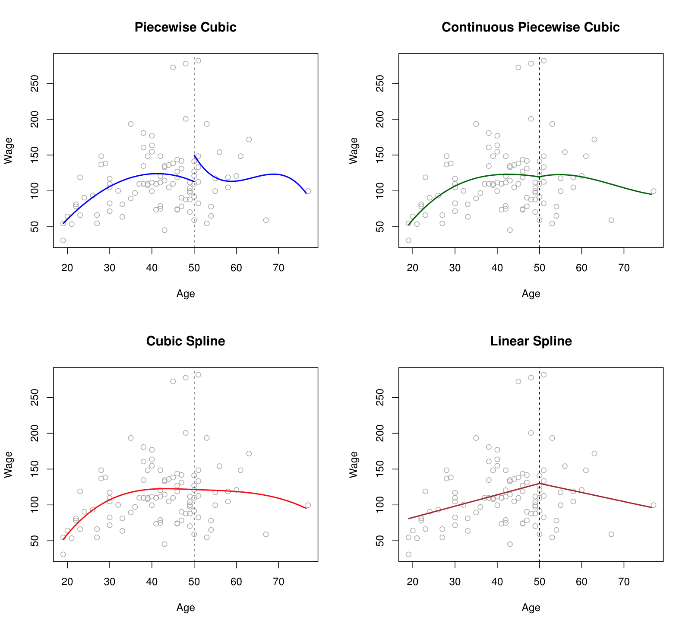{#fig-7-3 width=60%}

### Representación con Base de Splines

Los splines se representan convenientemente usando **base B-spline** o base de splines naturales. La @fig-7-4 muestra diferentes bases de splines para los datos Wage.

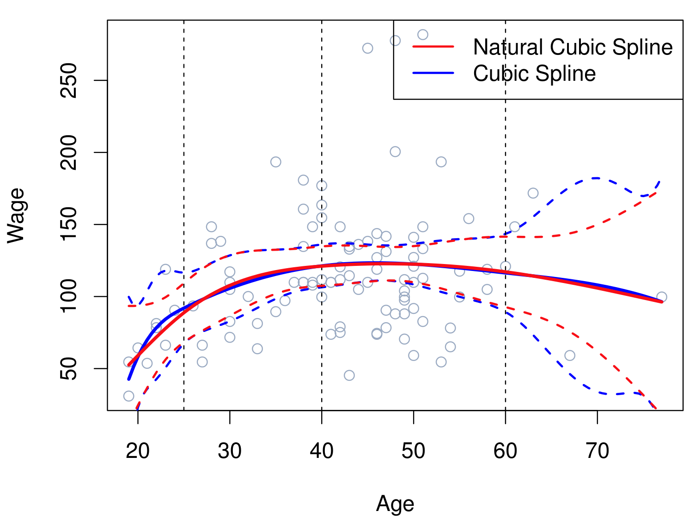{#fig-7-4 width=60%}

### Elección del Número y Ubicación de los Nodos

La ubicación de los nodos puede basarse en cuantiles de $X$. La @fig-7-5 compara splines con diferente número de grados de libertad (nodos).

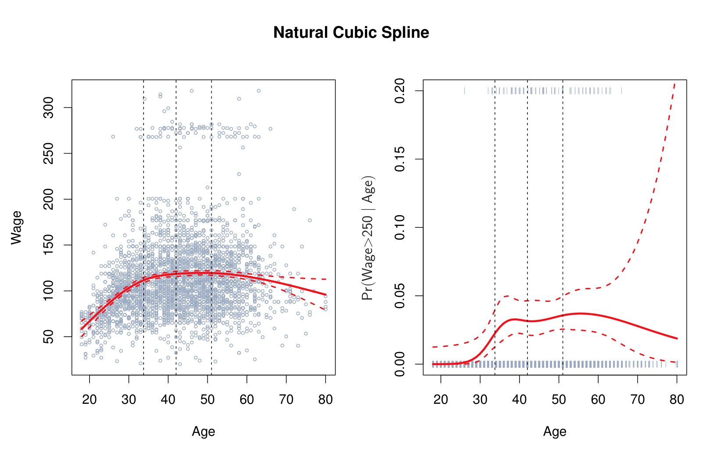{#fig-7-5 width=60%}

### Comparación con Regresión Polinomial

La @fig-7-6 compara splines cúbicos con regresión polinomial en los datos *Wage*, mostrando que los splines son más flexibles en regiones con variación y más estables en los extremos.

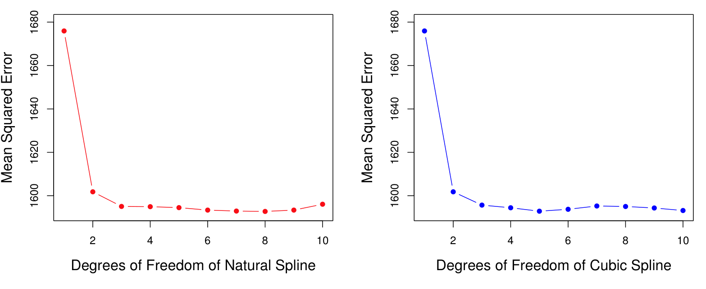{#fig-7-6 width=60%}

## Splines de Suavizado

Los **splines de suavizado** (smoothing splines) surgen de minimizar una RSS penalizada:

$$\sum_{i=1}^{n} (y_i - g(x_i))^2 + \lambda \int g''(t)^2 dt$$

El parámetro $\lambda$ controla el balance entre ajuste y suavidad. La @fig-7-7 ilustra splines de suavizado con diferentes valores de $\lambda$ para los datos *Auto*.

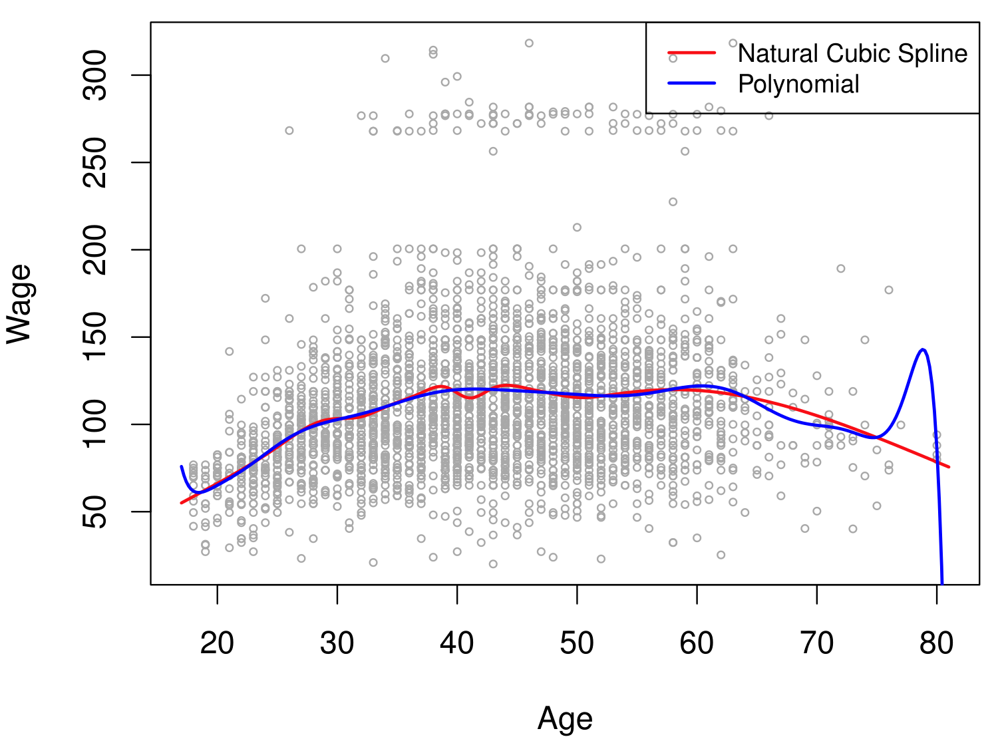{#fig-7-7 width=60%}

La @fig-7-8 compara splines de suavizado con splines de regresión, mostrando cómo ambos se relacionan.

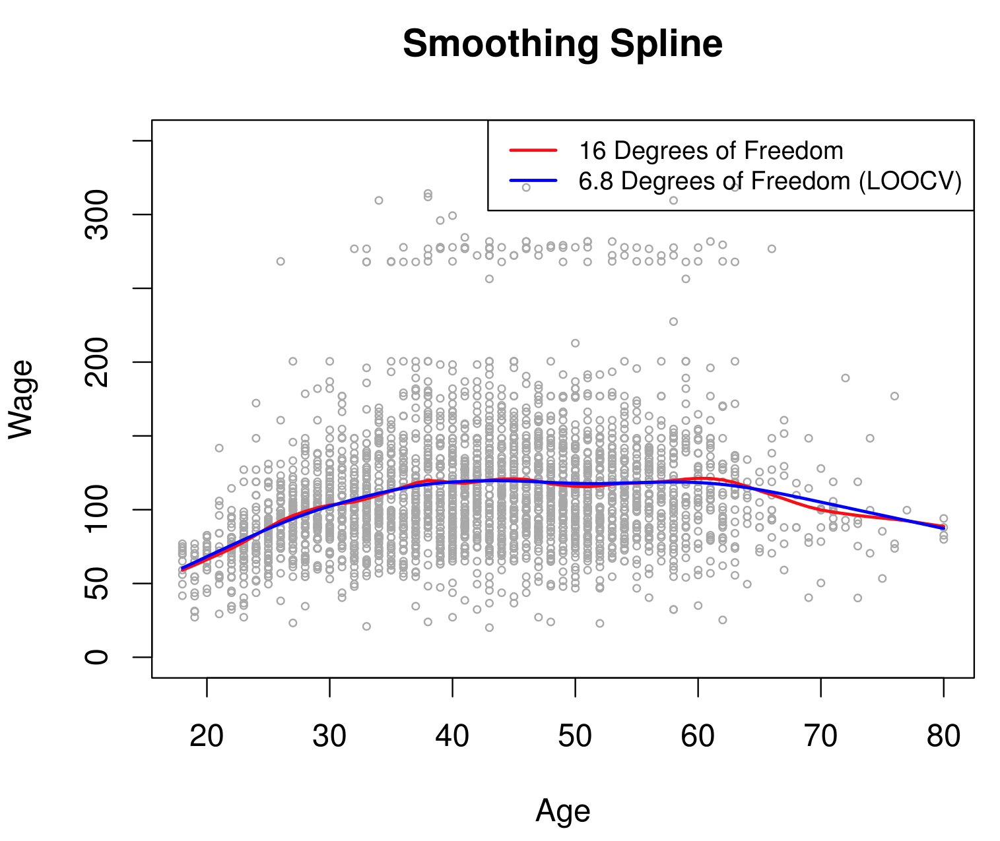{#fig-7-8 width=60%}

#### Selección del Parámetro de Suavizado

El parámetro $\lambda$ se selecciona mediante validación cruzada. La @fig-7-9 muestra el error de validación cruzada en función de los grados de libertad efectivos.

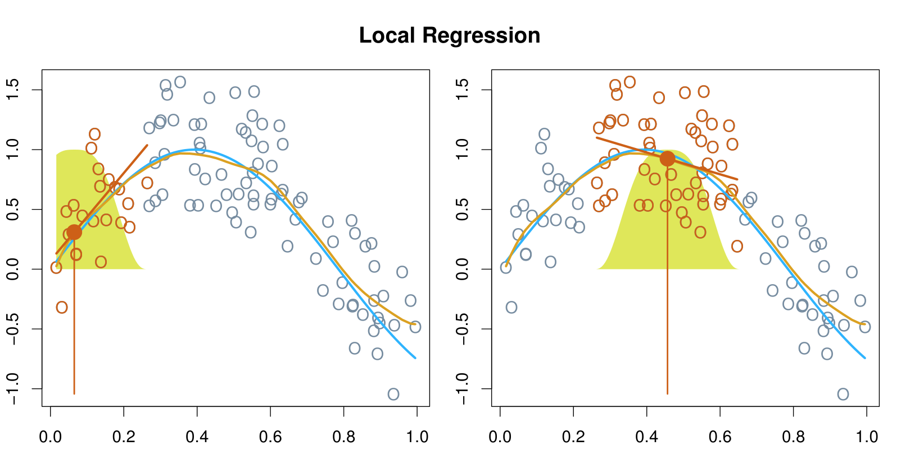{#fig-7-9 width=60%}

## Regresión Local

La **regresión local** ajusta un modelo separado en cada punto de evaluación $x_0$, usando solo las observaciones cercanas ponderadas por una función kernel. La @fig-7-10 ilustra la regresión local con diferentes anchos de ventana en los datos *Auto*.

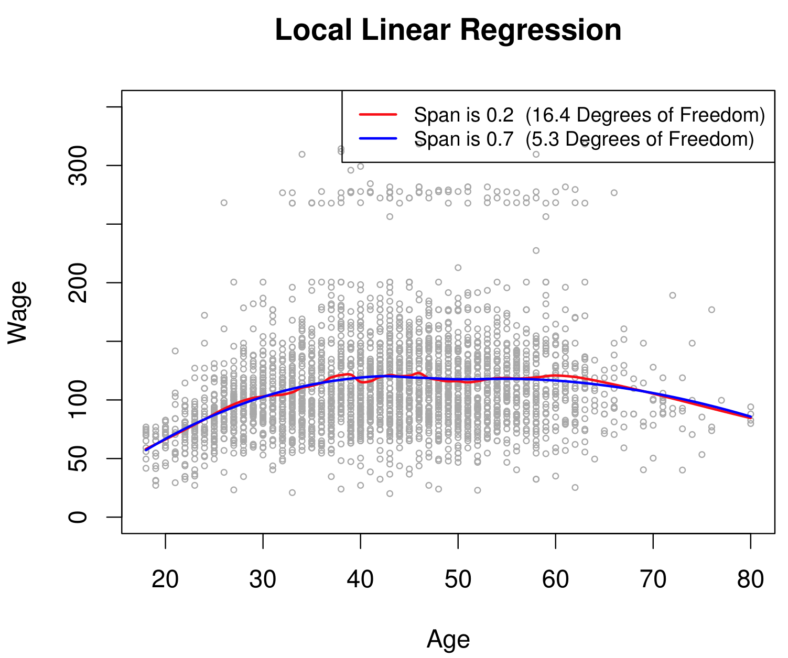{#fig-7-10 width=60%}

La @fig-7-11 muestra la regresión local en datos simulados, comparando diferentes kernels y anchos de ventana.

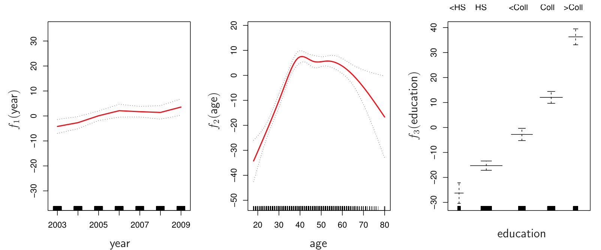{#fig-7-11 width=60%}

## Modelos Aditivos Generalizados (GAMs)

Los **modelos aditivos generalizados** (Generalized Additive Models, GAMs) extienden los modelos lineales permitiendo que cada predictor tenga una función no lineal:

$$y_i = \beta_0 + f_1(x_{i1}) + f_2(x_{i2}) + \cdots + f_p(x_{ip}) + \epsilon_i$$

Cada $f_j$ puede ser un spline, una regresión polinomial, o cualquier otra función suave. La aditividad del modelo mantiene la interpretabilidad.

### GAMs para Regresión

La @fig-7-12 muestra un GAM ajustado a los datos *Wage* con splines de suavizado para *año* y *edad*, y términos lineales para otras variables.

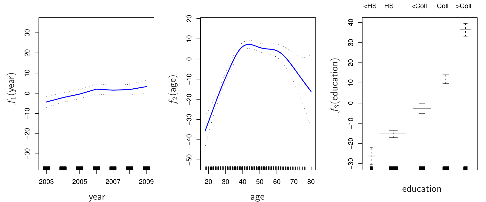{#fig-7-12 width=60%}

La @fig-7-13 extiende el GAM con términos de interacción y términos cualitativos para los datos Wage.

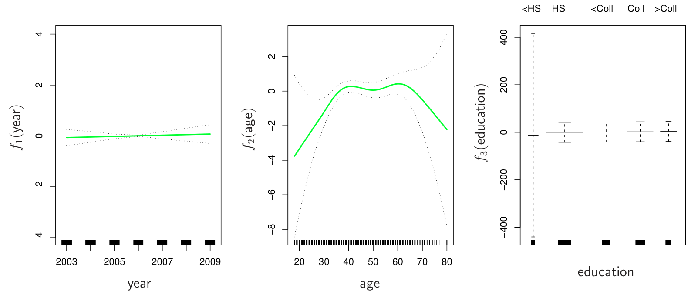{#fig-7-13 width=60%}

### GAMs para Clasificación

Los GAMs también pueden utilizarse para clasificación. La @fig-7-14 muestra un GAM para clasificación binaria aplicado a datos simulados, donde se modela el logit de la probabilidad.

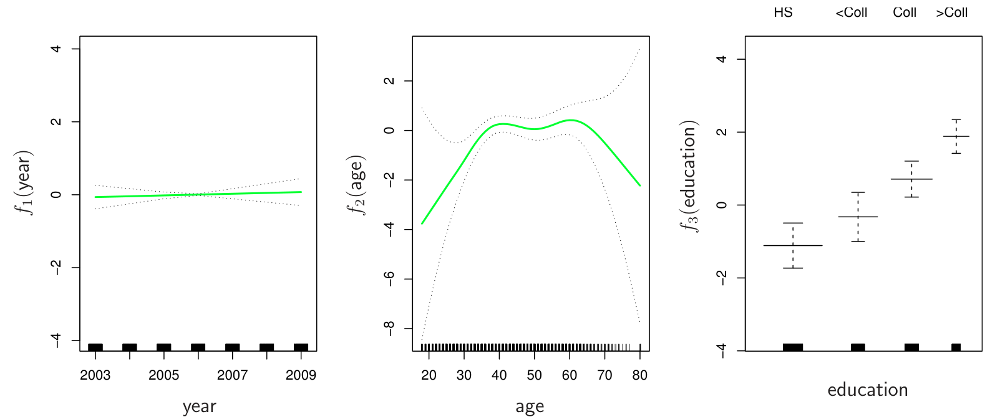{#fig-7-14 width=60%}

## Laboratorio

Los laboratorios con el código completo de este capítulo están disponibles en el sitio oficial del libro: [statlearning.com](https://www.statlearning.com){target="_blank"}. También puedes acceder a los notebooks en el repositorio oficial de ISLP: [ISLP_labs en GitHub](https://github.com/intro-stat-learning/ISLP_labs){target="_blank"}.
