## Resumen

Los **métodos basados en árboles** dividen el espacio de predictores en regiones y ajustan un modelo simple (como una constante) en cada región. Son populares por su interpretabilidad y porque manejan naturalmente relaciones no lineales e interacciones. En este capítulo estudiamos **árboles de regresión**, **árboles de clasificación**, **bagging**, **bosques aleatorios** y **boosting**.

## Árboles de Regresión

Un árbol de regresión divide el espacio de predictores en $J$ regiones $R_1, \ldots, R_J$ y predice la media de la respuesta en cada región:

$$\hat{f}(x) = \sum_{j=1}^{J} c_j \, I(x \in R_j), \quad c_j = \frac{1}{|R_j|} \sum_{i: x_i \in R_j} y_i$$

La construcción del árbol se realiza mediante **particionamiento recursivo binario** (recursive binary splitting). En cada paso, se selecciona el predictor y el punto de corte que minimizan la RSS.

La @fig-8-1 ilustra las regiones de partición de un árbol de regresión para predecir *mpg* usando *horsepower* y *weight* en los datos *Auto*.

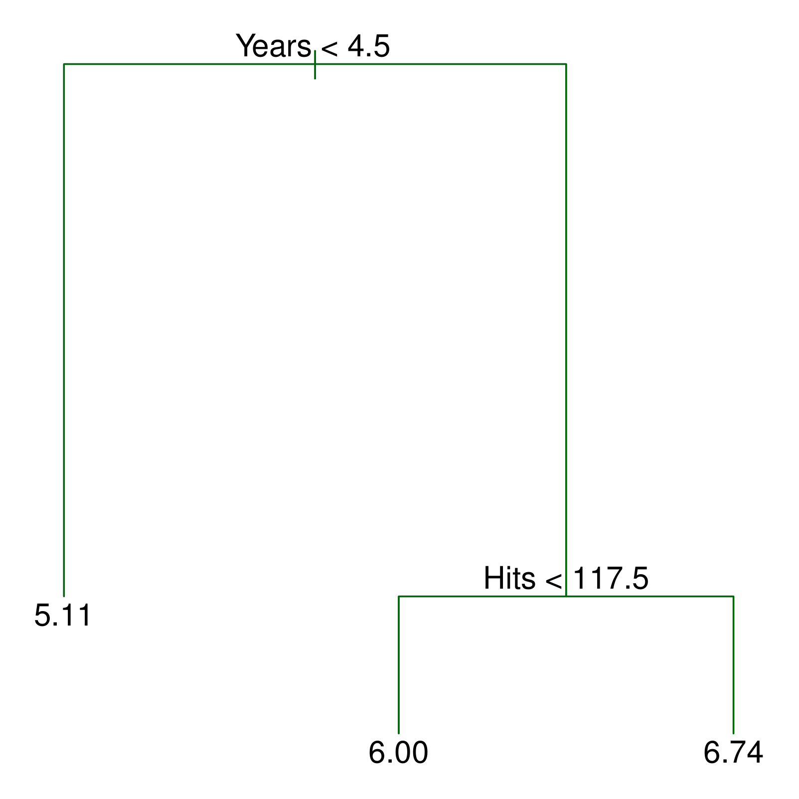{#fig-8-1 width=60%}

La @fig-8-2 muestra el árbol correspondiente, con las divisiones y los valores predichos en cada nodo terminal.

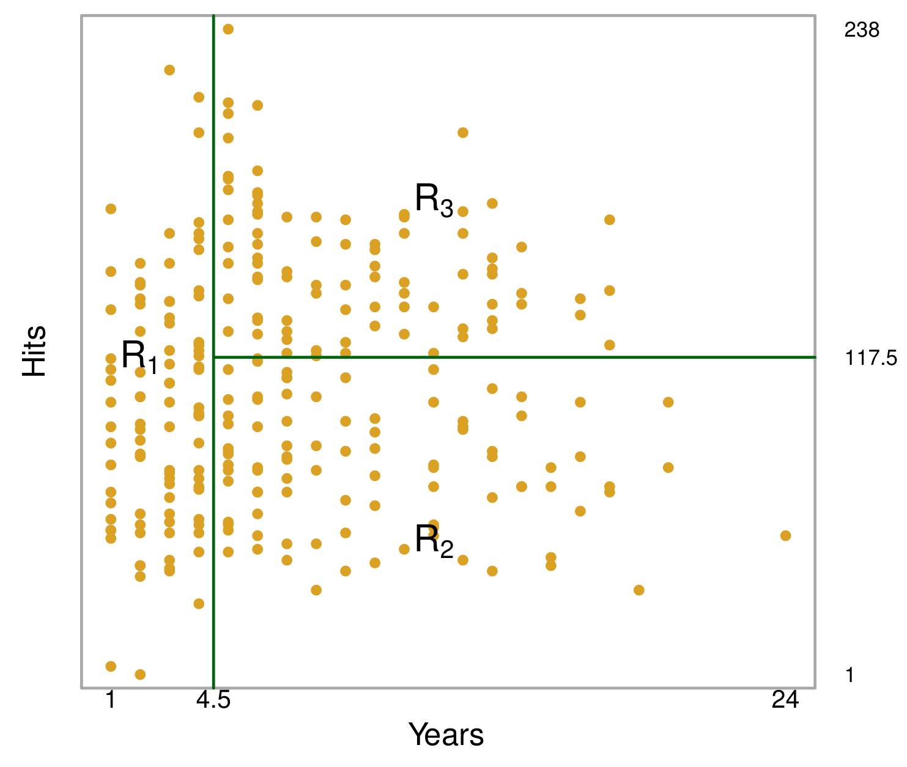{#fig-8-2 width=60%}

### Poda del Árbol

Los árboles grandes tienden a sobreajustar. La **poda** (pruning) reduce el tamaño del árbol penalizando la complejidad. La **poda por costo-complejidad** minimiza:

$$\sum_{j=1}^{|T|} \sum_{i: x_i \in R_j} (y_i - \hat{c}_j)^2 + \alpha |T|$$

La @fig-8-3 muestra el error de validación cruzada en función del número de nodos terminales para diferentes valores de $\alpha$.

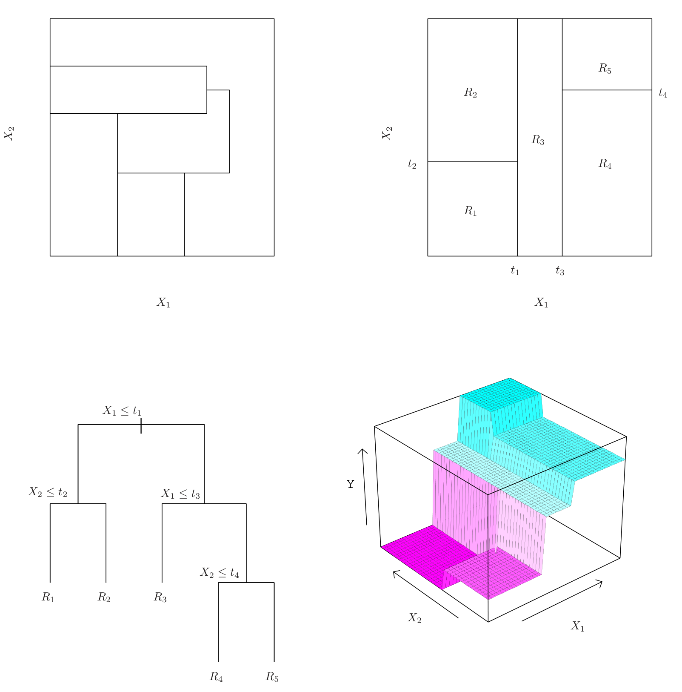{#fig-8-3 width=60%}

## Árboles de Clasificación

En clasificación, cada región se asigna a la clase mayoritaria entre las observaciones de entrenamiento en esa región. Para evaluar la calidad de una división se usan medidas como:

- **Tasa de error de clasificación**: $1 - \max_k(\hat{p}_{mk})$
- **Índice Gini**: $\sum_{k=1}^{K} \hat{p}_{mk}(1 - \hat{p}_{mk})$
- **Entropía cruzada** (deviance): $-\sum_{k=1}^{K} \hat{p}_{mk} \log(\hat{p}_{mk})$

La @fig-8-4 muestra las regiones de clasificación de un árbol para los datos *Heart* con dos predictores.

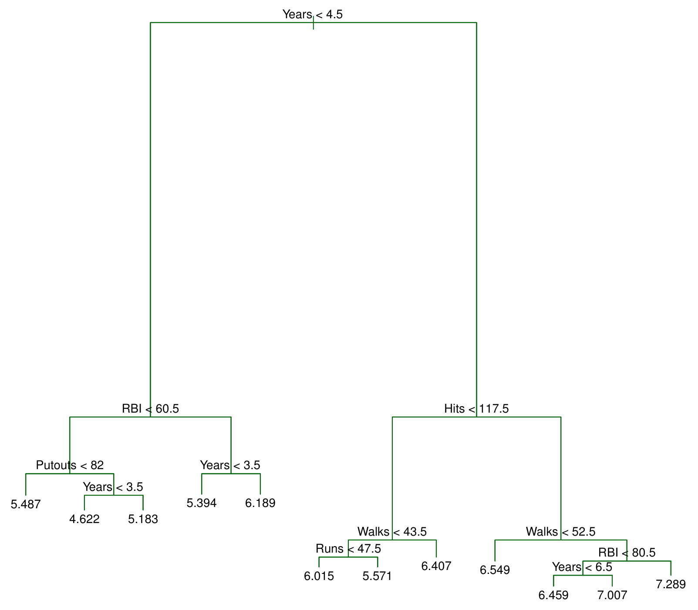{#fig-8-4 width=60%}

La @fig-8-5 muestra el árbol de clasificación correspondiente.

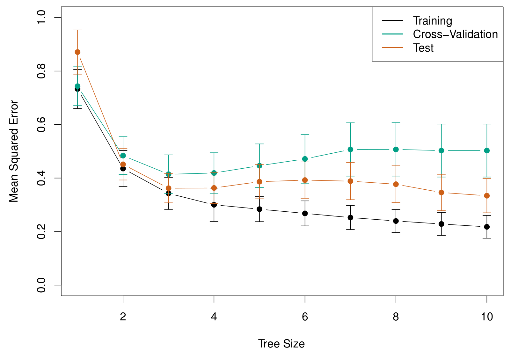{#fig-8-5 width=60%}

## Bagging

El **bagging** (bootstrap aggregation) reduce la varianza de un método estadístico promediando múltiples modelos ajustados en muestras bootstrap del conjunto de entrenamiento. Para árboles de regresión, el predictor bagging es:

$$\hat{f}_{\text{bag}}(x) = \frac{1}{B} \sum_{b=1}^{B} \hat{f}^{*b}(x)$$

La @fig-8-6 compara el error de prueba de un solo árbol con el de bagging para datos simulados.

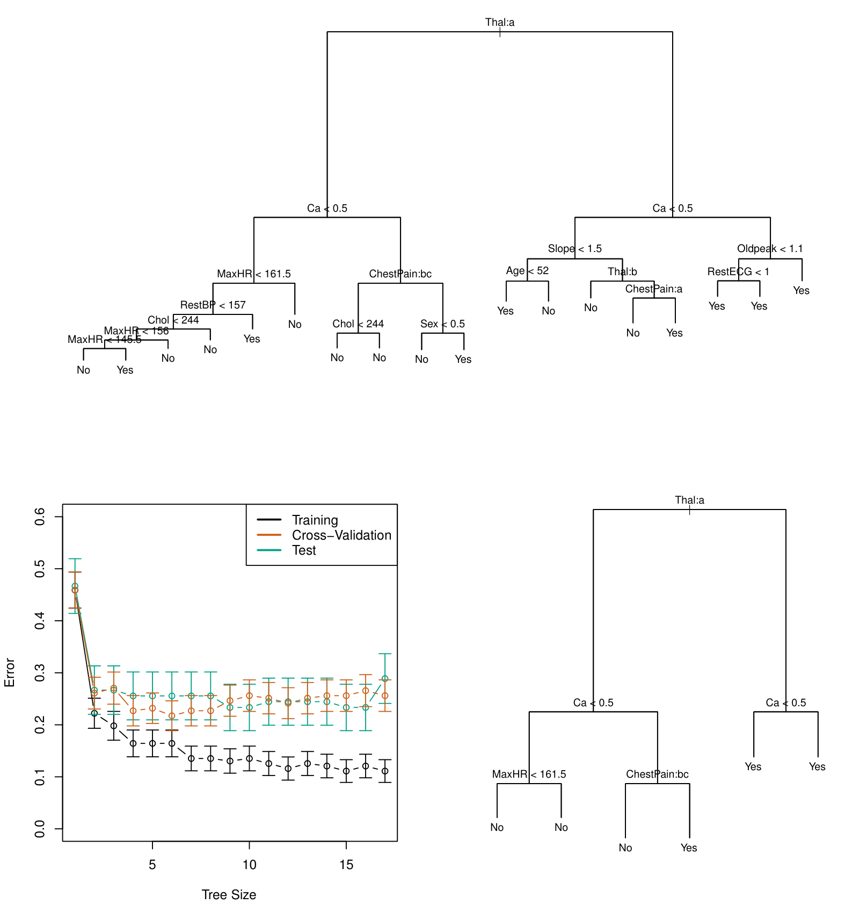{#fig-8-6 width=60%}

## Bosques Aleatorios

Los **bosques aleatorios** (random forests) mejoran el bagging mediante **descorrelación de los árboles**: en cada división, solo se considera un subconjunto aleatorio de $m$ predictores (típicamente $m \approx \sqrt{p}$). Esto evita que los árboles sean demasiado similares entre sí.

La @fig-8-7 compara el rendimiento de un solo árbol, bagging y bosques aleatorios para datos simulados.

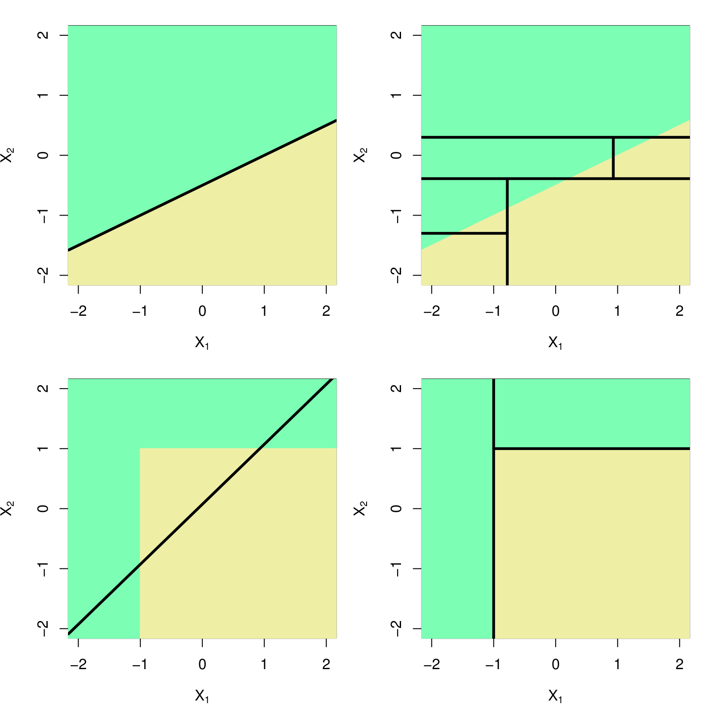{#fig-8-7 width=60%}

La @fig-8-8 muestra la importancia de variables calculada a partir de un bosque aleatorio, midiendo la reducción total del índice Gini (o RSS) atribuible a cada variable.

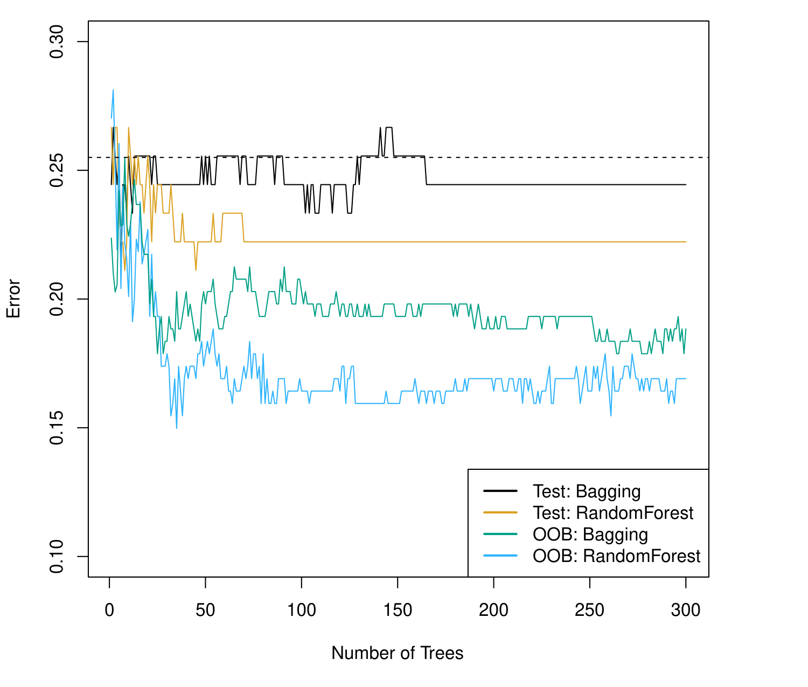{#fig-8-8 width=60%}

## Boosting

El **boosting** construye árboles de forma secuencial, donde cada árbol nuevo se enfoca en los residuos del modelo anterior:

1. Inicializar $\hat{f}(x) = 0$ y $r_i = y_i$ para todo $i$.
2. Para $b = 1, \ldots, B$:
   - Ajustar un árbol $\hat{f}^b$ con $d$ divisiones a los residuos $r_i$.
   - Actualizar $\hat{f}(x) \leftarrow \hat{f}(x) + \lambda \hat{f}^b(x)$.
   - Actualizar $r_i \leftarrow r_i - \lambda \hat{f}^b(x_i)$.

Los parámetros clave son:

- **$B$** (número de árboles): no debe ser demasiado grande para evitar sobreajuste.
- **$\lambda$** (tasa de aprendizaje): controla la contribución de cada árbol.
- **$d$** (profundidad): número de divisiones en cada árbol.

La @fig-8-9 compara el error de prueba de boosting con diferentes tasas de aprendizaje $\lambda$ en datos simulados.

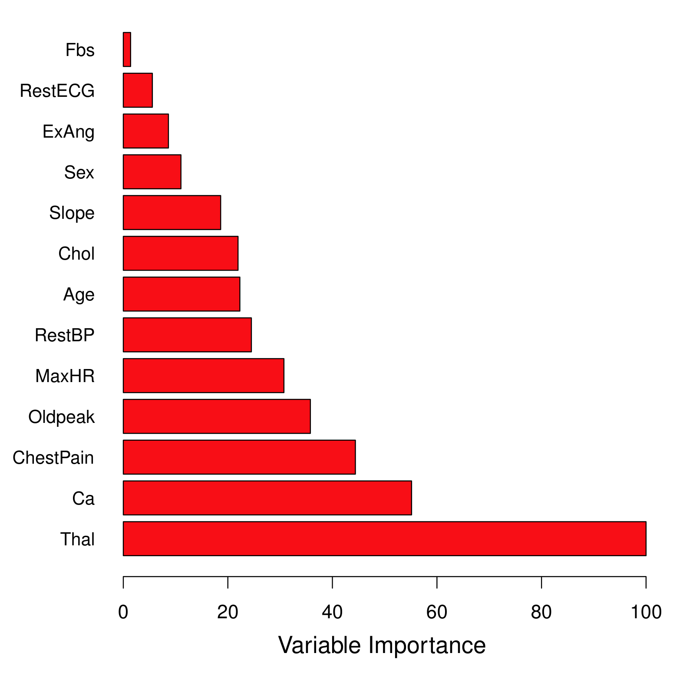{#fig-8-9 width=60%}

La @fig-8-10 ilustra la importancia de variables en un modelo boosting para los datos *Heart*.

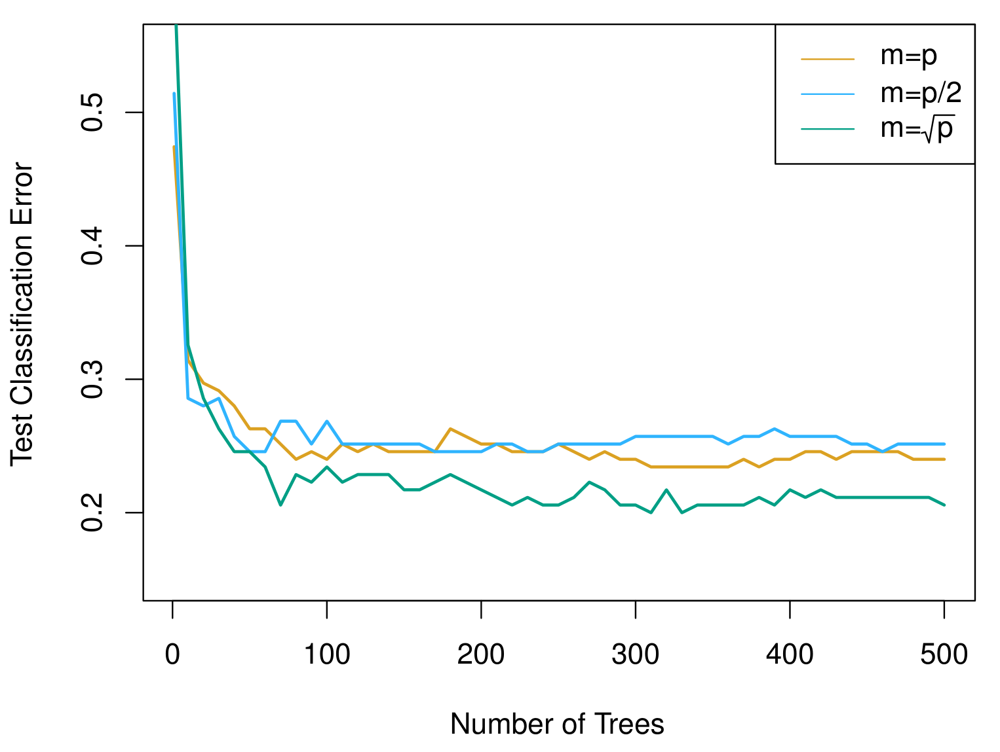{#fig-8-10 width=60%}

La @fig-8-11 compara el error de prueba de boosting con diferentes profundidades de árbol en datos simulados.

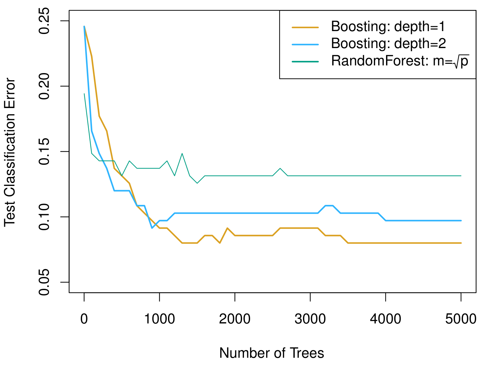{#fig-8-11 width=60%}

## Métodos Basados en Árboles: Resumen Visual

Las @fig-8-12a a @fig-8-12d presentan una comparación visual de los diferentes métodos basados en árboles (árbol simple, bagging, bosque aleatorio, boosting) en un problema de clasificación con dos predictores.

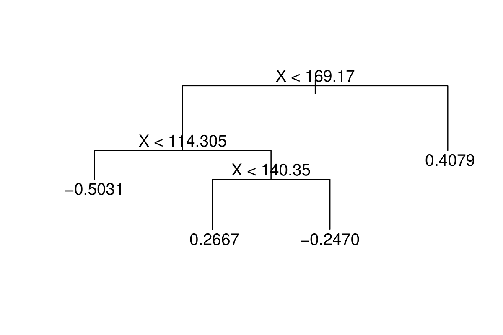{#fig-8-12a width=49%}

{#fig-8-12b width=49%}

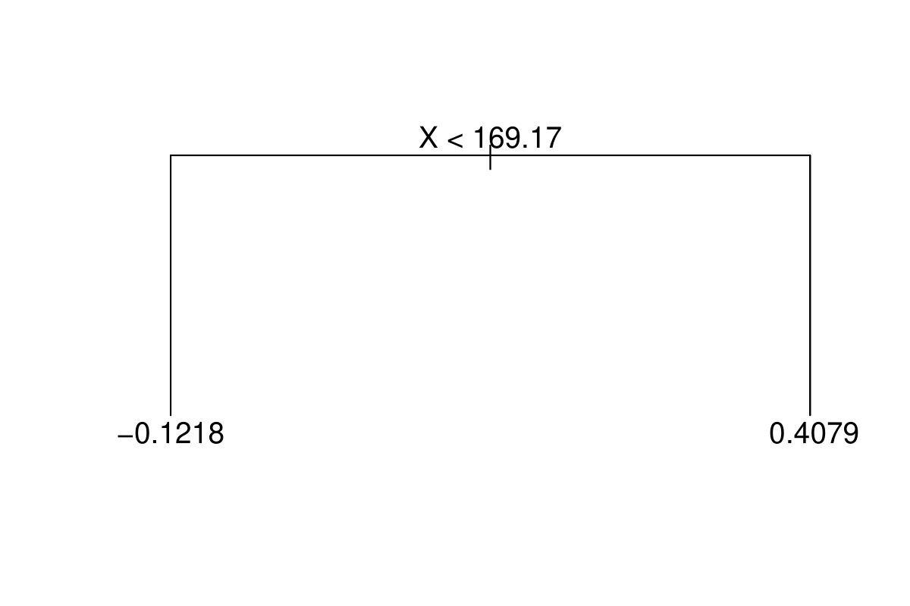{#fig-8-12c width=49%}

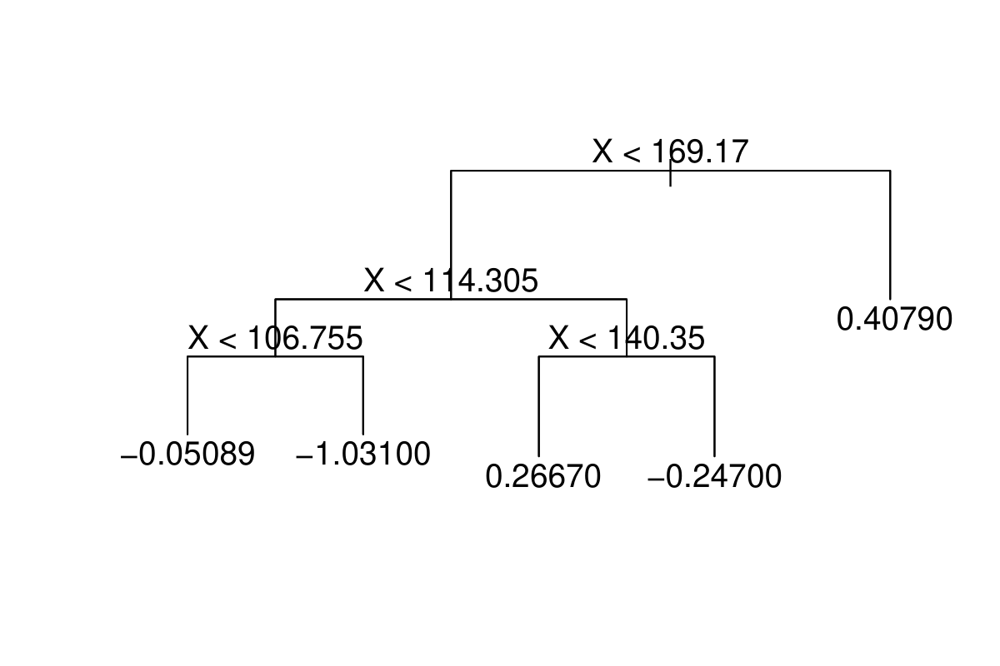{#fig-8-12d width=49%}

La @fig-8-13 y @fig-8-14 muestran resultados adicionales de bosques aleatorios y boosting para diferentes conjuntos de datos.

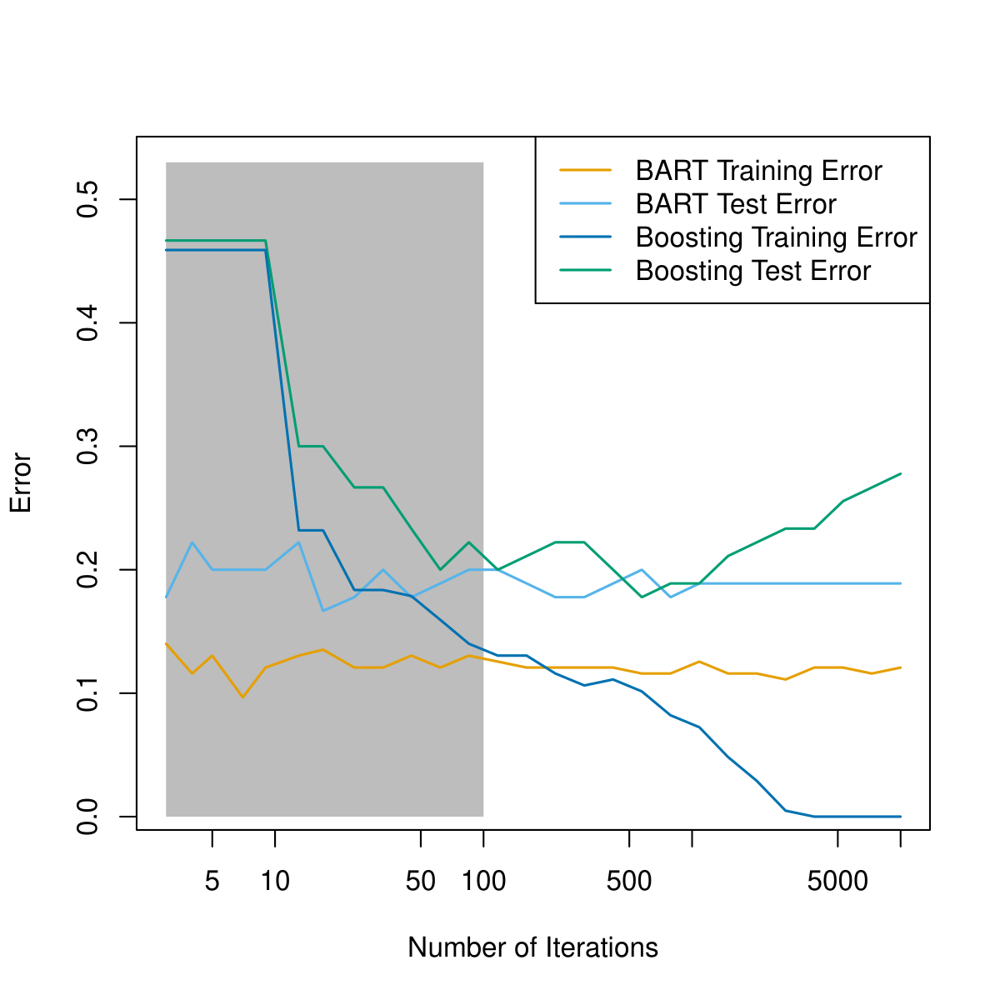{#fig-8-13 width=60%}

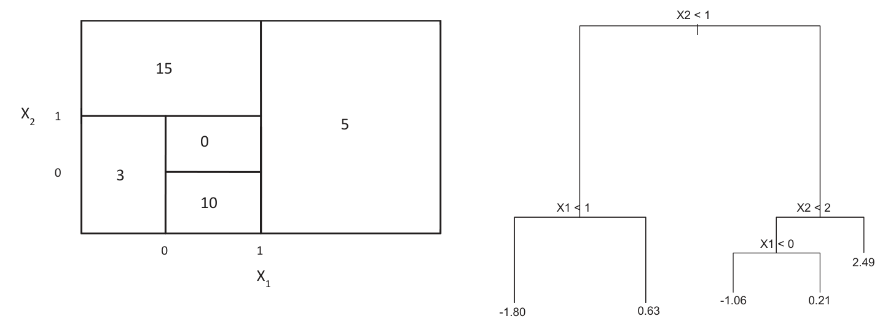{#fig-8-14 width=60%}

## Laboratorio

Los laboratorios con el código completo de este capítulo están disponibles en el sitio oficial del libro: [statlearning.com](https://www.statlearning.com){target="_blank"}. También puedes acceder a los notebooks en el repositorio oficial de ISLP: [ISLP_labs en GitHub](https://github.com/intro-stat-learning/ISLP_labs){target="_blank"}.
