## Resumen

Las **máquinas de vectores de soporte** (Support Vector Machines, SVM) son un conjunto de métodos de clasificación y regresión supervisados que construyen una frontera de decisión basada en un subconjunto de las observaciones de entrenamiento llamados **vectores de soporte**. En este capítulo cubrimos el **clasificador de máximo margen**, el **clasificador de vectores de soporte** y la **máquina de vectores de soporte** con kernels.

## Clasificador de Máximo Margen

### Hiperplano Separador

Un **hiperplano** en $p$ dimensiones es un subespacio afín de dimensión $p-1$ definido por:

$$\beta_0 + \beta_1 X_1 + \beta_2 X_2 + \cdots + \beta_p X_p = 0$$

Si los datos son linealmente separables, existe un hiperplano que separa perfectamente las clases. La @fig-9-1 muestra dos hiperplanos separadores posibles para un conjunto de datos simulado en $p = 2$ dimensiones.

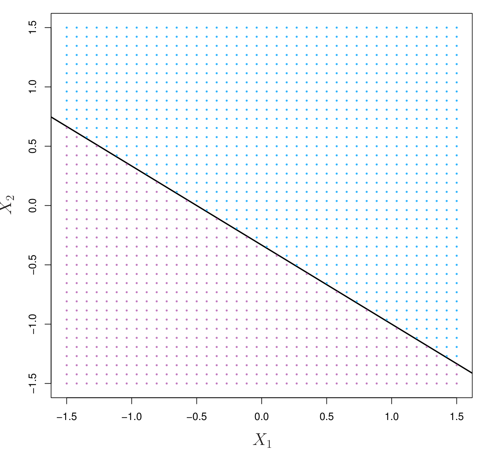{#fig-9-1 width=60%}

### Construcción del Clasificador de Máximo Margen

El **clasificador de máximo margen** es el hiperplano que maximiza la distancia mínima a las observaciones de entrenamiento. El **margen** es la distancia perpendicular desde el hiperplano hasta la observación más cercana.

Las observaciones que se encuentran exactamente sobre el margen determinan el hiperplano y se denominan **vectores de soporte**. La @fig-9-2 muestra el hiperplano de máximo margen para datos simulados.

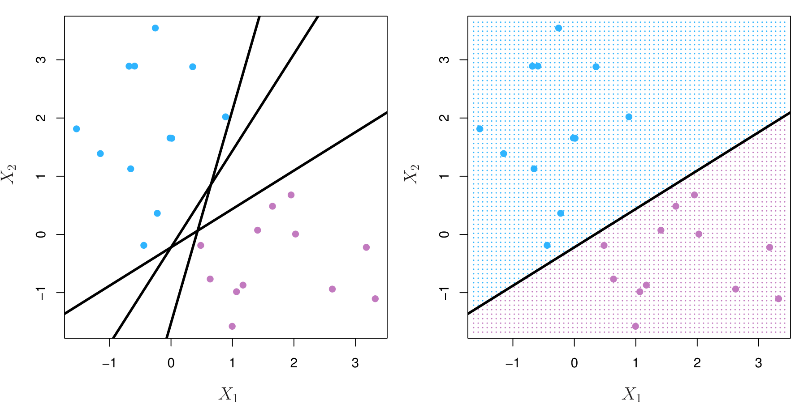{#fig-9-2 width=60%}

## Clasificador de Vectores de Soporte

En la práctica, las clases rara vez son perfectamente separables. El **clasificador de vectores de soporte** (también llamado SVM de margen suave) permite que algunas observaciones estén del lado incorrecto del margen o del hiperplano. Introduce una **holgura** (slack) $\epsilon_i \ge 0$ para cada observación:

$$\max_{\beta_0, \ldots, \beta_p, \epsilon_1, \ldots, \epsilon_n} M \quad \text{sujeto a} \quad \sum_{j=1}^{p} \beta_j^2 = 1, \quad y_i(\beta_0 + \sum \beta_j x_{ij}) \ge M(1 - \epsilon_i), \quad \epsilon_i \ge 0, \quad \sum \epsilon_i \le C$$

El parámetro **$C$** controla el margen: un $C$ pequeño da un margen estrecho con pocas violaciones; un $C$ grande da un margen ancho con más violaciones.

La @fig-9-3 compara clasificadores de vectores de soporte con diferentes valores de $C$ para datos simulados.

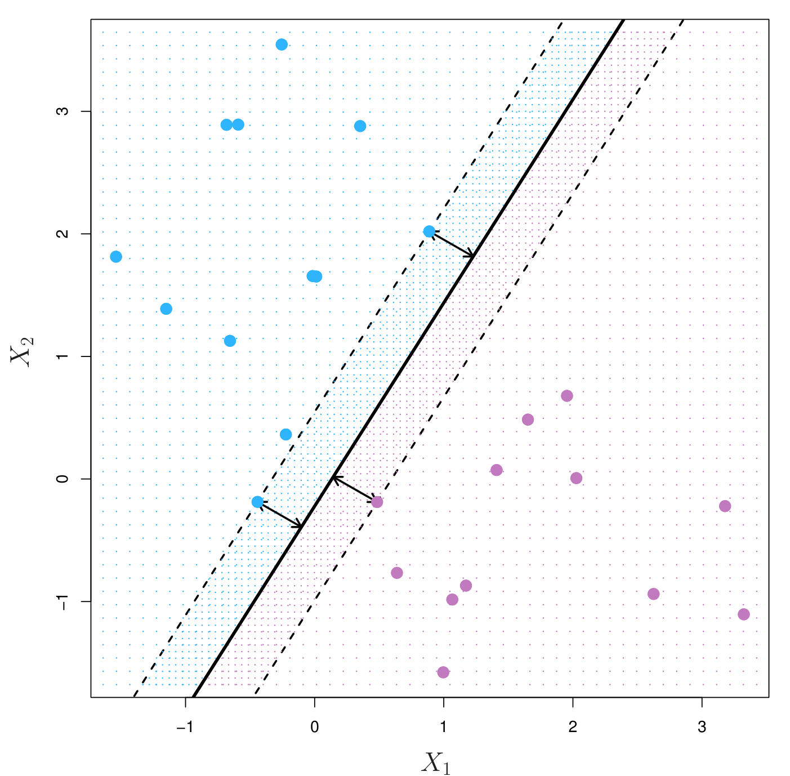{#fig-9-3 width=60%}

La @fig-9-4 muestra cómo cambian los vectores de soporte al variar $C$ en un problema de clasificación con datos simulados.

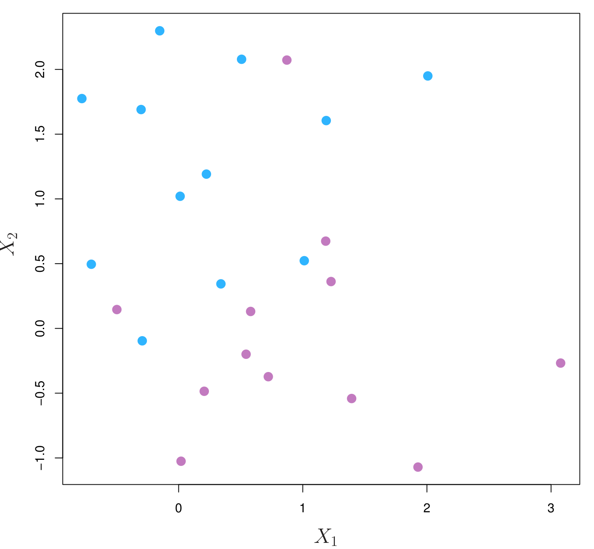{#fig-9-4 width=60%}

## Máquina de Vectores de Soporte

Cuando la frontera de decisión no es lineal, podemos usar el **truco del kernel** (kernel trick) para proyectar los datos a un espacio de mayor dimensión donde sean linealmente separables. El clasificador resultante es una **máquina de vectores de soporte** (SVM).

La función de kernel más común es el **kernel radial** (RBF):

$$K(x_i, x_{i'}) = \exp\left(-\gamma \sum_{j=1}^{p} (x_{ij} - x_{i'j})^2\right)$$

La @fig-9-5 compara la SVM lineal con la SVM con kernel radial para datos simulados no linealmente separables.

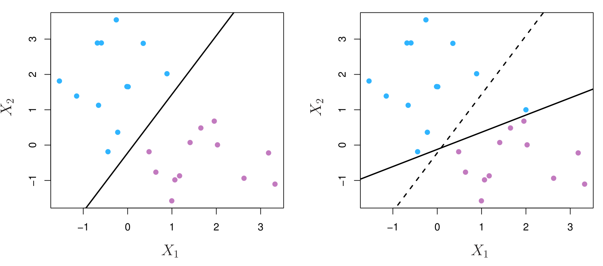{#fig-9-5 width=60%}

La @fig-9-6 muestra la SVM con kernel radial variando el parámetro $\gamma$ para datos simulados.

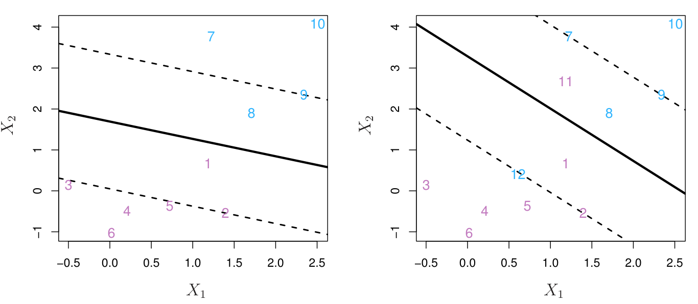{#fig-9-6 width=60%}

La @fig-9-7 ilustra el efecto combinado de $C$ y $\gamma$ en la frontera de decisión de una SVM con kernel radial.

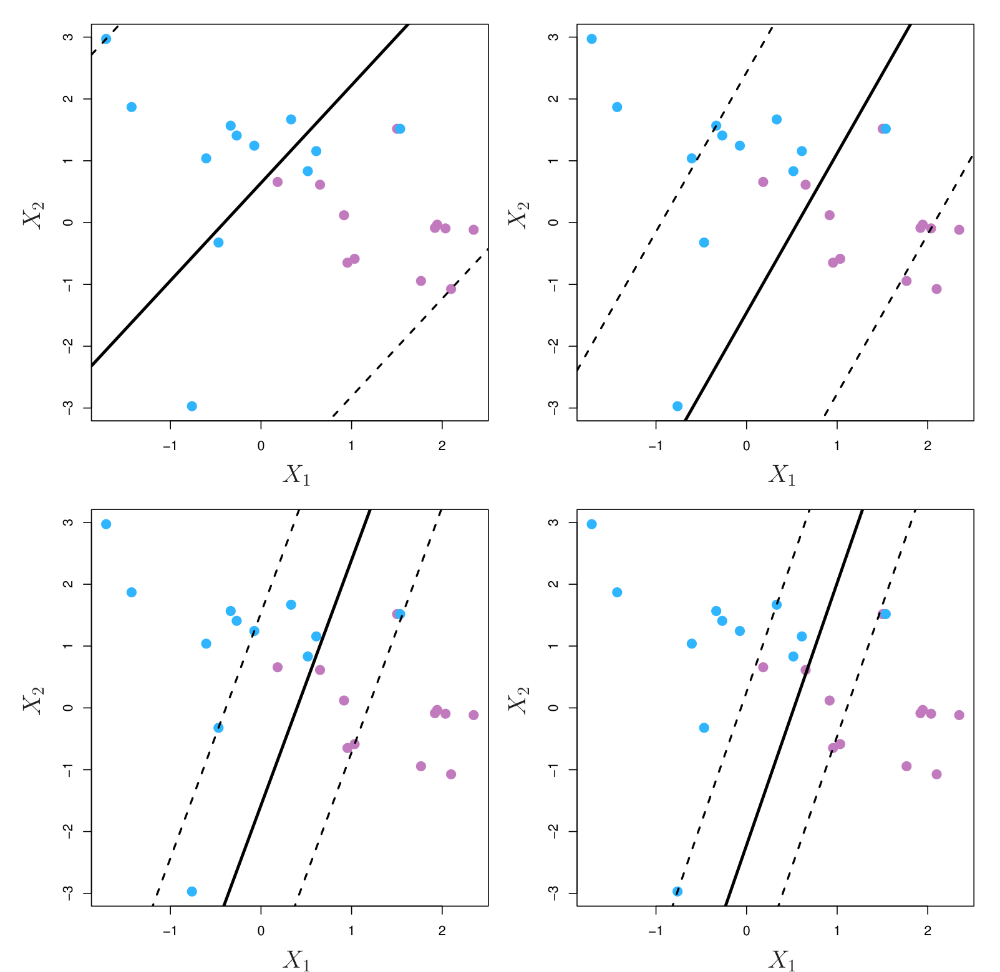{#fig-9-7 width=60%}

### SVM con Más de Dos Clases

Existen dos enfoques principales para extender SVM a problemas multiclase:

- **Uno contra uno** (one-vs-one): ajusta $K(K-1)/2$ clasificadores binarios.
- **Uno contra todos** (one-vs-all): ajusta $K$ clasificadores binarios.

## Relación con Métodos Estadísticos

La SVM tiene una conexión profunda con la **regresión logística** y otros métodos estadísticos. De hecho, la SVM puede verse como un caso particular de minimización de una función de pérdida (pérdida bisagra o hinge loss) con regularización $L_2$.

## Aplicaciones

Las SVM se utilizan en una amplia variedad de problemas, desde clasificación de texto hasta diagnóstico médico. La @fig-9-8 muestra la aplicación de SVM a datos de expresión génica (microarrays), donde el número de predictores ($p$) es mucho mayor que el número de observaciones ($n$).

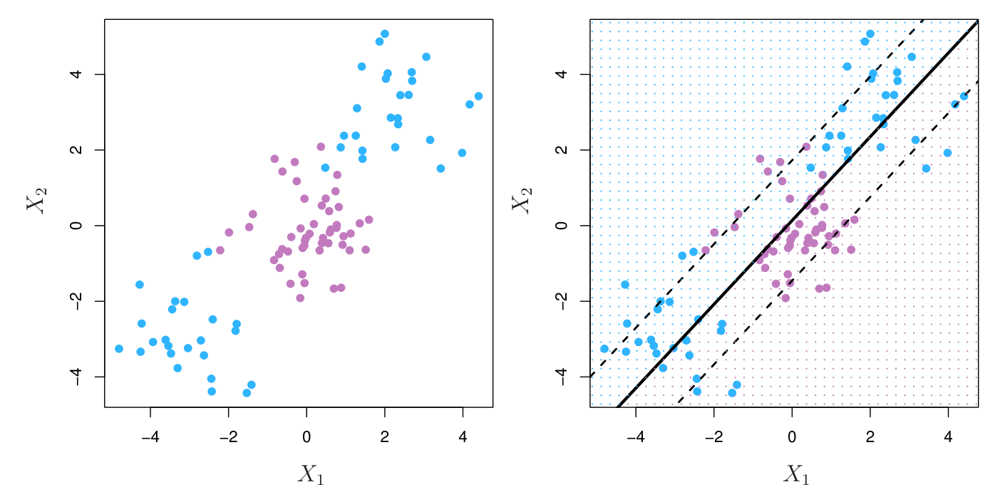{#fig-9-8 width=60%}

La @fig-9-9 compara SVM con otros clasificadores (regresión logística, LDA, QDA, KNN) en diferentes escenarios simulados.

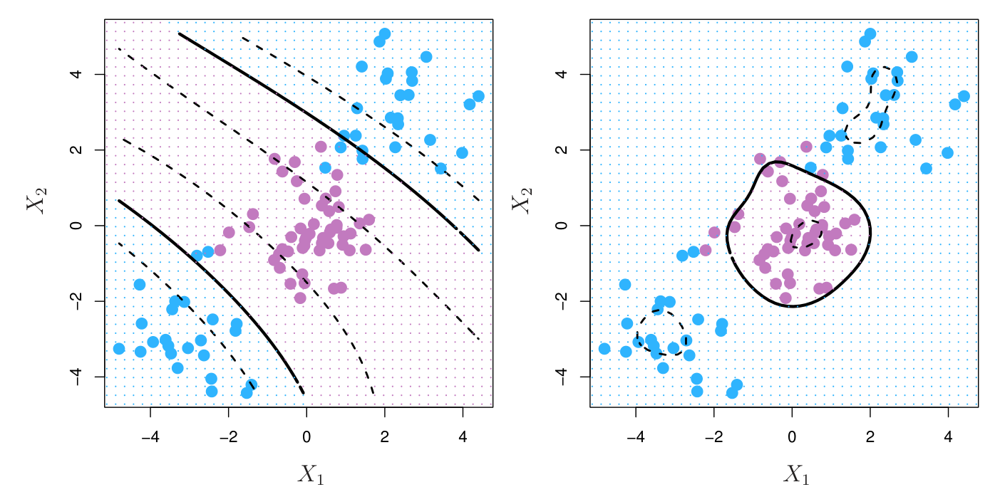{#fig-9-9 width=60%}

La @fig-9-10 muestra la superficie de decisión de una SVM con kernel polinomial de grado 2 en datos simulados.

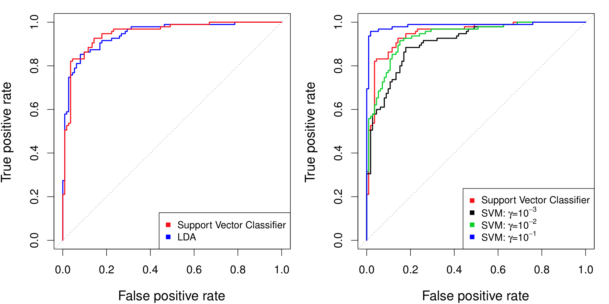{#fig-9-10 width=60%}

La @fig-9-11 y @fig-9-12 presentan más comparaciones de SVM con diferentes kernels y parámetros en problemas de clasificación multiclase.

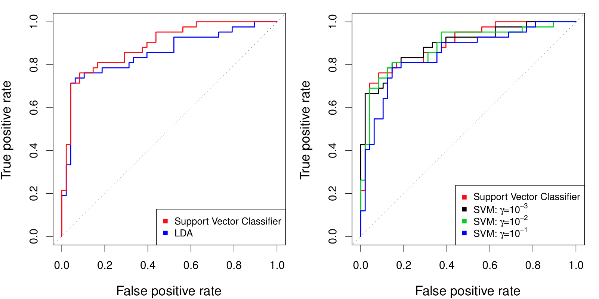{#fig-9-11 width=60%}

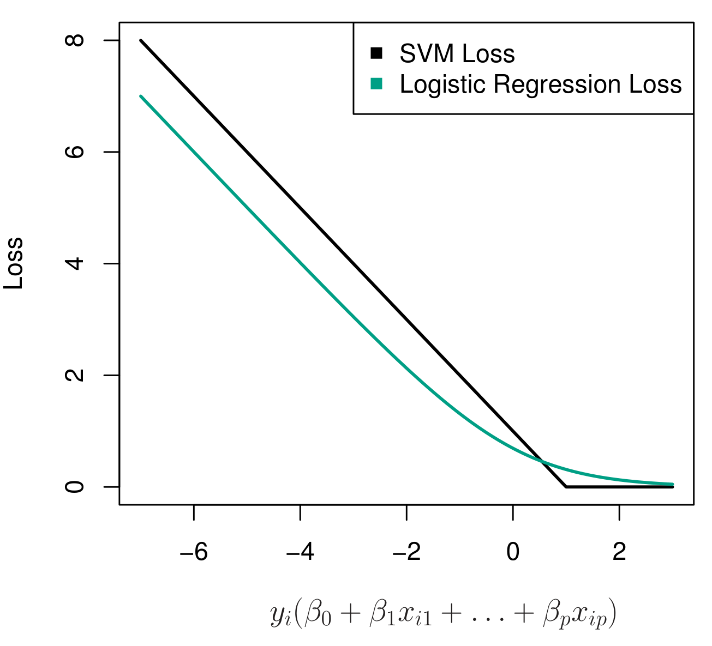{#fig-9-12 width=60%}

## Laboratorio

Los laboratorios con el código completo de este capítulo están disponibles en el sitio oficial del libro: [statlearning.com](https://www.statlearning.com){target="_blank"}. También puedes acceder a los notebooks en el repositorio oficial de ISLP: [ISLP_labs en GitHub](https://github.com/intro-stat-learning/ISLP_labs){target="_blank"}.
