## Resumen

El **aprendizaje profundo** (deep learning) se refiere a redes neuronales con múltiples capas ocultas. En este capítulo cubrimos los fundamentos de las redes neuronales artificiales, las redes convolucionales (CNN) para imágenes, las redes recurrentes (RNN) para secuencias, y tópicos avanzados como autoencoders, GANs y transformers.

## Redes Neuronales Simples

### Arquitectura de una Red Neuronal

Una red neuronal consiste en una **capa de entrada**, una o más **capas ocultas** y una **capa de salida**. Cada unidad (neurona) en una capa oculta computa una combinación lineal de las salidas de la capa anterior, seguida de una función de activación no lineal.

La @fig-10-1 muestra un diagrama esquemático de una red neuronal con una capa oculta.

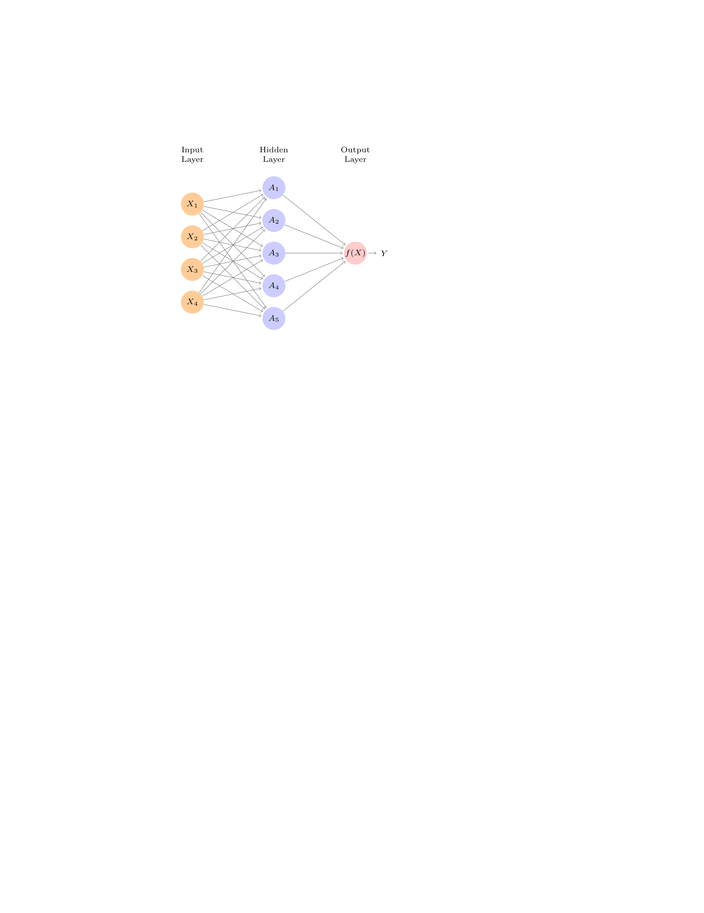{#fig-10-1 width=60%}

La @fig-10-2 muestra una neurona individual, ilustrando la combinación lineal y la activación.

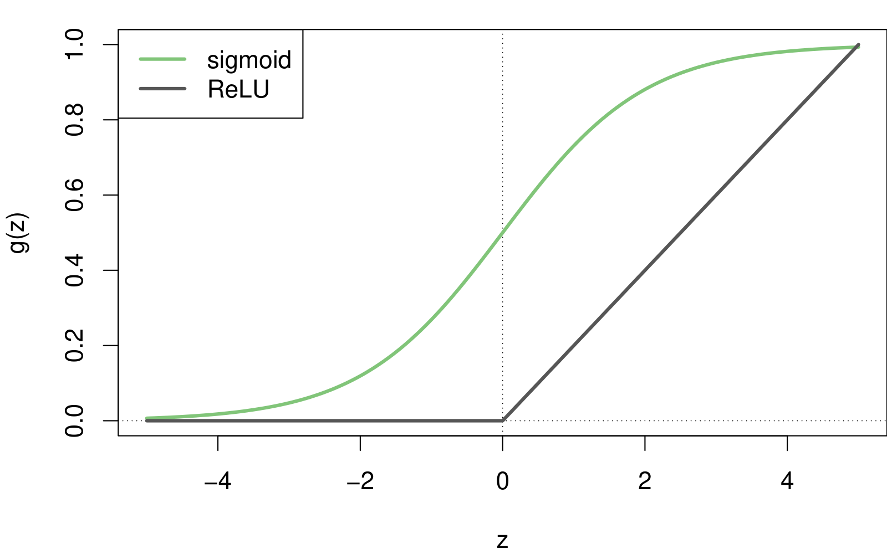{#fig-10-2 width=60%}

### Funciones de Activación

Las funciones de activación más comunes incluyen la **sigmoide**, la **tangente hiperbólica** y la **ReLU** (Rectified Linear Unit). La @fig-10-3a y @fig-10-3b muestran estas funciones y sus derivadas.

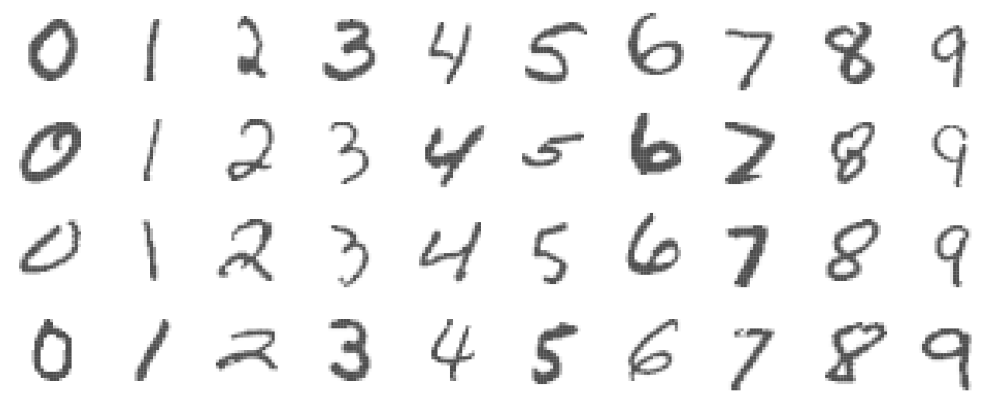{#fig-10-3a width=49%}

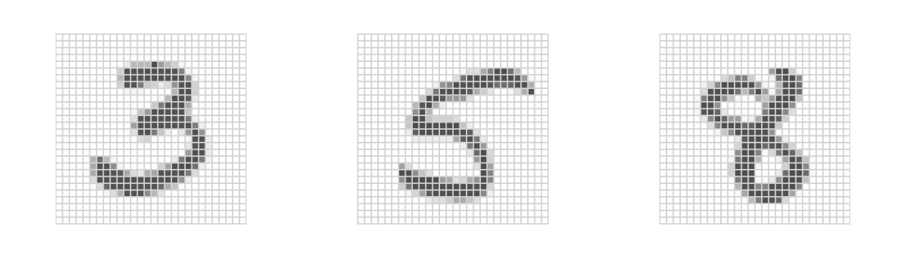{#fig-10-3b width=49%}

### El Problema XOR

El problema **XOR** (o exclusiva) no es linealmente separable. La @fig-10-4 ilustra este problema clásico y cómo una red neuronal con una capa oculta puede resolverlo.

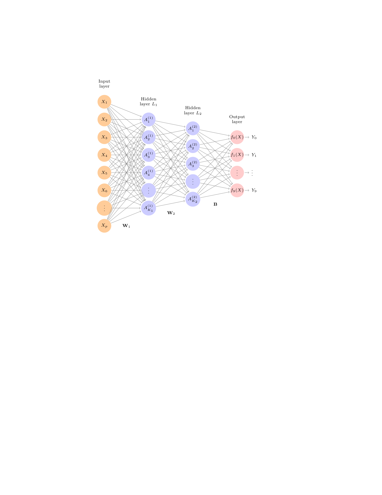{#fig-10-4 width=60%}

### Entrenamiento de Redes Neuronales

Las redes se entrenan mediante **retropropagación** (backpropagation) del gradiente del error y **descenso de gradiente** (o variantes como Adam, SGD). Se requieren cuidados especiales para evitar el sobreajuste:

- **Parada temprana** (early stopping)
- **Regularización $L_2$** (weight decay)
- **Dropout**: elimina aleatoriamente una fracción de neuronas durante el entrenamiento

## Redes Convolucionales (CNN)

Las **redes neuronales convolucionales** (Convolutional Neural Networks, CNN) están diseñadas para datos con estructura de cuadrícula, como imágenes. Utilizan **capas convolucionales** que aplican filtros (kernels) a la entrada para detectar patrones locales.

La @fig-10-5 ilustra una operación de convolución en una imagen.

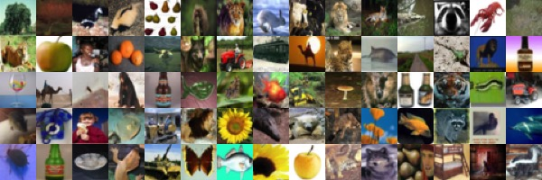{#fig-10-5 width=60%}

La @fig-10-6 muestra la arquitectura típica de una CNN con capas convolucionales, de pooling y densas.

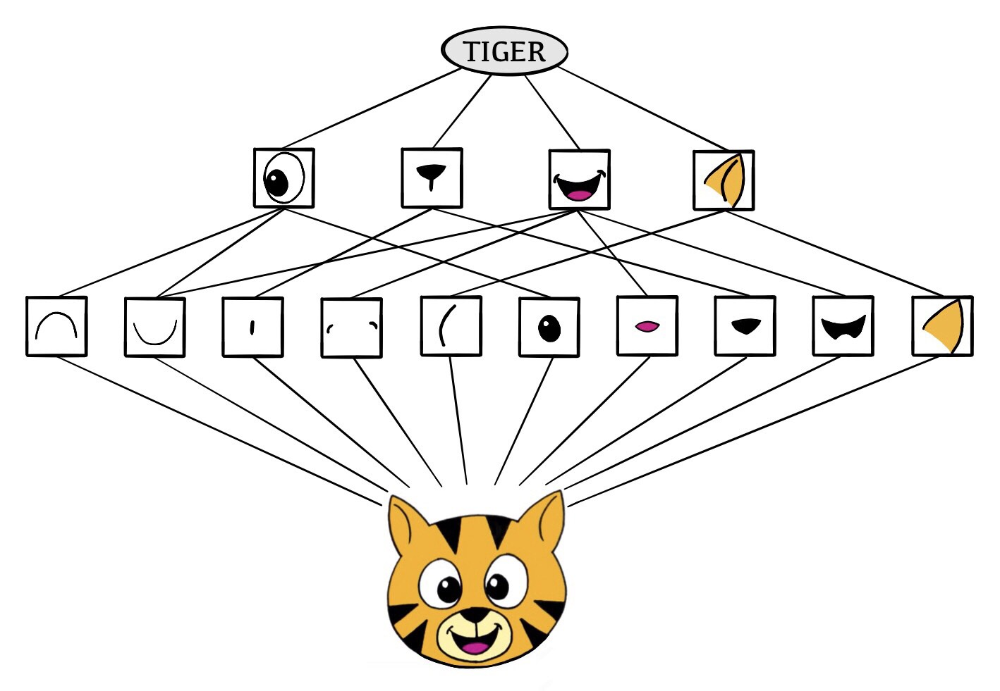{#fig-10-6 width=60%}

La @fig-10-7 visualiza los filtros aprendidos por una CNN en las primeras capas, que detectan bordes y texturas simples.

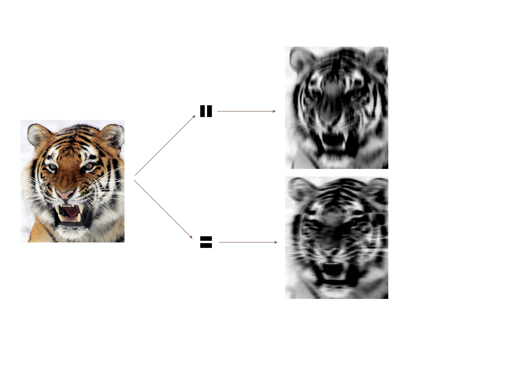{#fig-10-7 width=60%}

La @fig-10-8 muestra el efecto de las capas de **pooling** (max-pooling y average-pooling), que reducen la dimensionalidad y aportan invarianza a pequeñas traslaciones.

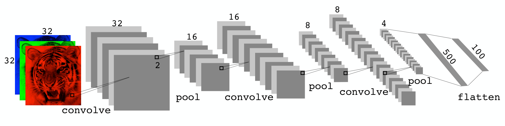{#fig-10-8 width=60%}

### Aumento de Datos

El **aumento de datos** (data augmentation) genera nuevas muestras de entrenamiento mediante transformaciones aleatorias (rotaciones, desplazamientos, volteos). La @fig-10-9 muestra ejemplos de imágenes aumentadas.

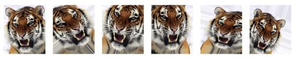{#fig-10-9 width=60%}

### Visualización de Filtros CNN

Las @fig-10-10a a @fig-10-10f visualizan los filtros aprendidos por diferentes capas de una CNN entrenada en ImageNet, mostrando cómo las capas profundas aprenden características cada vez más abstractas.

{#fig-10-10a width=49%}

{#fig-10-10b width=49%}

{#fig-10-10c width=49%}

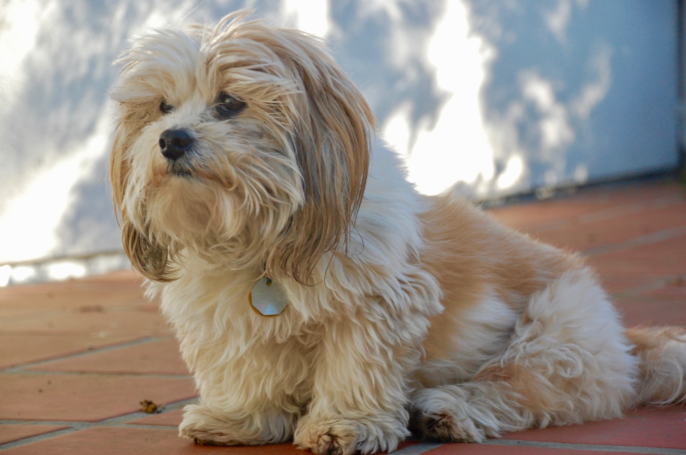{#fig-10-10d width=49%}

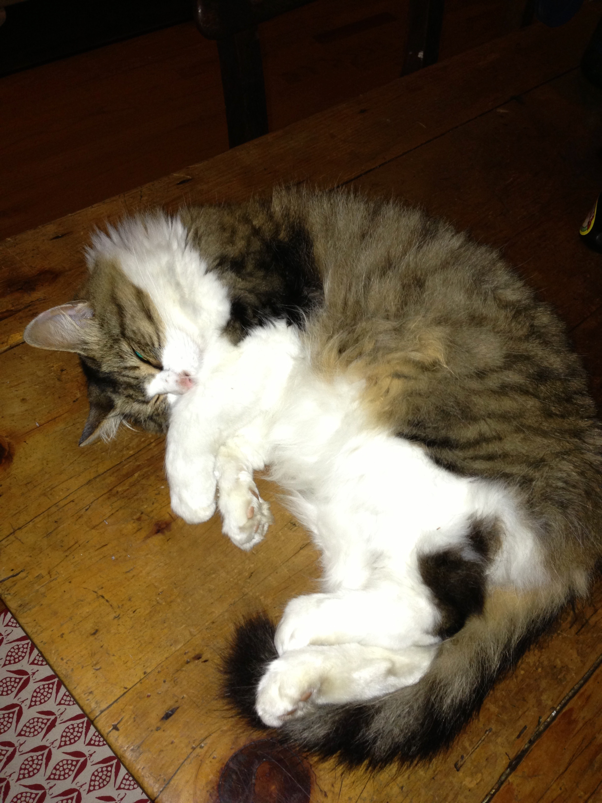{#fig-10-10e width=49%}

{#fig-10-10f width=49%}

### Resultados de CNN

La @fig-10-11 muestra la precisión de una CNN en el conjunto de datos CIFAR-10 a lo largo del entrenamiento, comparando diferentes arquitecturas.

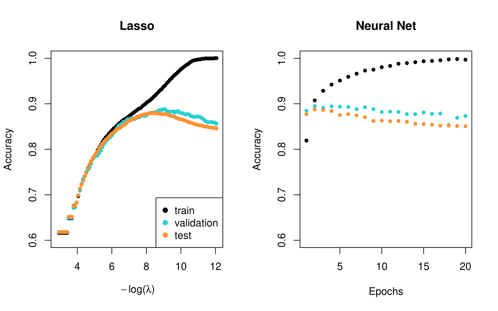{#fig-10-11 width=60%}

## Redes Recurrentes (RNN)

Las **redes neuronales recurrentes** (Recurrent Neural Networks, RNN) procesan datos secuenciales manteniendo un **estado oculto** que se actualiza en cada paso temporal.

La @fig-10-12 muestra la arquitectura básica de una RNN, donde la salida de cada paso depende de la entrada actual y del estado oculto del paso anterior.

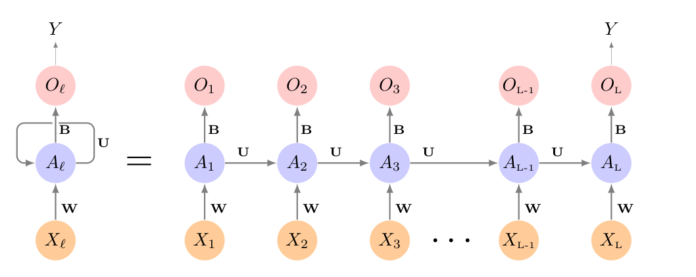{#fig-10-12 width=60%}

### Redes LSTM

Las **LSTM** (Long Short-Term Memory) son un tipo especial de RNN que introduce **compuertas** (gates) para controlar el flujo de información y mitigar el problema del desvanecimiento del gradiente. La @fig-10-13a y @fig-10-13b ilustran la arquitectura de una LSTM.

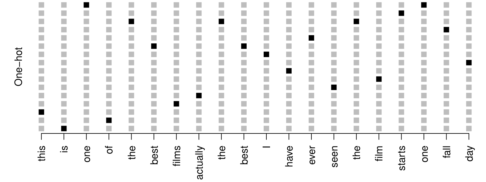{#fig-10-13a width=49%}

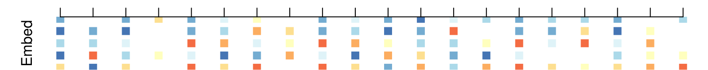{#fig-10-13b width=49%}

## Autoencoders

Un **autoencoder** es una red neuronal entrenada para reconstruir su entrada a través de un **cuello de botella** (bottleneck) que fuerza una representación comprimida.

La @fig-10-14 muestra la arquitectura de un autoencoder con codificador y decodificador.

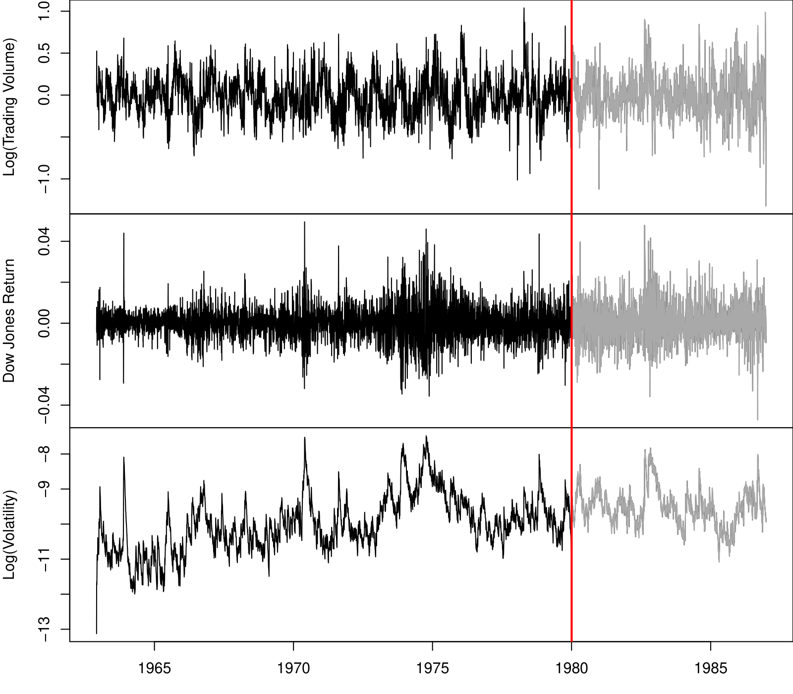{#fig-10-14 width=60%}

La @fig-10-15 compara las imágenes originales con las reconstruidas por un autoencoder entrenado en MNIST.

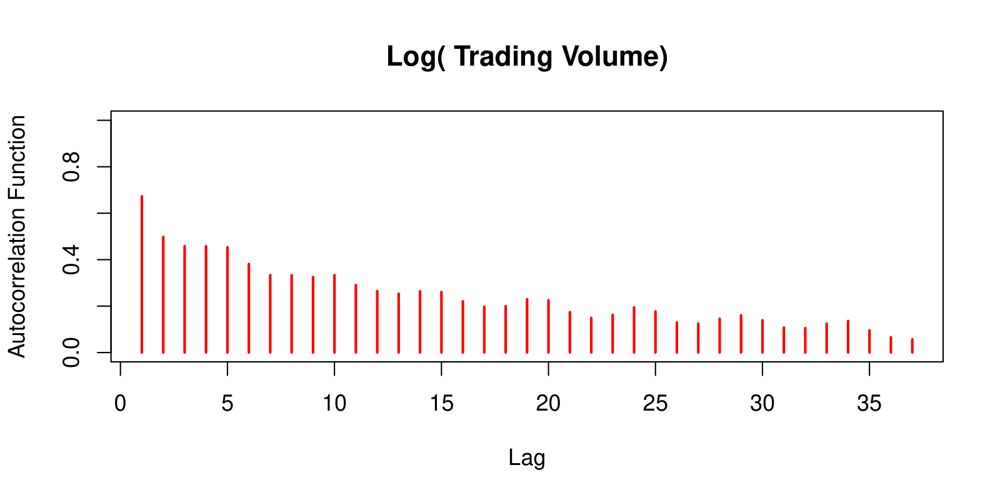{#fig-10-15 width=60%}

### Autoencoder Variacional (VAE)

El **autoencoder variacional** (Variational Autoencoder, VAE) es un modelo generativo que aprende la distribución latente de los datos. La @fig-10-16 muestra muestras generadas por un VAE.

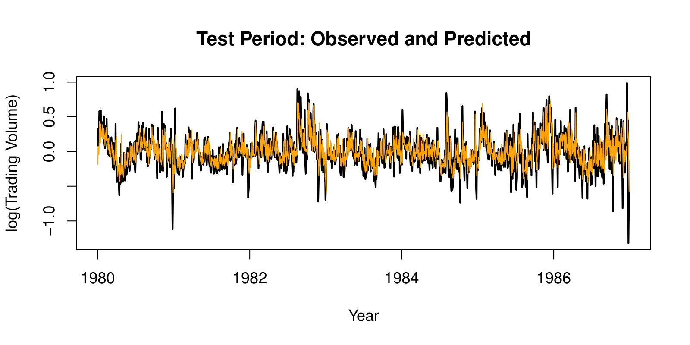{#fig-10-16 width=60%}

## Redes Generativas Antagónicas (GANs)

Las **GANs** (Generative Adversarial Networks) constan de dos redes: un **generador** que crea muestras falsas y un **discriminador** que intenta distinguirlas de las reales.

La @fig-10-17 muestra muestras generadas por una GAN entrenada en un conjunto de datos de imágenes faciales.

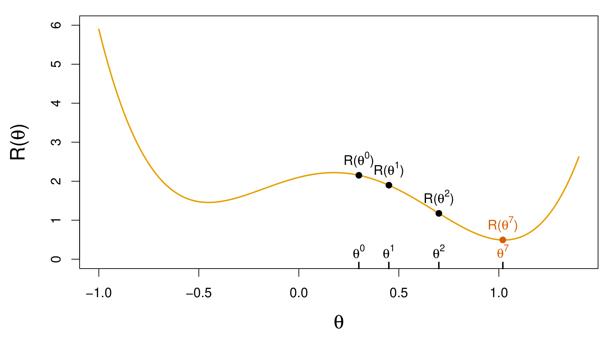{#fig-10-17 width=60%}

## Comparación de Métodos

La @fig-10-18 compara el rendimiento de diferentes arquitecturas de aprendizaje profundo (MLP, CNN, RNN, LSTM, etc.) en varios conjuntos de datos de referencia.

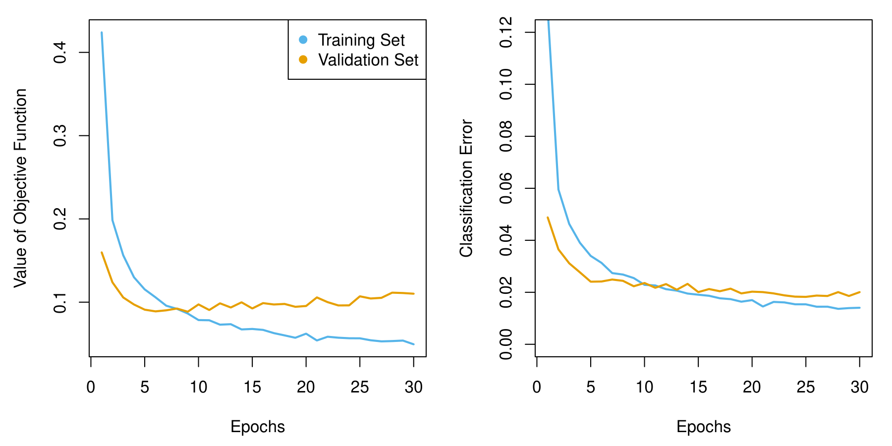{#fig-10-18 width=60%}

## Aprendizaje por Transferencia

El **aprendizaje por transferencia** (transfer learning) aprovecha modelos pre-entrenados en grandes conjuntos de datos y los ajusta (fine-tune) para una tarea específica.

Las @fig-10-19a y @fig-10-19b muestran los resultados del aprendizaje por transferencia, comparando el entrenamiento desde cero con el ajuste de un modelo pre-entrenado.

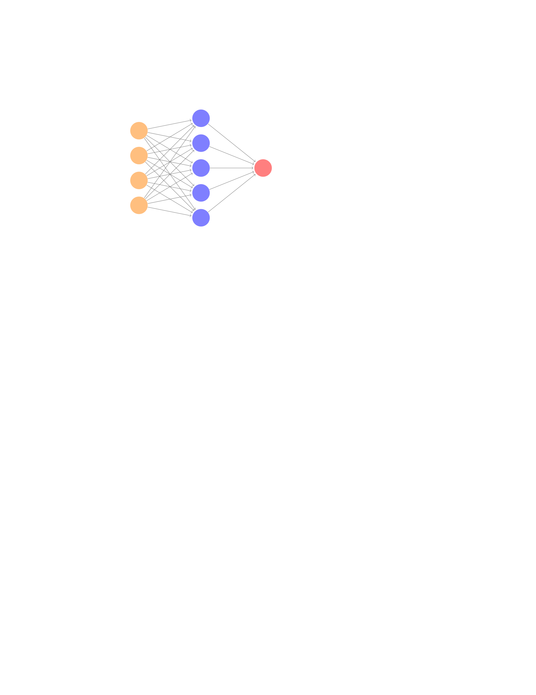{#fig-10-19a width=49%}

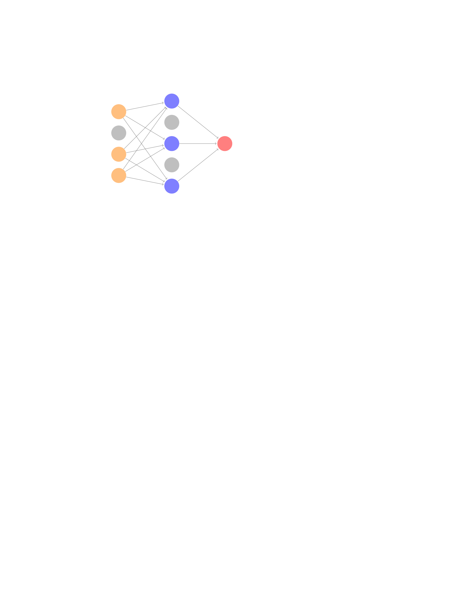{#fig-10-19b width=49%}

## Mecanismo de Atención y Transformers

El **mecanismo de atención** permite que el modelo pondere dinámicamente la importancia de diferentes partes de la entrada. La @fig-10-20 ilustra el mecanismo de autoatención (self-attention).

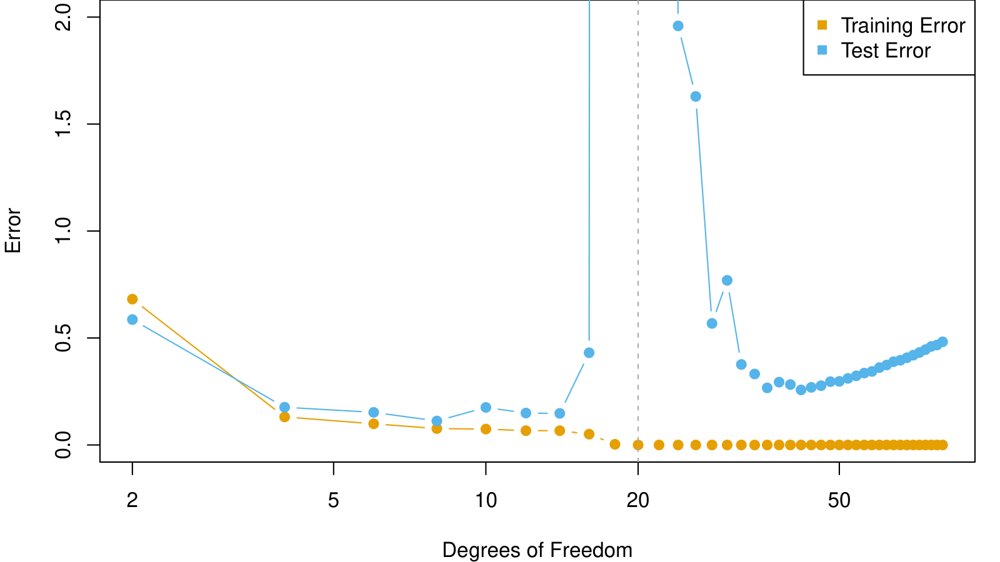{#fig-10-20 width=60%}

Los **transformers** son arquitecturas basadas únicamente en atención que han revolucionado el procesamiento del lenguaje natural y la visión artificial. La @fig-10-21 muestra la arquitectura del transformer original.

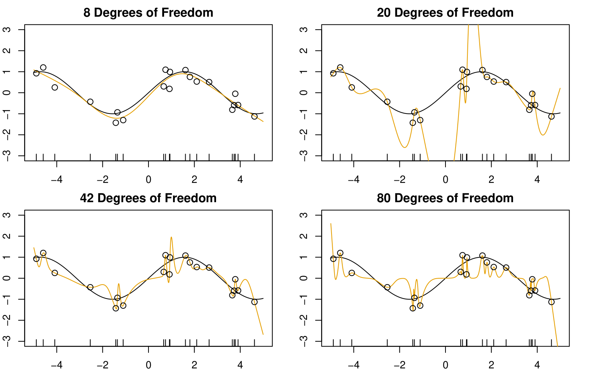{#fig-10-21 width=60%}

## Laboratorio

Los laboratorios con el código completo de este capítulo están disponibles en el sitio oficial del libro: [statlearning.com](https://www.statlearning.com){target="_blank"}. También puedes acceder a los notebooks en el repositorio oficial de ISLP: [ISLP_labs en GitHub](https://github.com/intro-stat-learning/ISLP_labs){target="_blank"}.
