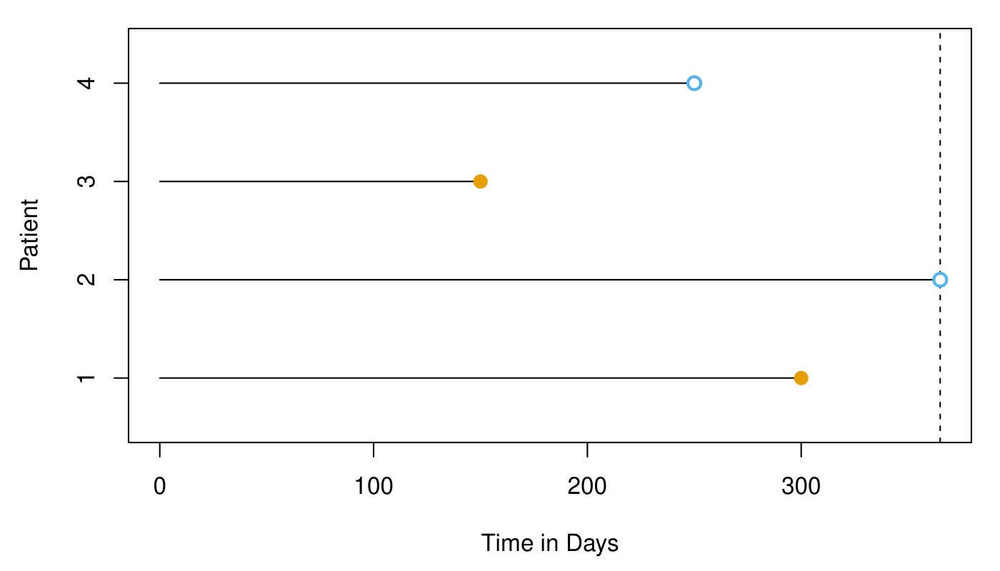
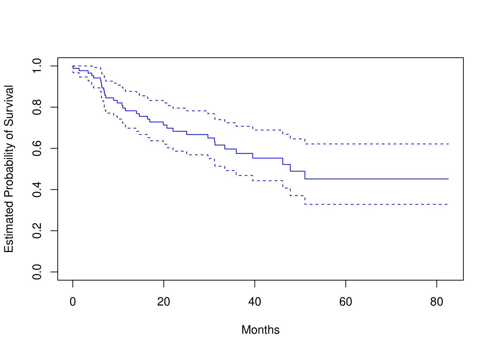
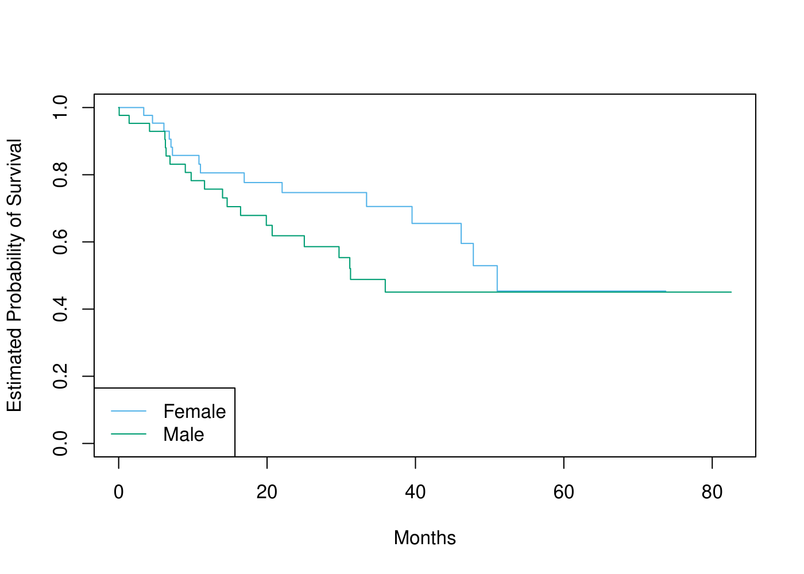
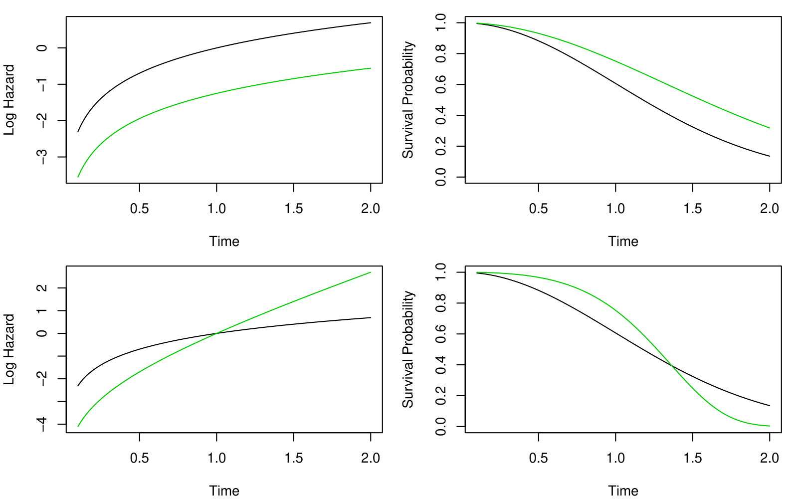
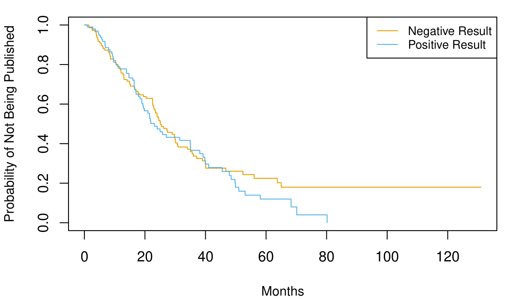
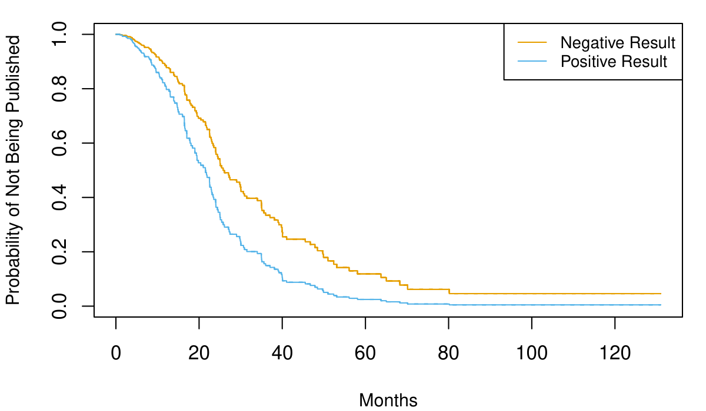
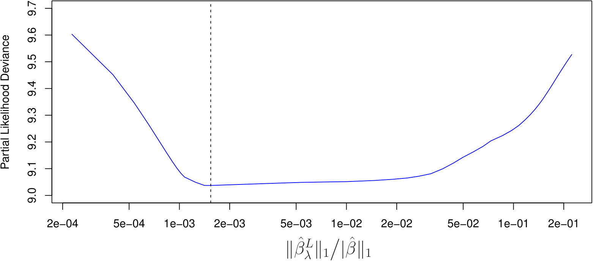
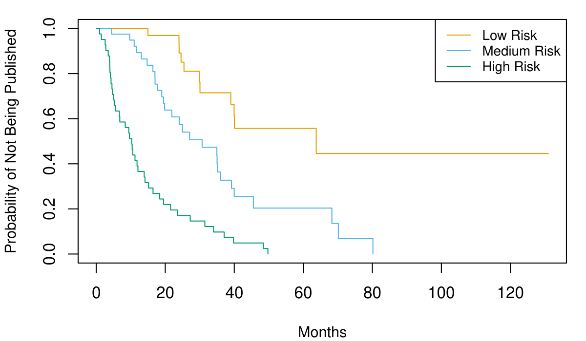
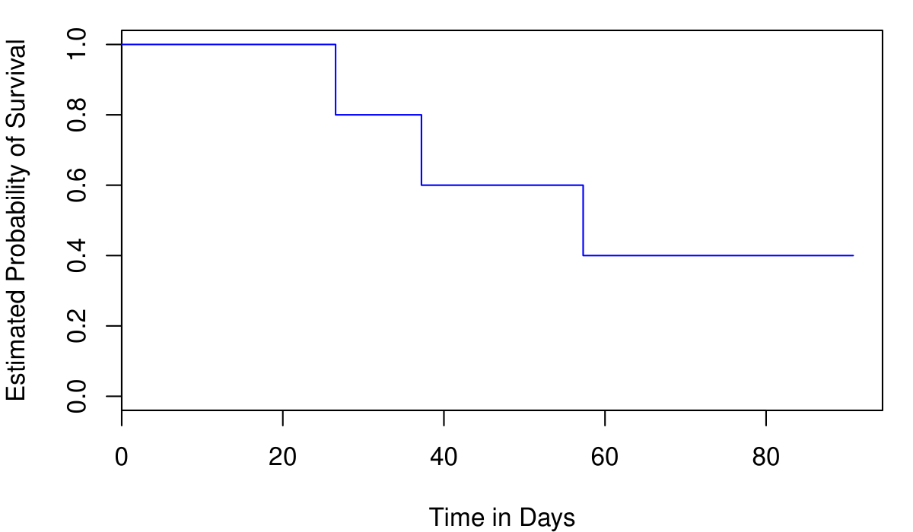

## Resumen

El **análisis de supervivencia** estudia el tiempo hasta que ocurre un evento de interés (muerte, fallo, recaída, etc.). Una característica clave de estos datos es la **censura**: para algunas observaciones, el evento no ha ocurrido al final del período de seguimiento. En este capítulo cubrimos el **estimador de Kaplan–Meier**, la **regresión de Cox** y extensiones con métodos de aprendizaje estadístico.

## Datos de Supervivencia y Censura

En el análisis de supervivencia, cada observación tiene un **tiempo de supervivencia** $T$ y posiblemente un indicador de censura $\delta$. Si $\delta = 1$, el evento ocurrió en el tiempo $T$; si $\delta = 0$, la observación está censurada (el evento no ocurrió antes del final del seguimiento, o la observación se perdió durante el seguimiento).

La **función de supervivencia** $S(t) = P(T > t)$ es la probabilidad de que el tiempo de supervivencia sea mayor que $t$. La **función de riesgo** (hazard) $\lambda(t)$ mide la tasa instantánea de ocurrencia del evento en el tiempo $t$, condicional a que no haya ocurrido antes.

La @fig-11-1 muestra un conjunto de datos de supervivencia típico, donde se indican los tiempos de evento y las censuras.

{#fig-11-1 width=60%}

## Estimador de Kaplan--Meier

El **estimador de Kaplan--Meier** (o producto-límite) estima la función de supervivencia a partir de datos censurados:

$$\hat{S}(t) = \prod_{j: t_j \le t} \left(1 - \frac{d_j}{r_j}\right)$$

donde $t_j$ son los tiempos de evento, $d_j$ el número de eventos en $t_j$, y $r_j$ el número de individuos en riesgo justo antes de $t_j$.

La @fig-11-2 muestra la curva de Kaplan--Meier para dos grupos de pacientes en un estudio clínico.

{#fig-11-2 width=60%}

### Comparación de Curvas de Supervivencia

Para comparar las curvas de supervivencia entre grupos, se utiliza el **test de log-rank**, que prueba la hipótesis nula de que las curvas son iguales.

## Regresión de Cox

El **modelo de riesgos proporcionales de Cox** relaciona el tiempo de supervivencia con predictores $X_1, \ldots, X_p$:

$$\lambda(t | X) = \lambda_0(t) \exp(\beta_1 X_1 + \cdots + \beta_p X_p)$$

donde $\lambda_0(t)$ es la **función de riesgo base** (no especificada) y $\exp(\beta_j)$ es el **hazard ratio** asociado al predictor $X_j$.

Este modelo es **semiparamétrico** porque la función de riesgo base no se parametriza, pero los efectos de los predictores son paramétricos. Los coeficientes $\beta_j$ se estiman maximizando la **verosimilitud parcial**.

La @fig-11-3 muestra las estimaciones de Kaplan--Meier junto con las curvas predichas por el modelo de Cox para diferentes niveles de un predictor.

{#fig-11-3 width=60%}

### Interpretación de los Coeficientes

Un hazard ratio $\exp(\hat{\beta}_j) > 1$ indica que un aumento en $X_j$ se asocia con un mayor riesgo (peor supervivencia); un valor $< 1$ indica un menor riesgo (mejor supervivencia).

La @fig-11-4 muestra los coeficientes estimados de un modelo de Cox con sus intervalos de confianza para varios predictores en un estudio de cáncer.

{#fig-11-4 width=60%}

## Riesgos No Proporcionales

El modelo de Cox asume que los hazard ratios son constantes en el tiempo (riesgos proporcionales). Cuando este supuesto no se cumple, se necesitan extensiones como:

- **Efectos dependientes del tiempo**: permitir que $\beta_j$ varíe con $t$.
- **Estratificación**: diferentes funciones de riesgo base para diferentes estratos.
- **Modelos de tiempo de fallo acelerado** (AFT).

La @fig-11-5 muestra un ejemplo donde el supuesto de riesgos proporcionales se viola, y cómo se diagnostica usando residuos de Schoenfeld.

{#fig-11-5 width=60%}

## Árboles de Supervivencia

Los **árboles de supervivencia** extienden los métodos basados en árboles al contexto de datos censurados. En lugar de predecir una respuesta continua, cada nodo terminal contiene un estimador de Kaplan--Meier para las observaciones en esa región.

La @fig-11-6 muestra un árbol de supervivencia para datos de cáncer de mama, donde las ramas dividen a los pacientes según características clínicas y moleculares.

{#fig-11-6 width=60%}

## Bosques Aleatorios de Supervivencia

Los **bosques aleatorios de supervivencia** (Random Survival Forests) combinan el bagging de árboles de supervivencia con la aleatorización de predictores. Proporcionan estimaciones de la función de riesgo y la función de supervivencia, así como medidas de importancia de variables.

La @fig-11-7 compara el rendimiento de un bosque aleatorio de supervivencia con el modelo de Cox en datos simulados.

{#fig-11-7 width=60%}

La @fig-11-8 muestra la importancia de variables calculada por un bosque aleatorio de supervivencia para un conjunto de datos de investigación biomédica.

{#fig-11-8 width=60%}

## Aprendizaje Profundo para Supervivencia

Métodos de **aprendizaje profundo** como DeepSurv y SurvivalNet extienden las redes neuronales al contexto de datos censurados. Estos modelos pueden capturar interacciones complejas y efectos no lineales entre predictores.

La @fig-11-9 compara el rendimiento de DeepSurv con el modelo de Cox y bosques aleatorios de supervivencia en datos de alta dimensión.

{#fig-11-9 width=60%}

## Laboratorio

Los laboratorios con el código completo de este capítulo están disponibles en el sitio oficial del libro: [statlearning.com](https://www.statlearning.com){target="_blank"}. También puedes acceder a los notebooks en el repositorio oficial de ISLP: [ISLP_labs en GitHub](https://github.com/intro-stat-learning/ISLP_labs){target="_blank"}.
