## Resumen

Cuando se realizan muchas pruebas de hipótesis simultáneamente, el riesgo de falsos positivos se acumula. Este capítulo cubre métodos para controlar la **tasa de error por familia** (FWER) y la **tasa de descubrimientos falsos** (FDR), incluyendo la corrección de Bonferroni y el procedimiento de Benjamini--Hochberg.

## El Problema de las Pruebas Múltiples

En el contexto de la genómica y otras áreas de alta dimensión, es común probar miles de hipótesis simultáneamente. Por ejemplo, en un estudio de expresión génica podemos probar si cada uno de $m = 20,000$ genes está diferencialmente expresado entre dos grupos.

Si realizamos $m$ pruebas independientes, cada una con nivel de significación $\alpha = 0.05$, esperamos $m \times \alpha$ falsos positivos. Para $m = 20,000$, esto significa aproximadamente $1,000$ falsos positivos, un número inaceptablemente alto.

La @fig-13-1 ilustra el problema: al aumentar el número de pruebas, la distribución del mínimo valor $p$ se desplaza hacia cero incluso cuando todas las hipótesis nulas son ciertas.

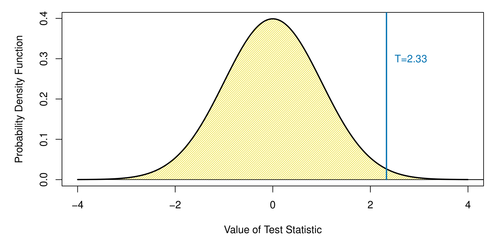{#fig-13-1 width=60%}

## Tasa de Error por Familia (FWER)

La **tasa de error por familia** (Family-Wise Error Rate, FWER) es la probabilidad de cometer al menos un falso positivo entre todas las pruebas:

$$\text{FWER} = P(\text{al menos un falso positivo})$$

### Corrección de Bonferroni

La corrección de **Bonferroni** controla la FWER rechazando $H_{0j}$ cuando $p_j \le \alpha / m$. Es un método conservador: garantiza que FWER $\le \alpha$, pero reduce el poder estadístico.

La @fig-13-2 compara el umbral de Bonferroni con el umbral nominal ($\alpha = 0.05$) para $m = 1,000$ pruebas en datos simulados donde algunas hipótesis nulas son falsas.

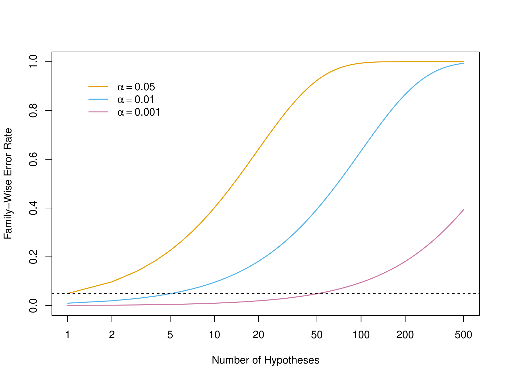{#fig-13-2 width=60%}

### Procedimiento de Holm

El **procedimiento de Holm** (o Bonferroni secuencial) es menos conservador que Bonferroni. Ordena los valores $p$ de menor a mayor y rechaza $H_{0(j)}$ si $p_{(j)} \le \alpha / (m - j + 1)$.

## Tasa de Descubrimientos Falsos (FDR)

La **tasa de descubrimientos falsos** (False Discovery Rate, FDR) es una alternativa menos conservadora que la FWER. En lugar de controlar la probabilidad de cualquier falso positivo, controla la **proporción esperada** de falsos positivos entre los rechazos:

$$\text{FDR} = E\left[\frac{V}{R}\right]$$

donde $V$ es el número de falsos positivos y $R$ el número total de hipótesis rechazadas.

### Procedimiento de Benjamini--Hochberg

El procedimiento de **Benjamini--Hochberg** (BH) controla la FDR. Dados los valores $p$ ordenados $p_{(1)} \le p_{(2)} \le \cdots \le p_{(m)}$, rechazamos $H_{0(1)}, \ldots, H_{0(k)}$ donde $k$ es el mayor índice tal que:

$$p_{(k)} \le \frac{k}{m} q$$

con $q$ el nivel deseado de FDR (típicamente $q = 0.05$ o $0.1$).

La @fig-13-3 muestra el procedimiento BH gráficamente: los valores $p$ ordenados se comparan con la línea de pendiente $q/m$.

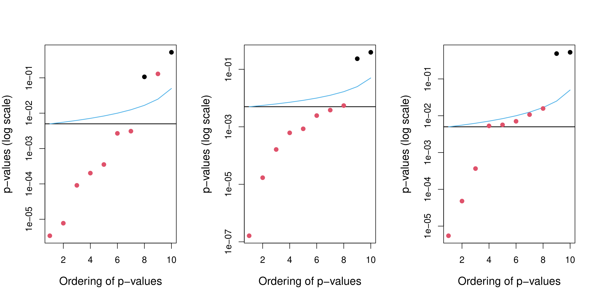{#fig-13-3 width=60%}

### Comparación de FWER y FDR

La @fig-13-4 compara el número de descubrimientos (rechazos) usando Bonferroni (FWER) y Benjamini--Hochberg (FDR) en datos simulados con diferentes proporciones de hipótesis alternativas verdaderas.

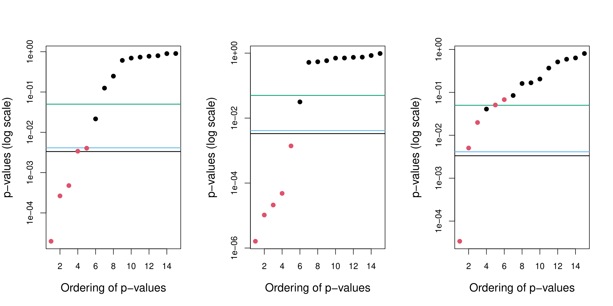{#fig-13-4 width=60%}

## Aplicación a Datos Genómicos

### Análisis de Expresión Génica

Los métodos de pruebas múltiples son esenciales en estudios de expresión génica, donde se prueban miles de genes simultáneamente.

La @fig-13-5 muestra un **volcano plot** (gráfico de volcán) para un estudio de expresión génica, donde cada punto representa un gen. El eje $x$ muestra el cambio en la expresión (log fold-change) y el eje $y$ el logaritmo del valor $p$.

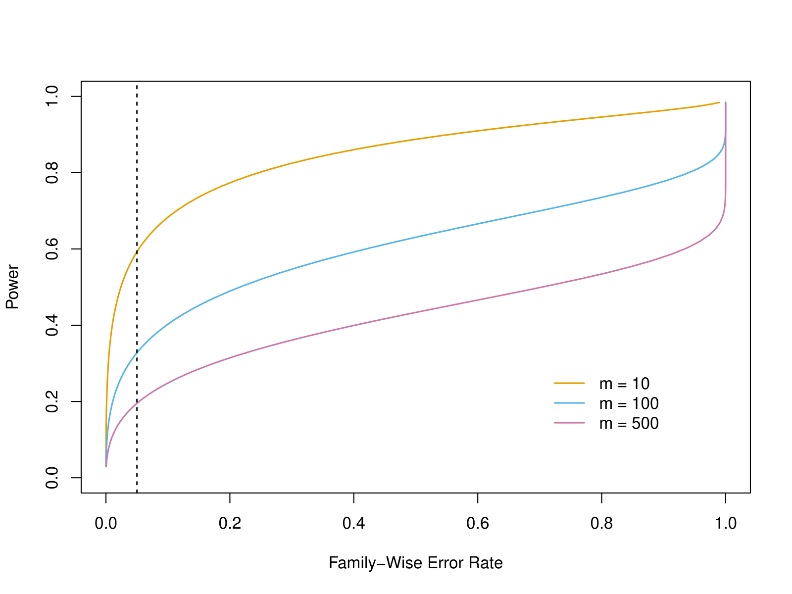{#fig-13-5 width=60%}

La @fig-13-6 muestra un heatmap de los genes más significativos en un estudio de cáncer.

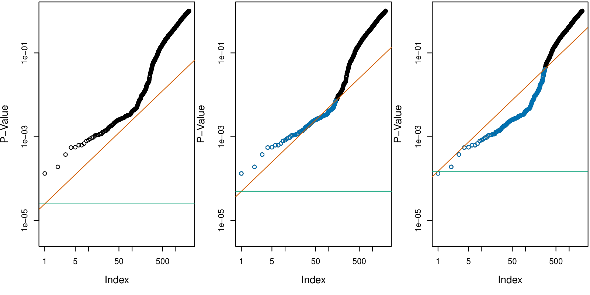{#fig-13-6 width=60%}

### Estudio de Asociación del Genoma Completo (GWAS)

En los estudios GWAS (Genome-Wide Association Studies) se prueban millones de variantes genéticas. La @fig-13-7 muestra un **Manhattan plot** típico de un GWAS.

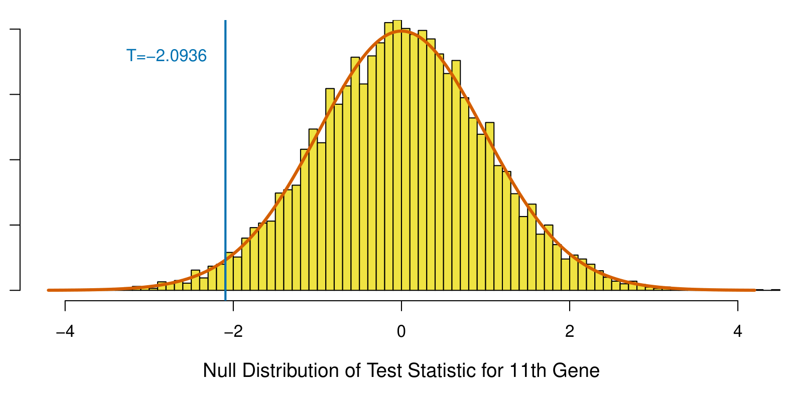{#fig-13-7 width=60%}

## Valores $p$ Ajustados

Los valores $p$ **ajustados** (o corregidos) transforman los valores $p$ originales para que puedan compararse directamente con el nivel de significación $\alpha$:

- **Bonferroni**: $\tilde{p}_j = \min(m p_j, 1)$
- **BH**: $\tilde{p}_{(j)} = \min_{k \ge j} \left(\frac{m}{k} p_{(k)}, 1\right)$

La @fig-13-8 compara los valores $p$ originales con los ajustados por Bonferroni y BH para un conjunto de datos simulado.

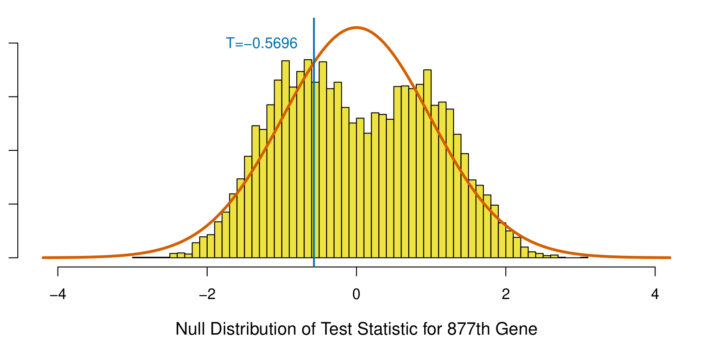{#fig-13-8 width=60%}

## Dependencia entre Pruebas

Los procedimientos de Bonferroni y BH asumen **independencia** o **dependencia positiva** entre las pruebas. Cuando hay dependencia compleja, pueden usarse métodos alternativos como el procedimiento de **Benjamini--Yekutieli**.

La @fig-13-9 muestra el efecto de la dependencia entre pruebas sobre el control de la FDR en datos simulados.

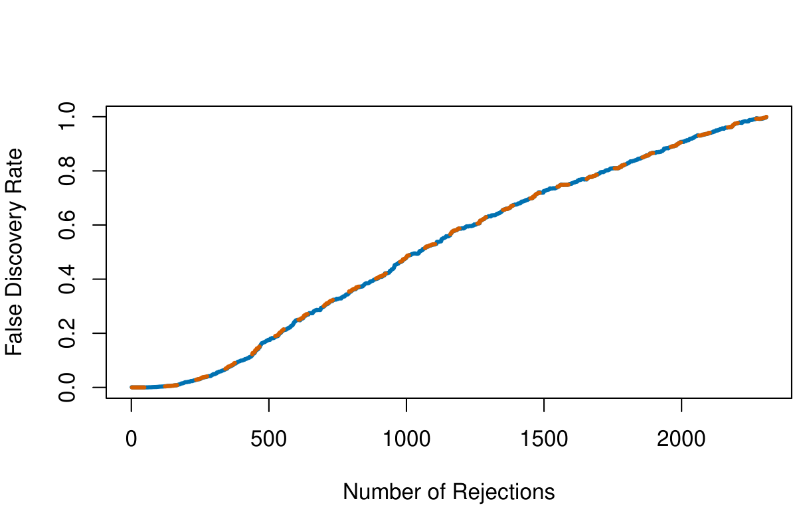{#fig-13-9 width=60%}

## Poder y Tasa de Falsos Negativos

La @fig-13-10 muestra el **poder** (tasa de verdaderos positivos) de los diferentes métodos de corrección para pruebas múltiples en función del tamaño del efecto y el número de pruebas.

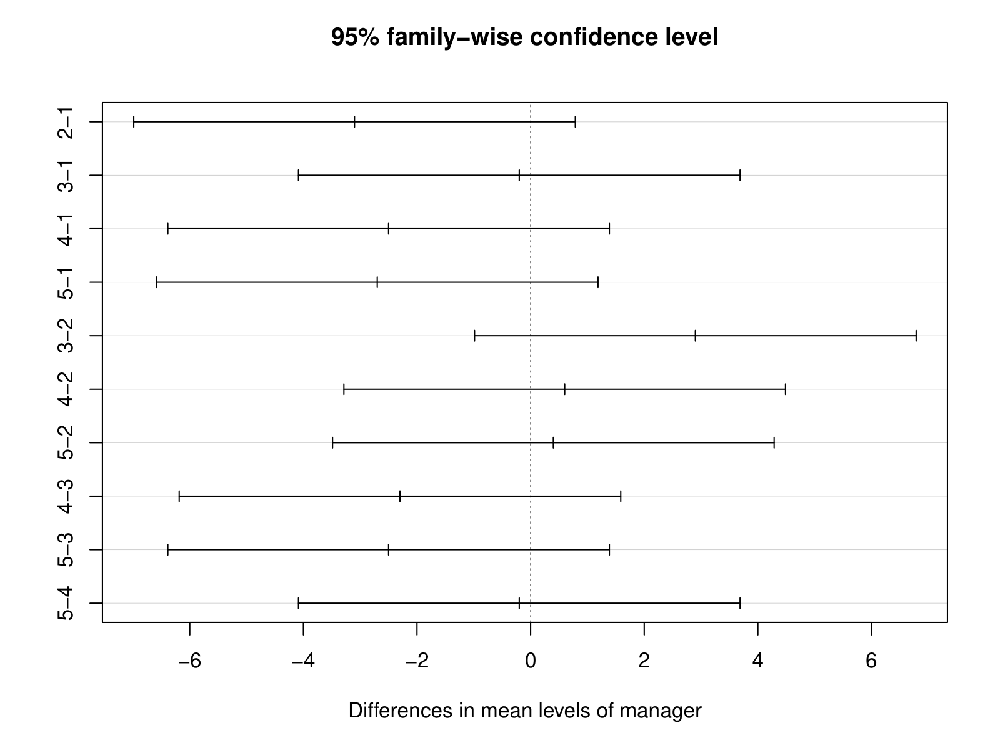{#fig-13-10 width=60%}

## Resumen Gráfico de Métodos

La @fig-13-11 presenta un resumen gráfico de los diferentes métodos de corrección para pruebas múltiples y sus propiedades.

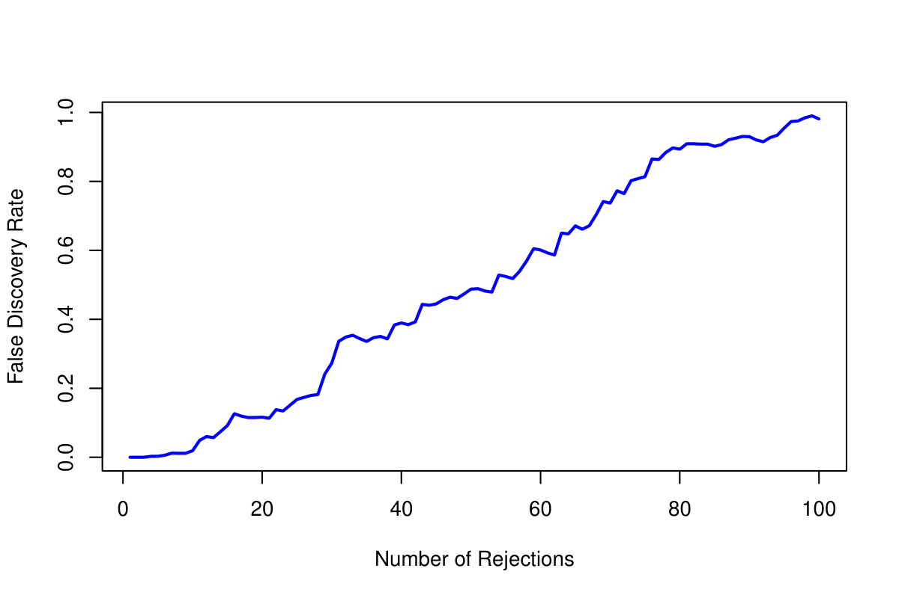{#fig-13-11 width=60%}

## Laboratorio

Los laboratorios con el código completo de este capítulo están disponibles en el sitio oficial del libro: [statlearning.com](https://www.statlearning.com){target="_blank"}. También puedes acceder a los notebooks en el repositorio oficial de ISLP: [ISLP_labs en GitHub](https://github.com/intro-stat-learning/ISLP_labs){target="_blank"}.
